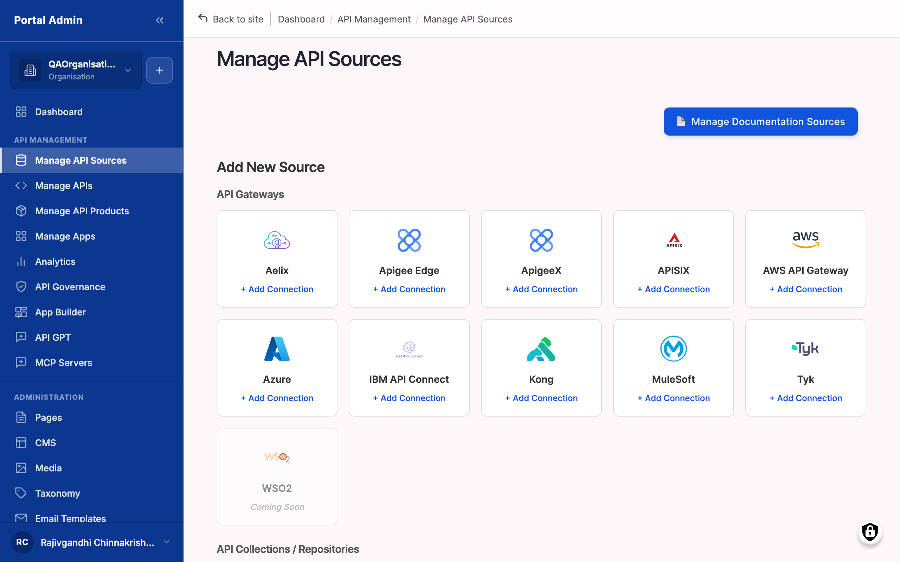

# Marketplace

**Marketplace turns your organisation's APIs into governed, discoverable products.** Connect any gateway, publish your APIs to a branded catalog, govern and monetize them, and watch usage. The marketplace is a management plane, not a proxy: it reads from your gateways and runs the storefront, governance, and analytics.


**New here?** Read the [Overview](overview.md) and the [Concepts](concept-foundations.md) to understand the platform, follow [Getting started](getting-started.md) for your first day, then configure each surface with the [How-to guides](features.md).

