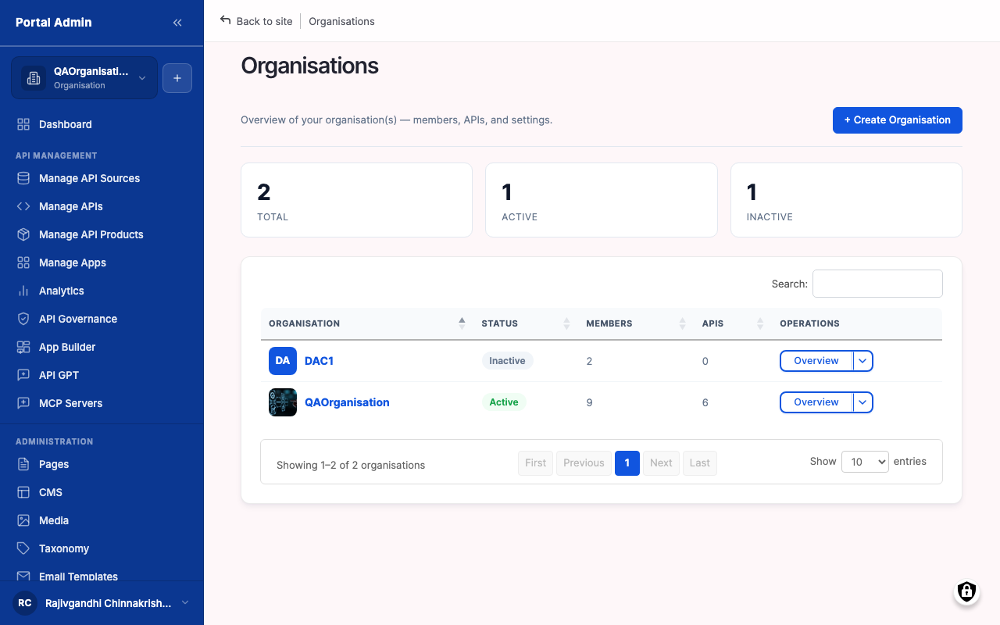
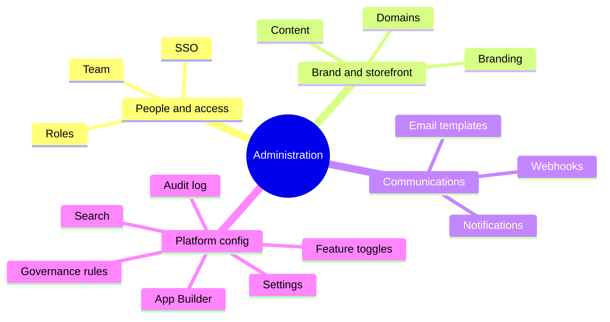

Administration is the set of controls behind a running marketplace, grouped into four themes that span fifteen areas. It governs who belongs and what they can do, how the portal looks and reads, how people and systems learn what happened, and how the platform is tuned over time. This page explains what each theme covers and why the controls are organised this way.

*Figure. The four themes and the fifteen areas they cover.*

## People & access

This theme decides who is in an organisation, what they may do, and how they sign in. **Team & Members** holds the people who belong: invite them by email, see who is active, and remove access when someone leaves. **Roles & Permissions** assigns named roles such as API Provider or Org Admin, each carrying a permission set, and access is default-deny. **Single Sign-On (SAML)** federates identity with an IdP like Okta or Azure AD, so people use corporate credentials and membership is managed centrally.

## Brand & storefront

This theme makes the portal look, read and resolve like yours, with no front-end build. **Branding & Theming** controls logo, colour palette, typography and theme from configuration. **Custom Domains** serve the portal on your own hostname with managed TLS certificates. **Content & Pages** is a built-in CMS for the storefront, covering the home page, documentation, guides, blog and static pages.

## Communications & events

This theme keeps people informed and lets other systems react. **Notifications** are in-app and email alerts for events that matter, such as subscription approvals and API changes, configurable per event type. **Webhooks** are outbound HTTP callbacks so external systems like CRM, billing or chat react to marketplace events in near real time. **Email Templates** provide branded, editable templates for every transactional email, with variables for personalisation.

## Platform configuration

This theme holds the operational knobs you tune over time.

The six platform-configuration areas

- **Governance Rules** configure the ruleset: categories, severities and which rules are enabled.
- **Search** tunes how the catalog is indexed and searched, and sets redirects so renamed links keep resolving.
- **Audit Log** is a read-only, exportable record of who changed what and when, filterable for a compliance review.
- **Feature Toggles** turn features on or off per tenant, so capabilities roll out gradually or differ by customer.
- **App Builder** composes custom pages and mini-apps inside the portal without code.
- **Settings** is the global, catch-all configuration for platform-wide options not owned by a dedicated area.

Across every theme, access remains default-deny: roles carry permission sets, and SSO federates identity so membership is managed centrally.

> **How-to:** for step-by-step configuration, see the How-to guides.