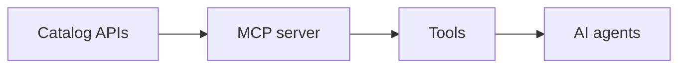
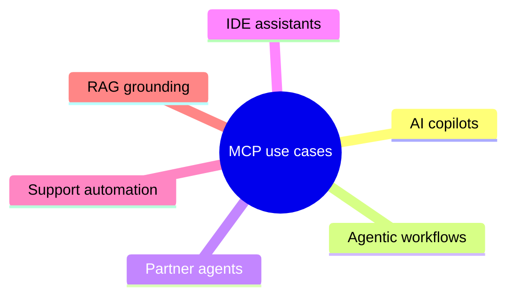
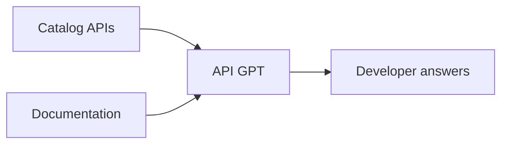

The AI layer makes your catalog usable by two new audiences: AI agents that call APIs as tools, and developers who explore the catalog in plain language. MCP servers serve the agents; the API GPT assistant serves the people. This page explains what each surface is and why it matters.

## Why an AI layer over your APIs

AI agents and copilots now call APIs alongside humans, so they are first-class consumers of your catalog. An AI layer makes onboarding faster, because grounded plain-language answers cut the time a developer needs to reach a first call. It also widens adoption, since agent access and easier discovery broaden who can build on your APIs. Critically, AI access carries no governance penalty: agents and assistants run through the same credentials, plans and rate limits as any other consumer, and neither capability is hand-coded per API.

## MCP servers expose APIs as agent tools

MCP, the Model Context Protocol, is the open standard that AI agents use to discover and call tools. Astra publishes catalog APIs as MCP servers, so any MCP-compatible client can use your APIs as tools. Each API operation becomes a callable tool, agents authenticate and are rate-limited like any consumer, and Astra maps your OpenAPI operations to MCP tools automatically.

*Figure. Catalog APIs surface as MCP tools that agents call.*

Standing up an MCP server

You pick the catalog APIs to back the server, select which operations to expose, bind credentials so calls are authorised and metered, and publish. Astra hosts the endpoint, so there is no bespoke MCP code to write.

## Where MCP servers are used

An agent-callable API earns its keep across several settings.

*Figure. The main places an agent-callable API is used.*

Use cases in detail

- **AI copilots** answer staff questions by calling customer, order or billing APIs.
- **Agentic workflows** orchestrate multi-step tasks across several of your APIs.
- **Partner agents** reach selected APIs, safely scoped and metered.
- **IDE assistants** call your APIs as tools while developers build.
- **Support automation** resolves tickets by querying live APIs instead of wikis.
- **RAG** grounds answers in real-time API data rather than stale documents.

## API GPT speeds developer onboarding

API GPT is a natural-language assistant grounded in your catalog and documentation. Developers ask in plain language and get the right API, endpoint, parameters and ready-to-run code, with citations back to the catalog. Because it draws on the live catalog, answers stay current, which means less time hunting through docs and a faster first call.

*Figure. Catalog and docs ground API GPT, which answers developers.*

> **How-to:** for step-by-step configuration, see the How-to guides.