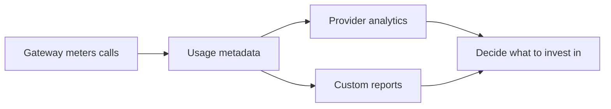

Analytics and reporting is the adoption lens over your marketplace: it turns the usage the gateway records into a view of who is adopting what and how it performs. Provider analytics gives product owners built-in dashboards, while custom reports build the specific slices teams watch. Both read the same underlying data, so the picture stays consistent.

*Usage flows from the gateway through metadata into dashboards and reports, which inform investment decisions.*

## Provider analytics

Provider analytics answers the product owner's first questions: what is being adopted, and how healthy is it. The built-in dashboards cover adoption, traffic, the top products, and subscriber health.

- **Adoption:** new subscriptions and active apps over time.
- **Traffic:** call volume, error rates, and latency across APIs and products.
- **Top products:** which products and APIs drive the most usage.
- **Subscriber health:** active, idle, and at-risk subscriptions at a glance.

Astra reports what the gateway meters. The marketplace is not in the request path, so freshness depends on how usage is collected: continuous collection is close to real time, batched collection carries a delay.

## Custom reports

Beyond the dashboards, custom reports answer specific questions through a filtered, saved view. You pick dimensions and metrics, choose a time window, and the report reruns on demand. This is the right tool when a dashboard is too broad: scope a view to one release window, one environment, or one product line, then share that link.

More detail

- **Dimensions:** group by service, environment, product, status, or route.
- **Metrics:** request count, error rate, and latency percentiles.
- **Time window:** bound a report to a release, an incident, or a billing period.
- **Saved and shareable:** a saved report reruns on demand and shares a stable link, so a team watches the same slice over time.


**Note:** analytics reports on usage; turning that usage into revenue (plans, invoices, and payouts) is covered separately under monetization.


> **How-to:** for step-by-step configuration of dashboards and custom reports, see the How-to guides.