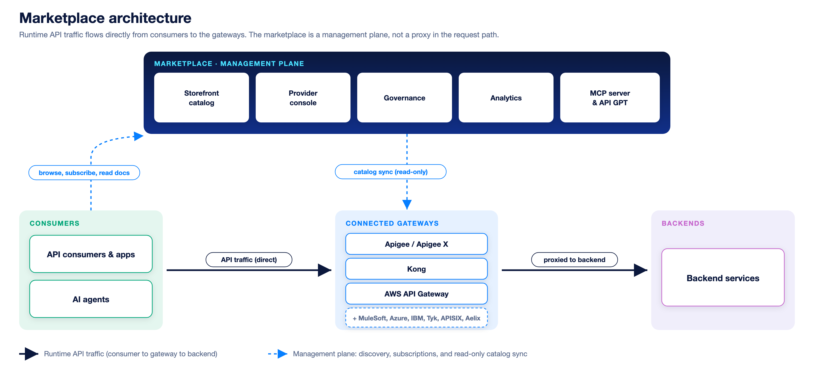

Astra splits cleanly into two planes: a management plane that decides policy and reads metadata, and a data plane that enforces that policy on every live call. Understanding this split, the product family around it, and the stack it runs on explains how the marketplace publishes an API without ever standing in the request path.

## Management plane vs data plane

Astra Marketplace is the management plane and stays out of the request path. It imports API specs and metadata from sources, governs them by scoring specs against a ruleset, publishes the catalogue to the portal, defines API products and plans, manages subscription state and approvals, provisions app credentials to the gateway, and reads usage metadata for analytics.

The API gateway is the data plane and terminates every live call. It authenticates the credential or API key, enforces rate limits and quotas, routes the request to the backend, applies security and traffic policy, meters usage, and allows or rejects each call in real time. The same concern is split across the two planes: Astra defines a plan's limits, the gateway enforces them; Astra provisions a credential, the gateway validates it on every single call; Astra reads usage for analytics, the gateway meters and emits the records.

## The product family

Three products form one path from publishing an API to consuming it:

- **Astra Marketplace:** the provider control plane that federates gateways, governs and publishes, manages products, plans, and subscriptions, and provides provider analytics.
- **Astra Gateway:** the data plane that terminates live calls, authenticates credentials, enforces limits and policy, and meters usage.
- **Developer Portal:** the consumer experience, a branded catalogue for discovering, subscribing, getting keys, and tracking usage.

Marketplace manages and configures the gateway, then publishes its catalogue to the Developer Portal. Consumers subscribe in the portal; their apps then call the gateway directly. Astra Gateway is first-class, and third-party gateways federate the same way.

## The technology stack

Astra is built on Drupal CMS and PHP, deployed on Kubernetes, and multi-tenant by design so that every data access is scoped to its tenant. The stack runs in layers:

- **Experience:** Developer Portal (Drupal / Twig theme), API Studio test console, MCP servers, API GPT assistant.
- **Application:** PHP 8.4 services, plugins and event subscribers, governance and rating engines, the subscription state machine.
- **Data:** PostgreSQL 17, cache bins, Queue API for async usage, billing, and email.
- **Integration:** gateway connectors, billing adapters, identity (Okta OAuth2 / SAML SSO).
- **Platform and DevOps:** Docker Compose locally, Kubernetes at runtime, GitHub Actions CI/CD.

The ecosystem is open across gateways (Astra Gateway, Apigee, Kong, APISIX, AWS, Azure APIM, IBM), spec and repo sources (SwaggerHub, GitHub, Bitbucket, Postman), identity (Okta, Azure AD, SAML SSO), billing adapters (Stripe, Kill Bill, Zuora, Chargebee), and an AI layer (MCP servers, API GPT assistant).

## Deployment models

The same multi-tenant codebase ships in three operating models, so you can pick the one that fits your security and compliance needs:

- **SaaS:** DigitalAPI-hosted, fully managed and multi-tenant, with upgrades handled for you. Best for teams that want zero ops.
- **Private cloud:** single-tenant and dedicated, running in your AWS, Azure, or GCP account with VPC isolation. Best for stricter isolation and control.
- **On-premises:** single-tenant and self-hosted in your data centre, with full data residency and air-gap capability on customer-managed Kubernetes. Best for regulated and sovereign workloads.

> **How-to:** for step-by-step configuration, see the How-to guides.