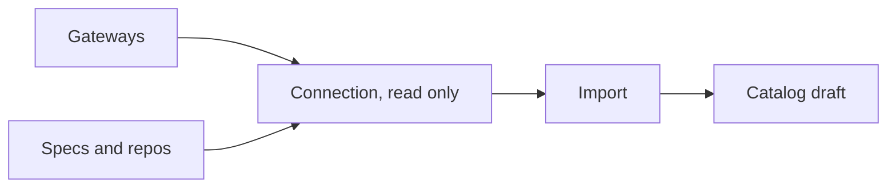
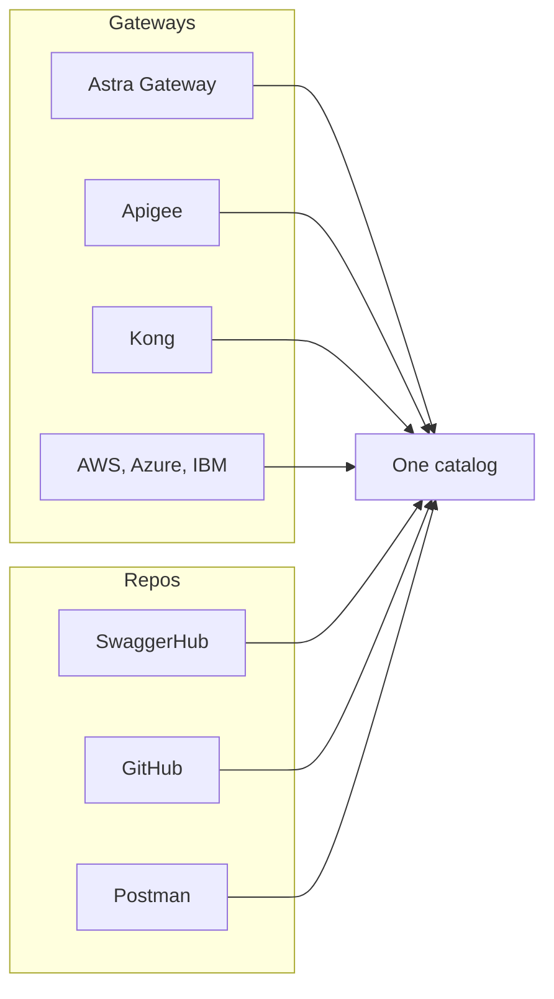

A source is any system Astra reads API definitions from. You point Astra at the gateways and repositories where your APIs already live, and it brings those definitions into the catalog. Connections are read-only by design.

*The path a definition travels from its source to a catalog draft.*

## Two kinds of source

- **Gateway connections.** A credentialed link to an API gateway. Astra lists the APIs that gateway exposes and keeps them in sync. You pick a gateway type, name the connection, and supply its base URL and credentials.
- **Spec and repository sources.** A link to where API definitions are authored or stored. This covers design-first APIs that do not sit behind a gateway yet, such as an OpenAPI file in version control or a SwaggerHub workspace.

Both kinds land their APIs in the same catalog, so a repository-sourced API sits alongside a gateway-sourced one with no distinction to the consumer.

## What Astra federates

Many sources fan into one catalog, so consumers browse a single shelf regardless of where each API was authored or hosted.

*Several gateways and repositories fan into one shared catalog.*

More detail

- **API gateways:** Astra Gateway, Apigee, Kong, APISIX, MuleSoft, and Tyk. Astra Gateway is first-class; the third-party gateways connect the same way.
- **Cloud gateways:** AWS API Gateway, Azure APIM, and IBM API Connect.
- **Specs and repositories:** SwaggerHub, GitHub, Bitbucket, Azure Repos, and Postman.

For repository sources you choose the repo, branch, and path, so that re-imports stay deterministic and pull from a known location every time.

## Read, not route

A connection reads metadata only. It never carries live traffic and never sits in the request path. Credentials are encrypted and scoped to the connection, and Astra uses them to list and read API definitions, not to proxy calls. This keeps the marketplace out of the data plane: your gateways continue to serve traffic exactly as before.

## Importing brings APIs in as drafts

Connecting a source and importing its APIs are two separate steps. One connection can surface many APIs, and importing is the controlled action that brings the ones you choose into the catalog. Each imported API arrives with its OpenAPI document, endpoints, version, and metadata, and a governance score ready for review.

Imported APIs start unpublished, as drafts. That gives you room to govern and review each one before any consumer can see it. Re-running an import refreshes the definition from the source, so the catalog tracks the upstream spec over time.

> **How-to:** for step-by-step configuration, see the How-to guides.