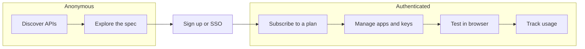
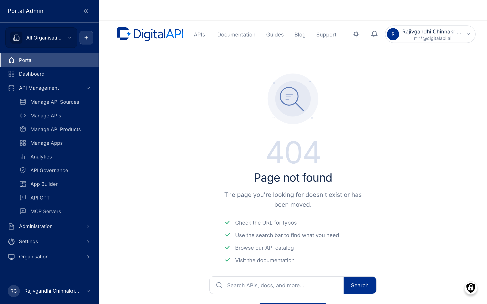

The consumer experience is the journey an external developer takes through your branded developer portal, from an anonymous first look at the catalog to a real, authenticated API call. It is one connected flow across a single auth boundary: discovery is open to anyone, consumption needs an account. The goal throughout is short time-to-first-call.

*The journey runs left to right across the auth boundary, with sign-up or SSO as the bridge.*

## The auth boundary

The journey divides into two zones. Before the boundary, a visitor is anonymous and can read; after it, a signed-in consumer can act. A visitor can evaluate an API fully before committing, which lowers the barrier to adoption.

- **Anonymous and public:** browse and search the catalog, open an API, and read its reference documentation. No account needed.
- **Authenticated consumer:** subscribe, manage applications and credentials, test in the browser, and track usage. Everything past the boundary requires an account.

More detail

**Discover and explore.** The catalog lists individual APIs and bundled Products, with full-text search and filters by domain and tag. Each tile carries a name, summary, domain, and rating for quick scanning. Opening an API gives everything needed to evaluate it without signing up: an overview with base URL and authentication, the interactive OpenAPI specification with request samples, a change log, and comments. Reference documentation is generated from the spec, so it does not drift out of date.

**Sign up, subscribe, and consume.** Crossing the boundary takes one of two paths: native sign-up with email and the configured profile fields, or single sign-on with your organisation's identity provider where enabled. The account then holds the consumer's apps, subscriptions, and analytics.

- **Subscribe:** a signed-in consumer subscribes an application to an API or Product under a chosen plan, which sets the quota, rate limits, and tier. Access is immediate or pending provider approval, depending on configuration.
- **Manage apps and keys:** applications carry the credentials that authorise calls. Consumers read the client identifier and secret or API key, and rotate credentials without losing the subscription. The gateway validates these on every call.
- **Test and track:** an in-browser tester sends real requests before any integration code is written, and the analytics view reports call volume, success and failure, response time, and consumption against the plan.


**Note:** the detailed, step-by-step consumer documentation lives in a separate space. For the full developer-facing walkthrough, see the Developer Portal guide.


> **How-to:** for step-by-step configuration on the provider side, see the How-to guides.