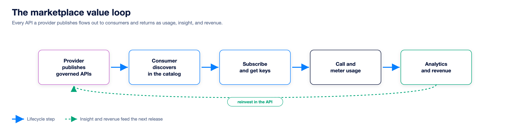

Astra Marketplace is a multi-gateway API marketplace and developer portal. It federates the API gateways you already run into one branded place where teams publish APIs as products and consumers discover, subscribe to, and consume them. Astra manages APIs across gateways, so it is the marketplace layer rather than another gateway.

## What the marketplace is

Four capabilities, brought together over the gateways you operate:

- **Federate:** one portal over Apigee, Kong, APISIX, AWS, Azure, and IBM.
- **Publish:** turn APIs into governed, documented products.
- **Monetize:** products, plans, quotas, and usage metering.
- **Self-serve:** consumers discover, subscribe, and test on their own.

## The value loop

Published APIs become products in a governed catalogue. Consumers discover and subscribe, their usage produces analytics, and those signals guide the next round of publishing. Each pass compounds.

## The shift, and why it matters

The shift is from gatekept to self-service. Organisations that exposed their systems as governed API products outgrew the ones that kept them locked away.

| Old way | With Astra |
|---|---|
| Request access through an admin team | Consumers self-serve discovery and keys |
| Wait on a gatekeeper to publish | Publishing runs through governance, not tickets |
| Hand-written docs that drift | Docs generated from the spec, always current |

## The management plane

Astra sits above your gateways as a management plane. It reads from them and never proxies live traffic, so it stays out of the latency path while keeping control of the catalogue. Live API calls flow straight from a consumer app to the gateway; Astra imports, governs, publishes, and meters around that path.

## The two sides

The same platform serves two audiences, joined by Products and Subscriptions.

What each side covers

- **Provider side (publish and operate):** connect sources, import and govern APIs, publish, package APIs into products with plans, manage subscriptions, and monitor and administer the portal.
- **Consumer side (discover and consume):** browse the catalogue, evaluate docs and specs, sign up, create an app and subscribe, collect credentials, then test and track usage.

## Time to first call

The north-star metric is time to first call: how fast a new consumer makes their first successful call. Maturity runs from manual access taking days, to same-day self-registration, to under ten minutes, to instant in-browser try-it. Astra targets the top of that ladder with a public catalogue, always-current docs, in-browser testing, and copy-paste samples.

## Roles and responsibilities

- **Portal Admin / API Provider:** owns the platform and the APIs; lands on the control-plane dashboard.
- **Org Admin:** runs a tenant or organization; works in the Administration area, scoped to their org.
- **API Consumer:** discovers and consumes APIs; works in the developer portal.

> **How-to:** for step-by-step configuration, see the How-to guides.