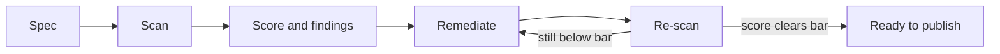
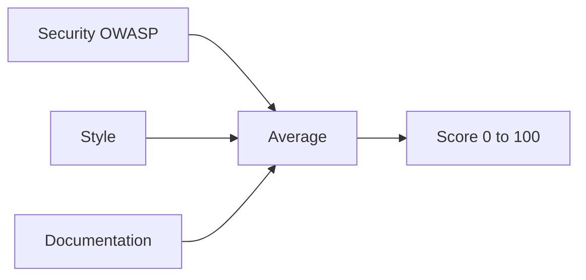

Astra scores every API spec against a configurable ruleset and produces a single number from 0 to 100. Governance turns quality into a measured, repeatable step rather than a matter of opinion.

*Governance runs as a loop until the score clears the bar.*

## The 0-100 score

Each API gets one score: the average of three category scores, each out of 100.

*Three category scores average into one number from 0 to 100.*

The Governance Report shows that number alongside severity-ranked findings and remediation guidance. Scores fall into bands:

- **Excellent:** 80 and above.
- **Good:** 60 to 79.
- **Fair:** 40 to 59.
- **Poor:** below 40.

A catalog-wide view rolls these up into a score distribution, category averages, and the rules violated most often. A common target is 80 or above for production APIs and 90 or above for public ones.

## Three categories

Rules are grouped into three categories, and the overall score is the average of the three. You decide which rules are active in each, and a category score reflects how an API does against its enabled rules.

- **Security (OWASP):** authentication, authorization, and data-protection rules drawn from the OWASP API Security Top 10.
- **Style Guidelines:** consistent URL patterns, correct HTTP methods, and predictable response structures.
- **Documentation:** completeness of descriptions, examples, and metadata, so the API is usable without guesswork.

## Severities

Every finding carries a severity: **Error**, **Warning**, or **Info**. Severity tells you what to fix first. Clear Errors before Warnings, and treat Info findings as polish. Disabling a rule stops both its findings and its impact on the score, so the ruleset stays honest about what is actually being measured.

## The scoring lifecycle

More detail

Governance runs as a loop of three stages.

1. **Score.** Astra scans the spec automatically when it changes, or on demand with a Scan All run across the whole catalog.
2. **Remediate.** Open a finding to read its compliant example, fix the spec at the named path, and re-scan to confirm the fix.
3. **Gate.** Treat the score as the bar an API must clear before it publishes, for example 80 or above.

That gate is a policy bar your API guild agrees on, not a hard code-level block. The score informs the decision to publish; it does not mechanically prevent it. Re-scan after any change to the ruleset so scores stay comparable.

> **How-to:** for step-by-step configuration, see the How-to guides.