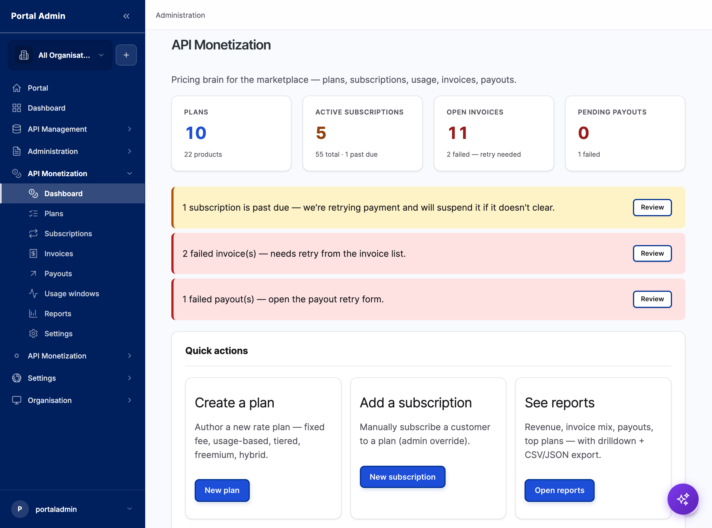
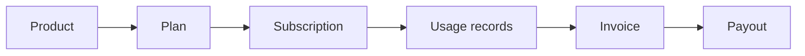
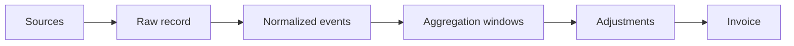

Monetization is the pricing brain of the marketplace. It turns metered API consumption into revenue by tracking plans, subscriptions, usage, invoices and payouts in one place, while delegating the movement of money to an external billing platform. This page explains what the model is and why it is built this way.

## The monetization model

Six objects carry an API call from price to paid invoice: a **product** bundles APIs into a subscribable offering, a **plan** attaches price, quota and tiers, a **subscription** links a consumer app to a plan, **usage records** capture metered calls, **invoices** roll rated usage into line items, and **payouts** disburse a provider's revenue share.

*Figure. How the six objects chain from price to payout.*

## The eight pricing models

Each plan charges with one of eight models.

The eight pricing models

- **Fixed fee** is a flat recurring charge regardless of usage.
- **Pay-as-you-go** prices per call against metered usage.
- **Flat + quota** is a flat fee that includes a usage allowance.
- **Tiered** prices each accumulating band as consumption crosses it.
- **Volume** applies a single rate to all usage, chosen by total volume.
- **Freemium** grants a free allowance, then a paid plan beyond it.
- **Revenue share** splits revenue with the API provider through payouts.
- **Hybrid** combines a base fee with usage or tiers.

## The two operating modes

Where the gateway sits decides who meters and who enforces.



Astra Gateway sits in the request path, meters every call and enforces quotas in real time. Billing is exact, and all eight pricing models apply: fixed, pay-as-you-go, flat + quota, tiered, volume, freemium, revenue share and hybrid.


Apps call the customer's own gateway directly. That gateway enforces quotas, and Astra collects usage afterward with some delay. Billing closes after a grace period, and the model suits per-call, freemium and soft-quota pricing.



## The usage pipeline

Metered calls flow through a fixed pipeline. A window stays open through the grace period, closes, and is rated into an invoice, so delayed federated usage still bills fairly.

*Figure. From raw call to rated invoice line.*

## Pluggable billing adapters

Astra prices and rates; an external platform invoices, charges and reconciles. Billing plan mappings link an Astra rate plan to a product and price in Stripe, Kill Bill, Zuora or Chargebee. Switching platforms is a configuration change behind one adapter interface, not a rebuild.

> **How-to:** for step-by-step configuration, see the How-to guides.