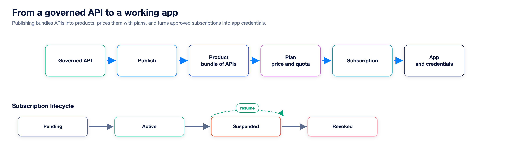
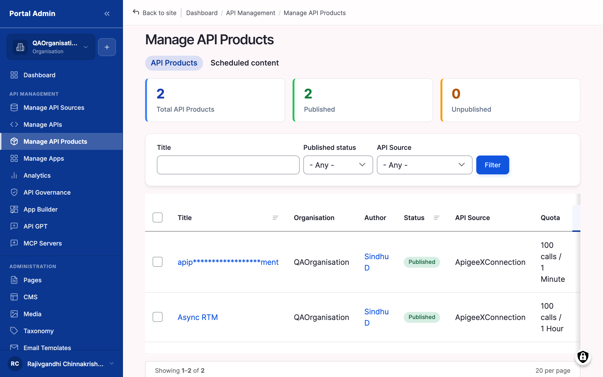

Publishing turns a governed API into something a consumer can find and subscribe to. Productizing packages one or more APIs into a subscribable unit with commercial terms attached.

## Publishing

Publishing moves an imported, governed API from draft into the catalog your consumers see. A moderation state controls visibility: change it to Published to take an API live, or revert it to pull the API back. The edit form sets the consumer-facing metadata that drives the catalog tile and detail page, including the overview, documentation, logo, domain, and tags.

- **Visibility:** scope the audience to public, or to partner and signed-in users only.
- **Revision log:** each publish records who changed what, surfaced in the Change Log.

Publish only after governance, since the score is the agreed quality bar.

## Products & plans

A Product bundles one or more APIs into the thing a consumer actually subscribes to. APIs can be grouped across gateways, so a Product can span several backends and still present as one offering.

Plans attach the commercial and operational terms to a Product. Each plan sets a quota, rate limits, and a pricing tier, so Free, Standard, and Premium map to different limits on the same Product. Subscribing to a Product grants access to every API in it under one subscription. Plans are where monetization begins; enforcement happens at the gateway, not in the portal.

## Subscriptions

A subscription links a consumer's app to an API or Product under a chosen plan. Providers review requests and manage each subscription through its life.

- **Request:** a consumer requests a subscription to a Product under a plan.
- **Approve or reject:** providers approve, optionally with a reason; auto-approval is configurable.
- **Lifecycle:** Pending, Active, Suspended, then Revoked or Cancelled.
- **Revocation:** suspending or revoking invalidates the credential at the gateway.

Subscription state is the source of truth the gateway honours on every call.

## Apps & credentials

An app is the consumer's application that holds credentials. When a subscription is active, Astra provisions credentials to the gateway, which validates them on every request.

- **Register:** a consumer creates an app, which can hold several subscriptions.
- **Credentials:** a client identifier and secret, or an API key, are issued.
- **Validated downstream:** the gateway checks the credential on every call. Astra issues and provisions; the gateway enforces, and the portal stays out of the request path.
- **Rotate and revoke:** keys rotate without losing the subscription, and revoking a subscription cuts access.

> **How-to:** for step-by-step configuration, see the How-to guides.