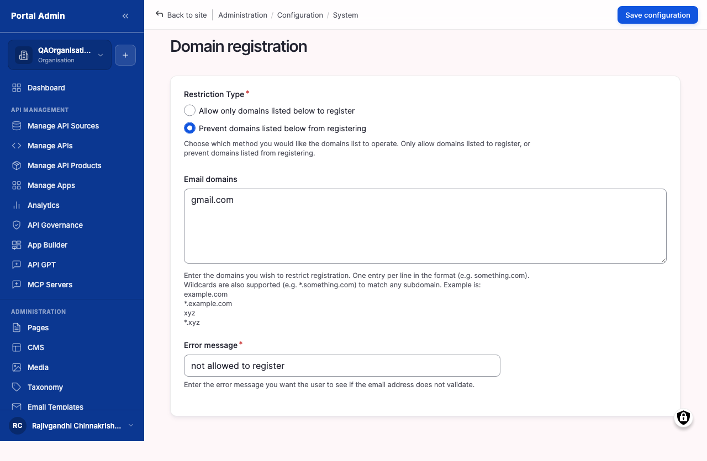
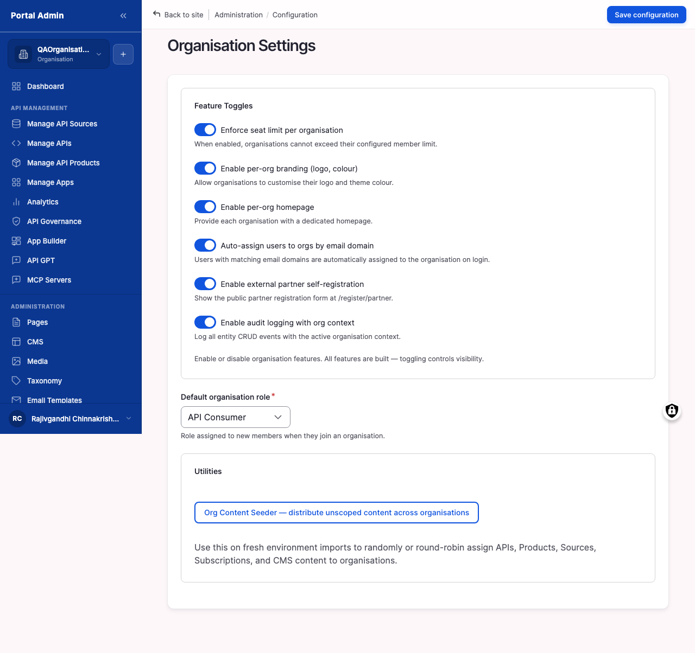

This chapter walks the operator-facing surfaces under **SETTINGS** that decide how users sign in and how the public storefront looks. It covers the messaging on the auth screens, the SAML configuration that federates the marketplace against a corporate identity provider, the logo and favicon uploads, the brand accent colour, the theme switcher, the site-wide preferences screen, the custom-domain register, and the per-Organisation branding overrides. By the end of the chapter, the marketplace signs users in the way the security team requires and looks like the company that owns it rather than a default template.

You will learn:

- How to set the messaging on the sign-in, registration, and forgot-password screens.
- How to configure SAML against the corporate identity provider, including attribute mapping and a default first-sign-in role.
- How to test SSO sign-in safely before rolling SAML out to the full user base.
- How to upload a logo and favicon, set an accent colour, and switch themes.
- How to register a custom domain so the storefront answers on the brand URL.
- How to scope branding per Organisation so each tenant carries its own look.
- How to preview the storefront before flipping changes live for consumers.

Allow ~60 minutes when SAML and a custom domain are in scope; ~30 minutes for branding and basic preferences alone.

## Configuring sign-in and SAML federation

Sign-in lives across three surfaces. **Auth Page Branding** controls the copy on the public login, register, and forgot-password screens. **SSO Configurations** registers SAML identity providers and turns federation on. **Basic Site Settings / User Settings** holds the registration policy and the default role for new accounts. Email-and-password sign-in is on by default; SAML is opt-in and stacks on top.

#### Configure sign-in screen messaging

Use this task to change the public messaging on the sign-in, registration, and password-reset screens. Typical edits add a "company use only" notice, an internal support contact, or a banner explaining which corporate credentials to use.

#### Before you start

- **Decide which sign-in methods you want exposed.** Email-and-password is on by default. If the organisation runs SSO, a fallback for break-glass accounts is usually still required; the two methods can co-exist.
- **Draft the wording in advance.** The messages on the sign-in screens are public-facing copy. Run them past the security or comms team before you paste them in.
- **Have a support email handy.** Users who land on the forgot-password screen need somewhere to escalate when the reset email does not arrive.

To configure sign-in screen messages:

1. From the left sidebar, expand **SETTINGS** and click **Basic Site Settings**.
2. Click the **Auth Page Branding** secondary tab at the top of the page.
3. Enter the message that should appear on the sign-in screen in the **Login page content** rich-text field.
4. Enter the message that should appear on the registration screen in the **Registration page content** rich-text field.
5. Enter the message that should appear on the forgot-password screen in the **Forgot password page content** rich-text field.
6. Click **Save configuration**.

The numbered callouts in Figure 12-1 are:

1. **Auth Page Branding** tab. The page heading. The three rich-text fields below it correspond to the three public-facing auth screens.
2. **Login page content** field. A rich-text editor. Whatever you enter renders on the sign-in screen, beneath the email and password fields. Use it for a company notice, a link to the IT helpdesk, or guidance on which corporate credentials to use.
3. **Registration page content** field. A rich-text editor. Renders on the new-user registration screen. Use it to set expectations about approval timelines or to point external developers at terms-of-use.
4. **Forgot password page content** field. A rich-text editor. Renders on the password-reset screen. Use it for the support email a user should contact when the reset email does not arrive.
5. **Save configuration** button. Persists the changes. The new copy appears immediately on the public auth screens.


**Result:** The sign-in, registration, and forgot-password screens carry the new messaging. The change is live for the next user who lands on those screens.



**Note:** The fields accept rich text. Links, bold text, and bullet lists are supported. Embedded scripts or iframes are stripped on save.



**Tip:** Keep each message under three sentences. Users who reach the sign-in screen want to sign in, not read a wall of text.


Verify:

1. Open the sign-in screen in a private browser window and confirm the new copy renders.
2. Repeat for the registration and forgot-password screens.
3. Confirm any embedded link in the rich-text fields opens the right destination.

#### Configure SAML against the identity provider

Use this task when the organisation requires every user to sign in through a corporate identity provider, for example Okta, Azure AD, Ping, ADFS, or Auth0. SAML federation lets the marketplace delegate authentication to the IdP and create the local account on first sign-in.

#### Before you start

- **Have the IdP metadata URL or XML file ready.** Most IdPs expose a metadata endpoint at a URL like `https://idp.example.com/saml/metadata`. If the IdP does not expose one, export the metadata as XML and have the file open.
- **Know which attributes the IdP releases.** At minimum the marketplace needs an email and a display-name claim. A role or group claim is recommended; without one, every federated user lands on the default role.
- **Pick the default role for first-time SSO users.** New SSO users land on this role until an Org Admin promotes them. API Consumer is the safest default.
- **Have a Portal Admin local-password account ready as break-glass.** If SAML is misconfigured, this is the only way back in.


**Caution:** SAML changes take effect immediately. Testing SAML in production without a verified configuration can lock everyone out except a Portal Admin with a local-password fallback. Always test SAML in a non-production environment first, and keep one local-password Portal Admin account active as the break-glass route.


To configure a SAML identity provider:

1. From the left sidebar, expand **SETTINGS** and click **SSO Configurations**.
2. Click **Add IdP**. The Add IdP form opens.
3. Enter a recognisable label in the **Identity Provider Name** field, for example *Okta Production* or *Azure AD Corp*.
4. Enter the **Entity ID** issued by the IdP. It usually looks like a URL, for example `http://www.okta.com/exk1abc23`.
5. Paste the IdP's metadata URL into the **IdP Metadata URL** field, or upload the XML file in the **IdP Metadata XML** field.
6. Enter the **Single Sign-On Service URL** (the IdP endpoint the marketplace redirects to for sign-in).
7. Enter the **Single Logout Service URL** if the IdP supports logout federation. Leave blank if it does not.
8. Paste the IdP's signing certificate into the **X.509 Certificate** field. Include the `-----BEGIN CERTIFICATE-----` and `-----END CERTIFICATE-----` lines.
9. Map the IdP's attribute claims in the **Attribute Mapping** section: email, first name, last name, and (optionally) role or group.
10. Set **Default Role on First Sign-In** to the role new federated users should land on.
11. Tick **Just-in-Time Provisioning** to create marketplace accounts automatically on first sign-in. Untick it if accounts must be pre-provisioned by an Org Admin.
12. Click **Save**.

The numbered callouts in Figure 12-2 are:

1. **Identity Provider Name** field. A label that appears on the sign-in screen and in the SSO Configurations list. Pick a name that distinguishes IdPs if more than one is in use.
2. **Entity ID** field. The unique identifier the IdP advertises. Copy it verbatim from the IdP's metadata; mismatches here are the most common cause of SAML failures.
3. **IdP Metadata URL** field. A live URL the marketplace fetches periodically. Preferred over uploading XML, because it picks up certificate rotations automatically.
4. **Single Sign-On Service URL** field. The IdP endpoint for sign-in. The marketplace redirects the user here when they click the SSO button.
5. **X.509 Certificate** field. The IdP's signing certificate. The marketplace verifies every SAML response against this certificate. Rotate it whenever the IdP rotates its keys.
6. **Attribute Mapping** section. A set of fields that tell the marketplace which IdP claim contains the user's email, name, and (optionally) role. Defaults match Okta and Azure AD; customise for other IdPs.
7. **Default Role on First Sign-In** dropdown. The role new federated users land on. API Consumer is the safest default; an Org Admin can promote a user later.
8. **Just-in-Time Provisioning** checkbox. Tick to create accounts on first sign-in; untick to require pre-provisioning by an Org Admin.


**Result:** SAML is configured. The next user who clicks the SSO button on the sign-in screen is redirected to the IdP, signs in there, and lands back on the marketplace under the default role.



**Note:** The marketplace's Service Provider metadata is exposed at `/saml/sp/metadata` once SAML is enabled. Hand that URL to the IdP team; they will configure the marketplace as a registered Service Provider on the IdP side.



**Tip:** If the IdP supports group claims, map a group like `marketplace-providers` to the API Provider role and a group like `marketplace-admins` to Org Admin. This lets you manage marketplace permissions from the IdP rather than on every user manually.


Verify:

1. Confirm the new IdP appears in the **SSO Configurations** list with status **Active**.
2. Confirm the marketplace's Service Provider metadata at `/saml/sp/metadata` is reachable and matches what the IdP team registered.
3. Run the round-trip in [Test SSO sign-in end to end](#test-sso-sign-in-end-to-end) before enabling the IdP for the full user base.

<strong>All fields on the Add IdP form</strong>

| Section | Field | Type | Required | What to enter |
|---|---|---|---|---|
| Identity | Identity Provider Name | Text | Yes | Label that appears on the sign-in button and the IdP list. |
| Identity | Entity ID | Text | Yes | The IdP-issued unique identifier; copy verbatim from IdP metadata. |
| Metadata | IdP Metadata URL | URL | Conditional | Live metadata endpoint. Required if XML upload is empty. |
| Metadata | IdP Metadata XML | File upload | Conditional | Exported metadata file. Required if Metadata URL is empty. |
| Endpoints | Single Sign-On Service URL | URL | Yes | IdP endpoint the marketplace redirects to for sign-in. |
| Endpoints | Single Logout Service URL | URL | No | IdP endpoint for federated sign-out. Leave blank if unsupported. |
| Certificate | X.509 Certificate | Text (PEM) | Yes | Full PEM block including BEGIN and END markers. |
| Attribute Mapping | Email claim | Text | Yes | XPath or claim name carrying the user's email. |
| Attribute Mapping | First name claim | Text | No | Claim carrying the given name. |
| Attribute Mapping | Last name claim | Text | No | Claim carrying the family name. |
| Attribute Mapping | Role/group claim | Text | No | Claim carrying the role or group, when mapping roles from the IdP. |
| Provisioning | Default Role on First Sign-In | Select | Yes | Role assigned to new federated users; API Consumer is the safest default. |
| Provisioning | Just-in-Time Provisioning | Checkbox | No | On to auto-create accounts; off to require pre-provisioning. |
| Provisioning | Force SSO for Organisation | Checkbox | No | Disables email-and-password sign-in for the listed organisation. |
| Status | Enabled | Checkbox | Yes | Off hides the IdP from the sign-in screen without deleting it. |

#### Test SSO sign-in end to end

Use this task to validate a SAML configuration before rolling it out organisation-wide. Skipping this step is the single largest cause of "everyone is locked out" incidents.

#### Before you start

- **Have a non-production marketplace.** Run the test there, not in production.
- **Have a test user in the IdP.** The user should be in whatever group or role you intend to map.
- **Open a private/incognito browser window.** This avoids stale session cookies from confusing the test.

To test SSO sign-in:

1. In a private browser window, open `<your-portal-domain>/user/login`.
2. Click the **Sign in with <your IdP name>** button.
3. The browser redirects to the IdP. Sign in with the test user's credentials.
4. The browser redirects back to the marketplace. Confirm the test user lands on the dashboard.
5. From the user menu in the top-right, confirm the email and display name match the IdP user.
6. Open the **Edit profile** page and confirm the role assigned matches the **Default Role on First Sign-In** value, or the mapped IdP group if attribute mapping for role is in use.
7. Sign out. Confirm the marketplace returns you to the sign-in screen, not back to the IdP.


**Result:** The round-trip is validated, sign-in, account creation, role assignment, and sign-out. SAML is safe to enable for the full user base.



**Note:** If the redirect from the IdP fails with a SAML response error, check the X.509 Certificate first. The second-most-common failure is a clock skew greater than 60 seconds between the IdP and the marketplace; if both run NTP this is rarely the cause.



**Tip:** Repeat the test for each role you have mapped: one user in the API Consumer group, one in the API Provider group, one in the Org Admin group. This catches attribute-mapping mistakes that affect only some users.



**Caution:** Once **Force SSO** is on for an organisation, email-and-password sign-in is disabled for that organisation's users. Confirm the round-trip works for at least three test users before flipping that switch.


Verify:

1. Confirm sign-in, account creation, role assignment, and sign-out succeed for at least three test users covering different IdP groups.
2. Confirm the local-password break-glass Portal Admin account still signs in via the email-and-password fallback.
3. Confirm the round-trip works in a non-production environment before enabling SAML on production.

#### Edit or remove a SAML identity provider

Use this task when an IdP rotates its certificate, when attribute mappings change, or when an IdP is being decommissioned and should no longer appear on the sign-in screen.

To edit a SAML identity provider:

1. From the left sidebar, expand **SETTINGS** and click **SSO Configurations**.
2. Locate the IdP row in the list.
3. Click **Edit** at the right of the row. The Add IdP form re-opens with the saved values.
4. Update the field that needs to change, for example paste the new X.509 certificate or correct an attribute claim path.
5. Click **Save**. Future SAML responses are validated against the updated configuration.

To remove a SAML identity provider:

1. From the left sidebar, expand **SETTINGS** and click **SSO Configurations**.
2. Locate the IdP row in the list.
3. Click **Delete** at the right of the row. The marketplace shows a confirmation dialog.
4. Confirm. The IdP entry is removed and its sign-in button disappears from the public sign-in screen.


**Caution:** Removing an IdP does not delete the local accounts created from it. Federated users keep their accounts but cannot sign in until they reset their password through the email-and-password flow, assuming that flow is still enabled.



**Tip:** When rotating a certificate, paste the new certificate into the existing IdP entry rather than creating a parallel IdP. Two IdPs with the same Entity ID confuse the SAML response handler and cause intermittent sign-in failures.



**Note:** Disabling an IdP without deleting it is a softer option than Delete. Edit the IdP and untick **Enabled** to hide the SSO button on the sign-in screen while keeping the configuration intact for later reactivation.


## Branding the storefront

The storefront is what consumers see when they land on the marketplace homepage. Four knobs control the look: the logo and favicon, the brand accent colour, the active theme, and the public domain users type into the browser.

#### Upload the organisation logo and favicon

Use this task to replace the default DevPortal logo and favicon with the company's. The logo appears in the top-left of every page; the favicon appears in browser tabs and bookmarks.

#### Before you start

- **Have a transparent-background PNG or SVG of the logo.** SVG scales best for retina displays. PNG is fine if SVG is not available. Avoid JPEG; its background colour clashes with the storefront.
- **Have a square favicon source at 256x256 pixels minimum.** The marketplace down-samples for the actual favicon sizes; starting larger gives crisper results.
- **Know the logo's intended display height.** Around 40 pixels works for most marketplaces. A logo too tall pushes the navigation bar down and crowds the page.

To upload the logo and favicon:

1. From the left sidebar, expand **SETTINGS** and click **Appearance**.
2. Locate the active theme's **Settings** link and click it. The theme settings form opens.
3. Scroll to the **Logo image** section.
4. Untick **Use the logo supplied by the theme** to expose the upload field.
5. Click **Choose File** under **Upload logo image** and select the logo file.
6. Scroll to the **Favicon** section.
7. Untick **Use the favicon supplied by the theme** to expose the upload field.
8. Click **Choose File** under **Upload favicon image** and select the favicon source.
9. Click **Save configuration**.

The numbered callouts in Figure 12-3 are:

1. **Installed themes** section. Lists every theme available on the marketplace. The default theme is marked with a label.
2. **Theme card**. Each theme is shown with a thumbnail, name, and version. The card surfaces the actions for that theme.
3. **Settings** link. Opens the per-theme settings form where logo, favicon, and accent colour live. Available on themes that support customisation.
4. **Set as default** link. Switches the storefront to that theme. Available on every theme except the current default.
5. **Uninstall** link. Removes the theme from the marketplace. Available only on themes that are not currently the default.


**Result:** The logo replaces the DevPortal mark in the top-left of every page. The favicon replaces the DevPortal favicon in browser tabs.



**Note:** The logo also appears on the sign-in, registration, and forgot-password screens. Uploading once covers all auth surfaces.



**Tip:** Test the logo against both light and dark mode. The marketplace supports a dark theme; a dark logo on a dark background is invisible. Use an SVG with `currentColor` fills, or supply a separate dark-mode logo through the theme files.


Verify:

1. Reload the storefront and confirm the new logo renders in the top-left of every page.
2. Reload a browser tab and confirm the favicon updates in the tab strip and in bookmarks.
3. Confirm the logo also appears on the sign-in, registration, and forgot-password screens.

#### Set the brand accent colour

Use this task to make the marketplace match the company's brand palette. The accent colour drives buttons, links, focus rings, and selected states across every page.

#### Before you start

- **Have the brand's accent colour as a hex code.** For example, `#0F62FE` or `#E04E27`. The marketplace also accepts the named CSS palette (red, blue, green, and so on) but a hex code matches the brand exactly.
- **Check contrast.** The accent colour sits on white in light mode and on dark grey in dark mode. Both pairings need to clear WCAG AA contrast. Use a tool like the WebAIM Contrast Checker before settling on a value.
- **Decide whether to use a preset or a custom hex.** Presets are quicker; a custom hex gives an exact brand match.

To set the accent colour:

1. From the left sidebar, expand **SETTINGS** and click **Appearance**.
2. Click **Settings** on the active theme's card.
3. Scroll to the **Accent color** section.
4. Click one of the preset accent colour swatches to apply that colour, or skip to the custom picker for an exact brand match.
5. To set a custom colour, click the colour swatch in **Custom accent color** and pick a colour from the colour picker, or paste a hex code into the **Accent color** text field beside it.
6. Click **Save configuration**.


**Result:** The marketplace renders buttons, links, focus rings, and selected states in the brand colour. The colour applies to both the storefront and the operator pages.



**Note:** The marketplace exposes the accent colour as a CSS custom property. Front-end customisations made through the theme can read it and stay in sync if the colour changes later.



**Tip:** A common pitfall is picking a brand colour that has poor contrast on white; pale yellows and lime greens are typical offenders. If the brand colour fails contrast, use it as an accent on dark headers and pick a darker variant for buttons.


Verify:

1. Reload the storefront and confirm primary buttons, links, and focus rings render in the new colour.
2. Confirm the same colour applies on the operator pages: sidebar accents, the Save buttons, and any active-state indicators.
3. Run a contrast check (for example WebAIM Contrast Checker) on the colour against white and dark backgrounds and confirm it clears WCAG AA.

#### Choose and activate a theme

Use this task to switch between the available marketplace themes. Themes change layout, typography, spacing, and component styling. Switching themes is non-destructive: content, users, APIs, and configuration stay the same; the visuals change.

#### Before you start

- **Look at each theme on a non-production environment first.** A theme switch is reversible but disruptive. Confirm the new theme renders APIs and Products correctly before flipping production.
- **Confirm the logo works against the new theme.** Some themes have darker backgrounds where a dark logo disappears. Re-upload a contrasting logo if needed.
- **Tell the team before switching.** Operators sometimes panic when the marketplace looks different overnight. A two-line note in the team chat saves a flood of "is the site broken" messages.

To switch themes:

1. From the left sidebar, expand **SETTINGS** and click **Appearance**.
2. The page lists the installed themes under **Installed themes**, with the current default marked.
3. Locate the theme to activate.
4. Click **Set as default** beneath that theme.
5. Confirm the storefront renders correctly by visiting `<your-portal-domain>/` in a private browser window.


**Tip:** Pair a theme switch with a logo and brand-colour update so the storefront looks coherent rather than a partially-themed mix. Switching the theme without updating the logo and accent colour leaves you with a half-rebranded site.



**Note:** The administrative theme, the look of the operator-facing pages where you import APIs and review governance, is configured separately from the storefront theme. A different theme can run for operators than for consumers.


Verify:

1. Open the storefront in a private browser window and confirm the new theme's typography, spacing, and component styling render.
2. Confirm the logo and accent colour still look right against the new theme.
3. Walk a couple of consumer-facing pages: homepage, API catalogue, a Product detail page; and confirm none of the layouts have broken.

#### Register a custom domain for the storefront

Use this task to point a brand-owned domain at the marketplace. Without a custom domain the storefront answers on the deployment's default hostname, which rarely matches the company brand. After registration the storefront answers on `https://developer.acme.com` (or the equivalent) instead.

#### Before you start

- **Own the DNS for the domain.** A DNS administrator must add a CNAME or A record pointing the brand domain at the marketplace deployment.
- **Have a valid TLS certificate.** The marketplace requires HTTPS. Either the deployment auto-provisions a certificate (Let's Encrypt or platform-managed) or the security team supplies a wildcard certificate.
- **Plan the cutover.** The first time the domain answers on the marketplace, anyone who has the old hostname bookmarked needs a redirect. The custom-domain register can also configure that redirect.

To register a custom domain:

1. From the left sidebar, expand **SETTINGS** and click **Site Domain Settings**, or navigate directly to `/admin/config/system/domain/register`.
2. Click **Register domain** at the top of the page.
3. Enter the fully qualified domain name in the **Hostname** field, for example `developer.acme.com`.
4. Pick the scheme in the **Protocol** dropdown. **https** is the only supported value for production traffic.
5. Tick **Make this the canonical domain** if this is the primary public hostname. Traffic on every other registered hostname redirects to the canonical one.
6. Optionally enter a label in the **Display name** field. This appears in the admin domain list to disambiguate similar hostnames.
7. Click **Save**.

The numbered callouts in Figure 12-4 are:

1. **Hostname** field. The fully qualified domain name that should answer on the marketplace. Lower-case and trimmed of any protocol prefix.
2. **Protocol** dropdown. **https** for production. The marketplace rejects plain HTTP in non-development modes.
3. **Make this the canonical domain** checkbox. When ticked, every other registered hostname 301-redirects to this one. Pick one canonical domain per environment.
4. **Display name** field. An admin-only label that appears in the domain list. Useful when several similar hostnames are registered.
5. **Save** button. Persists the registration. The hostname starts answering once DNS resolves to the marketplace.


**Result:** The marketplace answers on the new hostname. If the canonical flag is ticked, every other hostname redirects to it.



**Caution:** Registering a hostname does not configure DNS. The DNS record (CNAME or A) must already point at the marketplace, or the browser shows a "site not reachable" error until the record propagates. Coordinate the DNS change and the hostname registration so they land within the same window.



**Tip:** Register a `www.` variant alongside the bare apex (`developer.acme.com` and `www.developer.acme.com`) and mark the bare apex as canonical. Users typing either form land in the same place, and the canonical redirect keeps SEO clean.



**Note:** TLS certificates are not configured on this screen. They live with the deployment platform: Kubernetes Ingress annotations, an ALB listener, or a managed certificate service. Confirm the certificate covers the new hostname before pointing DNS at it.


Verify:

1. From a non-VPN browser, open `https://<new-hostname>/` and confirm the storefront renders without a certificate warning.
2. Open the old hostname and confirm it 301-redirects to the canonical one.
3. From the **Site Domain Settings** list, confirm the new entry appears with the correct protocol and canonical flag.

#### Scope branding per Organisation

Use this task when different Organisations on the marketplace need different storefront branding, for example a "Banking" sub-brand and a "Health" sub-brand under one deployment. Each Organisation can carry its own logo, accent colour, and theme override, on top of the site-wide defaults.

#### Before you start

- **Confirm the Organisation exists.** Per-Org branding lives on the Organisation edit form. Create the Organisation first if it does not exist (covered in the chapter on managing organisations and members).
- **Have the Organisation's branding assets ready.** A logo, an accent hex code, and, if needed, a chosen theme. The same constraints apply as for the site-wide branding.
- **Decide on the storefront entry point.** Per-Org branding renders when a user lands on a URL scoped to that Organisation, for example `/<org-slug>/` or a dedicated subdomain. Confirm the entry path before configuring.

To scope branding per Organisation:

1. From the left sidebar, expand **SETTINGS** and click **Organisations**.
2. Locate the Organisation row in the list and click its name to open the edit form.
3. Scroll to the **Branding** fieldset.
4. Untick **Inherit from site default** if it is ticked.
5. Upload the Organisation logo in the **Organisation logo** file picker. SVG or transparent PNG, same constraints as the site-wide logo.
6. Set the Organisation accent colour by clicking a preset swatch or entering a hex code in the **Accent color** field.
7. Optionally override the theme by picking one from the **Storefront theme** dropdown. Leave on *Inherit* to use the site-wide default.
8. Click **Save**.

The numbered callouts in Figure 12-5 are:

1. **Inherit from site default** checkbox. When ticked, the Organisation uses the site-wide branding and the per-Org fields below are hidden. Untick to expose the override fields.
2. **Organisation logo** field. A file picker. The uploaded image replaces the site-wide logo on storefront URLs scoped to this Organisation.
3. **Accent color** field. A hex code input with a colour picker swatch. Drives buttons, links, and selected states for this Organisation's storefront.
4. **Storefront theme** dropdown. An optional theme override. Defaults to *Inherit*, meaning the site-wide active theme is used.
5. **Save** button. Persists the Organisation's branding. Changes apply the next time a user lands on a URL scoped to this Organisation.


**Result:** The Organisation's storefront URLs render with the Organisation's branding rather than the site-wide defaults. Users on other Organisations and unscoped URLs continue to see the site-wide branding.



**Note:** Per-Org branding overrides the site-wide branding but is itself overridden by user-level theme settings (where a theme exposes them). The precedence is: user setting, then Organisation, then site-wide.



**Tip:** When several Organisations need the same alternate brand (for example all child Organisations of one parent), set the branding on the parent Organisation and leave the children on **Inherit from site default**. Child Organisations cascade the parent's branding by default.



**Caution:** A per-Org logo that fails accessibility contrast against the Organisation's accent colour will pass the form validator but fail user testing. Run the same WCAG check against the per-Org palette that you ran for the site-wide one.


Verify:

1. Open the Organisation's scoped URL in a private browser window and confirm the Organisation logo and accent colour render.
2. Open the marketplace's root URL in the same private window and confirm the site-wide branding still applies there.
3. Switch users to a member of a different Organisation and confirm their storefront carries that Organisation's branding instead.

#### Preview the storefront before going live

Use this task before any visible branding change becomes the default for consumers. The preview path renders the storefront with the in-progress configuration without affecting what real users see.

#### Before you start

- **Have the branding changes staged.** Logo uploaded, accent colour set, theme picked. The preview reads from the configuration as soon as it saves, so commit the changes before previewing.
- **Open a private browser window.** Avoids stale CSS, stale logo binaries, and stale session state from polluting the preview.
- **Decide who else needs to see the preview.** Often the comms team, the brand lead, and one engineering reviewer. Send them the preview URL before you flip the canonical domain.

To preview the storefront:

1. Save every branding change first (logo, favicon, accent colour, theme, per-Org overrides).
2. From the left sidebar, expand **SETTINGS** and click **Appearance**.
3. Click **Preview storefront** in the page header, or open `<your-portal-domain>/?preview=1` in a private browser window.
4. Walk the consumer-facing pages: homepage, API catalogue, a Product detail page, the sign-in screen.
5. Confirm the logo, accent colour, and theme apply consistently across each page.
6. Sign out and confirm the auth screens carry the branding as well.


**Result:** The storefront renders with the staged branding for any user with the preview URL, while everyone else continues to see the previous storefront.



**Note:** The preview URL is signed with a token that expires after 24 hours. Re-generate the link by clicking **Preview storefront** again when sharing with reviewers across multiple sessions.



**Tip:** Capture screenshots of the preview at three breakpoints (mobile, tablet, desktop) and attach them to the change ticket. The screenshots make the rollback decision easier if a stakeholder later asks "what did it look like before?"



**Caution:** The preview applies the staged branding to the storefront only. Per-Org overrides render in preview when the URL is scoped to that Organisation, for example `/<org-slug>/?preview=1`. Confirm both the site-wide and the per-Org views before going live.


## Setting global site preferences

Beyond auth and branding, a handful of global settings shape the marketplace's identity and the defaults applied to new content. They live on **Basic Site Settings**.

#### Configure site name, slogan, and contact email

Use this task to set the marketplace's display name (used in the page title and emails), an optional slogan, and the from-address used for system-generated email like password resets and notifications.

#### Before you start

- **Pick a site name that matches the domain.** "Acme Developer Portal" reads better in browser tabs than "Acme Inc Corporate API Marketplace v2 Production".
- **Have a monitored email mailbox for the contact email.** Replies to system-generated emails go here. A shared mailbox like `developer-portal@acme.com` works better than one person's address.
- **Decide whether to use a slogan.** Many marketplaces leave it blank. If used, keep it under eight words.

To configure site basics:

1. From the left sidebar, expand **SETTINGS** and click **Basic Site Settings**.
2. Enter the marketplace's display name in the **Site name** field.
3. Enter a slogan in the **Slogan** field, or leave it blank.
4. Enter the email address that should appear as the from-address on system-generated email in the **Email address** field.
5. (Optional) Enter the path to a custom homepage in the **Default front page** field. Leave blank to use the marketplace default.
6. (Optional) Enter the path to a custom 403 page in the **Default 403 (access denied) page** field.
7. (Optional) Enter the path to a custom 404 page in the **Default 404 (not found) page** field.
8. Click **Save configuration**.

The numbered callouts in Figure 12-6 are:

1. **Site name** field. The marketplace's display name. Appears in the browser tab title and as the from-name on system-generated email.
2. **Slogan** field. An optional one-line tagline. Themes may render it in the header; some themes ignore it.
3. **Email address** field. The from-address on every system-generated email: password resets, invitations, subscription approvals, governance alerts. Replies land here.
4. **Default front page** field. The internal path the marketplace serves for the homepage. Leave blank for the default storefront.
5. **Default 403 (access denied) page** and **Default 404 (not found) page** fields. Custom error pages for users who hit a permission denial or a missing page. Leave blank for the marketplace defaults.


**Result:** The site name, slogan, and contact email apply across the marketplace. The next system-generated email sent will use the new from-address.



**Note:** The contact email also appears on the public Contact page if the active theme renders one. Pick an address that is comfortable being public.


Verify:

1. Reload any page and confirm the new site name appears in the browser tab title.
2. Trigger a system email, for example a password-reset request, and confirm the from-name and from-address match what was set.
3. Visit one of the custom error paths (a deliberate 404 URL) and confirm the configured page renders.

#### Choose default visibility for new APIs and Products

Use this task to set the default visibility (public, organisation, private) applied to every API and Product created on the marketplace. Setting site-wide defaults saves Providers from configuring the same Visibility on every new API.

#### Before you start

- **Decide on the safest default for the business.** A public-by-default marketplace surfaces every imported API to anonymous visitors; a private-by-default marketplace requires the Provider to explicitly publish each API. Most enterprises start private-by-default.
- **Know whether APIs are catalogued before they are reviewed.** If a governance review must pass before publication, default to private; the reviewer flips visibility once the review passes.

To set default visibility:

1. From the left sidebar, expand **SETTINGS** and click **Basic Site Settings**.
2. Click the **User Settings** secondary tab.
3. Locate the **Default API visibility** dropdown and pick *Public*, *Organisation*, or *Private*.
4. Locate the **Default API Product visibility** dropdown and pick *Public*, *Organisation*, or *Private*.
5. Click **Save configuration**.


**Result:** Every API and Product created from now on takes the default visibility. Existing APIs and Products are unchanged.



**Note:** Org-scoped overrides exist. Each Organisation can override the site default for its own APIs and Products, set during onboarding by the Org Admin.



**Tip:** Pair a private-by-default policy with a clear publication checklist in the team runbook: governance review, documentation review, plan review, then flip Visibility to public. Without a checklist, APIs sit private and unreachable for weeks.


Verify:

1. Create a new API or Product and confirm its Visibility picker defaults to the value you selected.
2. Confirm an existing API's Visibility is unchanged.
3. Sign in to a non-Provider account and confirm an API created with the new default behaves as you expect, visible if Public, hidden if Private.

<strong>All branding and access fields across SETTINGS</strong>

| Screen | Field | Type | Required | What to enter |
|---|---|---|---|---|
| Basic Site Settings | Site name | Text | Yes | Display name in browser tab and email from-name. |
| Basic Site Settings | Slogan | Text | No | Optional one-line tagline. |
| Basic Site Settings | Email address | Email | Yes | From-address for system-generated email. |
| Basic Site Settings | Default front page | Path | No | Internal path for the homepage. |
| Basic Site Settings | Default 403 page | Path | No | Custom access-denied page path. |
| Basic Site Settings | Default 404 page | Path | No | Custom not-found page path. |
| Auth Page Branding | Login page content | Rich text | No | Message on the sign-in screen. |
| Auth Page Branding | Registration page content | Rich text | No | Message on the registration screen. |
| Auth Page Branding | Forgot password page content | Rich text | No | Message on the password-reset screen. |
| User Settings | Default API visibility | Select | Yes | Public, Organisation, or Private. |
| User Settings | Default API Product visibility | Select | Yes | Public, Organisation, or Private. |
| Appearance | Active theme | Select | Yes | Storefront theme; one per site. |
| Appearance / theme settings | Logo image | File | No | PNG or SVG with transparent background. |
| Appearance / theme settings | Favicon | File | No | Square PNG or ICO at 256x256 minimum. |
| Appearance / theme settings | Accent color | Hex / preset | Yes | Brand accent applied to buttons and links. |
| Site Domain Settings | Hostname | Text | Yes | Fully qualified domain name. |
| Site Domain Settings | Protocol | Select | Yes | https for production. |
| Site Domain Settings | Canonical | Checkbox | No | Marks the primary hostname; others redirect. |
| Site Domain Settings | Display name | Text | No | Admin-only label for the domain row. |
| Organisations / Branding | Inherit from site default | Checkbox | No | Off exposes per-Org overrides. |
| Organisations / Branding | Organisation logo | File | No | Per-Org logo override. |
| Organisations / Branding | Accent color | Hex / preset | No | Per-Org accent override. |
| Organisations / Branding | Storefront theme | Select | No | Per-Org theme override; *Inherit* uses site default. |

## Managing custom roles

The four built-in roles, API Provider, Org Admin, API Consumer, Portal Admin, cover most teams. When the built-ins do not fit, an Org Admin can define custom roles.

#### Create a custom role with custom permissions

Use this task when you need a permission set that does not match any built-in role, for example a "Read-only Analyst" who sees analytics but cannot publish, or a "Plan Designer" who manages plans but cannot import APIs.

#### Before you start

- **List the permissions the role should have.** Be explicit. "Manages plans" is ambiguous; "Create plans, edit plans, but not delete plans" is actionable.
- **Confirm an existing role does not already fit.** A custom role widens the permission matrix, which makes audits harder. Stick to the built-ins when possible.
- **Have an Org Admin run this task.** Custom roles are an Org Admin responsibility. API Providers can request a new role but cannot create one.

To create a custom role:

1. From the left sidebar, click **People**.
2. Click the **Roles** secondary tab.
3. Click **Add role**.
4. Enter a recognisable name in the **Role name** field, for example *Plan Designer*.
5. Click **Save**.
6. The new role appears in the Roles list. Click **Edit permissions** in its row.
7. Tick the checkboxes for the permissions the role should have. Use the search box at the top of the page to narrow the list.
8. Click **Save permissions**.


**Result:** The new role appears in the **Role** dropdown when inviting members and when editing existing members. Org Admins can assign it like any built-in role.



**Note:** A custom role inherits no permissions by default; every checkbox starts unticked. Build the role from the smallest viable permission set rather than from a built-in role minus exclusions; the audit story is cleaner.



**Tip:** Document each custom role in the team runbook with a one-line statement of intent: *"Plan Designer: creates and edits plans, no other permissions."* Six months later the reason the role exists will not be obvious.


Verify:

1. Confirm the new role appears in the Roles list with the expected name.
2. Open the role's permission editor and confirm only the intended permissions are ticked.
3. Assign the role to a sandbox account and confirm the menu items, buttons, and records visible to that account match the design.

## Next steps

- **Day-to-day operations.** Tune email templates, governance rules, and webhooks now that the storefront looks and signs in the way you want.
- **Managing your team.** Apply the new custom role, theme settings, and per-Org branding to members across organisations.
- **Onboarding your first consumer.** With sign-in, branding, and the custom domain ready, the consumer experience is now ready to receive its first subscriber.