# Connecting your first gateway

Before you can publish APIs through the marketplace, you need to tell it where your APIs already live. You do that by adding a **Gateway Connection** under **Manage API Sources**. Connecting a gateway is a one-time setup; subsequent imports and publishes reuse the connection. The marketplace acts as a federated catalog — APIs stay on your gateway and the connection only reads metadata.

You will learn:

- How to identify the correct gateway tile for your product on the **Add New Source** panel.
- How to fill in an **Add Apigee X Connection** form as the worked example, with field-by-field guidance.
- How to add connections for the other supported gateways (Apigee Edge, Kong, MuleSoft, AWS, Azure, IBM API Connect, Tyk, APISIX, Aelix).
- How to test a connection, edit credentials, or revoke it later.
- How to register a documentation source (SwaggerHub and the Coming Soon repository tiles) when an API is not yet behind a runtime gateway.

Allow ~30 minutes for your first connection. Subsequent connections take 5–10 minutes each.

## Choosing your gateway

Select the gateway that hosts your APIs. The marketplace supports the major commercial and open-source gateways and treats each one as a peer source. The marketplace supports any number of connections, including multiple instances of the same product (for example a separate connection per Apigee X organisation or per AWS region).

#### Choose your gateway type

Use this task when you're ready to add your first gateway and want to confirm the marketplace supports your product.

#### Before you start

- **Confirm which gateway hosts your APIs in production.** If your team runs more than one gateway, start with the one that hosts the largest number of business-critical APIs. You can add the others later in the same flow.
- **Check that your account has Portal Admin or Org Admin access.** Manage API Sources is hidden for users with consumer-only roles. If the API MANAGEMENT group in the left sidebar does not list Manage API Sources, ask your Portal Admin to grant you the role.

To pick a gateway type:

1. From the left sidebar, expand **API MANAGEMENT**, then click **Manage API Sources**. The page opens at `/admin/apim/connections` with the heading Manage API Sources and an Add New Source panel below it.
2. Under the **API Gateways** heading on the Add New Source panel, locate the tile that matches your gateway product. The visible tiles are Aelix, Apigee Edge, ApigeeX, APISIX, AWS API Gateway, Azure, IBM API Connect, Kong, MuleSoft, Tyk, and WSO2 (marked *Coming Soon*).
3. Each tile shows a **+ Add Connection** action. Click it (or click the tile body) to open the Add Connection form for that gateway.
4. Scroll past the gateway tiles to find a second heading, API Collections / Repositories. Those tiles cover spec-only and design-time sources (SwaggerHub, Postman, Azure Repos, GitHub, Bitbucket). Skip them for now — this chapter is about gateway connections. Repositories are covered separately under [Add a documentation source](#add-a-documentation-source).

The numbered callouts in Figure 3-1 are:

1. **Manage API Sources** — Page heading at `/admin/apim/connections`. Confirms you're on the gateway-connections surface, not the documentation-sources surface.
2. **Manage Documentation Sources** — Top-right button that switches you over to the spec/repository tiles (SwaggerHub, Postman, etc.). You don't need it for gateway connections.
3. **Add New Source > API Gateways** — The panel grouping every supported runtime gateway. The current tile list is **Aelix**, **Apigee Edge**, **ApigeeX**, **APISIX**, **AWS API Gateway**, **Azure**, **IBM API Connect**, **Kong**, **MuleSoft**, **Tyk**, and **WSO2** (Coming Soon).
4. **+ Add Connection** action — One on every tile. Click it to open the gateway-specific **Add Connection** form. The next task walks through Apigee X as the worked example.
5. **API MANAGEMENT** sidebar group — Holds **Manage API Sources** alongside **Manage APIs**, **Manage API Products**, **Manage Apps**, **Analytics**, **API Governance**, **App Builder**, **API GPT**, and **MCP Servers**. Every task in chapters 3 through 10 starts here.

> **Result:** You have identified the correct gateway tile and are ready to open its Add Connection form in the next task.

> **Note:** The marketplace does not migrate APIs between gateways. The connection only reads what is already in your gateway; it does not move or copy your APIs from one gateway to another.

> **Note:** Tiles marked Coming Soon (currently WSO2) are visible in the catalog but their + Add Connection action is disabled. Support is pending a future release.

> **Tip:** If you run the same gateway in multiple environments (for example Apigee X in `dev`, `staging`, and `prod`), add a separate connection for each environment rather than relying on a single connection to switch between them. Per-environment connections produce cleaner audit trails and simpler credential rotation.

#### Verify

1. Confirm the Manage API Sources page heading is displayed at the top of the panel.
2. Confirm the API Gateways tile group lists your gateway product among the visible tiles.
3. Hover over the **+ Add Connection** action on your chosen tile and confirm it is enabled (not disabled by a Coming Soon marker).

## Adding a gateway connection

After you select a gateway, complete a short **Add Connection** form with the gateway's admin URL, your tenant identifier, and a credential. The marketplace stores the credential encrypted and uses it for every subsequent read.

#### Add an Apigee X connection

Use this task when your APIs run on Apigee X (the Google Cloud Apigee product, not the on-premises Apigee Edge).

#### Before you start

- **Obtain your GCP project ID.** Apigee X is provisioned per GCP project; the marketplace needs the project ID to scope its calls to your organisation. Find it in the Google Cloud console under Project info.
- **Identify your API Hub region.** Apigee X stores the API catalog in API Hub, and API Hub is regional. Select the region you provisioned API Hub in. If you provisioned it in more than one region, add one connection per region.
- **Create a service account with the Apigee Reader role.** Paste this account's JSON key into the form. Do not reuse a personal user credential and do not paste an Owner-level service account key — narrow the scope to read-only access against API Hub and the Apigee organisation.
- **Choose a connection name identifiable by your team.** "Production EU Apigee X" or "EMEA Sandbox" is preferable to the GCP project ID. You can rename later by editing the connection.

To add an Apigee X connection:

1. From the left sidebar, expand **API MANAGEMENT**, then click **Manage API Sources**.
2. In the Add New Source panel, under API Gateways, click the **Apigee X** tile. The page opens at `/admin/apim/connection/add/apigeex`.
3. In the **Connection Name** field, enter a label identifiable by your team. The field accepts up to 128 characters.
4. In the **Description** field, optionally describe the scope of this connection. Use this field when your team manages many connections and the name alone is insufficient.
5. In the **ApigeeX Endpoint** field, enter the Apigee X admin endpoint for your organisation. This typically starts with `https://apigee.googleapis.com/`. Do not enter the runtime endpoint your consumers call.
6. In the **Organization / GCP Project ID** field, enter the GCP project ID that hosts your Apigee X organisation. The value is case-sensitive — match it exactly to the Google Cloud console.
7. From the **API Hub Location** dropdown, select the region where you provisioned API Hub. Options span North America (for example `us-central1 (Iowa)`, `us-east4 (Northern Virginia)`), Europe (`europe-west2 (London)`, `europe-west3 (Frankfurt)`), Asia (`asia-south1 (Mumbai)`, `asia-southeast1 (Singapore)`), and Australia (`australia-southeast1 (Sydney)`).
8. Open your service account JSON key file in a text editor. Copy the entire file contents, including the outer braces.
9. Paste the JSON into the **GCP Service Account Key** field. The marketplace stores it encrypted at rest; you can rotate the key later by editing the connection.
10. Click **Test connection** to verify the marketplace can reach Apigee X with the credentials supplied. See [Testing the connection](#test-the-connection).
11. Click **Save**. Your gateway appears under Existing API Sources on the Manage API Sources page.

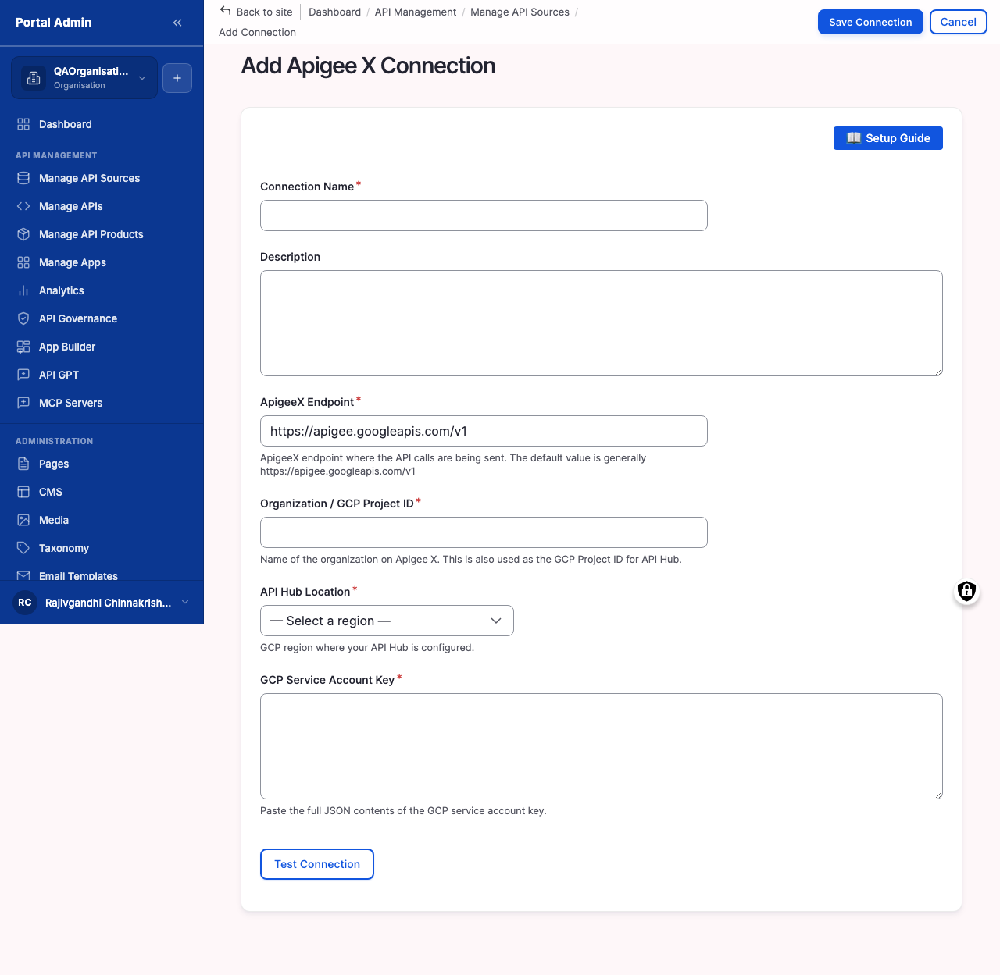

The numbered callouts in Figure 3-2 are:

1. **Connection Name** — A label visible only to you and your team. Use a name that includes the environment or region (for example "Production EU Apigee X"). Required, max 128 characters.
2. **Description** — Optional free text. Use this for organisational context such as which team owns the connection or which renewal cycle the credentials follow.
3. **ApigeeX Endpoint** — The Apigee X admin endpoint URL, not the runtime endpoint. Required, max 128 characters.
4. **Organization / GCP Project ID** — Your GCP project ID where Apigee X is provisioned. Case-sensitive. Required, max 128 characters.
5. **API Hub Location** — A dropdown of every supported GCP region. Select the region in which API Hub is deployed. Required.
6. **GCP Service Account Key** — Paste the full contents of your service-account JSON key. Required. The marketplace stores the key encrypted; rotate it by editing the connection later.

> **Result:** Your Apigee X connection is saved. The marketplace can now read your APIs from API Hub. You are ready to import your first API in [Importing your first API](importing-your-first-api.md#importing-your-first-api).

> **Note:** Saving the connection does not import any APIs by itself. APIs remain in Apigee X until you trigger the import described in the next chapter.

> **Caution:** The GCP Service Account Key grants the marketplace read access to every API in your project. If narrower scope is required, create a dedicated service account before pasting its key. Never paste a key that carries Owner or Editor roles on the project.

After saving, the connection appears under Existing API Sources with row-level actions to Import APIs from this gateway. The next chapter walks through the import in full; the figure below previews the dialog that opens when you click Import APIs on a saved Apigee X connection.

The numbered callouts in Figure 3-3 are:

1. **Source row** — The Existing API Sources entry for the connection you saved. The row carries the Import APIs action that opens this flow.
2. **Import APIs panel** — Lists the APIs the marketplace discovered in your gateway, ready for selection.
3. **Selection controls** — Tick individual APIs or use the header checkbox to import every API the connection exposes.
4. **Import** button — Pulls the selected APIs into Manage APIs as draft entries linked to this connection.

#### Verify

1. Confirm the saved connection is listed under Existing API Sources on the Manage API Sources page.
2. Confirm the row shows your connection name and an **Import APIs** action.
3. Click **Test connection** on the row and confirm a green confirmation banner.
4. Open the connection in edit mode and confirm every field except **GCP Service Account Key** retains your saved value.

## Adding other gateway connections

The Apigee X walkthrough covers the canonical shape of the Add Connection form. Each remaining gateway uses the same pattern — a connection name, an optional description, an admin or control-plane endpoint, a tenant or workspace identifier, and a credential — but the field set differs by product. Use the task subsections below for the remaining supported gateways.

#### Add an Apigee Edge connection

Use this task when your APIs run on **Apigee Edge** — the legacy on-premises and cloud Apigee product, distinct from Apigee X.

Apigee Edge authenticates with a username and password against your Apigee organisation.

To add an Apigee Edge connection:

1. From the left sidebar, select **Manage API Sources**.
2. In the Add New Source panel, click the **Apigee Edge** tile.
3. Fill in the form fields:
    - **Connection Name** — A label identifiable by your team. Required, max 128 characters.
    - **Description** — Optional free text describing the scope of this connection.
    - **Endpoint URL** — The Apigee Edge management API endpoint, typically `https://api.enterprise.apigee.com/`. Required, max 128 characters.
    - **Organization** — Your Apigee Edge organisation name. Required, max 128 characters.
    - **Environment** — The environment to read from (for example `prod`, `test`). Required, max 128 characters.
    - **Username** — The username of an Apigee user with read access to the organisation. Required, max 128 characters.
    - **Password** — The password for that user. Required, max 128 characters.
4. Click **Test connection**.
5. Click **Save**.

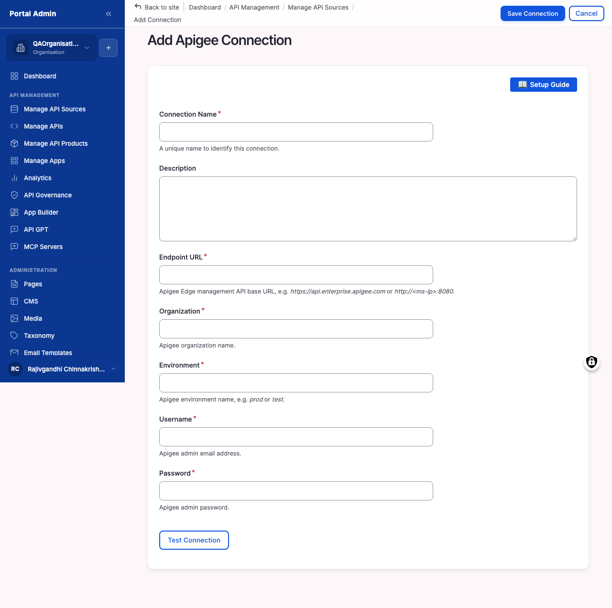

The numbered callouts in Figure 3-4 are:

1. **Connection Name** — The label your team uses to identify this connection in Existing API Sources.
2. **Endpoint URL** — The Apigee Edge management API endpoint, not the runtime endpoint your consumers call.
3. **Organization** and **Environment** — The Apigee organisation and environment scope this connection reads from.
4. **Username** and **Password** — Credentials of an Apigee user with read access to the organisation.
5. **Test connection** button — Validates the credentials before saving.
6. **Save** button — Persists the connection.

> **Note:** Add a separate Apigee Edge connection per environment if your team manages `dev`, `test`, and `prod` from the same organisation. Each environment is read independently.

> **Tip:** Where your security policy disallows passwords for service integrations, create a dedicated Apigee Edge user with the read-only Org User role and rotate its password through your existing identity workflow.

#### Add a Kong connection

Use this task when your APIs run on **Kong Gateway** (Enterprise or open-source with Kong Manager).

Kong authenticates with an admin API key against the Admin API URL.

To add a Kong connection:

1. From the left sidebar, select **Manage API Sources**.
2. In the Add New Source panel, click the **Kong** tile.
3. Fill in the form fields:
    - **Connection Name** — A label identifiable by your team. Required, max 128 characters.
    - **Description** — Optional free text describing the scope of this connection.
    - **Admin API URL** — The Kong Admin API URL (not the proxy URL), typically `https://kong-admin.example.com:8001`. Required, max 128 characters.
    - **Workspace** — Optional Kong Enterprise workspace name. Leave blank for the default workspace. Max 128 characters.
    - **Admin API Key** — A Kong RBAC token or admin API key with read access to services and routes. Required, max 128 characters.
4. Click **Test connection**.
5. Click **Save**.

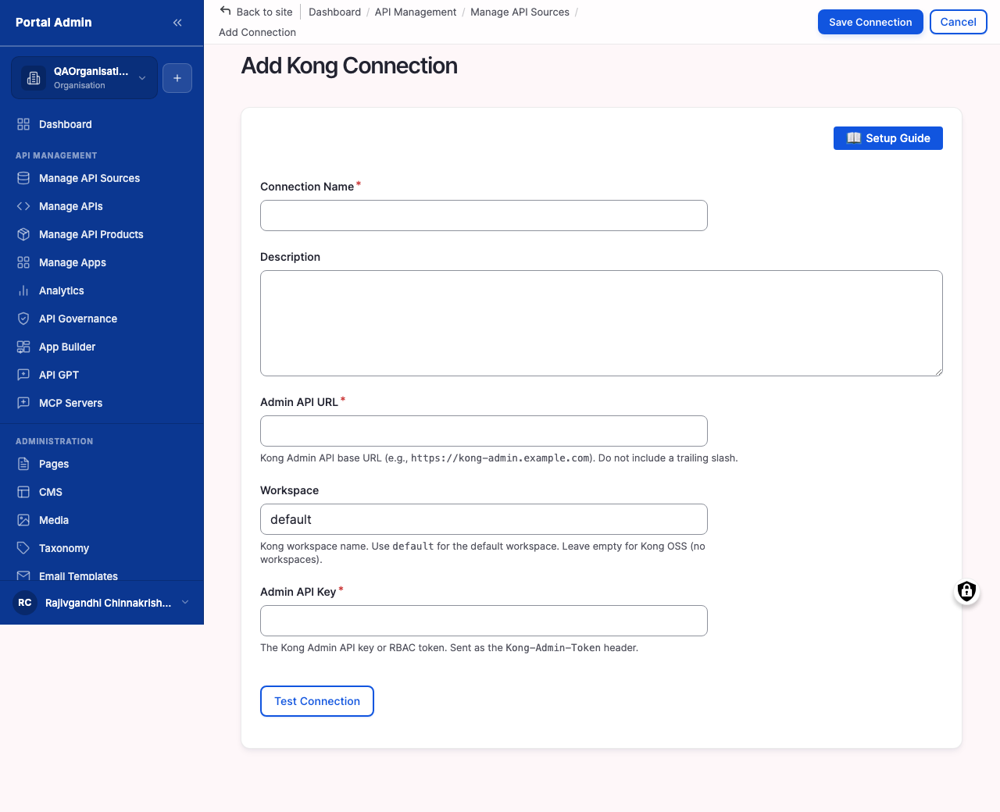

The numbered callouts in Figure 3-5 are:

1. **Connection Name** — Identifies this Kong instance in Existing API Sources.
2. **Admin API URL** — The Kong Admin API endpoint, not the proxy URL.
3. **Workspace** — Optional Kong Enterprise workspace; leave blank for open-source or default workspace.
4. **Admin API Key** — A Kong RBAC token or admin key with read access to services and routes.
5. **Test connection** button — Validates the credentials before saving.
6. **Save** button — Persists the connection.

> **Note:** Workspaces are a Kong Enterprise feature. If your team runs Kong open-source, leave **Workspace** blank.

#### Add a MuleSoft connection

Use this task when your APIs run on **MuleSoft Anypoint Platform**.

MuleSoft accepts either a username and password or an OAuth client ID and secret.

To add a MuleSoft connection:

1. From the left sidebar, select **Manage API Sources**.
2. In the Add New Source panel, click the **MuleSoft** tile.
3. Fill in the form fields:
    - **Connection Name** — A label identifiable by your team. Required, max 128 characters.
    - **Description** — Optional free text describing the scope of this connection.
    - **Anypoint Platform Base URL** — The Anypoint Platform base URL, typically `https://anypoint.mulesoft.com`. Required, max 128 characters.
    - **Business Group (Organization) ID** — The business group or organisation ID under which your APIs are registered. Required, max 128 characters.
    - **Environment ID** — The environment ID to read from (for example the production environment GUID). Required, max 128 characters.
    - Choose an authentication option:
        - **Username & Password** — Authenticate as an Anypoint user. Enter the **Username** and **Password** for that user.
        - **Client ID & Secret** — Authenticate using a connected app. Enter the **Client ID** and **Client Secret** for that app.
4. Click **Test connection**.
5. Click **Save**.

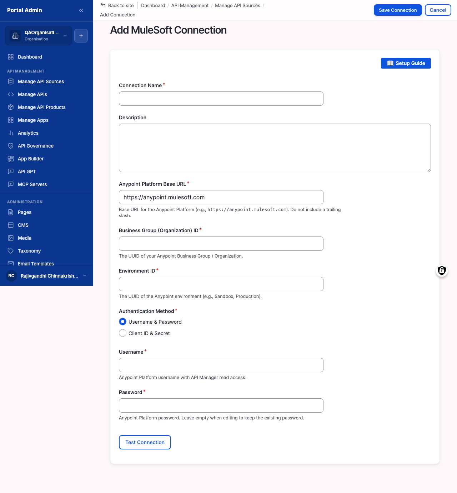

The numbered callouts in Figure 3-6 are:

1. **Connection Name** — Identifies this MuleSoft tenant in Existing API Sources.
2. **Anypoint Platform Base URL** — The Anypoint Platform endpoint the marketplace calls.
3. **Business Group (Organization) ID** and **Environment ID** — Scope this connection to a single business group and environment.
4. **Authentication block** — Choose **Username & Password** for a user-bound credential, or **Client ID & Secret** for a connected-app credential.
5. **Test connection** button — Validates the credentials before saving.
6. **Save** button — Persists the connection.

> **Tip:** Prefer **Client ID & Secret** for service integrations. A connected app is auditable and revocable independently of any one user account.

#### Add an AWS API Gateway connection

Use this task when your APIs run on **AWS API Gateway**.

AWS authenticates with an IAM access key pair scoped to a single region. Add a separate connection per region you operate in.

To add an AWS API Gateway connection:

1. From the left sidebar, select **Manage API Sources**.
2. In the Add New Source panel, click the **AWS API Gateway** tile.
3. Fill in the form fields:
    - **Connection Name** — A label identifiable by your team — include the region (for example "Production us-east-1"). Required, max 128 characters.
    - **Description** — Optional free text describing the scope of this connection.
    - **AWS Region** — Select the region your APIs are deployed in. The dropdown lists every commercial, GovCloud, and China region. Required.
    - **Access Key ID** — The IAM access key ID for a user or role with read access to API Gateway. Required, max 128 characters.
    - **Secret Access Key** — The matching secret access key. Required, max 128 characters.
    - **Use Assume Role** — Optional. Select to have the marketplace assume an IAM role rather than using the access key directly.
    - **Enable AWS Cognito Authentication** — Optional. Select if your APIs sit behind a Cognito user pool and you want the marketplace to honour Cognito authorisers when proxying calls.
4. Click **Test connection**.
5. Click **Save**.

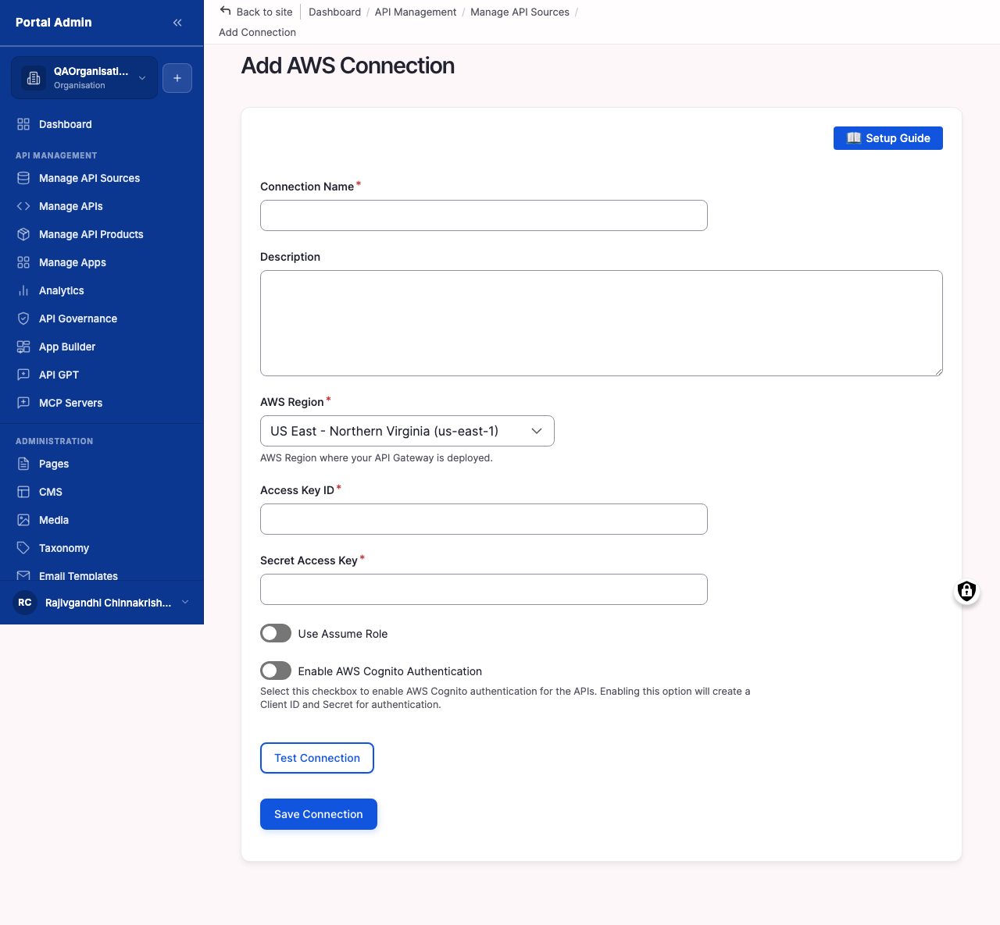

The numbered callouts in Figure 3-7 are:

1. **Connection Name** — Identifies the AWS account and region this connection covers.
2. **AWS Region** — Selects the region the marketplace reads APIs from. AWS API Gateway is regional; one connection covers one region.
3. **Access Key ID** and **Secret Access Key** — IAM credentials for a user or role with read access to API Gateway.
4. **Use Assume Role** and **Enable AWS Cognito Authentication** — Optional toggles for IAM role chaining and Cognito-protected APIs.
5. **Test connection** button — Validates the credentials before saving.
6. **Save** button — Persists the connection.

> **Note:** AWS API Gateway is a regional service. A connection bound to `us-east-1` does not see APIs in `eu-west-1`. Add one connection per region.

> **Caution:** Use a dedicated IAM user or role with a read-only API Gateway policy. Never paste root-account or administrator credentials.

#### Add an Azure API Management connection

Use this task when your APIs run on **Azure API Management**.

Azure authenticates with a service-principal client ID and secret against your Azure tenant. The marketplace also supports SAS-token authentication for environments that disallow OAuth.

To add an Azure API Management connection:

1. From the left sidebar, select **Manage API Sources**.
2. In the Add New Source panel, click the **Azure** tile.
3. Fill in the form fields:
    - **Connection Name** — A label identifiable by your team. Required, max 128 characters.
    - **Description** — Optional free text describing the scope of this connection.
    - **Service Name** — The API Management service instance name as it appears in the Azure portal. Required, max 128 characters.
    - **Resource Group** — The Azure resource group that contains the service instance. Required, max 128 characters.
    - **Subscription ID** — The Azure subscription GUID under which the service is provisioned. Required, max 128 characters.
    - **Management API URL** — The Azure Resource Manager management endpoint, typically `https://management.azure.com`. Required, max 128 characters.
    - **Authentication Type** — Choose **OAuth** (default) or **SAS Token**.
    - **Tenant ID** — The Azure AD tenant GUID for OAuth authentication. Required, max 128 characters.
    - **Client ID** — The service-principal client ID. Required, max 128 characters.
    - **Client Secret** — The service-principal client secret. Required, max 128 characters.
4. Click **Test connection**.
5. Click **Save**.

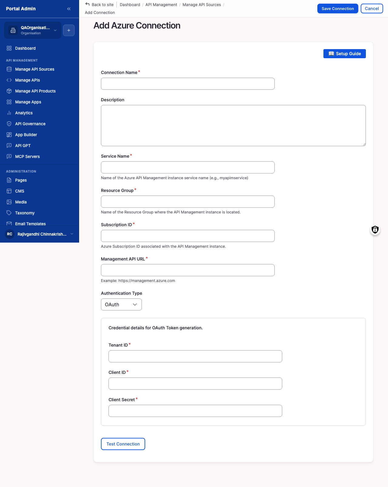

The numbered callouts in Figure 3-8 are:

1. **Connection Name** — Identifies this Azure tenant and resource group in Existing API Sources.
2. **Service Name**, **Resource Group**, and **Subscription ID** — Together name the API Management instance the connection reads from.
3. **Authentication Type** — Choose **OAuth** for service-principal auth or **SAS Token** for environments that disallow OAuth.
4. **Tenant ID**, **Client ID**, and **Client Secret** — The service-principal credentials used when **OAuth** is selected.
5. **Test connection** button — Validates the credentials before saving.
6. **Save** button — Persists the connection.

> **Tip:** Create a dedicated service principal scoped to the API Management resource group with the *API Management Service Reader* role. Avoid subscription-wide Contributor rights.

#### Add an IBM API Connect connection

Use this task when your APIs run on **IBM API Connect**.

IBM API Connect requires a toolkit OAuth credential, an IBM API key, and a provider organisation — the API key alone is insufficient.

To add an IBM API Connect connection:

1. From the left sidebar, select **Manage API Sources**.
2. In the Add New Source panel, click the **IBM API Connect** tile.
3. Fill in the form fields:
    - **Connection Name** — A label identifiable by your team. Required, max 128 characters.
    - **Description** — Optional free text describing the scope of this connection.
    - **Toolkit Endpoint** — The API Connect toolkit (platform) endpoint URL. Required, max 128 characters.
    - **Toolkit Client ID** — The OAuth client ID issued for toolkit access. Required, max 128 characters.
    - **Toolkit Client Secret** — The matching OAuth client secret. Required, max 128 characters.
    - **IBM API Key** — Your IBM Cloud API key. Required, max 128 characters.
    - **Provider Organisation Name** — The provider organisation that owns your APIs. Required, max 128 characters.
    - **Catalog Name** — The catalog within the provider organisation to read from. Required, max 128 characters.
    - **Import Level** — Choose **Catalog** to read every API in the catalog, or **Space** to scope to a single space within the catalog.
    - **Space Name** — Required only when **Import Level** is **Space**. Names the space to read from. Max 128 characters.
    - **User Registry Name** — The user registry the toolkit credentials belong to. Required, max 128 characters.
4. Click **Test connection**.
5. Click **Save**.

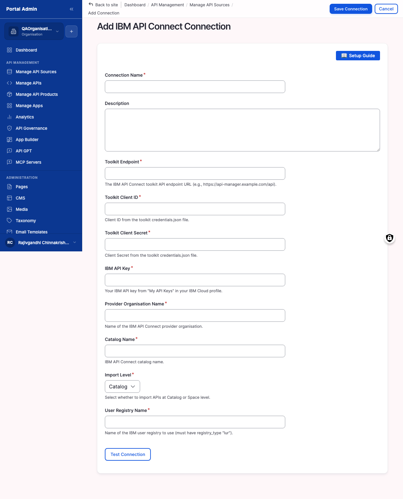

The numbered callouts in Figure 3-9 are:

1. **Connection Name** — Identifies this API Connect deployment in Existing API Sources.
2. **Toolkit Endpoint**, **Toolkit Client ID**, and **Toolkit Client Secret** — The OAuth toolkit credentials the marketplace uses to authenticate.
3. **IBM API Key** and **User Registry Name** — Pair an IBM Cloud API key with the user registry the toolkit credentials belong to.
4. **Provider Organisation Name** and **Catalog Name** — Scope the connection to one provider organisation and one catalog.
5. **Import Level** and **Space Name** — Choose **Catalog** to read every API, or **Space** plus a space name to scope tighter.
6. **Test connection** and **Save** — Validate and persist the connection.

> **Note:** The provider organisation is distinct from the catalog. A single API Connect deployment can host multiple provider organisations, each with multiple catalogs.

#### Add a Tyk connection

Use this task when your APIs run on **Tyk**.

Tyk supports two operating modes — Tyk Pro/Cloud (Dashboard API) and Tyk open-source (Gateway API). The marketplace defaults to Dashboard mode; switch the **API Mode** field for a Gateway-only deployment.

To add a Tyk connection:

1. From the left sidebar, select **Manage API Sources**.
2. In the Add New Source panel, click the **Tyk** tile.
3. Fill in the form fields:
    - **Connection Name** — A label identifiable by your team. Required, max 128 characters.
    - **Description** — Optional free text describing the scope of this connection.
    - **API Mode** — Choose **Tyk Dashboard API (Pro/Cloud)** (default) for a managed deployment, or **Tyk Gateway API (Open Source)** for a gateway-only deployment.
    - **Dashboard URL** — The Tyk Dashboard URL (or the Gateway API URL when in Gateway mode). Required, max 128 characters.
    - **Dashboard API Key** — The dashboard or gateway API key with read access. Required, max 128 characters.
4. Click **Test connection**.
5. Click **Save**.

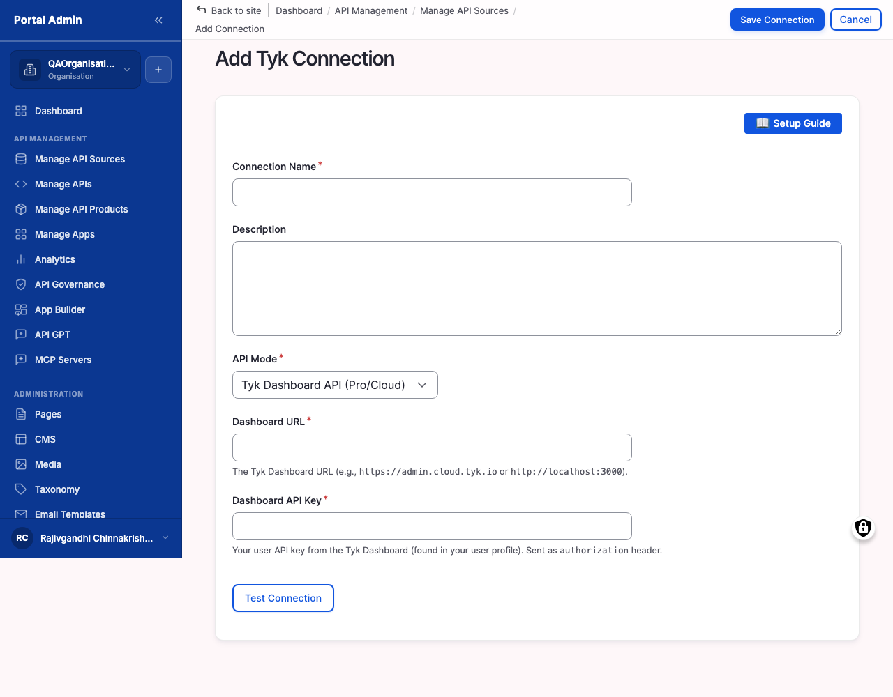

The numbered callouts in Figure 3-10 are:

1. **Connection Name** — Identifies this Tyk deployment in Existing API Sources.
2. **API Mode** — Choose **Tyk Dashboard API (Pro/Cloud)** for managed deployments or **Tyk Gateway API (Open Source)** for gateway-only deployments.
3. **Dashboard URL** — The Tyk Dashboard URL, or the Gateway API URL when in Gateway mode.
4. **Dashboard API Key** — A dashboard or gateway API key with read access.
5. **Test connection** button — Validates the credentials before saving.
6. **Save** button — Persists the connection.

> **Note:** Tyk Cloud users can find the Dashboard API key under **Users > Edit Profile > Tyk Dashboard API Access Credentials**.

#### Add an APISIX connection

Use this task when your APIs run on **Apache APISIX**.

APISIX requires both the Admin API base URL (control plane) and the Runtime URL (data plane) so that imported routes can be matched to the correct runtime.

To add an APISIX connection:

1. From the left sidebar, select **Manage API Sources**.
2. In the Add New Source panel, click the **APISIX** tile.
3. Fill in the form fields:
    - **Connection Name** — A label identifiable by your team. Required, max 128 characters.
    - **Description** — Optional free text describing the scope of this connection.
    - **Admin API Base URL** — The APISIX Admin API URL, typically on port `9180`. Required, max 128 characters.
    - **Runtime URL** — The APISIX runtime (data-plane) URL where consumer traffic terminates. Required, max 128 characters.
    - **Admin API Key** — The APISIX admin key configured in `config.yaml`. Required, max 128 characters.
4. Click **Test connection**.
5. Click **Save**.

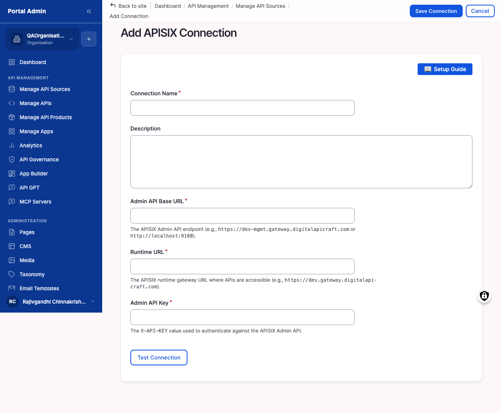

The numbered callouts in Figure 3-11 are:

1. **Connection Name** — Identifies this APISIX deployment in Existing API Sources.
2. **Admin API Base URL** — The APISIX Admin API URL on the control plane (typically port `9180`).
3. **Runtime URL** — The APISIX runtime URL on the data plane where consumer traffic terminates.
4. **Admin API Key** — The APISIX admin key configured in `config.yaml`.
5. **Test connection** button — Validates the credentials before saving.
6. **Save** button — Persists the connection.

> **Tip:** When the Admin API and Runtime are on different hosts (for example a hardened control-plane node and a public data-plane fleet), enter the host that the marketplace can reach for **Admin API Base URL** and the consumer-facing host for **Runtime URL**.

#### Add an Aelix connection

Use this task when your APIs run on **Aelix**.

Aelix authenticates with the email and password of an Aelix control-plane user.

To add an Aelix connection:

1. From the left sidebar, select **Manage API Sources**.
2. In the Add New Source panel, click the **Aelix** tile.
3. Fill in the form fields:
    - **Connection Name** — A label identifiable by your team. Required, max 128 characters.
    - **Description** — Optional free text describing the scope of this connection.
    - **Control Plane Endpoint URL** — The Aelix control-plane URL. Required, max 128 characters.
    - **Email** — The email address of an Aelix user with read access. Required, max 254 characters.
    - **Password** — The password for that Aelix user. Required, max 128 characters.
4. Click **Test connection**.
5. Click **Save**.

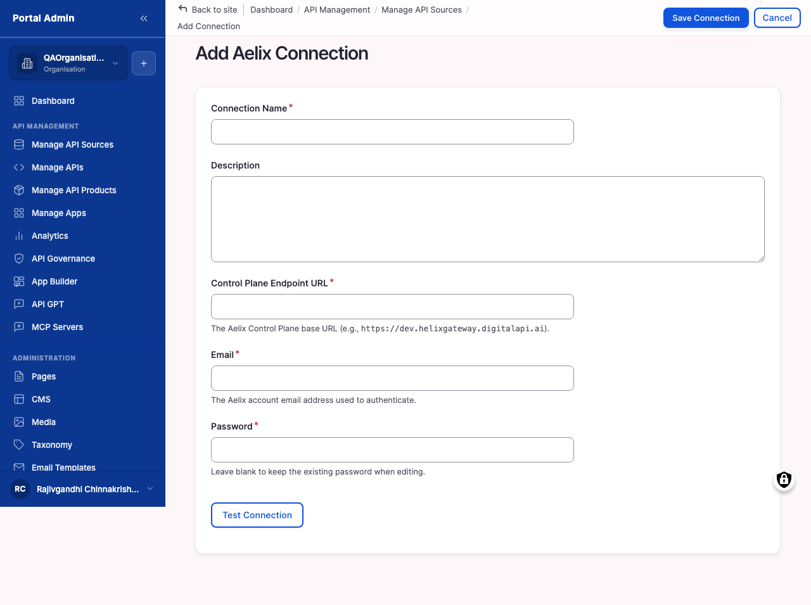

The numbered callouts in Figure 3-12 are:

1. **Connection Name** — Identifies this Aelix deployment in Existing API Sources.
2. **Control Plane Endpoint URL** — The Aelix control-plane URL the marketplace authenticates against.
3. **Email** — The address of an Aelix control-plane user with read access.
4. **Password** — The password for that Aelix user.
5. **Test connection** button — Validates the credentials before saving.
6. **Save** button — Persists the connection.

> **Tip:** Create a dedicated Aelix service user for the marketplace and rotate its password on the same cadence as your other gateway credentials.

## Verifying and managing connections

After you save a connection, confirm the marketplace can reach your gateway, and learn how to update or remove the connection later.

#### Test the connection

Use this task whenever you create a new connection or change credentials on an existing one. A successful test indicates that the marketplace can reach your gateway's admin endpoint and authenticate with the credentials supplied.

To test a connection:

1. On the **Add Connection** form (or the equivalent edit form for an existing connection), complete every required field.
2. Click **Test connection**. The button sits next to Save at the bottom of the form.
3. Wait for the result banner. A green confirmation indicates the marketplace authenticated against the gateway. A red error banner indicates the test failed; the message names the failing step (for example "endpoint unreachable", "authentication rejected", or "API Hub region returned empty").
4. If the test fails, correct the field the error names. Common causes are an admin endpoint pointed at the runtime URL, a typo in the project ID, a service account that lacks the Apigee Reader role, or a regional API Hub deployed in a different region than the dropdown selection.
5. Click **Test connection** again. Repeat until the green confirmation appears.
6. Click **Save**. A connection that fails the test remains saveable, but it cannot import APIs until the underlying problem is resolved.

> **Result:** The marketplace has confirmed it can read from your gateway. The connection is ready for import.

> **Tip:** Run Test connection whenever credentials may have rotated or the gateway may have moved. A quick health check is faster than waiting for an import to fail with a less obvious error.

#### Verify

1. Confirm the green confirmation banner appears under the **Test connection** button.
2. Read the banner text — it names the gateway endpoint and the tenant the marketplace authenticated against.
3. If a red banner is shown, note the failing step (endpoint, authentication, or region) and correct that field before retesting.

#### Add additional gateways

Use this task when your team runs more than one gateway, or to onboard a second gateway alongside your first.

To add another gateway:

1. From the left sidebar, select **Manage API Sources**.
2. In the Add New Source panel, click the tile for the gateway product to add. Each tile opens its own Add Connection form at `/admin/apim/connection/add/<gateway>`.
3. Complete the form. The shape mirrors the Apigee X walkthrough above — a connection name, a description, an admin endpoint, a tenant identifier, and a credential — but field labels and authentication mechanics differ per product. For example: Apigee (the legacy Edge product) takes a username and password; Kong takes an Admin API URL and admin API key; AWS takes a region and an IAM access key pair; Azure takes a tenant ID and a client secret; IBM API Connect takes a provider org and an API key.
4. Click **Test connection**, then **Save**.
5. The new gateway appears as a separate entry under Existing API Sources, alongside any gateways added previously.

> **Result:** Multiple gateways are connected. Each behaves as an independent source; APIs imported from one remain associated with that connection. After saving, the new connection joins the others under Existing API Sources further down the Manage API Sources page, with row-level Import APIs, Edit, and Delete Connection actions.

> **Note:** The marketplace does not deduplicate APIs across gateways. If the same OpenAPI spec is published in two gateways, two API entries appear — one per source. Use API Products to group them logically (covered in [Reviewing API Products and Plans](reviewing-api-products-and-plans.md#reviewing-api-products-and-plans)).

#### Verify

1. Confirm both gateways appear as separate rows under Existing API Sources.
2. Confirm each row shows its own connection name and gateway type.
3. Click **Test connection** on the new row and confirm the green confirmation banner.

#### Edit or revoke a connection

Use this task to rotate credentials, point an existing connection at a new endpoint, or remove a gateway you no longer want the marketplace to read from.

#### Before you start

- **Decide whether to edit or delete.** Editing preserves the connection's identity, the imported APIs, and any subscriptions. Deleting removes them. Most credential rotations and endpoint moves should be edits, not deletes.
- **Check dependencies before deleting.** Open Manage APIs, filter by the gateway, and review which APIs were imported from this connection. If any of those APIs have live consumer subscriptions, deleting the connection breaks them.

To edit a connection:

1. From the left sidebar, select **Manage API Sources**.
2. Under Existing API Sources, locate the row for the connection to change.
3. Click **Edit**. The original Add Connection form opens with current values pre-filled — except secret fields such as GCP Service Account Key, which are blanked for safety.
4. Update the required fields. To rotate credentials, paste the new key into the secret field; to move endpoints, change the admin URL.
5. Click **Test connection** to confirm the new values work.
6. Click **Save**.

To revoke (delete) a connection:

1. From the left sidebar, select **Manage API Sources**.
2. Under Existing API Sources, locate the row for the connection to remove.
3. Click **Delete Connection**.
4. Confirm the action in the dialog that appears. The marketplace removes the connection record and unlinks every API imported from it.

> **Caution:** Deleting a connection that has imported APIs unlinks those APIs from their source. Any consumer apps subscribed to those APIs lose access on the next request. Before deleting, either migrate consumers to a replacement API on a different gateway, or warn them with the Upcoming API Deprecation Notice workflow.

> **Result:** The connection is updated or removed. Edited connections re-test with the new values on the next import; deleted connections disappear from the list and stop appearing in import flows.

> **Note:** Editing a connection's Connection Name is safe — it is only a label. Editing the admin endpoint or tenant identifier on a connection that already has imported APIs may strand those APIs if the new endpoint does not expose them; re-import after a major endpoint change.

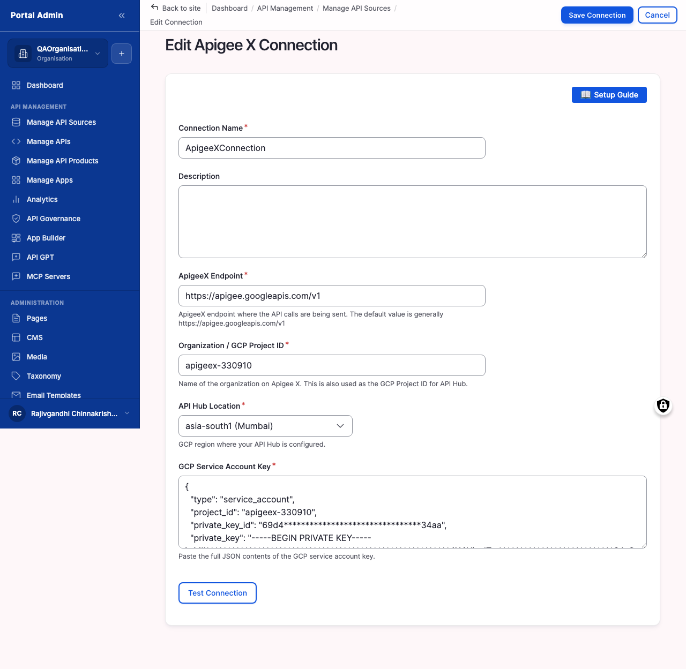

The numbered callouts in Figure 3-13 are:

1. **Pre-populated fields** — Non-secret values such as Connection Name, endpoint, and tenant identifier are filled with the connection's current values.
2. **Blanked secret fields** — Fields like GCP Service Account Key are emptied for safety. Paste a new value to rotate the credential, or leave blank to keep the existing one.
3. **Test connection** button — Re-validates with whatever value is in the secret field after your edit.
4. **Delete Connection** action — Removes the connection record and unlinks every API imported from it; surfaces a confirmation dialog before applying.

#### Verify

1. After an edit, confirm the row under Existing API Sources reflects your updated values (for example, a new endpoint or connection name).
2. After an edit, click **Test connection** on the row and confirm the green confirmation banner.
3. After a delete, confirm the row no longer appears under Existing API Sources.
4. After a delete, open Manage APIs and confirm APIs sourced from the deleted connection no longer reference it in the API Source column.

## Connecting a documentation source

Beyond the runtime gateways, the marketplace can also pull APIs from spec-only and design-time sources — locations where an OpenAPI document lives but no traffic flows through a gateway yet. The flow shape mirrors gateways: select the source product, enter credentials, save. Only the surface and the field set differ.

#### Add a documentation source

Use this task when an API is not behind a runtime gateway yet but its OpenAPI document is held in a spec registry (SwaggerHub, Postman) or a source-control repository (Azure Repos, GitHub, Bitbucket).

#### Before you start

- **Confirm the spec is in one of the supported sources.** The current list is SwaggerHub (active), Postman (Coming Soon), Azure Repos (Coming Soon), GitHub (Coming Soon), and Bitbucket (Coming Soon). Tiles marked Coming Soon import nothing today; they are placeholders.
- **Obtain a read-only token for the source.** SwaggerHub takes an API key with read scope. The other sources will accept similar read tokens once enabled.

To add a documentation source:

1. From the left sidebar, select **Manage API Sources**. The page opens at `/admin/apim/connections` with the API Gateways tile group active by default (Figure 3-1).
2. In the top-right corner of the page, click **Manage Documentation Sources**. The page remains at `/admin/apim/connections` but the visible tile group switches from API Gateways to API Collections / Repositories — the spec-only sources. The tiles in this group are SwaggerHub (active), Postman, Azure Repos, GitHub, and Bitbucket (all marked Coming Soon today).
3. Click the active tile (currently **SwaggerHub**). The tile action reads Configure & Import.
4. Complete the source-specific form. SwaggerHub's form takes an organisation name and an API key; the other sources will follow the same shape when enabled.
5. Click **Save**. The source is registered. It then appears as an Import APIs target on the Manage APIs page covered in [Importing your first API](importing-your-first-api.md#importing-your-first-api).

> **Result:** A documentation source is registered alongside your gateway connections. APIs imported from it appear in Manage APIs with the source labelled accordingly. You can publish them, attach them to API Products, and approve subscriptions exactly as for gateway-imported APIs.

> **Note:** Documentation sources surface API specs, not runtime traffic. Consumers can read the spec and try requests in the in-browser console, but the request goes to whichever server URL the spec declares — there is no marketplace proxy in front. Bind the same API to a runtime gateway later if a managed proxy is required.

> **Note:** Manage Documentation Sources is a view toggle on the same page, not a navigation. The URL remains `/admin/apim/connections`; only the visible tile group changes. Click Manage API Gateways (the inverse button that appears in the same top-right slot) to return to the gateway tiles.

> **Tip:** If your team owns both a spec registry (for design-time iteration) and a runtime gateway (for live traffic), import the same API from both. The gateway version handles real consumer requests; the spec-registry version remains in sync with the API team's current edits.

#### Verify

1. Confirm the visible tile group has switched to API Collections / Repositories after clicking **Manage Documentation Sources**.
2. Confirm your saved source is listed under Existing API Sources on the Manage Documentation Sources view.
3. Click **Test connection** (where exposed) and confirm the green confirmation banner.

## Adding documentation source connections

The previous task introduces the documentation-source surface as a single flow. The task subsections below cover each supported source individually — SwaggerHub as the canonical worked example, then short walkthroughs for Postman, GitHub, Bitbucket, and Azure Repos.

#### Add a SwaggerHub connection

Use this task when an API spec is hosted in **SwaggerHub** and not yet behind a runtime gateway.

SwaggerHub authenticates with an API key issued to your SwaggerHub user. The marketplace uses the key to list the APIs and definitions owned by a single SwaggerHub user — and optionally, an organisation that user belongs to.

#### Before you start

- **Generate a SwaggerHub API key.** From your SwaggerHub profile, open API Keys, create a new key with read access, and copy it. The marketplace stores the key encrypted; you can rotate it later by editing the connection.
- **Identify the owner.** Owner is the SwaggerHub user whose APIs you want to import — typically your SwaggerHub login. Owner is required.
- **Identify the organisation, if applicable.** If your APIs are owned by a SwaggerHub organisation rather than an individual, also enter the organisation name. Organisation is optional; leave blank for personal accounts.

To add a SwaggerHub connection:

1. From the left sidebar, select **Manage API Sources**.
2. In the top-right corner of the page, click **Manage Documentation Sources** to switch the visible tile group.
3. Click the **SwaggerHub** tile. The page opens at `/admin/apim/connection/add/swaggerhub`.
4. Fill in the form fields:
    - **Connection Name** — A label identifiable by your team. Required, max 128 characters.
    - **Description** — Optional free text describing the scope of this connection.
    - **API Key** — Your SwaggerHub API key. Required, max 128 characters.
    - **Organization** — The SwaggerHub organisation name (for example `my-org`). Optional, max 128 characters.
    - **Owner** — The SwaggerHub user whose APIs you want to import (for example `my-user`). Required, max 128 characters.
5. Click **Test connection** to confirm the marketplace can list APIs with the supplied credentials.
6. Click **Save**. The connection appears under Existing API Sources on the Manage Documentation Sources view.

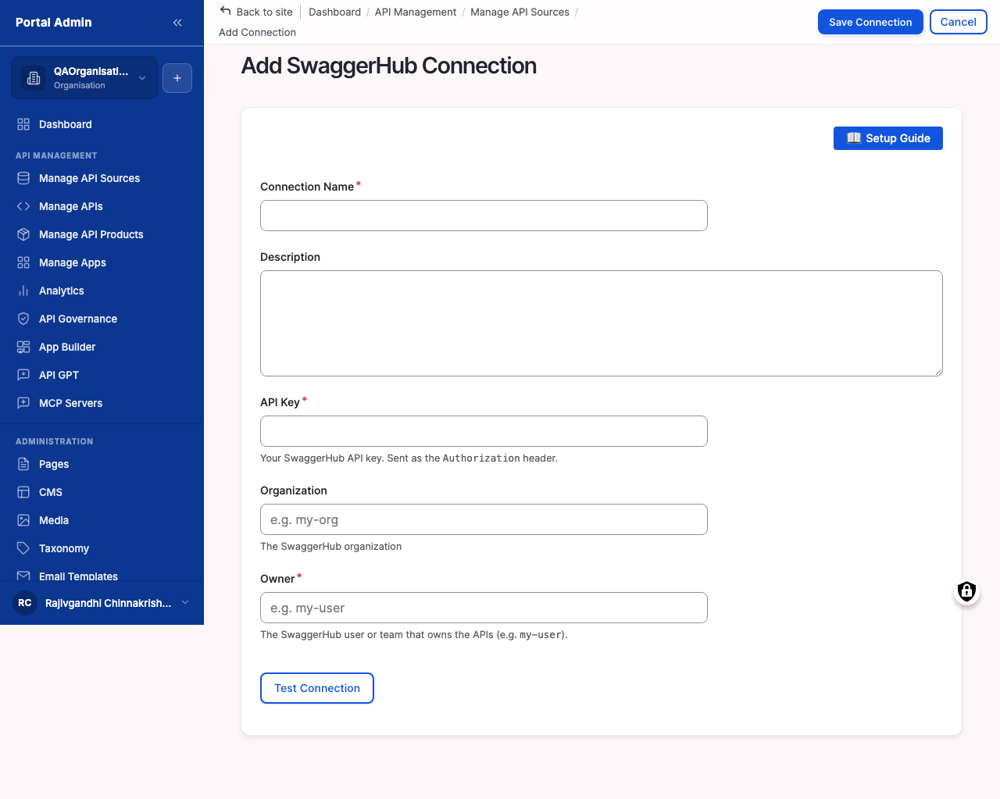

The numbered callouts in Figure 3-14 are:

1. **Connection Name** — Identifies this SwaggerHub source in Existing API Sources.
2. **API Key** — A SwaggerHub API key with read scope, issued from your SwaggerHub profile.
3. **Organization** — Optional organisation name. Leave blank for personal accounts.
4. **Owner** — The SwaggerHub user whose APIs the connection imports.
5. **Test connection** button — Validates the credentials before saving.
6. **Save** button — Persists the connection.

> **Result:** Your SwaggerHub connection is saved. The marketplace can now read OpenAPI definitions from SwaggerHub. Imported APIs land in Manage APIs with the source labelled SwaggerHub. See [Importing your first API](importing-your-first-api.md#importing-your-first-api) for the import step.

> **Note:** SwaggerHub APIs surface as spec-only entries. Consumers can read the OpenAPI document and try requests, but the request hits whichever server URL the spec declares — there is no marketplace proxy in front. To put a managed proxy in front of a SwaggerHub-imported API, also publish that API through one of your gateway connections.

> **Tip:** If a single SwaggerHub user owns APIs across multiple organisations, add a separate connection per organisation. Each connection scopes its imports to the **Organization** + **Owner** combination, so multiple connections produce cleaner per-organisation audit trails.

#### Verify

1. Confirm the SwaggerHub row is listed under Existing API Sources on the Manage Documentation Sources view.
2. Click **Test connection** on the row and confirm the green confirmation banner.
3. Open the connection in edit mode and confirm the **API Key** field is blanked while **Owner** and **Organization** retain their saved values.

#### Add a Postman connection

Use this task when an API spec is held in a **Postman** workspace.

Postman authenticates with a Postman API key.

To add a Postman connection:

1. From the left sidebar, select **Manage API Sources**.
2. Click **Manage Documentation Sources** to switch the visible tile group.
3. Click the **Postman** tile.
4. Fill in the form fields:
    - **Connection Name** — A label identifiable by your team. Required, max 128 characters.
    - **Description** — Optional free text describing the scope of this connection.
    - **Postman API Key** — Your Postman API key with read access to the workspace. Required, max 128 characters.
5. Click **Save**.

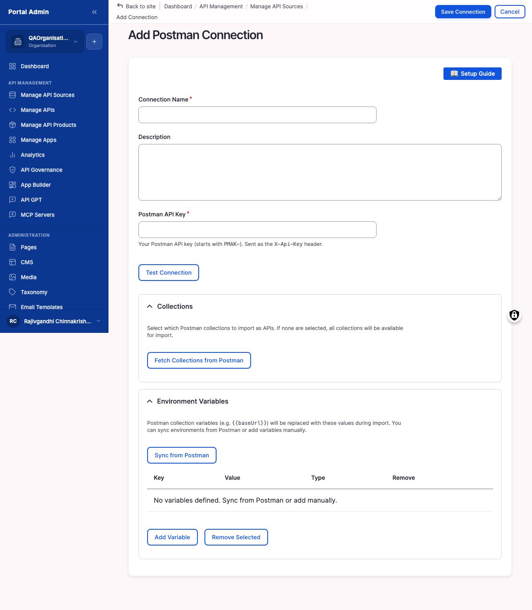

The numbered callouts in Figure 3-15 are:

1. **Connection Name** — Identifies this Postman workspace in Existing API Sources.
2. **Description** — Optional free text describing the scope of the connection.
3. **Postman API Key** — A Postman API key with read access to the workspace.
4. **Save** button — Persists the connection (imports remain disabled until the tile leaves Coming Soon).

> **Note:** The Postman tile is marked **Coming Soon** today. The form is visible but imports are disabled pending a future release. The fields are documented here so that your onboarding plan accounts for them.

#### Add a GitHub connection

Use this task when an OpenAPI spec is held in a **GitHub** repository.

GitHub authenticates with a personal access token (or fine-grained token) that has read access to the repository contents.

To add a GitHub connection:

1. From the left sidebar, select **Manage API Sources**.
2. Click **Manage Documentation Sources** to switch the visible tile group.
3. Click the **GitHub** tile.
4. Fill in the form fields:
    - **Connection Name** — A label identifiable by your team (for example "My GitHub Connection"). Required, max 128 characters.
    - **Repository URL** — The full GitHub repository URL (for example `https://github.com/my-org/my-api-repo`). Required, max 128 characters.
    - **GitHub Access Token** — A personal access token with read access to repository contents. Required, max 128 characters.
    - **Branch** — Select the branch to read specs from. The dropdown populates after you enter a valid repository URL and token.
    - **OpenAPI** — Select the spec format checkbox to read OpenAPI documents from the repository.
5. Click **Save**.

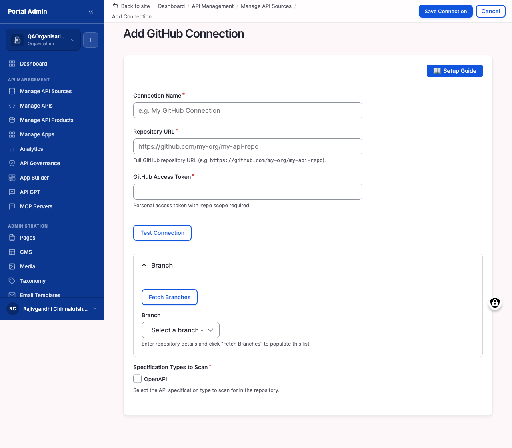

The numbered callouts in Figure 3-16 are:

1. **Connection Name** — Identifies this GitHub repository source in Existing API Sources.
2. **Repository URL** — The full GitHub repository URL the connection reads from.
3. **GitHub Access Token** — A personal or fine-grained token with read access to repository contents.
4. **Branch** — Populates after a valid URL and token are entered; selects the branch to read specs from.
5. **OpenAPI** — Spec-format checkbox that enables OpenAPI document discovery in the repository.
6. **Save** button — Persists the connection.

> **Note:** The GitHub tile is marked **Coming Soon** today. The form is visible but imports are disabled pending a future release. The fields are documented here so that your onboarding plan accounts for them.

#### Add a Bitbucket connection

Use this task when an OpenAPI spec is held in a **Bitbucket** repository.

Bitbucket authenticates with a username and an app password scoped to repository read access.

To add a Bitbucket connection:

1. From the left sidebar, select **Manage API Sources**.
2. Click **Manage Documentation Sources** to switch the visible tile group.
3. Click the **Bitbucket** tile.
4. Fill in the form fields:
    - **Connection Name** — A label identifiable by your team (for example "My Bitbucket Connection"). Required, max 128 characters.
    - **Repository URL** — The full Bitbucket repository URL (for example `https://bitbucket.org/my-workspace/my-api-repo`). Required, max 128 characters.
    - **Username** — Your Bitbucket username. Required, max 128 characters.
    - **App Password** — A Bitbucket app password with repository read scope. Required, max 128 characters.
    - **Branch** — Select the branch to read specs from. The dropdown populates after you enter a valid repository URL and credentials.
    - **OpenAPI** — Select the spec format checkbox to read OpenAPI documents from the repository.
5. Click **Save**.

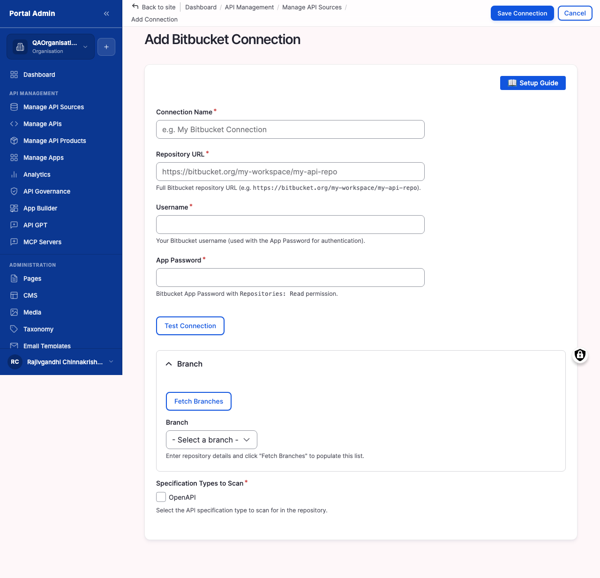

The numbered callouts in Figure 3-17 are:

1. **Connection Name** — Identifies this Bitbucket repository source in Existing API Sources.
2. **Repository URL** — The full Bitbucket repository URL the connection reads from.
3. **Username** and **App Password** — A Bitbucket username paired with an app password scoped to repository read access.
4. **Branch** — Populates after a valid URL and credentials are entered; selects the branch to read specs from.
5. **OpenAPI** — Spec-format checkbox that enables OpenAPI document discovery in the repository.
6. **Save** button — Persists the connection.

> **Note:** The Bitbucket tile is marked **Coming Soon** today. The form is visible but imports are disabled pending a future release. The fields are documented here so that your onboarding plan accounts for them.

#### Add an Azure Repos connection

Use this task when an OpenAPI or Swagger spec is held in an **Azure Repos** repository.

Azure Repos authenticates with a personal access token scoped to Code (Read).

To add an Azure Repos connection:

1. From the left sidebar, select **Manage API Sources**.
2. Click **Manage Documentation Sources** to switch the visible tile group.
3. Click the **Azure Repos** tile.
4. Fill in the form fields:
    - **Connection Name** — A label identifiable by your team. Required, max 128 characters.
    - **Description** — Optional free text describing the scope of this connection.
    - **Repository URL** — The Azure Repos repository URL. Required, max 128 characters.
    - **Access Token** — An Azure DevOps personal access token with Code (Read) scope. Required, max 128 characters.
    - **OpenAPI** — Select to read OpenAPI 3.x documents from the repository.
    - **Swagger** — Select to read Swagger 2.0 documents from the repository.
    - **Branch** — Click **Fetch Branches** to load the list, then select the branch to read specs from.
5. Click **Save**.

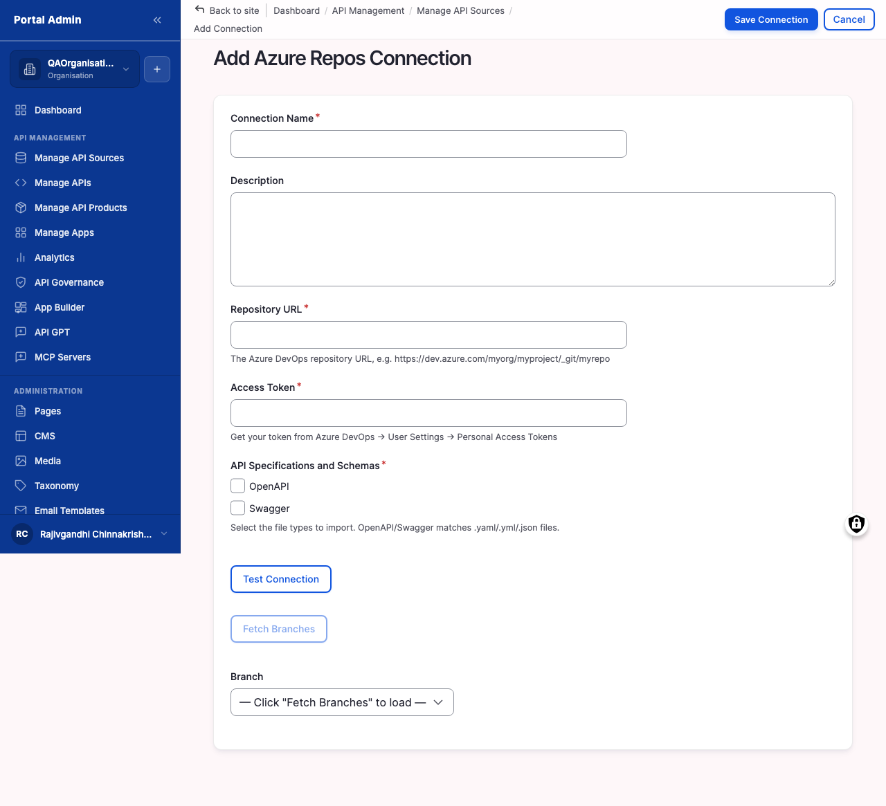

The numbered callouts in Figure 3-18 are:

1. **Connection Name** — Identifies this Azure Repos source in Existing API Sources.
2. **Repository URL** — The Azure Repos repository URL the connection reads from.
3. **Access Token** — An Azure DevOps personal access token with Code (Read) scope.
4. **OpenAPI** and **Swagger** — Spec-format checkboxes; tick to read OpenAPI 3.x or Swagger 2.0 documents from the repository.
5. **Fetch Branches** action and **Branch** dropdown — Loads available branches once the URL and token are valid; pick the branch to read specs from.
6. **Save** button — Persists the connection.

> **Note:** The Azure Repos tile is marked **Coming Soon** today. The form is visible but imports are disabled pending a future release. The fields are documented here so that your onboarding plan accounts for them.

## Next steps

- **[Importing your first API](importing-your-first-api.md#importing-your-first-api)** — Now that your gateway is connected, the next chapter walks through pulling APIs from it into the marketplace catalog.
- **[Reviewing API governance](reviewing-api-governance.md#reviewing-api-governance)** — Each imported API runs through a linting pass; this chapter shows how to read the resulting score before you publish.
- **[Publishing your first API](publishing-your-first-api.md#publishing-your-first-api)** — Once governance is acceptable, transition the API from Draft to Published so consumers can find it in the catalog.
- **[Reviewing API Products and Plans](reviewing-api-products-and-plans.md#reviewing-api-products-and-plans)** — Wrap one or more APIs into a subscribable Product with a Plan; required before consumers can subscribe.
