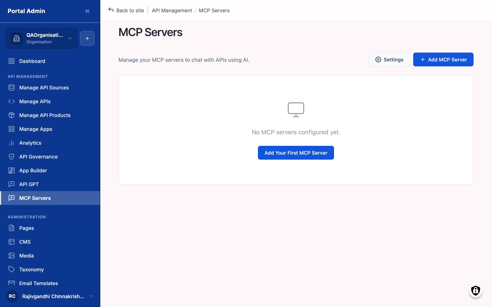
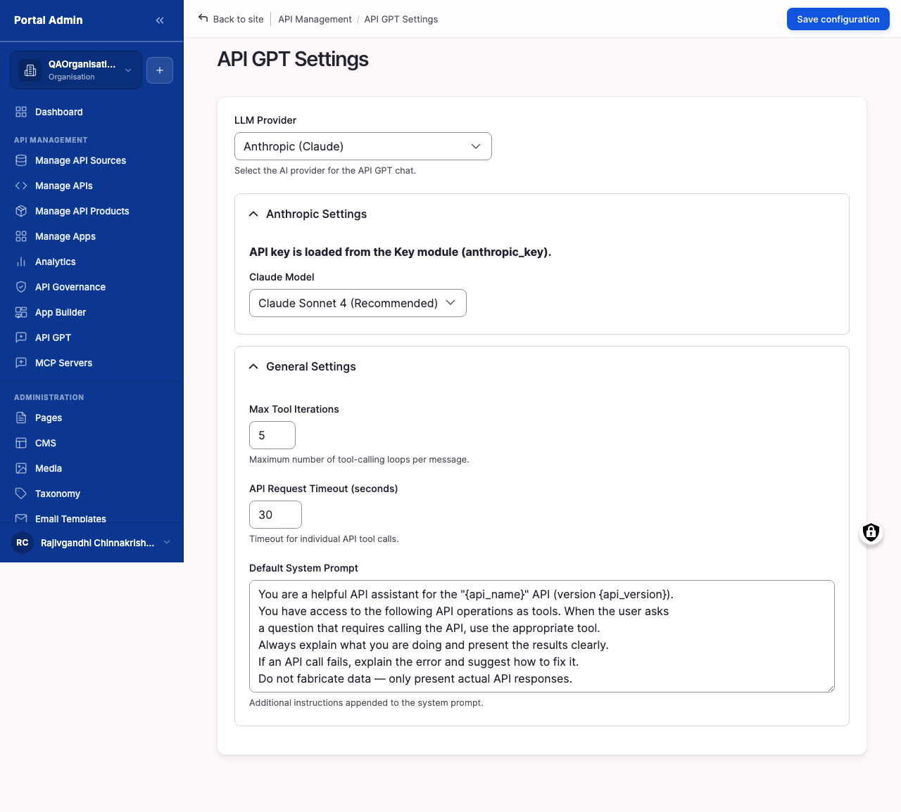

Your APIs are valuable to humans calling them with code. They are equally valuable to AI agents — Claude, GPT, your own LLM-powered apps — that need to call them as tools. The marketplace provides two complementary surfaces for this. **MCP Servers** wrap selected APIs in the Model Context Protocol so any MCP-aware agent can discover and use them. **API GPT** is the chat assistant inside the marketplace itself, with a configurable LLM backend. This chapter walks you through both.

You will learn:

- The difference between an MCP server and the API GPT chat assistant, and how the same registration powers both.
- How to register an MCP server so any MCP-aware agent can discover and call your published API as a tool.
- How to choose an LLM provider, model, and runtime limits for the API GPT chat in your marketplace.
- How to write a default system prompt that steers the assistant toward your APIs.
- How to test the assistant end to end before announcing it to consumers.

Allow ~40 minutes for the first MCP registration, the API GPT configuration, and a round of tests.

## What MCP and API GPT do

Before clicking anywhere, distinguish the two concepts. They are related but distinct.

#### Understand MCP servers and API GPT

This subsection is conceptual. Read it once, then move on to the registration and configuration tasks.

**MCP Servers** are wrappers around your published APIs that speak the Model Context Protocol. MCP is an open protocol that allows an AI agent to discover available tools and call them with structured arguments. When you register an MCP server, you select which API the server exposes and the marketplace generates the MCP tool definitions from that API's OpenAPI spec. Agents that already speak MCP — Claude Desktop, IDE assistants, any custom agent built on the MCP SDK — connect to your MCP server's URL and can immediately call the API as a tool.

**API GPT** is the chat assistant the marketplace ships in-product. Your consumers reach it at `/api-gpt`; as Portal Admin you configure it under API GPT Settings at `/admin/portal/mcp-settings`. API GPT uses the registered MCP servers as its tool layer — so the same registration powers both external agents and the in-product chat.

Two reasons this matters:

- **Agentic consumption.** A growing share of API consumption is driven by AI agents acting on a user's behalf. Exposing your APIs as MCP tools puts you in front of those agents from the outset.
- **Internal productivity.** API GPT allows your own team — and your consumers — to ask plain-English questions such as *"how do I create a payment in the Payments API?"* and get an answer that calls the API to demonstrate, rather than only a docs paragraph.

> **Note:** MCP exposure is opt-in per API. Registering an MCP server does not expose every API in your organisation — only the ones you select.

> **Tip:** For an introduction to MCP, the Anthropic documentation on Model Context Protocol explains the wire format. Reading it is not required to follow this chapter — the marketplace handles the protocol for you.

Related tasks:

- [Register an MCP server](#register-an-mcp-server)
- [Configure the API GPT model](#configure-the-api-gpt-model)

## Registering an MCP server

Each MCP server in the marketplace is a single connection point that exposes one of your published APIs to AI agents. Register one server per API to expose.

#### Register an MCP server

Register an MCP server to make a published API callable by AI agents — including the marketplace's own API GPT.

#### Before you start

- **Publish the API first.** The MCP server form lists only APIs already published in the marketplace. Complete [Publishing your first API](publishing-your-first-api.md#publishing-your-first-api) first.
- **Decide on the agent's persona.** The system prompt set on the MCP server steers how the agent introduces and uses this API. Write it before opening the form.
- **Choose a clear label.** The label is what agent-side clients see in their tool list, so write something identifiable — *"Payments API (production)"* is preferable to *"mcp-1"*.

To register an MCP server:

1. From the left sidebar, expand **API MANAGEMENT** and click **MCP Servers**.
2. On the MCP Servers list page, click **Add MCP Server**.
3. The page heading changes to Add MCP Server.
4. In the form, select the API the server will expose from the **API** dropdown. The dropdown is populated from your published APIs.
5. Enter a **Label** for the server. This appears in the MCP Servers list and in the agent's tool list.
6. Enter the **Base URL** for the server. This is the externally callable URL the agent connects to. Copy it from your gateway connection if uncertain.
7. Enter a **System Prompt** in the textarea. This text is sent to the agent alongside the tool definitions and steers how the agent presents and calls the API.
8. Click **Save**.

The numbered callouts in Figure 10-1 are:

1. **MCP Servers** — The page title and the heading of the list. Each row is one registered server.
2. **Add MCP Server** — Opens the registration form covered in step 2 above. The button appears in the page's action area.
3. **API** — The published API the server wraps. Click the API name to jump back to the API's detail page.
4. **Label** — The human-readable name assigned to the server.
5. **Base URL** — The URL agents use to connect. Copy this URL into your agent's MCP client config to wire it up.
6. **Delete MCP Server** — A row-level action that removes the server. The marketplace prompts to confirm before deletion.

> **Result:** Your MCP server is registered. Any MCP-aware agent that connects to its Base URL can now discover the API as a tool and call its operations.

> **Note:** The marketplace generates the MCP tool definitions from the API's OpenAPI spec. If the spec is incomplete — missing operation summaries, missing parameter descriptions — the agent will see those gaps too. Tighten the spec in your gateway, re-import, and the MCP server picks up the fresh definitions.

> **Tip:** Register one MCP server per logical API surface. Avoid bundling three APIs into one server with a large system prompt — agents handle smaller, focused tool surfaces better than large ones.

> **Caution:** The MCP server inherits whatever auth the underlying API requires. If the API is protected by an API key, the agent must pass that key when it calls. Confirm the consumer registering the agent has a subscription to the underlying API plan — see [Onboarding your first consumer](onboarding-your-first-consumer.md#onboarding-your-first-consumer).

#### Verify

1. Confirm the new server appears in the **MCP Servers** list with the correct API, label, and Base URL.
2. From a separate machine running an MCP-aware agent (for example, Claude Desktop), connect to the Base URL and confirm the agent enumerates the API operations as tools.
3. Issue a test call from the agent and confirm a `2xx` response — see [Watch the first calls land](onboarding-your-first-consumer.md#watch-the-first-calls-land) for the gateway-side check.

Related tasks:

- [Understand MCP servers and API GPT](#understand-mcp-servers-and-api-gpt)
- [Configure the API GPT model](#configure-the-api-gpt-model)

## Configuring the API GPT model

API GPT is the in-product chat assistant. You choose which LLM provider and model power it, set a default system prompt, and tune the runtime limits.

#### Configure the API GPT model

Configure the API GPT model when setting up the marketplace, when swapping providers, or when tuning the assistant's behaviour for your consumers.

#### Before you start

- **Have an Anthropic or Groq API key.** The marketplace ships with two LLM providers. Anthropic (Claude) is the default. Groq runs free-tier open-weight models. Select one and have its key ready.
- **Decide on a model trade-off.** Larger models are more accurate; smaller models are faster and cheaper. The defaults provide a sensible starting point — change them when there is a reason.
- **Draft a default system prompt.** This is what every API GPT conversation starts with. Keep it focused on your marketplace's purpose — *"You are an assistant helping developers explore the Acme APIs"* is preferable to a generic prompt.

To configure the API GPT model:

1. From the left sidebar, expand **API MANAGEMENT** and click **API GPT Settings**.
2. The page loads with the title API GPT Settings.
3. From the **LLM Provider** dropdown, select Anthropic (Claude) or Groq (Free tier — Llama, Gemma, Mixtral).
4. If you selected Anthropic, choose a model from **Claude Model** — Claude Sonnet 4 (Recommended), Claude Opus 4, or Claude 3.5 Haiku (Fastest).
5. If you selected Groq, paste your API key into **Groq API Key** and choose a model from **Groq Model** — Llama 3.3 70B Versatile (Recommended — best for tools) is the default.
6. Set **Max Tool Iterations** to a value between *1* and *20*. This caps how many tool calls the agent can chain in a single turn. *5* is a reasonable starting point.
7. Set **API Request Timeout (seconds)** to a value between *5* and *120*. This caps how long the marketplace waits for the LLM to respond.
8. Enter your **Default System Prompt** into the textarea.
9. Click **Save configuration**.

The numbered callouts in Figure 10-2 are:

1. **LLM Provider** — Select Anthropic (Claude) for production-grade quality or Groq (Free tier — Llama, Gemma, Mixtral) for free-tier evaluation. The choice gates which model dropdown is active below.
2. **Claude Model** — Active when LLM Provider is Anthropic. Claude Sonnet 4 (Recommended) is the default and balances accuracy and cost.
3. **Groq API Key** — Active when LLM Provider is Groq. Paste the API key from your Groq account. The marketplace stores it server-side.
4. **Groq Model** — Active when LLM Provider is Groq. Llama 3.3 70B Versatile is recommended because it handles tool calls well; smaller Groq models may fail when many tools are registered.
5. **Max Tool Iterations** — A number between *1* and *20*. Caps how many tool calls the agent can chain before responding to the user. Higher values allow the agent to solve harder problems but consume more tokens.
6. **API Request Timeout (seconds)** — A number between *5* and *120*. The HTTP timeout for each LLM call. Increase it for larger models; reduce it for faster failure under load.
7. **Default System Prompt** — Free-form text. Sent to the LLM at the start of every API GPT conversation. Use it to set the assistant's persona and constraints.

> **Result:** Your API GPT settings are saved. The next consumer who opens the API GPT chat at `/api-gpt` is served by the configured model and prompt.

> **Note:** API GPT uses every registered MCP server as its tool layer. If a consumer asks API GPT a question, the assistant can call any of your registered APIs to answer.

> **Tip:** When starting on a tight budget, select Claude 3.5 Haiku (Fastest) or the Groq free tier and upgrade to Claude Sonnet 4 later. Switching models is a single dropdown change.

> **Caution:** Max Tool Iterations above *10* allows the agent to consume tokens quickly on hard prompts. Keep it tight while tuning your system prompt; raise it once you trust the assistant's behaviour.

#### Verify

1. Confirm the page shows a *Configuration saved* banner after you click **Save configuration**.
2. Reload the page and confirm the **LLM Provider**, model dropdown, **Max Tool Iterations**, and **API Request Timeout (seconds)** retain the values you set.
3. Open `/api-gpt`, ask a question, and confirm the response style matches your **Default System Prompt**.

Related tasks:

- [Register an MCP server](#register-an-mcp-server)
- [Test the chat assistant](#test-the-chat-assistant)

## Testing the assistant

Before announcing API GPT to your consumers, exercise it yourself. The fastest way to catch a broken prompt or a missing tool is to ask it a question and observe what it does.

#### Test the chat assistant

Test the assistant after registering at least one MCP server and saving your API GPT settings. The check confirms the model picks up the tools and uses them.

#### Before you start

- **Register at least one MCP server.** Without a registered MCP server, API GPT has no tools and falls back to discussing your APIs from documentation alone.
- **Prepare a question that should hit a tool.** *"List the most recent payments"* should make the assistant call the Payments API; *"What does the Payments API do?"* should not. Mix both kinds when testing.
- **Open the consumer-facing view.** The chat lives at `/api-gpt` on the consumer side. You can test as Portal Admin, but the chat appears the same way a consumer would see it.

To test API GPT:

1. Open a new browser tab and go to the marketplace home page.
2. Click **API GPT** in the top navigation. The chat opens at `/api-gpt`.
3. In the chat input, enter a question that should call a tool — for example, *"What APIs are available?"* — and press **Enter**.
4. Observe the assistant's response. It should describe the available APIs, drawn from your MCP server registrations.
5. Enter a question that should hit a specific API — for example, *"Use the Payments API to list the last 5 payments"* — and press **Enter**.
6. Watch for a tool-call indicator in the response. The assistant should announce that it is calling the API, then return the result.
7. If the tool call fails, click the failure detail to see the underlying error.
8. Return to API GPT Settings to adjust the Default System Prompt if the assistant misbehaves, then re-test.

> **Result:** You have confirmed the assistant can find and call the APIs registered as MCP servers. Your consumers can do the same when they open `/api-gpt`.

> **Note:** API GPT enforces the same auth as direct API calls. If the consumer chatting does not have an active subscription to the API's plan, the tool call returns the same auth error a direct request would.

> **Tip:** Watch the Analytics dashboard in another tab while chatting. Every successful tool call lands as a real request in Recent Requests and counts toward your traffic charts. This is a fast way to confirm the chain end-to-end.

> **Caution:** Do not paste sensitive data — API keys, customer PII — into the chat input while testing. Conversations may be logged for monitoring; treat the chat as you would any third-party LLM tool.

#### Verify

1. Confirm the assistant responds within the timeout you configured.
2. Confirm the tool-call indicator appears for a question that should hit a registered API.
3. Switch to the Analytics dashboard in another tab and confirm the tool call lands as a real request in **Recent Requests**.
4. Sign in as a test consumer without an active subscription and confirm the same tool call returns the expected auth error.

## Next steps

- **[Managing your team](managing-your-team.md#managing-your-team)** — Decide who in your Organisation owns MCP registrations and the API GPT system prompt by mapping it to a role.
- **[Configuring access and storefront branding](configuring-access-and-storefront-branding.md#configuring-access-and-storefront-branding)** — Brand the API GPT page so it looks like part of your storefront, not a default install.
- **[Monitoring usage](monitoring-usage.md#monitoring-usage)** — Watch the analytics dashboard for traffic from MCP agents and the API GPT chat alongside human traffic.
