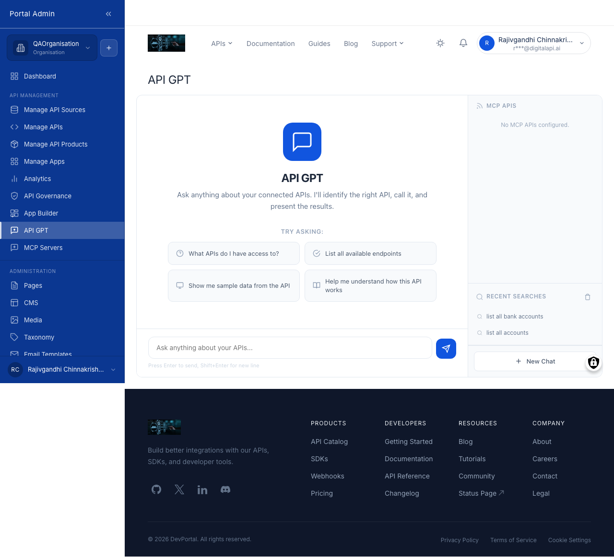
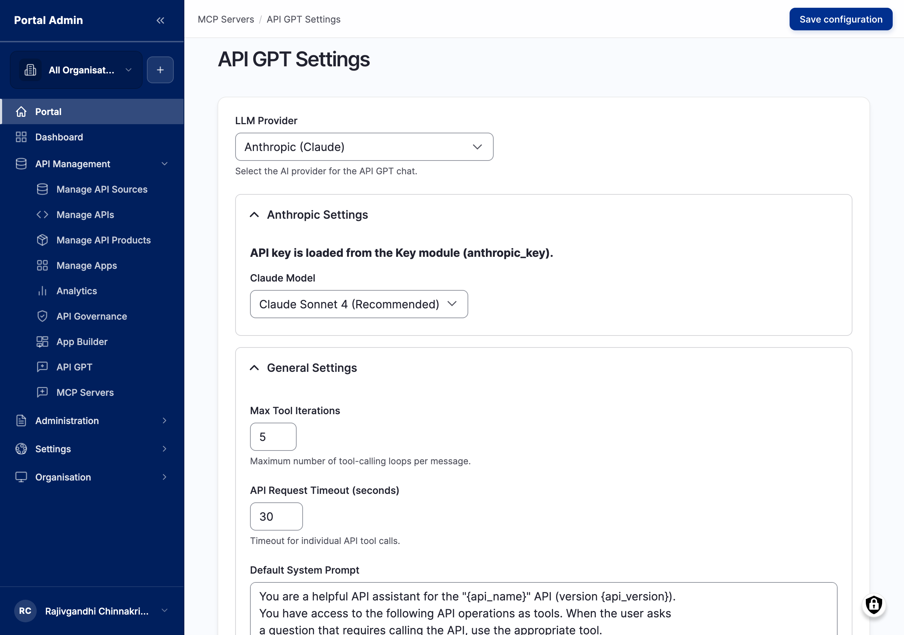
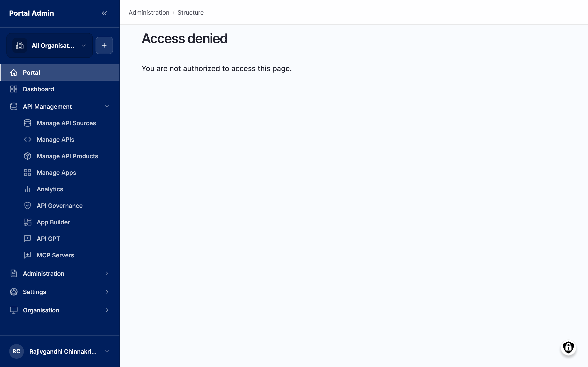

API GPT is the chat assistant the marketplace ships in-product. Consumers reach it at `/api-gpt`; as Portal Admin you configure it under API GPT Settings at `/admin/portal/mcp-settings`. The assistant uses your registered [MCP servers](feat-mcp-servers.md) as its tool layer, so the same registration powers both external agents and the in-product chat. Configure which LLM provider and model run it, set a default system prompt, tune runtime limits, brand the chat panel, and embed it on the storefront so consumers find it without typing a URL. Register at least one MCP server first, otherwise the assistant has no tools and falls back to discussing your APIs from their OpenAPI documentation alone.

## What you see

The API GPT Settings form holds the model settings, the default prompt, the runtime limits, and a Branding section, in that order. The model and limit fields:

- **LLM Provider**: dropdown, required. Anthropic (Claude) for production-grade quality, or Groq (Free tier: Llama, Gemma, Mixtral) for evaluation. The choice gates which model dropdown is active below.
- **Claude Model**: dropdown, active when the provider is Anthropic. Options are Claude Sonnet 4 (Recommended), Claude Opus 4, and Claude 3.5 Haiku (Fastest). The default balances accuracy and cost.
- **Anthropic API Key**: text, active when the provider is Anthropic. Pasted from your Anthropic console and stored server-side.
- **Groq Model**: dropdown, active when the provider is Groq. Llama 3.3 70B Versatile (Recommended) is the default; smaller Groq models may fail when many tools are registered.
- **Groq API Key**: text, active when the provider is Groq.
- **Max Tool Iterations**: number between `1` and `20`. Caps how many tool calls the agent chains in a single turn; `5` is a reasonable start.
- **API Request Timeout (seconds)**: number between `5` and `120`. Caps how long the marketplace waits for the LLM to respond.
- **Default System Prompt**: free text. The system message prepended to every conversation. Keep it focused on your marketplace's purpose so the assistant prefers a live API call over a documentation summary.

The Branding section below the model settings controls how the chat reads to consumers:

- **Assistant Name**: text, max 64 characters. Shown in the chat header. Set it to something that maps to your storefront, for example *"Acme API Helper"*.
- **Avatar**: image upload, PNG, JPG, or SVG up to 1 MB. Renders at 32x32 in the chat header, so a square image with a transparent background is cleanest.
- **Welcome Message**: text, max 280 characters. Appears as the assistant's first bubble. Use one or two sentences to set expectations.
- **Chat Accent Colour**: colour picker or hex value. Applies to the send button, the user-bubble background, and the focus ring.

Branding fields are optional; leaving them blank falls back to the platform defaults (*"API GPT"*, the marketplace logo, a generic welcome, and the storefront's primary colour).

## Configure the assistant

Have an Anthropic or Groq API key ready and draft a focused default system prompt before you start.

1. From the left sidebar, expand **API MANAGEMENT** and click **API GPT Settings**. The page loads at `/admin/portal/mcp-settings`.
2. From **LLM Provider**, select Anthropic (Claude) or Groq.
3. Paste the matching API key (**Anthropic API Key** or **Groq API Key**) and pick a model from the active model dropdown.
4. Set **Max Tool Iterations** between `1` and `20`, and **API Request Timeout** between `5` and `120`.
5. Enter your **Default System Prompt**.
6. Click **Save configuration**. A green banner confirms the save.


**Tip:** On a tight budget, select Claude 3.5 Haiku (Fastest) or the Groq free tier and graduate to Claude Sonnet 4 later. Switching providers is a single dropdown change; no consumer-side reconfiguration is required.
**Caution:** Max Tool Iterations above `10` lets the agent consume tokens quickly on hard prompts. Keep it tight while tuning the system prompt; raise it once you trust the assistant's behaviour and have a spend ceiling in place.


## Brand the chat panel

1. On **API GPT Settings**, scroll to the **Branding** section below Default System Prompt.
2. Enter an **Assistant Name** (for example *"Acme API Helper"*).
3. Upload an **Avatar** image.
4. Enter a **Welcome Message** (for example *"Hi! Ask me anything about the Acme APIs. I can call them to show you how they work."*).
5. Pick a **Chat Accent Colour** from the picker or paste a hex value.
6. Click **Save configuration**.


**Tip:** Match the chat accent colour to the brand colour set in the auth-and-branding settings. The chat reads as part of the storefront when the two colours align.
**Caution:** The welcome message is not localised. If your storefront supports multiple locales, write a welcome that reads sensibly across them.


## Set the API scope and grounding

The assistant answers about, and can call, whichever APIs your registered MCP servers expose, since those servers are its tool layer. The Default System Prompt grounds its behaviour around that scope.

1. To widen or narrow what API GPT can discuss and call, change the API selection on the [MCP servers](feat-mcp-servers.md), not on this form.
2. Write the **Default System Prompt** to name your APIs and steer the assistant, for example *"You are an assistant helping developers explore the Acme APIs. Prefer the live API call over a documentation summary when both are available."*
3. Save, then test a question that should hit a tool (*"List the last 5 payments"*) and one that should not (*"What does the Payments API do?"*).
4. Return to the prompt and refine it where the assistant answers poorly, then re-test.


**Note:** API GPT enforces the same auth as direct API calls. A consumer who asks the assistant a question can have any of your registered APIs called on their behalf, but only within their own subscription scope; a missing subscription returns the same auth error a direct request would.


## Embed the assistant on the storefront

Surface the chat from the storefront so consumers find it without typing `/api-gpt`.

1. From the left sidebar, expand **Structure** and click **Blocks** at `/admin/structure/block`.
2. Find the **API GPT Chat Launcher** block. It ships disabled.
3. Click **Place block** in the region you want: home page hero, API discovery sidebar, or footer.
4. Optionally override the launcher label (it defaults to the **Assistant Name**) and set visibility rules for which pages and roles see it.
5. Click **Save block**.

The launcher reuses the assistant name and avatar from API GPT Settings, so branding stays in one place and the embed inherits it. Clicking the launcher opens the same chat as `/api-gpt`.


**Tip:** Pin the launcher to the bottom-right of the viewport with the Floating visibility option. Consumers find it on every storefront page without it stealing real estate.


## Verify

- After **Save configuration**, the page shows a *Configuration saved* banner.
- Reloading the page retains the LLM Provider, model, Max Tool Iterations, API Request Timeout, Default System Prompt, Assistant Name, Welcome Message, and accent colour.
- The storefront home page in an incognito window shows the launcher in the region you chose.
- Clicking the launcher (or visiting `/api-gpt`) opens the chat with your assistant name, avatar, and welcome message; asking *"what APIs are available?"* returns an answer matching the scope of your registered MCP servers.
- Each successful tool call lands as a row in [Provider analytics](feat-provider-analytics.md) Recent Requests, confirming the chain end to end.

## Related

- [MCP servers](feat-mcp-servers.md): register and scope the servers that supply API GPT's tools.
- [Provider analytics](feat-provider-analytics.md): observe API GPT and external agent traffic alongside human traffic.