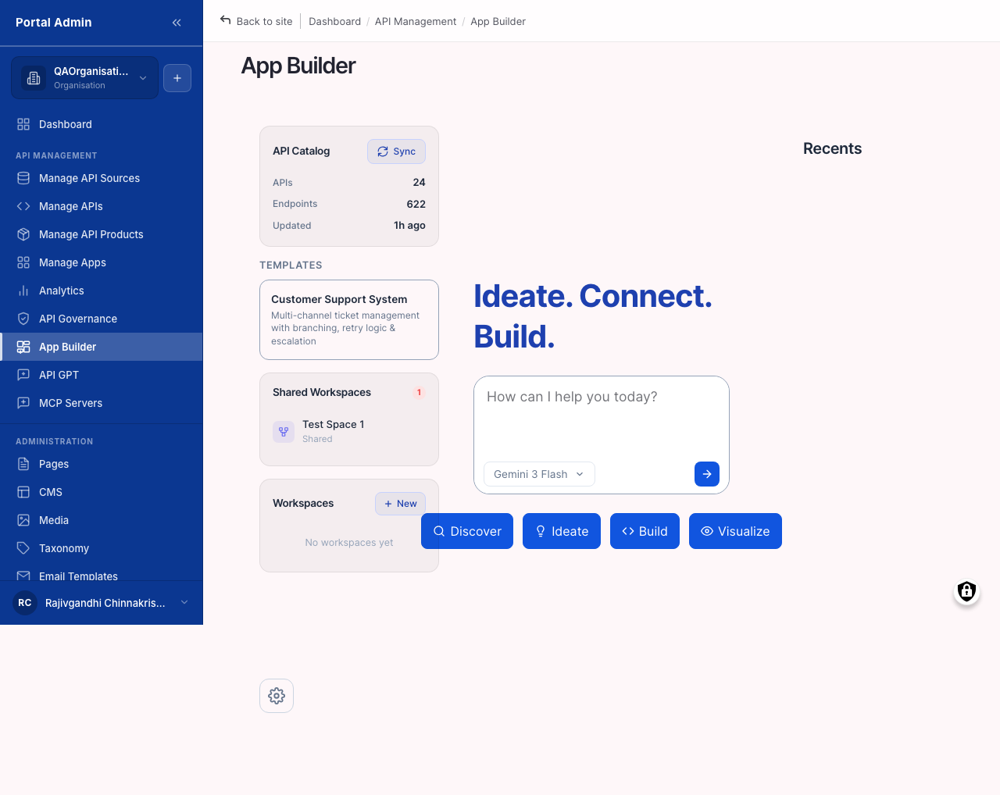

App Builder is a low-code surface where you assemble small demonstration Apps on top of the APIs in your catalogue. Use it to prove an integration pattern, give a partner a runnable starter, or seed a Workspace that consumers can clone for their own Apps.

## Configure

1. From the left sidebar under **API MANAGEMENT**, click **App Builder**.
2. Review the **API Catalog** panel on the left, which summarises the APIs and endpoints the builder can call. Click **Sync** to refresh the inventory after you publish a new API.
3. To start from a starter App, pick a tile from the **TEMPLATES** list. Each template packages an API selection, a UI layout, and routing wiring.
4. To start blank, choose **Workspaces** > **+ New**, or open a shared workspace someone else began.
5. Type your goal into the prompt box on the right (for example, "a dashboard that lists active subscriptions") and pick a model.
6. Let the assistant draft a starting App, then refine it through the **Discover**, **Ideate**, **Build**, and **Visualize** phases along the bottom.
7. Preview the App, then publish the workspace.


**Result:** You have a workspace App composed from catalogue APIs. Once published, consumers see it as a clonable starter on their own dashboard.
**Note:** App Builder runs against your published APIs. To demo an API still in draft, publish it to a private Plan first so the builder can call it.
