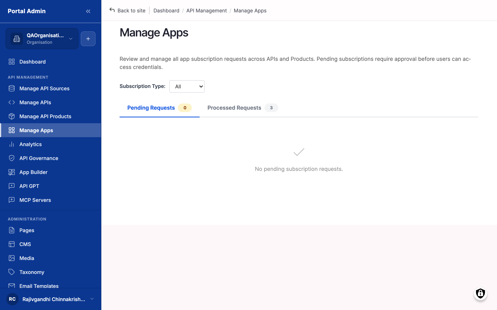

Before you grant access to a Product, inspect the app the consumer registered, the user who registered it, and the credentials it holds. After a subscription is live, this is also where you rotate a key when it is suspected leaked. Manage Apps is the surface for all three, and it shows every consumer app the marketplace knows about regardless of subscription state. Use this page to vet an app before you approve it on the [Subscriptions](feat-subscriptions.md) queue.


**Note:** The marketplace is a management plane, not in the request path. Credentials are validated at the gateway on every call, never at the portal. The portal issues, rotates, and revokes keys against the gateway; the gateway is what accepts or rejects a call.


## What you see

The list opens at `/admin/portal/manage-apps` showing every app sorted by **Created** descending, 25 rows per page. Read the columns:

- **App Name**: the name the consumer gave the app at registration. Click to open the app detail page, where credentials and subscriptions surface.
- **Owner**: the marketplace user who registered the app. Click to open their profile.
- **Organisation**: the organisation the owner belongs to. Useful for grouping apps by tenant when several consumers from the same organisation each register their own.
- **Subscriptions**: count of active and pending subscriptions tied to this app. A count of zero usually means the consumer registered the app but never subscribed to a Product.
- **Created**: when the app was registered on the portal. The most recent apps sit at the top by default.
- **Actions**: a per-row dropdown carrying **View**, **Edit**, and **Delete**. Edit and Delete are typically reserved for Portal Admin; API Providers usually act through the subscription queue instead.


**Tip:** Filter the list by **Organisation** when triaging requests from a single tenant. A procurement-heavy approval flow often runs one organisation at a time. Manage Apps shows apps, not subscriptions inline; to see subscription state, open the app detail page or read the queue at Manage Product Subscriptions.


## The app detail page

Click an **App Name** to open the detail page, which has four tabs.

**Overview tab.** A read-only panel gathering the registering user, the organisation, the app description, the registered redirect URLs, and any contact email the consumer provided. The marketplace treats the registering user as the *primary contact*; organisations with several developers often have one user register on behalf of the team, so treat the registering user as a starting point for outreach.

**Credentials tab.** One row per issued key. Each row carries:

- **Credential type**: typically an API key.
- **Prefix**: the first few characters of the key, never the full value.
- **Issue date**: when the marketplace provisioned the credential.
- **Expiry**: the lapse date if one is set, otherwise blank.
- **Status**: *Active*, *Suspended*, or *Revoked* per credential.
- **Last used**: populated from gateway analytics on a one-to-five-minute poll. An empty value long after issue means the consumer never integrated the key or abandoned it.

**Subscriptions tab.** One row per subscription with **Product**, **Plan**, **Status**, **Approved**, and **Last call**. *Pending* rows here are the same requests you see on the main queue; approving from the detail page and approving from the queue have identical effects. *Active* rows show **Last call** populated once the consumer has called at least once. *Revoked* and *Suspended* rows stay visible for audit.

**Activity tab.** The recent activity recorded against the app.


**Caution:** The full credential value is shown to the consumer exactly once, immediately after issue, on their My Apps page. Providers see only the prefix. If a consumer reports a lost key, the path forward is rotation, not retrieval; nobody can recover the original.


## Inspect an app before approving

Use this before approving any subscription request to confirm the app is legitimate, the description matches the requested Product, and the registered redirect URLs point at the consumer's real infrastructure.

1. From the subscription queue's **App** column, or from Manage Apps, click the **App Name** to open the detail page.
2. On the **Overview** tab, read the registering user, the organisation, the app description, the redirect URLs, and any contact email.
3. Confirm the description matches the requested Product. A vague description against a high-value Product is a flag for a follow-up question.
4. Read the redirect URLs. They should point at the consumer's domain. A localhost URL is acceptable during development but not for a Product slated for production traffic.
5. Cross-check the registering user's email domain against the organisation's domain. A mismatch usually means the user signed up with a personal address; ask for a corporate address before approving high-value subscriptions.
6. Open the **Subscriptions** tab as a sanity check. If the same app already has several Active subscriptions to your Products with no traffic, the consumer may be staging requests faster than their integration can absorb them.

## Inspect the credentials on an app

Use this to see what credentials the marketplace has provisioned, when they were issued, and which keys are still in use.

1. On the app detail page, click the **Credentials** tab.
2. Read the credentials table by type, prefix, issue date, optional expiry, and status.
3. For each Active credential, confirm the consumer has only one key per subscription. Multiple Active credentials per subscription is unusual and usually means a previous rotation did not complete cleanly.
4. Read the **Last used** timestamp. A credential issued months ago with no Last used is either one the consumer never integrated or one they have abandoned in favour of another.


**Note:** A credential's Last used value updates from gateway analytics on a poll interval typically between one and five minutes. A fresh credential with an empty Last used after thirty minutes is a signal the consumer has not yet integrated, not that the credential is broken.


## Rotate a consumer credential

Use this when a credential is suspected leaked, when a consumer reports the key compromised, or when your policy requires periodic rotation. Rotation issues a fresh key and revokes the prior one on the gateway in a single atomic move. Coordinate with the consumer first: rotation invalidates the old key the moment the new one is provisioned, and the consumer must swap the key within the rotation window or calls fail with `401`.

1. Open the consumer's app detail page from the queue's **App** column or from Manage Apps.
2. Click the **Credentials** tab.
3. Locate the credential row to rotate. The row shows the prefix, the issue date, and the current status.
4. Click the **Rotate** action on the row. A confirmation dialog opens with a **Reason** field.
5. Fill the **Reason** with the rotation rationale (suspected leak, scheduled rotation, security policy). One or two sentences is enough; the reason surfaces in the consumer's notification email and the audit log.
6. Click **Confirm**. The marketplace issues a new credential, revokes the old one on the gateway, and queues a notification email pointing the consumer at their My Apps page for the new key.


**Caution:** Rotation invalidates the old key immediately on the gateway. Any in-flight call with the old key may complete or may return `401` depending on gateway timing; any new call with the old key returns `401`. Plan the rotation outside the consumer's peak hours where possible.



**Tip:** For incident response on a leaked key, rotate first, then communicate. The audit log preserves the chain for post-incident review, and the minutes you save on the rotation can be the minutes the abuser would have used.


## Verify

- Confirm the **App Name** link opens the detail page with all four tabs visible.
- Confirm the **Credentials** tab shows at least one credential row for any app with an Active subscription.
- After a rotation, confirm a new credential row sits at the top with the current timestamp, and the prior row's status reads *Revoked*.
- Ask the consumer to retry a call: the new key returns `2xx` and the old key returns `401`.
- Confirm the **Subscriptions** tab lists the same subscriptions you find on Manage Product Subscriptions when filtered by that app name.
- Open the audit log entry for the rotation and confirm the **Reason** is captured against your username.

## Related

- [Subscriptions](feat-subscriptions.md): approve, suspend, and revoke the subscriptions tied to an app.
- [API Products & Plans](feat-products-and-plans.md): the Products an app subscribes to and the Plan terms it inherits.
- [Provider analytics](feat-provider-analytics.md): read aggregate traffic across all apps subscribed to a Product.