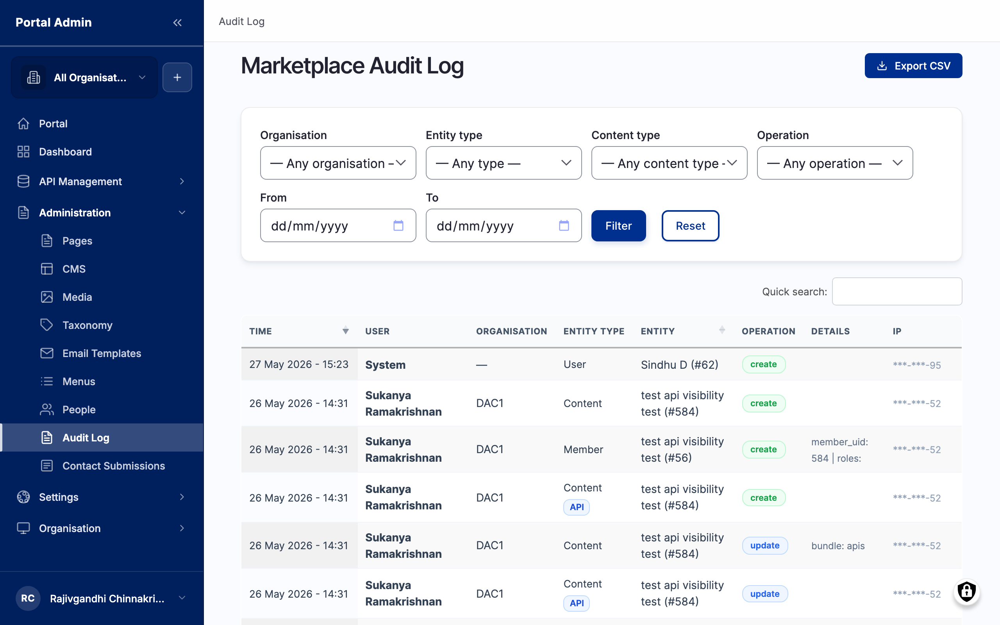

The Marketplace Audit Log is the chronological record of every consequential action in the portal: content created and updated, members added, APIs published, and system events. Use it to answer who changed what and when, to investigate an unexpected state change, or to satisfy a compliance review. It is read-only and exportable, so it doubles as the evidence trail behind any review. Reach it from the left sidebar under **Administration** > **Audit Log**.

## What you see

The page heading sits above a row of filter controls, which sit above a chronological table. The list loads most-recent-first, so the action you are most likely investigating is at the top. Each entry captures one action across these columns:

- **Time**: the timestamp of the action.
- **User**: the actor who performed the action.
- **Organisation**: the Organisation the actor and the affected entity belong to.
- **Entity**: the object that changed, such as an API, a Page, or a member.
- **Operation**: the action taken, tagged **create** or **update**, so you can scan for a class of change at a glance.
- **Source IP**: the address the request came from, useful when confirming where an action originated.

Click any row to open the full entry detail, which names the actor, the entity, and the specific change. The **Export CSV** action in the top-right downloads the currently filtered window for an offline review.

## Filter controls

The controls above the list narrow the log. Combine them to isolate one actor or one class of action:

- **Organisation**: select (optional). Scopes the log to actions within one Organisation. Default shows every Organisation.
- **Entity type**: select (optional). Scopes to one kind of object, such as an API or a member. Default shows every entity type.
- **Content type**: select (optional). Scopes to one content type for content-related changes, such as Page or Article. Default shows every content type.
- **Operation**: select (optional). Scopes to **create** or **update**. Default shows both.
- **From**: date (optional). The start of the window. Entries before this date are hidden.
- **To**: date (optional). The end of the window. Entries after this date are hidden.

After setting filters, click **Filter** to apply them, or **Reset** to clear every filter and return to the full log.

## Read and filter the audit log

Open the audit log when you need to trace a specific change, confirm who performed an action, or export a window of activity for a review.

1. From the left sidebar, expand **Administration** and click **Audit Log**.
2. The **Marketplace Audit Log** loads with the most recent entries first. Each row records the time, the user, the organisation, the entity, the operation, and the source IP.
3. Use the **Organisation**, **Entity type**, **Content type**, and **Operation** filters to narrow the list. Combine them to find, for example, every `create` operation on an API entity within one Organisation.
4. Set a **From** and **To** date to scope the log to a window, useful for a specific incident or a review period.
5. Click **Filter** to apply, or **Reset** to clear every filter.
6. Click a row to open the entry and see the full detail of the change.


**Tip:** When a downstream system reports an unexpected state, filter the log to the affected entity and the hour around the incident. The operation and user columns usually point straight at the change that caused it.


## Export a window for review

Export the log when an auditor, a security review, or an incident retrospective needs the activity record offline.

1. Set the filters that define the window you want: the Organisation, the entity type, the operation, and the **From** and **To** dates.
2. Click **Filter** to apply them and confirm the on-screen list shows the rows you expect.
3. Click **Export CSV** in the top-right.
4. The marketplace downloads a CSV of the currently filtered rows, with one row per action and one column per field shown on screen.


**Note:** The export reflects the active filters, not the entire log. If you need the full history, click **Reset** first, then export.


## Investigate an incident

Use the log to trace the change behind an unexpected state.

1. Open the audit log and set the **Entity type** to the kind of object that changed, such as an API.
2. Set the **From** and **To** dates to the hour around when the problem first appeared.
3. Click **Filter** and scan the **Operation** and **User** columns for the change that lines up with the incident.
4. Click the matching row to open the detail view and confirm the before-and-after of the change.
5. Note the **Source IP** if you need to confirm where the action came from.


**Caution:** The audit log is read-only by design. You cannot edit or delete an entry from this surface, and you should not try to: an unbroken trail is what makes the log valid evidence in a review.


## Verify

- After running a filter, confirm every row in the list matches the values you set: one Organisation, one operation, the chosen date window.
- Open a single entry and confirm the detail view names the actor, the entity, and the change.
- Click **Export CSV** and confirm the downloaded file contains the same filtered rows shown on screen.


**Result:** You have a filtered, time-ordered record of who did what across the portal, exportable for review.


## Related

- [Roles and permissions](feat-roles-and-permissions.md)
- [Team and members](feat-team-and-members.md)
- [Notifications](feat-notifications.md)