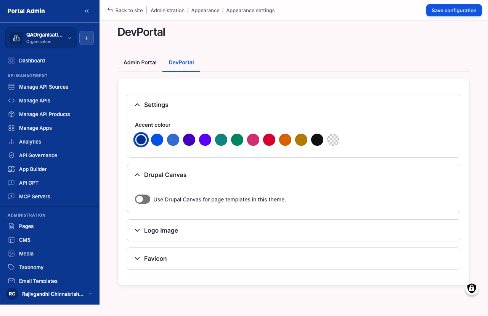
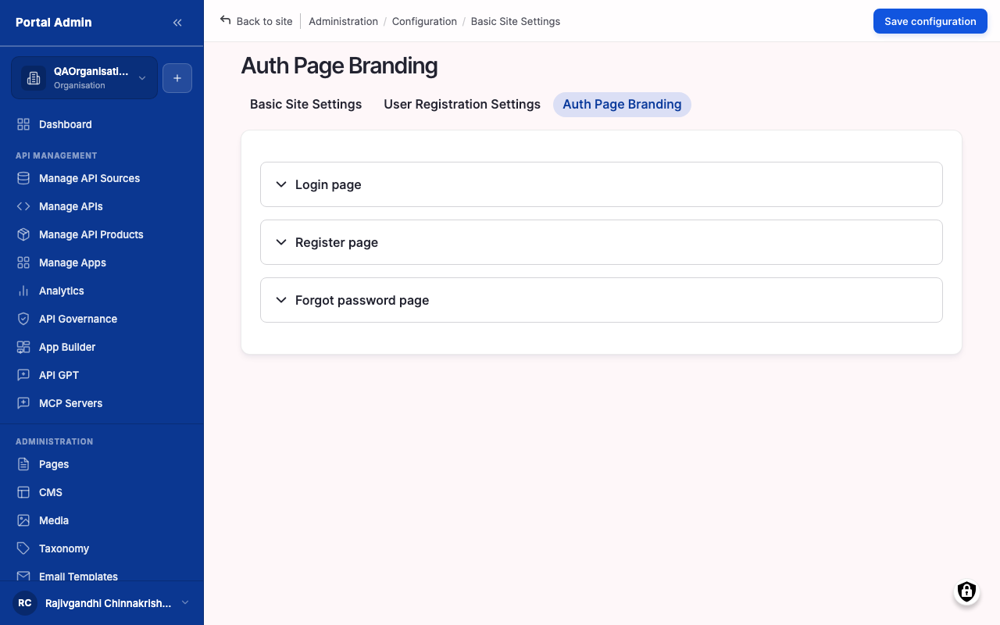

Replace the default logo, favicon, accent colour, and theme so the storefront looks like the company that owns it rather than a default template. Branding applies across both the public storefront and the operator pages, and the same assets carry through to the sign-in, registration, and forgot-password screens. Use it whenever a new deployment goes live or a brand refresh lands.

## What you configure

The look is driven from two surfaces: per-theme settings under **Appearance**, and the auth-screen copy under **Basic Site Settings**.

- **Logo image**: a transparent-background SVG or PNG shown in the top-left of every page. SVG scales best for retina displays; avoid JPEG, whose background clashes with the storefront. Untick **Use the logo supplied by the theme** to expose the upload field.
- **Favicon**: a square source at 256x256 pixels or larger, shown in browser tabs and bookmarks. The marketplace down-samples it; starting larger gives crisper results.
- **Accent color**: the brand colour applied to buttons, links, focus rings, and selected states across every page. Pick a preset swatch or paste an exact brand hex such as `#0F62FE`. Exposed as a CSS custom property so theme customisations stay in sync.
- **Theme**: the active storefront theme, which sets layout, typography, spacing, and component styling. Switching is non-destructive: content, users, APIs, and configuration are untouched. The operator-facing administrative theme is configured separately.
- **Auth-screen branding**: rich-text messaging on the sign-in, registration, and forgot-password screens, set on the **Auth Page Branding** tab. Use it for a company notice, an IT-helpdesk link, or the support email for reset failures. Embedded scripts and iframes are stripped on save.

## Configure

1. From the left sidebar, expand **SETTINGS** and click **Appearance**.
2. Click **Settings** on the active theme's card to open its settings form.
3. In **Logo image**, untick **Use the logo supplied by the theme**, then upload the logo file.
4. In **Favicon**, untick **Use the favicon supplied by the theme**, then upload the favicon source.
5. In **Accent color**, click a preset swatch or paste a brand hex code into the **Accent color** field.
6. Click **Save configuration**.
7. To switch themes, return to **Appearance** and click **Set as default** beneath the theme you want.
8. For auth-screen copy, open **Basic Site Settings**, click the **Auth Page Branding** tab, enter the messages, and click **Save configuration**.
9. Preview the result by opening the storefront root in a private browser window.

## Verify

- Reload the storefront and confirm the logo renders top-left and the accent colour drives buttons, links, and focus rings.
- Reload a browser tab and confirm the favicon updates in the tab strip and bookmarks.
- Walk the homepage, API catalogue, and a Product detail page, then sign out and confirm the auth screens carry the logo and any custom copy.
- Run a contrast check (for example WebAIM Contrast Checker) on the accent colour against white and dark backgrounds and confirm it clears WCAG AA.


**Tip:** Test the logo against both light and dark mode. A dark logo on a dark background is invisible; use an SVG with `currentColor` fills, or supply a separate dark-mode logo through the theme files.
**Result:** The storefront, operator pages, and auth screens render the brand logo, favicon, accent colour, and theme consistently.


## Options

For multi-brand deployments, each Organisation can override the site-wide branding. On the Organisation edit form, untick **Inherit from site default** and supply a per-Org logo, accent colour, and optional **Storefront theme**. The precedence is user setting, then Organisation, then site-wide. Per-Org branding renders only on URLs scoped to that Organisation, for example `/<org-slug>/`; unscoped URLs keep the site-wide look. Saved branding applies immediately, so stage and review any visible change on a non-production environment before promoting it.