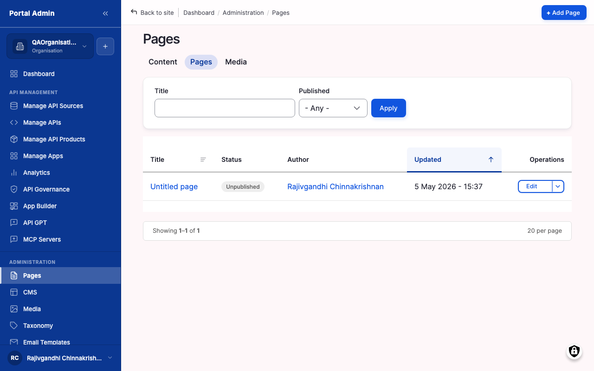
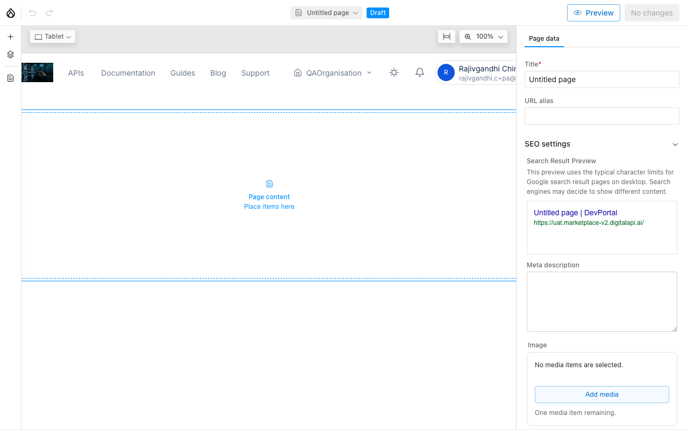
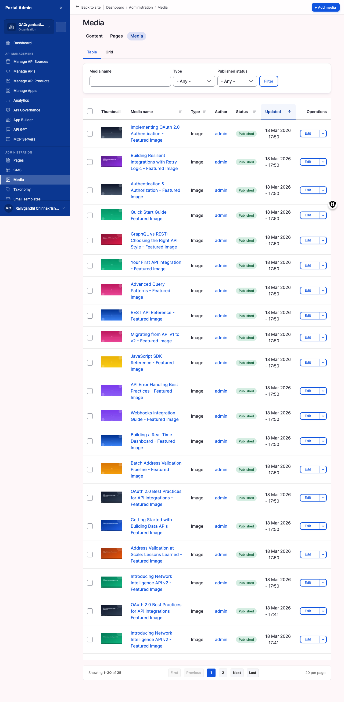

The content surfaces under **Content** in the sidebar manage your storefront: standing pages (About, Help, Privacy, Terms, the homepage), articles, and the media library that holds every image, PDF, video, and file the portal serves. Edit content when copy is out of date, when legal asks for a Privacy or Terms revision, or when you launch a new page ahead of a release. An editorial workflow and a scheduling queue let you gate changes behind review and time them to a release date.

## What you see

The **Content** overview is the single list of every content item in the portal, across Pages, CMS items, and Media. Its tabs and columns are:

- **Overview / Scheduled content** tabs: switch between the full list and the queue of future state changes.
- **Title / Type / Published status** filters: combine them to find, for example, every Documentation item still in Draft.
- **Content type** column: whether a row is a Page, a Documentation item, a Guide, or another type.
- **Status** column: whether the item is Published or unpublished.
- **Updated** column: sortable; sort descending to see today's edits first.
- **Operations** menu: per-row menu to open the item for **Edit** or view its revisions.

The **Pages** sub-list narrows this to standing pages, with a **Title** filter, a **Status** filter, an **Add page** button top-right, and a per-row **Operations** menu for **Edit**, revision log, and removal.

## The page editor

A page is composed in a visual block builder; media items are stored once and referenced by pages. The fields you fill in:

- **Title**: text (required). The heading visitors see at the top of the page and on the browser tab.
- **URL alias**: text (required). The public path, for example `/partner-programme`. Use a short, descriptive slug rather than `/node/12`.
- **Description**: text (optional). The meta description used by search engines and link previews.
- **Body**: block builder (required). Built by dragging blocks (heading, text, image, callout, columns) onto the canvas. Rearrange them at any time without losing content.
- **SEO settings**: panel (optional). An SEO title and meta description that differ from the page values.
- **Scheduling**: panel (optional). A **Publish on** and optional **Unpublish on** date and time, covered under scheduling below.
- **Status**: select (required). *Published* or *Unpublished*. Pages publish immediately on save, so draft first if a change needs review.

## Edit a storefront page

1. Expand **Content** in the sidebar, then click **Pages**.
2. Use the **Title** filter to find the page, or sort by **Updated** to find the most recently edited one.
3. Click the page title to open it, then click **Edit**.
4. Update the copy in the body editor.
5. To change the publish state, toggle **Status** between *Published* and *Unpublished*.
6. Click **Save**.


**Tip:** Before saving a major copy change to a high-traffic page (the homepage, Pricing, Privacy), set the status to *Unpublished*, save, preview it logged in as an admin, then re-publish once you are satisfied.


## Add a new page

1. Expand **Content** in the sidebar, then click **Pages**.
2. Click **Add page** in the top-right.
3. Enter a **Title**.
4. Enter a **URL alias**, for example `/partner-programme`.
5. Enter a short **Description** for the meta description.
6. Build the body with the visual block builder, dragging blocks onto the canvas.
7. Open the **SEO settings** panel to set an SEO title and meta description if they should differ from the page values.
8. Click **Preview** to render the page as a visitor sees it.
9. Save and publish from the top-right action menu.


**Note:** Each block (heading, text, image, callout, columns) is dragged onto the canvas from the block panel on the left. You can rearrange blocks at any time without losing content.



**Tip:** Save an unpublished version first, share the preview URL with a reviewer, and only publish once they approve. That is faster than building, publishing, and rolling back.


## Manage media

The media library stores every image, PDF, video, and downloadable file the portal serves. Pages reference media items rather than holding the binary, so you can replace an image once and every referencing page picks up the new version. The **Media** list offers a **Name** filter, a **Type** filter (images, documents, video, audio), a **Status** filter (published, archived), an **Add media** button, a **Bulk upload** drop-zone, and a grid view that shows thumbnails alongside metadata.

The media item fields:

- **File**: upload (required). The image or file itself, dragged onto the upload target or chosen from your computer.
- **Name**: text (required). The library label you and your team see. Visitors only see the file itself.
- **Alt text**: text (required for images). The description screen readers announce and search engines index.

To upload a media item:

1. Expand **Content** in the sidebar, then click **Media**.
2. Click **Add media** for a single file, or **Bulk upload** to drop in many at once.
3. Drag the file onto the upload target, or click to choose a file.
4. Enter a **Name**, and alt text for images.
5. Click **Save**.

To replace a media item without breaking references:

1. Open the **Media** list and find the item by name.
2. Click the row's edit link.
3. In the file field, click **Remove**, then upload the new file.
4. Click **Save**.


**Caution:** Deleting a media item breaks every reference to it, leaving that area of a page empty. Always replace before deleting, or check the **Used in** column first.


## Review moderated content

Editorial workflow puts a review gate between an author saving a draft and that draft going public. The **Moderated content** tab is the single queue of every item waiting on review, across Pages, CMS items, and Media.

1. Expand **Content** in the sidebar, then click the **Moderated content** tab.
2. Use the **Content type** filter to narrow the queue to one type when you review only one kind.
3. Use the **Moderation state** filter to scope to *Draft*, *Needs review*, *Published*, or *Archived*.
4. Click a title to open the item, review the changes, then transition the state from the editor and add a revision message the author sees.

The moderation states are Draft, Needs review, Published, and Archived. The default workflow allows direct publish; switching a content type to a moderated workflow (under **Configuration** > **Workflow** > **Workflows**, on the **Editorial** workflow) gates publication behind this queue.


**Tip:** Sort by **Updated** descending and skim the top of the queue every morning. Drafts that sit longer than a week often go stale. Chase the author or close the item.


## Schedule a publication

Schedule a publication when an announcement, a policy update, or a new page needs to appear at a specific date and time. The marketplace flips the state from *Draft* to *Published* automatically at that moment, and the change appears in the **Scheduled content** queue.

1. Open the content item from **Content** > **Pages** (or any type that supports scheduling).
2. Open the **Scheduling** sidebar panel.
3. Enter a **Publish on** date and time.
4. Optionally enter an **Unpublish on** date and time for content that should retire on its own.
5. Save the item with status *Draft*. The marketplace publishes it at the scheduled time.


**Tip:** The Scheduled queue is the single place to audit every future state change in the portal. Skim it every Monday to catch a publish set up for the wrong week.


## Verify

- Reload the page or alias in a private browser window and confirm the new copy renders.
- Confirm the **Status** column on the Pages list reflects what you saved.
- For media, confirm the item appears in the **Media** list with the correct name, type, and alt text, and that every page in the **Used in** column serves the current file.
- For a scheduled item, confirm it appears in the **Scheduled** queue with status *Pending* and the dates you entered.


**Caution:** Deleting a media item breaks every reference to it. Replace before deleting, or check the **Used in** column first.



**Result:** The page or article is live at its alias and referenced media serves the current file. Published changes appear on the next page load; scheduled changes fire at their set time.


## Related

- [Branding & theming](feat-branding-and-theming.md) controls the look-and-feel that wraps these pages.
- [Notifications](feat-notifications.md) and [Email templates](feat-email-templates.md) cover messaging that pairs with a content launch or deprecation.
- [Search](feat-search.md) covers URL aliases and redirects when a page path changes.