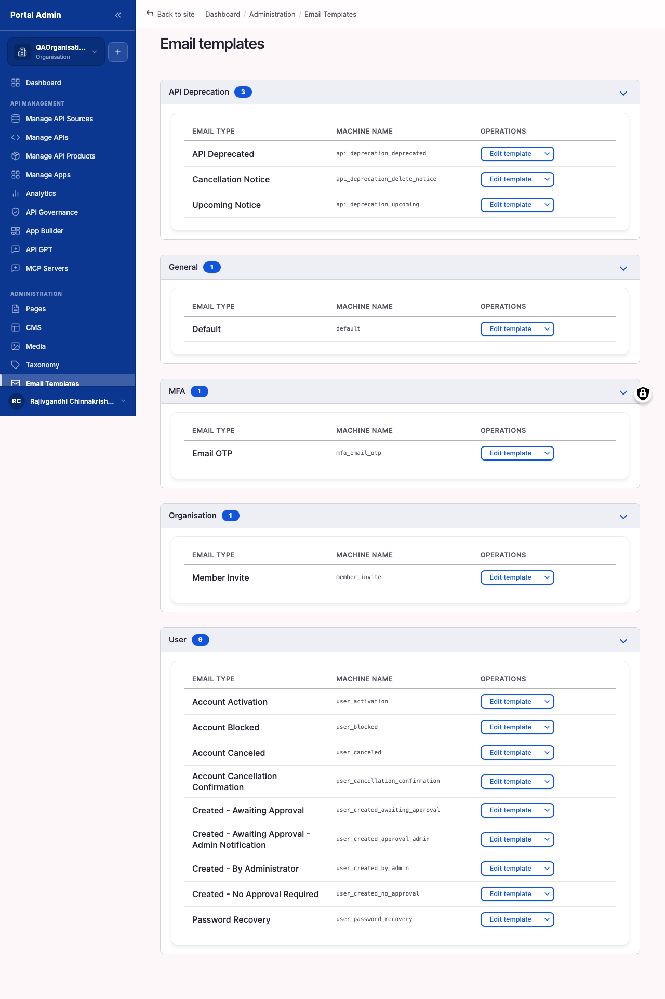

Every transactional email the marketplace sends comes from a template: subscription approvals, password recovery, member invitations, account activation, and API deprecation notices. The portal ships with sensible defaults. Edit a template when the default copy does not match your tone, when legal asks for specific footer text, or when you want to translate it for a non-English audience.

## What you configure

Each template fires on a specific event and exposes a fixed set of fields you edit:

- **Email type**: the template name, grouped into collapsible categories for quick lookup. This identifies which event the template fires on.
- **Machine name**: the read-only identifier that binds the template to its trigger event. Editing the wrong template means your change never goes out.
- **Subject**: the email's Subject header. This is the field operators most often change to match brand voice.
- **Body**: the message, edited in a rich-text editor. Insert variables from the variable list to the right of the editor.
- **Variables**: tokens such as `[user:display-name]`, `[site:name]`, and `[org:name]` that resolve at send time. The editor lists every variable the template exposes.
- **Preview**: renders the email with placeholder values substituted so you can check layout before saving.

## Configure

1. Expand **SETTINGS** in the sidebar, then click **Email templates**.
2. Find the template by name. Templates group into collapsible categories (for example API Deprecation, General, MFA, Organisation, User).
3. Click the template name to open the editor.
4. Update the **Subject** field for a different subject line.
5. Edit the **Body** in the rich-text editor, inserting variables from the list so they resolve at send time.
6. Click **Preview** to see the rendered email with placeholder values.
7. Click **Save**.

## Options

The shipped templates cover the platform's transactional events, including:

- **User lifecycle**: Member Invite, User Activation, User Password Recovery, User Created (several approval variants), User Blocked, User Cancelled.
- **Security**: MFA Email OTP, sent when email-based multi-factor authentication is required at login.
- **API Deprecation**: Upcoming, Deprecated, and Delete Notice, each fired at its stage of the deprecation schedule.
- **Default**: the fallback used when no event-specific template applies.

## Verify

- Trigger the matching event for a test recipient (for example, invite yourself to a test Organisation for Member Invite) and confirm the email arrives with the new subject and body.
- Confirm every variable resolves to a real value. No literal `[user:display-name]` strings remain in the delivered email.
- Confirm the From-name and From-address match what is set on the email transport.


**Caution:** A typo in a variable name renders as the literal string in the outgoing email. Always send a test to yourself after editing.



**Result:** The next outbound email of that type uses the new subject and body. Queued emails already in flight are not rewritten.
