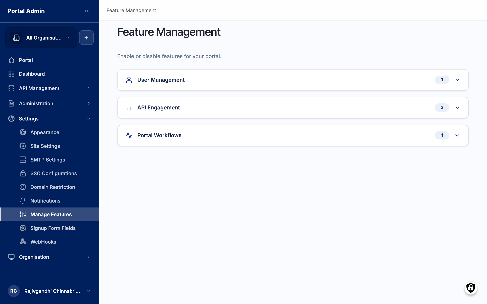

Feature Management is the master switchboard for your Organisation. Each toggle turns a whole portal capability on or off for your tenancy without a code deployment. Use it to roll a feature out gradually, to retire one your team does not use, or to gate an in-progress feature until it is ready. Reach it from the left sidebar under **Settings** > **Manage Features**.

## What you see

The **Feature Management** page heading sits above a set of collapsible feature groups. The line below the heading confirms you are enabling or disabling features for your portal. Each group shows a pill with the count of features it holds. Expand a group to reach its individual on/off toggles. The groups are:

- **User Management**: user-facing toggles that govern how accounts, sign-up, and member-related surfaces behave.
- **API Engagement**: API-discovery and engagement toggles that control catalogue and consumer-facing capabilities.
- **Portal Workflows**: workflow toggles such as content moderation gates and approval steps.

The chevron on each group row is the expander. Click it to open the group and reveal the toggles inside. Each toggle inside a group enables or disables one capability for the whole tenancy.

## What each toggle controls

A toggle controls more than a single button. It governs every surface, menu link, and workflow tied to that capability, so the effect is felt across the portal the moment you flip it:

- A **User Management** toggle changes how accounts behave: whether self-sign-up is open, which fields a new user fills in, and whether member-related menus appear.
- An **API Engagement** toggle changes the consumer-facing catalogue: whether a discovery surface, an engagement panel, or a related consumer page renders at all.
- A **Portal Workflows** toggle changes whether a workflow gate is in force: turning a moderation or approval workflow off lets content publish directly, while turning it on routes content through review first.

Because a toggle reaches every dependent surface, treat each change as portal-wide. Turning a toggle off hides every surface that depends on that capability for every user, not only yourself.

## Toggle controls

Each row inside an expanded group is a single feature with one control:

- **Feature name**: the label naming the capability the toggle governs.
- **On/off toggle**: switch (required). Flips the capability on or off for the whole tenancy. The change saves on toggle; there is no separate save step. Default reflects the feature's current state for your Organisation.

## Before you start

- **Know what the feature controls.** Toggling a feature off hides every surface that depends on it for every user, not only yourself. Confirm no one relies on it before you switch it off.
- **Plan the change by group.** Features are organised into groups (User Management, API Engagement, Portal Workflows). Expand the group to see the individual toggles and the count of features it holds, so you change the right one.

## Enable or disable a portal feature

Open Feature Management when you want to turn a capability on for the first time, retire one your team no longer uses, or stage a rollout where one feature group goes live ahead of another.

1. From the left sidebar, expand **Settings** and click **Manage Features**.
2. The **Feature Management** page loads with the feature groups collapsed. Each group shows a count of the features it holds.
3. Click a group, for example **API Engagement**, to expand it and reveal the individual toggles.
4. Read what the feature controls before changing it. Toggling a feature off hides every surface that depends on it for every user.
5. Flip the toggle on or off for the feature you want to change.
6. The change saves on toggle. No separate save step is required.


**Caution:** Disabling a feature that other surfaces depend on can hide functionality your team relies on day to day. Toggle one feature at a time and confirm the affected surfaces still behave as expected before moving on.


## Stage a gradual rollout

Use the groups to bring a capability live in stages rather than all at once.

1. Decide which feature group leads the rollout, for example **API Engagement** ahead of **Portal Workflows**.
2. Expand the leading group and turn on the first capability you want to release.
3. Confirm the surfaces that capability adds render for the intended users before moving on.
4. Return to Feature Management and turn on the next capability once the first is stable.
5. Keep dependent capabilities off until the surfaces they support are ready, so consumers never reach a half-built feature.


**Tip:** Change one toggle at a time so you can attribute any change in behaviour to the right feature. If a surface disappears unexpectedly, the last toggle you flipped is the place to look.


## Verify

- Confirm the toggle holds its new on or off position after the page reloads.
- Open a surface the feature controls and confirm it renders when the feature is on, and stops rendering when it is off.
- After enabling a feature, check the menu or page it adds appears for the intended users.
- Test as more than one role where the feature is user-facing, so you confirm the change reaches consumers and not only administrators.


**Result:** The capability is on or off across the portal immediately. Surfaces that depend on a disabled feature stop rendering for every user.


## Related

- [Roles and permissions](feat-roles-and-permissions.md)
- [Content and pages](feat-content-and-pages.md)
- [Single sign-on](feat-single-sign-on.md)