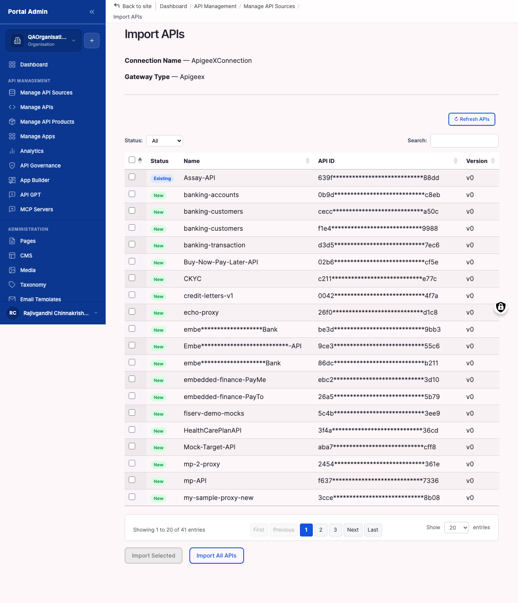
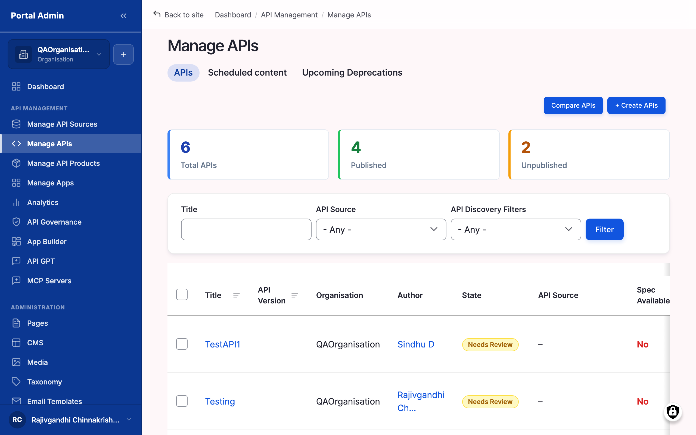

Bring APIs into the catalog two ways: an automatic import that reads a connected gateway and creates one node per spec, or the manual **Create APIs** wizard for APIs that live outside any gateway. Most teams seed the catalog with an import, then add manual entries as needed. Both paths produce the same kind of catalog node, ready for governance, plans, and publication.

## What you configure

For an automatic import you set a few batch-wide choices; the manual wizard exposes the full field set. The settings that matter most:

- **Per-API selection:** every row the gateway exposes carries a checkbox. Deselecting a row excludes it from this run, not forever; re-trigger the import later to pick it up. The header checkbox toggles all rows at once.
- **Default visibility:** one setting applied to the whole batch. **Org Level** (members of this organisation only), **Internal** (all logged-in users across organisations), or **Public** (everyone, including anonymous visitors). Org Level is the safe first-import choice. Per-API overrides come later when you publish.
- **Moderation state:** imported and freshly created APIs land as **Draft**. Draft APIs are hidden from consumers regardless of visibility. **Published** makes them live in the catalog at the chosen visibility.
- **Basic Identity** (manual wizard): Title (required, the catalog tile heading and re-import matching key), API Version, API Revision, Environment, and comma-separated API Tags.
- **Discovery Filters** (manual wizard): Domain (multi-select, drives catalog grouping), API Resources (links to related guides), and an optional Spotlight feature window.
- **Narrative Content** (manual wizard): Overview (catalog tile blurb), Documentation (long-form landing-page content), and an optional Logo.
- **Specification Editor** (manual wizard): the OpenAPI 2.0 or 3.0 document in JSON or YAML, attached by upload, paste, or import from URL, then **Validate**.

## Configure

1. Confirm the connection passed **Test connection** first. A failed connection cannot list APIs.
2. From **Manage API Sources**, find the connection under **Existing API Sources** and click **Import APIs** on its row.
3. Wait for the marketplace to enumerate the gateway. Large gateways take 30 seconds or more.
4. Review the discovered list. Each row shows the API title, version or revision, environment, and a checkbox. Deselect any rows to exclude.
5. Pick a default **Visibility** for the batch. Org Level is the safe first-import choice.
6. Click **Import selected**. The marketplace creates one node per row and redirects to **Manage APIs**.

To create an API by hand instead, open the **Create APIs** wizard from **Create > APIs** (or **Content > APIs > Add API**). Fill the four fieldsets top to bottom: **Basic Identity**, **Discovery Filters**, **Narrative Content**, and the **Specification Editor** (click **Validate** until the status reads **No issues**). Set **Visibility** and **Moderation state** in the footer, then **Save**.

## Verify

- After an import, confirm the redirect lands on **Manage APIs**.
- Sort by **Last updated** descending and confirm the new APIs sit at the top of the list.
- Check each new row carries the connection name in the **API Source** column. Manual creates show `(none)` or the source you chose.
- Click into one API and confirm its spec renders without a parse error in the **API Specification** tab.
- Confirm the **Status** column reads **Draft** (or **Published** if you changed it during creation).

## Options

- **Visibility scope:** Org Level, Internal, or Public, set per batch on import and per API in the wizard.
- **Spec format:** OpenAPI 2.0 (Swagger) and 3.0, in JSON or YAML, up to 10 MB. AsyncAPI, RAML, and gRPC `.proto` do not import.
- **Spec source in the wizard:** upload a file, paste into the editor body, or **Import from URL** for a publicly reachable spec.


**Note:** Re-running an import matches existing nodes by Title. Renaming an API in the gateway and re-importing creates a duplicate rather than updating the original.
**Result:** Every selected API exists as a catalog node, linked to its source gateway and queued for a governance scan, ready for plans and publication.
