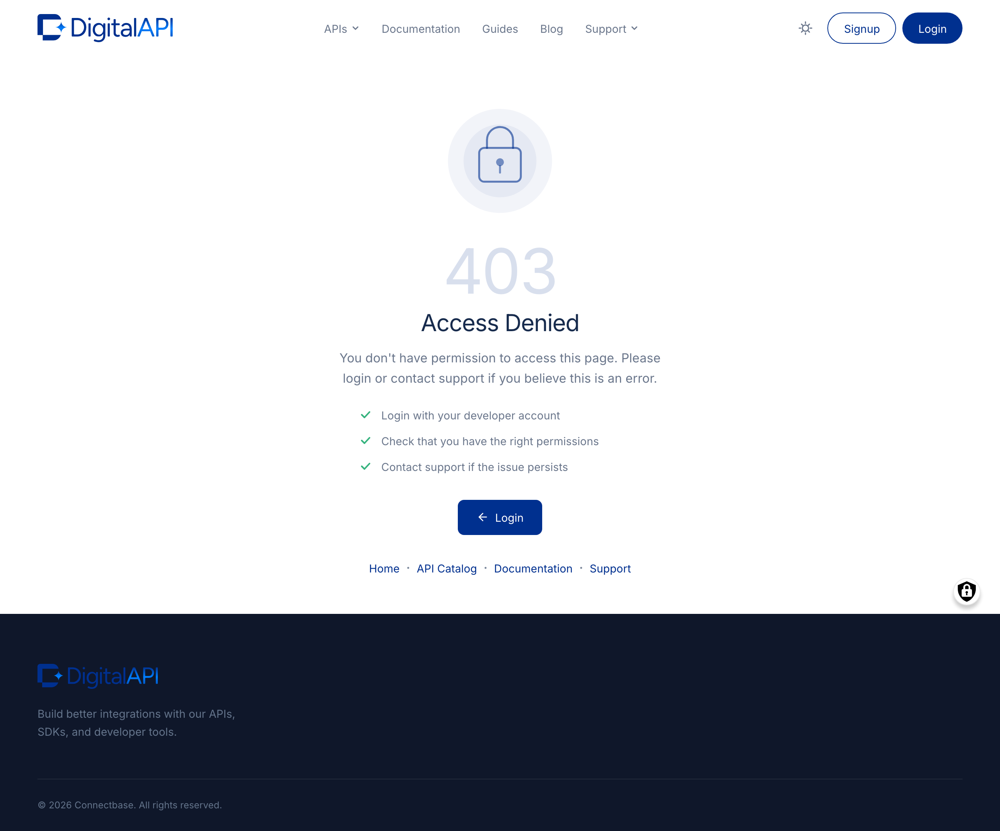

Bring APIs into the catalog two ways: an automatic import that reads a connected gateway and creates one node per spec, or the manual **Create APIs** wizard for APIs that live outside any gateway. Most teams seed the catalog with an import, then add manual entries as needed. Both paths produce the same kind of catalog node, ready for governance, plans, and publication. Use an automatic import after you have saved a connection; use the wizard when the marketplace itself owns the canonical spec.

## What you see

Two surfaces drive imports. The **Import APIs** panel opens from a connection row on Manage API Sources at `/admin/apim/connection/<id>/import-apis/<gateway>`. After enumerating the gateway it shows:

- A **source banner** naming the connection the import is reading from.
- An **API list**, one row per spec, each carrying the title, version or revision, environment, and a selection checkbox.
- A **header checkbox** that toggles every row at once.
- A **Default Visibility** selector applied to the whole batch.
- An **Import selected** button, disabled until at least one row is selected.

The **Manage APIs** list at `/admin/manage-apis` is the catalog control surface. Its columns, left to right:

- **Title**: the public name. Click to open the API detail page.
- **API Source**: the connection or documentation source the API came from. Manual creates show `(none)` or the source chosen at creation. The column reports the connection name, not the gateway product, so two connections to the same product read as distinct sources.
- **Status**: moderation state, **Draft** or **Published**. Draft APIs are invisible to consumers regardless of visibility.
- **Last updated**: timestamp of the most recent change. The column most providers sort by daily.
- **Governance Report**: a link to the per-API drilldown. A value of N/A means the scan has not run yet.

Above the table sit filter dropdowns (**Status**, **API Source**, **Visibility**), sortable column headers (Title and Last updated), an **Actions** dropdown for bulk operations, and pagination below (25 rows per page by default; 10, 25, 50, or 100). Filter and sort state is captured in the URL, so a filtered view can be bookmarked or shared.

## Trigger an automatic import

Use this to discover and create one API node per spec held in a connected gateway. The import reads the gateway, creates nodes in batch, and links each node back to its source connection. Before you start, confirm the connection passed **Test connection** (a failed connection cannot list APIs), decide whether to import all APIs or a subset, and choose a default visibility (Org Level is the safe first-import choice).

1. From the left sidebar, expand **API MANAGEMENT**, then click **Manage API Sources**.
2. Scroll to **Existing API Sources** and find the connection's row.
3. Click **Import APIs**. The page opens at `/admin/apim/connection/<id>/import-apis/<gateway>`.
4. Wait while the marketplace queries the gateway. Large gateways can take 30 seconds or more to enumerate.
5. Review the list. Deselect any rows to exclude from this run (the header checkbox toggles all).
6. Pick a default **Visibility** for the batch: **Org Level**, **Internal**, or **Public**.
7. Click **Import selected**. A progress indicator runs while nodes are created, then the page redirects to **Manage APIs** with the new APIs at the top.


**Note:** Imported APIs land in **Draft** by default. Consumers do not see them until you publish. The Visibility selector controls who *could* see them; the moderation state controls whether anyone *does*.
**Caution:** Re-running an import matches existing nodes by Title. Renaming an API in the gateway and re-importing creates a duplicate rather than updating the original.
**Tip:** The same connection supports importing API Products after the underlying APIs land. Use **Import Products** from the connection row; plans and groupings are covered in [API Products and Plans](feat-products-and-plans.md).


## Filter and sort the list

Use this to narrow a busy catalog down to the slice you need.

1. On **Manage APIs**, locate the filter row above the table.
2. From **Status**, pick Draft, Published, or leave All.
3. From **API Source**, pick a single connection to scope the list. The dropdown lists every registered connection plus an `(unsourced)` entry for manual creates.
4. From **Visibility**, pick Org Level, Internal, or Public.
5. Click a sortable header (**Last updated** is the common choice) to re-sort; click again to flip direction.


**Tip:** The empty state ("No APIs match the current filters") is informative, not an error. After an import, the most common cause is a Status filter still set to Published while the imports are Draft.
**Note:** Pagination preserves filter and sort state. Moving to page two does not reset your selections.


## Use the row actions and bulk actions

Each row has an action menu (hover the row, click the action icon) with five entries:

- **Edit**: opens the detail page in edit mode at `/node/<nid>/edit`.
- **Delete**: opens a confirmation dialog before removing the API.
- **Duplicate**: copies the API into a new draft with `(copy)` appended to the title.
- **Re-run governance**: queues an immediate scan and updates the Governance Report column when it finishes.
- **Open in gateway**: deep-links to the API in its source gateway's admin console where supported; disabled for manual creates without a source.

For several APIs at once, tick the row checkboxes (or the header checkbox for the whole page), pick **Publish selected**, **Unpublish selected**, **Delete selected**, or **Re-run governance** from the **Actions** dropdown, click **Apply**, and confirm.


**Caution:** **Delete** is permanent and revokes any consumer subscriptions tied to the API. For published APIs with live subscriptions, prefer transitioning to Unpublished first. Bulk actions span only the current page, not the full filtered set.
**Tip:** **Duplicate** is the quickest way to scaffold a versioned successor: duplicate `v1`, change the title to `v2`, update the version, paste the new spec, save.


## Create an API by hand

The **Create APIs** wizard at `/node/add/apis` is the path for APIs that do not live behind a connected gateway. The form is a single long page split into four fieldsets, then a visibility-and-moderation footer. Open it from **Create > APIs** in the top bar, or from **Content > APIs > Add API** in the sidebar. Both routes land on the same form. If a prior session left unsaved values, a **Resume editing** banner appears: pick Resume or Discard.


**Note:** The wizard autosaves a draft every 30 seconds while you type. Closing the tab without saving loses nothing; the Resume editing prompt appears next time.


### Basic Identity

- **Title**: text (required, max 255). The public name, shown as the catalog tile heading and the spec viewer header. It is also the re-import matching key, so editing it later breaks the link to gateway re-imports.
- **API Version**: text (optional, max 255). The release tag, for example `1.4.0`. Drives version-aware filters on the consumer side.
- **API Revision**: text (optional, max 255). A revision label when revisions differ from versions. Leave blank when not meaningful.
- **Environment**: autocomplete (optional, max 255). Pick or add a tag such as `prod`, `staging`, `dev`. Allows separate catalog entries per environment.
- **API Tags**: multi-tag text (optional). Comma-separated discovery tags. Press Enter or comma to confirm a tag; tags drive consumer-side catalog filters.


**Caution:** Version and Revision are display fields, not enforcement fields. The marketplace does not refuse a subscription against an old version. Use the deprecation workflow to retire a version on the consumer side.


### Discovery Filters

- **Domain**: multi-select (optional). One or more business domains (default options Banking and Health; a Portal Admin can add more). Drives the left-rail grouping consumers see on the catalog discovery page.
- **API Resources**: autocomplete (optional, max 1024 per entry). Links related guides, articles, or utility pages so consumers find context next to the spec.
- **Spotlight**: collapsed panel (optional, off by default). Expand and tick **Enable Spotlight** to feature the API on the landing page during a launch window, then set a **from** and **to** date-time range.


**Tip:** Spotlight is most effective in two to three week windows tied to a launch. Leaving it on permanently dilutes the signal, as the landing page surfaces only the top spotlighted APIs.


### Narrative Content

- **Overview**: rich text (recommended). Three to five sentences describing what the API does; the catalog tile blurb. The tile truncates after the first sentence or two.
- **Documentation**: rich text (recommended). Long-form content: authentication, rate-limit notes, usage examples, changelog. Rendered verbatim on the API detail page's Documentation tab.
- **Text format**: dropdown. Leave on **Content** for plain rich text; switch to **Markdown** when pasting a raw README; **Email** is for editorial templates. The Overview and Documentation dropdowns are independent.
- **Logo**: image upload (optional, up to 5 MB; PNG, JPG, or SVG). The catalog tile uses it as the icon and renders at 64x64.


**Tip:** Paste your README into Documentation with the format set to **Markdown**. The editor preserves headings, code blocks, and links.
**Caution:** The Logo upload accepts large files but the tile renders at 64x64. Resize before uploading to avoid wasting bandwidth on every catalog load.


### Specification Editor

This fieldset attaches the OpenAPI document that drives the spec viewer, the try-it console, and the governance scanner. The editor accepts OpenAPI 2.0 (Swagger) and 3.0 in JSON or YAML, up to 10 MB. AsyncAPI, RAML, and gRPC `.proto` files do not import.

1. Scroll to **Specification Editor**, below Narrative Content.
2. Attach the spec one of three ways: click **Upload** and pick a JSON or YAML file (drag-and-drop into the editor body also works); click into the editor body and paste; or click **Import from URL** and paste a publicly reachable spec URL.
3. Click **Validate**. A green check with **No issues** means the spec parsed; a red banner names the failing line.
4. Read the **Size indicator** beneath the editor to confirm content is present. A `0 bytes` value after upload means the file did not attach.
5. Fix any named parse error and re-validate until clean. A **Download** button exports the editor contents to keep the on-disk spec in sync.


**Note:** Validate only checks parseability, not governance. A spec can parse cleanly and still fail governance for a missing `securitySchemes` block. Run [API governance](feat-api-governance.md) immediately after saving.
**Caution:** The editor body is the source of truth at save time. If you uploaded a file and then typed over the editor, the typed contents win. Check the Size indicator and the editor body before saving.


### Visibility and moderation, then save

- **Visibility**: radio (required). **Org Level** (members of this organisation only), **Internal** (all logged-in users across organisations), or **Public** (everyone, including anonymous visitors).
- **Moderation state**: select (required, defaults to Draft). **Draft** hides the API from consumers regardless of visibility; **Published** makes it live at the chosen visibility.
- **Publish on**: date-time (optional). A scheduled go-live; relevant only when Moderation state is Draft.

Click **Save** at the bottom of the form. The marketplace creates the node and redirects to the detail page. Save stays disabled until required fields are valid and the spec parses.


**Note:** Saving with Visibility=Public and Moderation=Draft still hides the API until the moderation state transitions to Published. Both settings must agree before the API appears on the consumer catalog.
**Tip:** Always save the first version as Draft, even when you are confident. The governance scan typically catches missing security definitions you want to fix before going live.


## Edit, duplicate, or re-run governance

- **Edit**: from Manage APIs, click the title or pick Edit from the row menu to open `/node/<nid>/edit`. The edit form mirrors Create APIs, pre-populated with current values. Replace the spec by uploading or pasting a new document, click **Validate**, then **Save**.
- **Duplicate**: pick Duplicate from the row menu. A new draft is created with `(copy)` appended to the title. Duplicate copies metadata and the spec body but not the source connection link, so re-imports will not touch the copy.
- **Re-run governance**: from the row menu, pick **Re-run governance**, or open the detail page's **API Governance Report** tab and click **Re-run scan**. Scans typically complete within a minute for specs under 1 MB.


**Note:** Editing the Title breaks the re-import matching key for connection-sourced APIs. The next gateway re-import will create a duplicate rather than updating this one.
**Caution:** Replacing the spec on a published API can break consumer apps that depend on the old shape. For breaking changes, create a new API at the new version rather than mutating the old one.


## Verify

- After an import, the redirect lands on **Manage APIs**.
- Sorting by **Last updated** descending puts the new APIs at the top.
- Each new row carries the connection name in **API Source** (manual creates show `(none)`).
- Clicking into an API shows its spec rendering without a parse error in the **API Specification** tab.
- The **Status** column reads **Draft** (or **Published** if changed during creation).
- A Governance Report score of N/A means the scan has not run yet; re-run it from the row menu to force a current score.

## Fix common import failures

- **Invalid spec format.** Only OpenAPI 2.0 and 3.0 in JSON or YAML import. Convert AsyncAPI, RAML, or gRPC `.proto` first, or attach the original under API Resources as supplementary documentation.
- **Missing security definitions.** A spec with no `securitySchemes` imports but flags a governance violation. Add a minimal `apiKey` or `oauth2` block before re-importing.
- **Gateway timeout during import.** Re-trigger the import. If it fails again, check the gateway endpoint's health and click **Test connection** on the source row.
- **Duplicate title collision.** A title matching one already in the catalog under the same source is rejected. Rename one, or use API Version to disambiguate.
- **Spec too large.** Specs over 10 MB are rejected at upload. Split by tag or path prefix and import each part.
- **Authentication rejected mid-import.** A credential that passed Test connection can still fail mid-import if it expired or its scopes narrowed. Edit the connection, paste a fresh credential, re-test, and re-trigger.
- **Empty environment.** APIs with no `servers` block (OpenAPI 3.0) or `host` (OpenAPI 2.0) import but show `(no environment)`. Add a `servers` entry and re-import.
- **Save button disabled in the wizard.** Always means the spec failed Validate. Check the Specification Editor status indicator, fix the named parse error, validate, then save.


**Caution:** Do not delete an API to force a clean re-import if it has consumer subscriptions; deletion revokes them. Edit the node in place, or re-trigger the import for the affected connection.
**Tip:** When in doubt, re-test the connection before re-importing. A five-second check rules out the most common failures (credential rotation, endpoint change, region mismatch).


## Related

- [Gateway connections](feat-gateway-connections.md): register a runtime gateway before importing from it.
- [Documentation and repository sources](feat-documentation-sources.md): import specs from registries and repositories instead of a gateway.
- [API governance](feat-api-governance.md): read and act on the linting score for each imported API.
- [Publishing APIs](feat-publishing-apis.md): transition an API from Draft to Published once governance is acceptable.
- [API Products and Plans](feat-products-and-plans.md): wrap imported APIs into a subscribable Product before approving subscriptions.