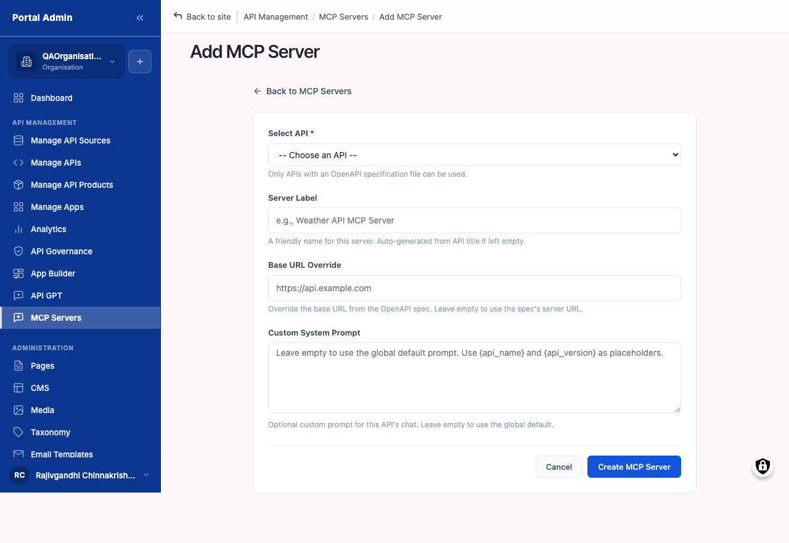
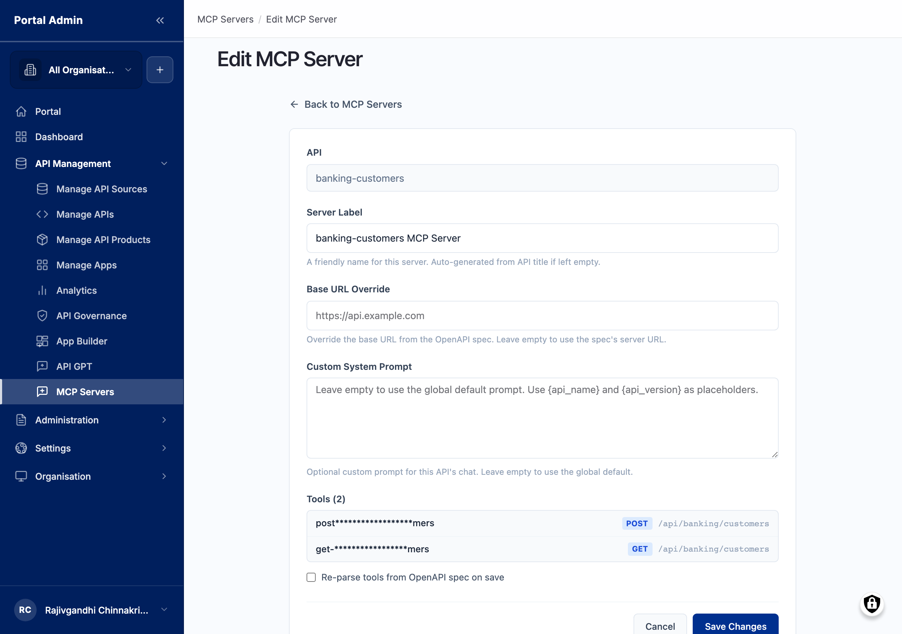

An MCP server registers a Model Context Protocol endpoint that exposes a curated subset of your published APIs to AI agents. MCP is an open protocol that lets an agent discover the tools on a server and call them with structured arguments. When you register a server, you select which APIs it exposes and the marketplace generates the MCP tool definitions from each API's OpenAPI spec. Agents that already speak MCP (Claude Desktop, IDE assistants, custom clients built on the MCP SDK) connect to the server's Base URL, enumerate the tool list, and call your APIs as tools. The same registration also powers the in-product [API GPT assistant](feat-api-gpt.md), so one server feeds both external agents and the storefront chat.

## What you see

The list page at `/admin/portal/mcp-servers` is the directory of every server registered in your organisation and the launchpad for adding, editing, and revoking servers. Read the columns left to right; the default order surfaces identity first, scope second, lifecycle third.

- **Label**: the human-readable name agents see in their tool list. Click it to open the detail page.
- **APIs**: the published APIs scoped to this server. A server with three APIs shows all three; a longer list shows the first two and a `+5 more` counter.
- **Base URL**: the externally callable URL agents use to connect. Copy it straight into your MCP client config.
- **Status**: Active or Revoked. Revoked servers stay in the list for audit but reject new agent connections.
- **Add MCP Server**: the top-right button that opens the registration form at `/admin/portal/mcp-servers/add`.
- **Row action menu**: Edit, Revoke, Delete, Copy URL. Hover the row to reveal it at the right edge.


**Note:** The MCP Servers list scopes to your organisation. Servers registered by other organisations on the same marketplace install do not appear here.


## What you configure

The registration form turns a set of published APIs into a single callable endpoint:

- **Server label**: text, required, max 255 characters. The name agents see in their tool list and the list page's Label column. Prefer an identifiable name such as *"Payments API (production)"* over *"mcp-1"*.
- **Description**: text, optional, max 1024 characters. An internal memo that reminds your team what the server scopes; it does not affect agent behaviour.
- **APIs**: multi-select, required. Type a partial title to filter, click to add a pill, click the pill's `x` to remove. Only APIs already published in the marketplace appear in the list. Each selected API becomes a callable tool on the server.
- **Base URL override**: text, pre-filled. The portal fills it with the storefront domain and a per-server path. Edit it only when a separate gateway fronts MCP traffic.
- **Custom system prompt**: free text, optional. Sent to the agent alongside the tool definitions. Use it to set persona, name the scoped APIs, and constrain behaviour, for example *"You are an assistant for the Payments API. Always confirm currency before calling create_payment."*
- **Generated tools**: read-only. The portal builds one tool per endpoint (the POST and GET operations) from each scoped API's OpenAPI spec. The Tools list on the form confirms exactly which operations the agent can call.
- **Status**: Active or Revoked. New servers default to Active; set Revoked to stage a server without exposing it.

## Register an MCP server

Publish the APIs first; the form lists only APIs already published. Decide on the agent's persona and a clear label before you open the form.

1. From the left sidebar, expand **API MANAGEMENT** and click **MCP Servers**.
2. Click **Add MCP Server**. The heading changes to Add MCP Server at `/admin/portal/mcp-servers/add`.
3. Enter a **Label** and an optional **Description**.
4. In the **APIs** multi-select, pick one or more published APIs. Each one becomes a callable tool.
5. Confirm the **Base URL**, or override it only if a separate gateway fronts MCP traffic.
6. Enter the **System Prompt** that steers how the agent presents and calls these APIs.
7. Set **Status** to Active, then click **Save**.


**Tip:** Keep system prompts focused. *"You are an assistant for the Payments API. Always confirm currency before calling create_payment."* outperforms a 500-word essay covering every API at once.
**Caution:** The server inherits whatever auth each underlying API requires. If an API is protected by an API key, the agent must pass that key, and the consumer registering the agent needs an active subscription to each underlying plan.


## Choose the exposed operations

The set of operations an agent can call is the union of the APIs in scope. To change it, edit the server's API selection; a focused scope (two or three related APIs) produces more reliable agents than a broad one.

1. From **MCP Servers**, click the server **Label**, or pick **Edit** from the row action menu. The form opens at `/admin/portal/mcp-servers/<id>/edit`.
2. In the **APIs** multi-select, add the APIs to expose; type a partial title to filter, then click to add a pill.
3. Remove any APIs that should no longer be in scope by clicking the `x` on the pill.
4. Update the **System Prompt** to reflect the new scope so the prompt and the API selection stay aligned.
5. Confirm the **Tools list** shows one tool per endpoint for each scoped API, then click **Save**.

The portal re-parses each scoped API's OpenAPI spec on save, so the Tools list refreshes to reflect the current operations. Agents pick up the new tool list on their next handshake.


**Note:** Removing an API from one server does not affect that API's other MCP servers or its direct (non-MCP) subscribers. The change scopes only to this server.
**Tip:** Watch the agent's tool count after a scope change. If a count of 12 drops to 11 unexpectedly, an API that was in scope has been unpublished or deleted.


## Edit, copy, or revoke a server

- **Edit**: from the row action menu pick **Edit** (or open the detail page and click **Edit**), change the Label, Description, APIs, Base URL, System Prompt, or Status, then **Save**. Edits preserve the server's identity and do not break existing connections.
- **Copy URL**: hover the row, open the action menu, and click **Copy URL** (or use the copy icon next to Base URL on the detail page). A toast confirms `URL copied to clipboard`. This is the only piece a consumer needs to wire the server into their agent.
- **Revoke**: open the row action menu and pick **Revoke**, confirm the summary dialog, and the Status flips to Revoked. New handshakes are rejected within seconds; in-flight authenticated calls complete, and the next request returns 403. Re-activate from the Edit form by setting Status back to Active; the Base URL stays the same, so consumers need no reconfiguration.
- **Delete**: removes the server and its audit row permanently. Prefer Revoke unless you are intentionally purging a record.


**Caution:** Editing the Base URL invalidates the URL agents have already configured in their MCP clients. Communicate the change before saving; new connections must use the new URL.


## Verify

- The new server appears in the **MCP Servers** list with the correct Label, APIs, and Base URL.
- The server's Edit form shows one tool per endpoint for each scoped API.
- From an MCP-aware agent (for example Claude Desktop), connecting to the Base URL enumerates each scoped API's operations as tools, and a test call returns a `2xx`.
- A revoked server reads Revoked, rejects new tool calls, and its call count drops to zero on the analytics time-series shortly after.

## Related

- [API GPT assistant](feat-api-gpt.md): the in-product chat that uses your registered servers as its tool layer.
- [Provider analytics](feat-provider-analytics.md): AI-agent calls land in Recent Requests, tagged with the server label so you can tell them apart from human traffic.