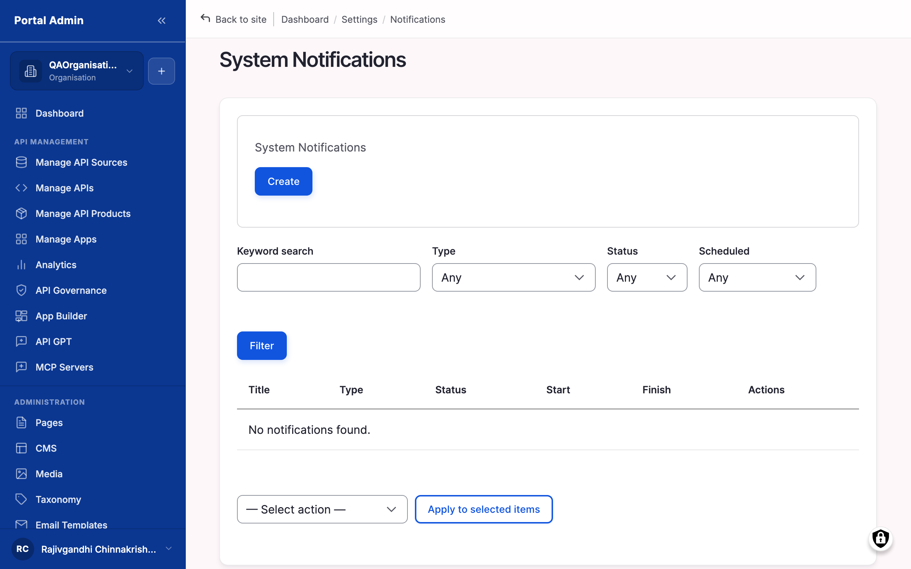
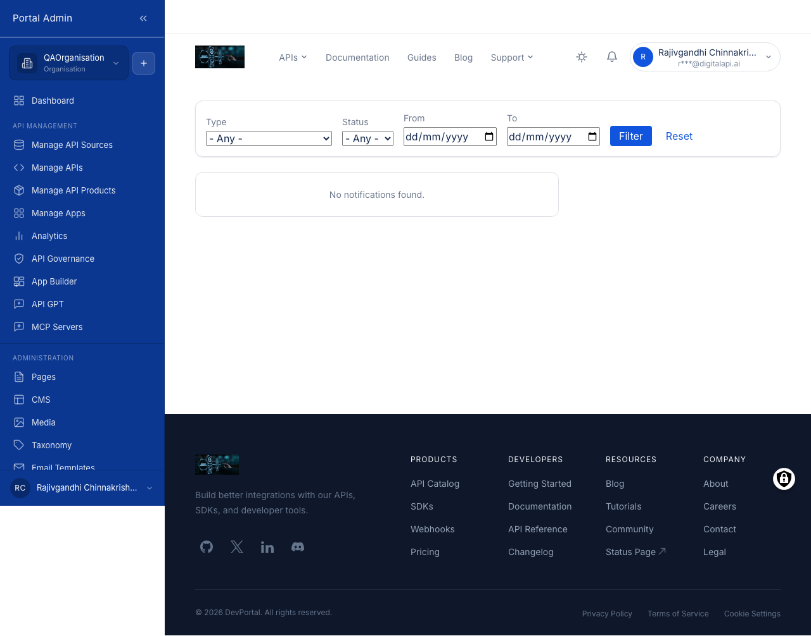

System notifications are the marketplace's broadcast channel. Post one when every signed-in user (Providers, Org Admins, Consumers) needs to see a message regardless of which page they are on: planned downtime, a major release, a service disruption, or a deprecation that affects the whole portal audience. They complement webhooks and email by reaching users inside the app, even when they missed the email. A second surface, the personal inbox, is where each user reads the notifications addressed to them, including subscription decisions, governance scan results, and webhook delivery failures.

## What you see

The **System Notifications** list sits under **Administration** in the left sidebar. Each row is one notification with its title, severity type, publication status, and scheduled date. The controls across the page are:

- **Keywords** filter: free-text search across notification titles and bodies.
- **Type** filter: scope the list by severity (Info, Warning, Critical).
- **Status** filter: scope by publication state (Published, Draft, Archived).
- **Scheduled** filter: show only notifications with a future start date.
- **Action** selector: the bulk action applied to ticked rows (Publish, Unpublish, Archive, or Delete).
- **Add notification** button: top-right, opens the compose form.
- **Operations** menu: per-row menu to open a notification for **Edit** or to view it.

## The compose form

The Add notification form holds a handful of fields that control what the message says, who sees it, and when it appears:

- **Title**: text (required). The headline shown in the in-app inbox. Keep it under 60 characters; a longer title gets truncated.
- **Body**: rich text (required). The message shown on the notification detail view. Plain text plus a single link reads best for skim-reading.
- **Type**: select (required). The severity. *Info* for routine announcements, *Warning* for something to plan around (planned maintenance, a breaking change in 30 days), *Critical* for an active incident. Defaults to Info.
- **Audience**: scope control (required). All signed-in users, only Providers, only Consumers, or one Organisation. Defaults to all signed-in users. Pick the narrowest scope that covers everyone who needs to know.
- **Start date**: date and time (optional). When the notification becomes visible. Leave blank to publish immediately on save.
- **End date**: date and time (optional). When the notification hides itself. Outside the start-to-end window the notification is hidden automatically.
- **Status**: select (required). *Published* to go live, or *Draft* to save without publishing.

## Post a system notification

1. Expand **Administration** in the sidebar, then click **System Notifications**.
2. Click **Add notification** in the top-right.
3. Enter a **Title** under 60 characters.
4. Write the **Body** in the message editor. Plain text plus a single link works best.
5. Choose a severity from **Type**: Info, Warning, or Critical.
6. Set the **Audience** scope to the narrowest group that covers everyone who needs the message.
7. For a time-bounded notice, set a **Start date** and an **End date**. Outside that window the notification is hidden automatically.
8. Set **Status** to *Published* to go live, or *Draft* to hold it.
9. Click **Save**.


**Note:** Critical notifications override per-user notification preferences and always appear in the in-app inbox. Use this severity sparingly. A noisy banner trains users to ignore the channel.


## Edit or archive a notification

1. Open **Administration** > **System Notifications**.
2. Find the notification by title, or filter the list by **Type** and **Status**.
3. Click the title to open the detail view, then click **Edit**.
4. Adjust the title, body, severity, audience, or schedule as needed.
5. Click **Save**. The change applies to the inbox immediately.

To retire several at once, tick the rows, choose **Archive** from the **Action** selector, and click **Apply to selected items**.


**Tip:** When you escalate a Warning to Critical mid-incident, archive the original Warning rather than deleting it. The trail of how an incident was communicated is useful in a post-incident review.


## Read the personal inbox

Every user has a personal inbox, opened from the bell icon in the top-right of the page header. It accumulates every notification the marketplace sends that user: subscription approvals or rejections, governance scan completions, system announcements, webhook delivery failures, and member invitations. The inbox is where users catch up on anything they missed by email.

To open and filter the inbox:

1. Click the bell icon in the top-right of the page header. The inbox loads as a full-page view.
2. Use the **Type** dropdown to scope to one event family (for example Subscription or Governance).
3. Use the **Status** dropdown to scope to **Read** or **Unread** entries. The default is **Any**.
4. Set a **From** and **To** date to scope to a window when you are looking for a specific past event.
5. Click **Filter** to apply, or **Reset** to clear every filter.
6. Click any row to open the notification detail. Opening a row marks it read.

The badge on the bell icon clears once every entry is read.


**Tip:** When a downstream automation reports it stopped working, check the inbox for a webhook-delivery-failure entry. The detail view links straight to that webhook's delivery log.


## Verify

- Sign in as a member of the targeted audience and confirm the notification appears in the in-app inbox.
- For Critical severity, confirm the banner shows across the top of every page until dismissed.
- Confirm the row in **System Notifications** shows status *Published* and the scheduled window you set.
- For the personal inbox, confirm an event you triggered (for example a subscription approval) lands as a new row and that opening it marks it read.


**Tip:** For planned maintenance, post a Warning two weeks ahead and a Critical banner on the day of the work. Archive both once it is complete to keep inboxes clean.



**Result:** The notification reaches the inbox of every user in the audience, and Critical notifications also surface as a top-of-page banner. Personal inbox entries accumulate per user and clear the bell badge once read.


## Related

- [Webhooks](feat-webhooks.md) drive the same events to external systems such as Slack and ticketing tools.
- [Email templates](feat-email-templates.md) control the transactional emails that pair with in-app notifications.
- [Content & pages](feat-content-and-pages.md) covers scheduling a content publication or deprecation notice that you may want to pair with an announcement.