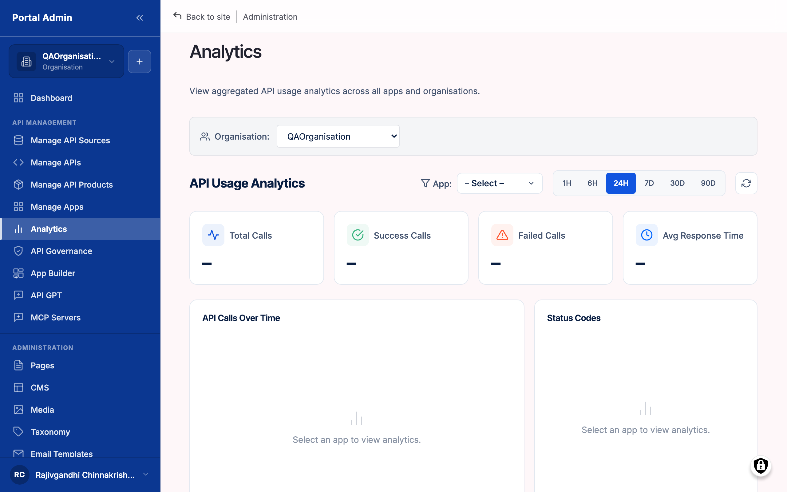
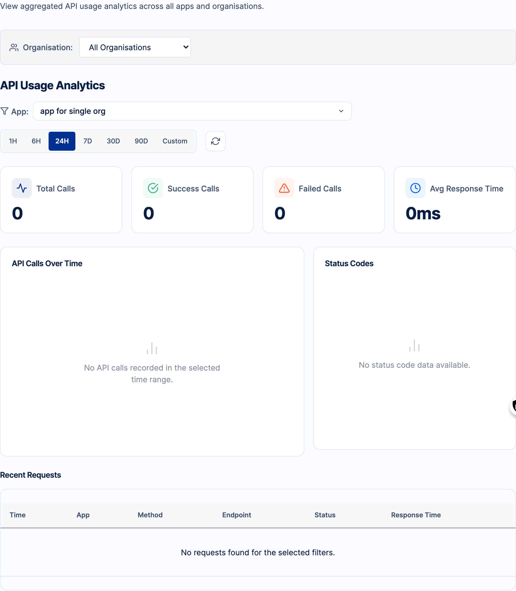

Provider analytics is the operational home for every API Provider. It is where you answer day-to-day usage questions ("how much traffic is flowing today?") and incident questions ("did the 5xx rate spike after yesterday's release?") without leaving the marketplace. Every chart on the page derives from the same source, the per-request log your gateway connections report back, so the numbers across tiles, charts, and tables stay internally consistent. To open it, expand **API MANAGEMENT** in the left sidebar and click **Analytics**; the page opens at `/admin/portal/analytics`.

## What you see

The page header reads **Analytics**, with the main panel heading **API Usage Analytics**. Everything below that heading reflects the selected time range, and every panel re-queries together whenever the range changes.

- **Summary tiles**: four tiles across the top row, each a single number for the selected range. **Total Calls** is the request count, **Success Rate** the proportion of `2xx` against the total, **Error Rate** the proportion of `4xx` and `5xx` combined, and **Average Latency** the mean response time in milliseconds.
- **API Calls Over Time**: a request-volume time-series chart. The Y-axis is request count per bucket; the X-axis rebuckets to suit the range, with finer buckets for short presets and daily buckets for longer ones.
- **Status Codes**: traffic split by HTTP status family (`2xx`, `3xx`, `4xx`, `5xx`). Each segment represents one family and its share of the total. Hover a segment to read the exact count.
- **Recent Requests**: a per-request log with columns for timestamp, method, path, status, latency, and consumer app. It is the only view that shows individual requests rather than aggregates, which makes it the forensic view during an incident.

The time range is the only control that scopes the page. A row of preset buttons sits at the top of the API Usage Analytics panel: **1H**, **6H**, **24H**, **7D**, **30D**, **90D**, and **Custom**. There are no per-API, status-code, or consumer dropdowns here; selecting a button re-queries every panel at once. The currently selected button is highlighted.

- **1H** and **6H**: incident triage.
- **24H**: release-day checks.
- **7D**: weekly reviews.
- **30D** and **90D**: monthly and quarterly summaries.
- **Custom**: an arbitrary window set by a From and a To date-time.

## Read the dashboard

1. From the left sidebar, expand **API MANAGEMENT** and click **Analytics**.
2. Read **Total Calls** first. A weekly review against the same range last week tells you whether traffic is growing.
3. Read **Success Rate**. A healthy production API sits above 99 percent; a number below 95 percent during business hours warrants a closer look.
4. Read **Error Rate**. A `4xx` spike points at consumers; a `5xx` spike points at your APIs.
5. Read **Average Latency** against your published SLA. This is a mean, not a percentile, so follow up with Recent Requests sorted by latency to find slow outliers.
6. Read **API Calls Over Time** for the traffic curve: a steady baseline with daily cycles is healthy, a vertical spike is an incident or launch, a sustained drop is an outage or a missed sync.
7. Read **Status Codes** for the success-versus-error split, then scan **Recent Requests** to name the individual failing or slow calls.

## Filter by time range

1. At the top of the API Usage Analytics panel, find the row of time-range buttons.
2. Click a preset that matches your question. The selected button is highlighted.
3. For an arbitrary window, click **Custom** and enter a From date-time and a To date-time.
4. Every panel re-queries against the new range at once: the tiles, the chart, the Status Codes panel, and Recent Requests.


**Tip:** When investigating a spike, zoom out first and zoom in second. The 24H view confirms whether the spike is unusual; a Custom hour-wide range tells you when it started.


## Investigate an anomaly

1. Open the dashboard and set the range to **24H**.
2. Read the tiles. A normal day sits within a typical band, above 99 percent success, below 1 percent error, with latency near baseline.
3. Read **API Calls Over Time** for vertical spikes, sustained dips, or a step change from a release.
4. Read **Status Codes** for a visible `5xx` share or a growing `4xx` share.
5. Scan **Recent Requests** for the failing calls behind any status-code change; the status and path columns name the affected endpoint.
6. Switch to **7D** to compare against the same range a week earlier and confirm the anomaly is unusual rather than routine variance.

To stop watching the page, configure outbound webhooks under **SETTINGS > Webhooks**: click **Add webhook**, enter an **Endpoint URL**, pick analytics events such as `error_rate.exceeded`, `latency.exceeded`, `traffic.spike`, or `traffic.drop`, set a threshold, and **Save**. The marketplace sends a test payload to confirm delivery.


**Note:** The dashboard reflects the organisation scope shown in the top bar. Providers in more than one organisation should switch organisation before reading the numbers.
**Tip:** A genuine anomaly is usually visible from at least two panels. A spike on the time-series with no change in Status Codes is often a traffic shift rather than an incident.
**Caution:** A success rate of 100 percent with a Total Calls of zero is "no traffic", not "healthy". Always check Total Calls first.


## Verify

- Every panel reflects the same selected range: change the preset and the tiles, chart, and tables update together.
- A confirmed read has a window, a status family, and the failing paths from Recent Requests behind any change.
- An environment with no recorded traffic renders each panel in its empty state, with identical layout once requests begin to flow.
- A saved webhook delivers its test payload to your destination tool within seconds.

## Related

- [MCP servers](feat-mcp-servers.md) and the [API GPT assistant](feat-api-gpt.md) become new traffic sources; their calls land in Recent Requests alongside human traffic.