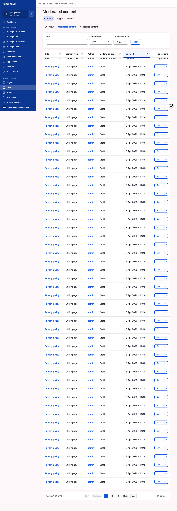

Publishing completes the consumer-facing metadata, sets the visibility scope, and moves the moderation state from Draft to Published so the API appears in the storefront. Use it once a gateway-imported API is content-complete and ready for consumers to find.

## Configure

1. From the sidebar, open **API MANAGEMENT > Manage APIs**, find the Draft API, and click **Edit**.
2. Complete the **Overview** (three to five sentences for the catalog tile) and the **Documentation** long-form page. Set each **Text format** to Markdown when pasting Markdown.
3. Upload a square **Logo** (PNG, JPG, or SVG up to 5 MB; 256x256 or larger).
4. Set **Domain** categories and comma-separated **API Tags** to drive the catalog filters.
5. In the **Visibility** radio group, pick the scope: **Org Level** (your organisation only, with an optional Teams picker), **Internal** (any signed-in user), or **Public** (anonymous visitors, after a content review).
6. In the right-rail **Moderation** panel, set **Change to** to **Published**, and type an optional **Revision log message**.
7. To launch later instead, expand **Publishing options**, set the **Publish on** date and time, set **Publish state** to **Published**, and leave Moderation at **Draft**. The cron flips the state when the schedule fires.
8. Click **Save**.
9. Open an incognito window, go to `<your-portal-domain>/api-discovery`, and confirm the tile renders with the title, logo, and Overview snippet for an anonymous visitor.


**Result:** The Status column reads **Published** and the API renders in the storefront for the audience the Visibility scope allows.
**Tip:** If the tile does not appear, check that Visibility is Public, the state is Published, and the catalog cache has refreshed (within about one minute).
