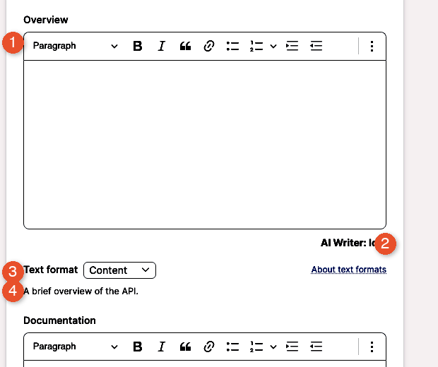
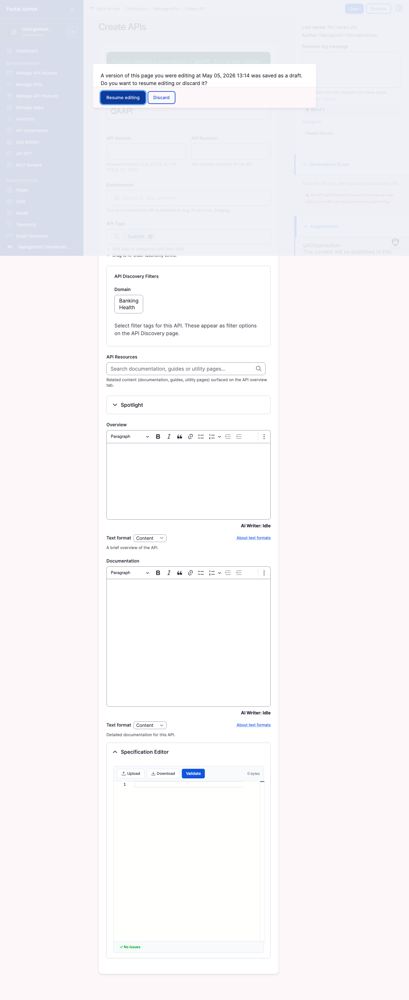
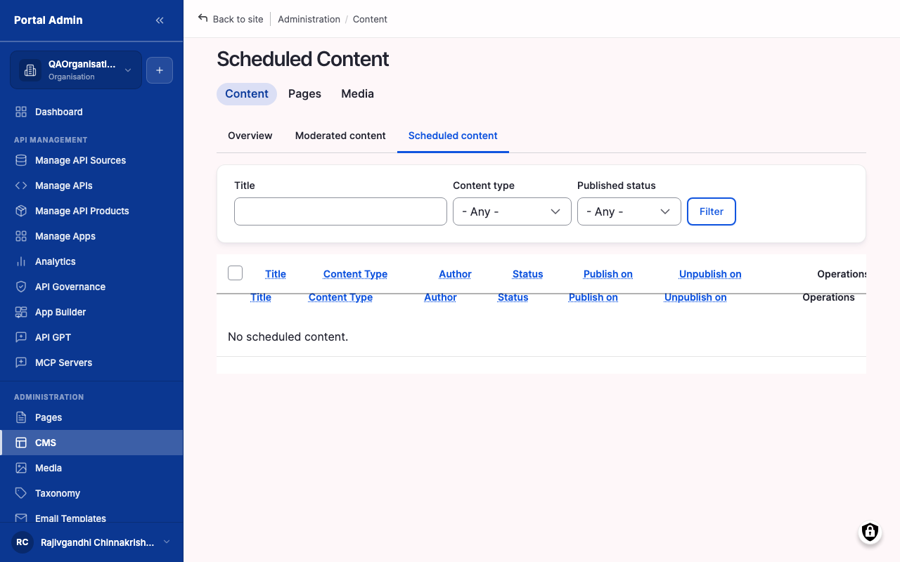

Publishing is the moment an API crosses from a private admin node into a discoverable storefront entry. A gateway-imported API arrives with only an OpenAPI title and a version number; publishing completes the consumer-facing metadata, sets the visibility scope, and moves the moderation state from Draft to Published so the tile renders on the catalog. Use it once the API is content-complete, its governance score meets your bar, and you are ready for consumers to find it.

Publishing alone makes an API discoverable, not subscribable. Subscriptions, quotas, and rate limits live on API Products, so a typical launch pairs this flow with [API Products & Plans](feat-products-and-plans.md). Allow around 30 minutes for a first publish including content review; later publishes settle into a five-minute loop once your metadata template is set.

## What you see

The edit form opens pre-populated with the imported values. The body groups the consumer-facing metadata into fieldsets, top to bottom: **Overview** (the tile blurb and Overview tab), **Documentation** (the long-form Documentation tab), **Logo** (cropped to a 64x64 thumbnail), **Domain** and **API Tags** (the discovery taxonomy behind the left-rail grouping and filter chips), and **API Resources** and **Spotlight** (related-content links and an optional landing-page feature window).

The right rail groups the publish controls into panels: a **Moderation panel** (the current state and the **Change to** control that takes the API live), a **Visibility panel** (three audience radios plus an optional Teams picker), a **Revision log message** field stored with each revision, a **Publishing options panel** for a future go-live, and a **URL alias panel** that auto-generates the public URL from the title.

## Field reference

The form is long. These are the fields that participate in a publish.

| Field | Type (required) | What to enter |
|---|---|---|
| **Overview body** | rich text (recommended) | Three to five sentences for the catalog tile blurb and the Overview tab. The tile strips formatting; the detail page renders it. |
| **Text format (Overview)** | select (required) | Content (plain rich text), Markdown (raw Markdown paste), or Email (editorial templates). Defaults to Content. |
| **Documentation body** | rich text (recommended) | Long-form authentication, base URL, key endpoints, rate limits, changelog, and one runnable example. Headings, code blocks, lists, and links all render. |
| **Text format (Documentation)** | select (required) | Same options as Overview, set independently. |
| **Logo** | image upload (optional) | PNG, JPG, or SVG up to 5 MB; square at 256x256 or larger so it stays legible cropped to 64x64. |
| **Domain** | multi-select (recommended) | One or more business categories (for example Banking, Health) that drive the catalog left-rail grouping. Configured by your portal admin; treat it as required for discovery. |
| **API Tags** | comma-separated text (recommended) | Discovery keywords that power the filter chips, for example `accounts, payments, kyc`. Press Enter or comma to confirm each tag. |
| **API Resources** | autocomplete (optional) | Related guides, articles, or utility pages; each renders as a card on the detail page. |
| **Spotlight enable** | checkbox (optional) | Off by default. On features the API on the landing page during a launch window. |
| **Spotlight from / to** | date-time (conditional) | Required when Spotlight is enabled; sets the feature window bounds. |
| **Visibility scope** | radio (required) | Org Level, Internal, or Public (see Visibility scopes below). |
| **Teams** | multi-select (optional) | Only meaningful when Visibility is Org Level; narrows the audience to named teams. |
| **Change to** | select (required) | Target moderation state: Draft, Needs Review, Published, or Archived. Not every workflow exposes all four. |
| **Revision log message** | text (optional) | Free-text label stored with the revision, for example *Initial publish, v1.0*. |
| **Publish on date / time** | date and time (optional) | A future moment for a scheduled publish; uses the portal timezone, not your browser's. |
| **Publish state** | select (optional) | Target state for the scheduled transition, almost always Published. |
| **URL alias** | text (optional) | Auto-generated from the title; override when preserving incoming links from a previous catalog. |

## Visibility scopes

Visibility decides which audience the marketplace renders the tile for. You can change it at any time, but each change has consequences for existing subscribers, so set it deliberately.

- **Org Level**: narrowest scope. The tile renders only for members of your organisation and never appears on the public catalog. Selecting it activates the **Teams** picker; choose one or more teams to narrow further, or leave teams unselected to reach every member of the organisation.
- **Internal**: mid scope. The tile renders for any signed-in account regardless of organisation. Use it for partner programs that require login but no public marketing.
- **Public**: widest scope. The tile renders on the discovery page to anonymous visitors and is eligible for sitemap indexing. Reserve it for content-reviewed production APIs.


**Caution:** Narrowing visibility on a live API (Public to Internal, or Internal to Org Level) hides the tile from new visitors but does not revoke existing subscriptions. Consumers who subscribed while the API was Public keep calling it and still see it on their app dashboard. To stop calls, revoke their subscription separately; see [Subscriptions](feat-subscriptions.md).


## Moderation states

The **Change to** control moves the API through its workflow:

- **Draft**: hides the tile from consumers. Imported APIs land here by default.
- **Published**: renders the tile for the audience the visibility scope allows.
- **Needs Review**: an optional intermediate state in some workflows, for an editor or approver to sign off before publishing.
- **Archived**: a permanent retirement. The node and its revision history are preserved and remain queryable from the admin surface, but the API will not return to the catalog.

## Complete the metadata

1. From the sidebar, expand **API MANAGEMENT**, then click **Manage APIs**. Find the Draft API using the **Title** search or the **API Source** and **Domain** filters, and click **Edit**.
2. Confirm the **Status** column reads **Draft** before you start; editing a Published row propagates changes to consumers immediately.
3. In the **Overview** editor, write three to five sentences: what the API does, what it returns, and who it is for. Set **Text format** to Markdown if you are pasting Markdown.
4. In the **Documentation** editor, write or paste the long-form page: authentication, base URL, the three or four most-used endpoints, and one runnable `curl` example. Set its **Text format** independently.
5. Upload a square **Logo** that stays legible at 64x64. Wait for the thumbnail preview before moving on.
6. Set the **Domain** categories and the comma-separated **API Tags** that consumers will filter on. Add **API Resources** links if related guides exist.
7. Leave the **Spotlight** panel collapsed for a routine publish, or expand it and set a from/to window to feature the API during a launch.


**Tip:** Paste your project README straight into Documentation with **Text format** set to Markdown. The editor preserves headings, lists, and fenced code blocks, sparing you a manual rewrite.



**Caution:** Editing the **Title** breaks the matching key for connection-sourced re-imports. After a title change, the next gateway re-import creates a duplicate row instead of updating this one. Plan title edits deliberately.


## Move from Draft to Published

1. With the metadata complete, scroll to the right-rail **Moderation** panel and confirm the current state reads **Draft**.
2. In the **Visibility** radio group, pick the audience scope. If you choose **Org Level**, optionally select one or more **Teams** to narrow further.
3. In the **Change to** control, select **Published**.
4. Type an optional **Revision log message**, for example *Initial publish, v1.0*. It is stored with the revision timestamp and author.
5. Click **Save**. The form redirects to the API detail page, and the **Status** column on Manage APIs reflects the new state on the next render.

To publish a batch after a large import: on **Manage APIs**, tick the rows to include, pick **Publish selected** from the **Actions** dropdown, click **Apply**, and confirm the dialog.


**Note:** Publishing makes the API discoverable, not subscribable. Wrap it in an API Product to expose a Subscribe button; see [API Products & Plans](feat-products-and-plans.md).



**Caution:** Bulk actions act only on the visible page. If your selection spans pagination, raise the per-page size to 100 first, or run the action one page at a time.


## Schedule a publish for later

Some launches need to land at a fixed moment: a Monday go-live, a coordinated press release, the start of a maintenance window. The schedule writes a queued transition that the marketplace cron flips when the moment arrives.

1. On the edit form, expand the **Publishing options** panel in the right rail.
2. Set the **Publish on** date and time. The fields use the portal's configured timezone, not your browser's.
3. Set **Publish state** to **Published**.
4. Leave the **Moderation state** at **Draft**. The schedule does the transition; setting it Published now defeats the purpose.
5. Type an optional **Revision log message** describing the planned launch.
6. Click **Save**. The row keeps reading Draft until the scheduled moment, then flips to Published on the next cron cycle.

To cancel a queued publish: from the sidebar, open **Content**, click the **Scheduled** tab, find the row, and click **Cancel**. The transition is removed and the API stays in its current state.


**Caution:** The schedule fires only when marketplace cron is running. If the scheduled time passes and the API is still Draft, ask your portal administrator to check cron health before retrying manually.



**Tip:** Pair a scheduled publish with a matching **Spotlight** window. Setting both to the same moment makes the API the landing-page feature for the launch with no further admin action.


## Unpublish or version a live API

Publication is reversible, and the form supports a clean versioning workflow.

To unpublish: open the edit form, set **Change to** to **Draft** (or **Archived** for permanent retirement), type a **Revision log message** recording the reason, and click **Save**.

To ship a new version without breaking subscribers: open the row action menu on **Manage APIs**, pick **Duplicate**, edit the duplicate's **Title** and **API Version**, paste the new spec and validate it, walk the same metadata flow, and publish the duplicate. Both versions then live in the catalog: existing subscribers keep calling the previous version while new subscribers find the new one.


**Caution:** Unpublishing hides the discovery tile but does not stop existing subscribers from calling the gateway. The marketplace hides the surface; the gateway still routes traffic. Coordinate with the gateway team to rate-limit or block at the gateway tier if you need calls to stop immediately.



**Tip:** Versioning via **Duplicate** is the safest path because it preserves the previous version's node identity, revision history, and subscriber list. Editing the spec in place on a live version risks breaking production calls.


## Verify

- Confirm the **Status** column on Manage APIs reads **Published** for the API.
- Open an incognito window, go to `<your-portal-domain>/api-discovery`, and confirm the tile renders with the title, logo, and Overview snippet for an anonymous visitor.
- Click each Domain and Tag filter chip and confirm the API surfaces under the expected category.
- Click the tile and confirm the detail page renders the Overview, Documentation, and API Specification tabs, plus a Subscribe button if the API is wrapped in a Product.
- For a scheduled publish, confirm the row stays Draft until the scheduled time, then flips to Published on the next cron cycle.
- Confirm the revision history lists your latest entry with the revision log message you typed.


**Note:** If the tile is not visible, the most common causes in order are: Visibility set to Internal or Org Level instead of Public; moderation state still Draft; the catalog cache not yet refreshed (usually within a minute); or an active filter chip on the discovery page matching the tile out.


## Related

- [API Products & Plans](feat-products-and-plans.md) wraps a published API in a Product so consumers can subscribe through a Plan with quota and rate limits.
- [Subscriptions](feat-subscriptions.md) approves the first subscription and covers the revoke flow referenced above.
- [API governance](feat-api-governance.md) re-checks the score after each publish; upstream rule changes can produce new findings on already-published APIs.
- [Provider analytics](feat-provider-analytics.md) monitors latency, errors, and quota consumption once consumers begin calling.
- [Content & pages](feat-content-and-pages.md) covers the Content moderation list and the Scheduled view in their own right.


**Result:** The Status column reads **Published**, the API renders in the storefront for the audience the visibility scope allows, and the publish is verified from an anonymous session.
