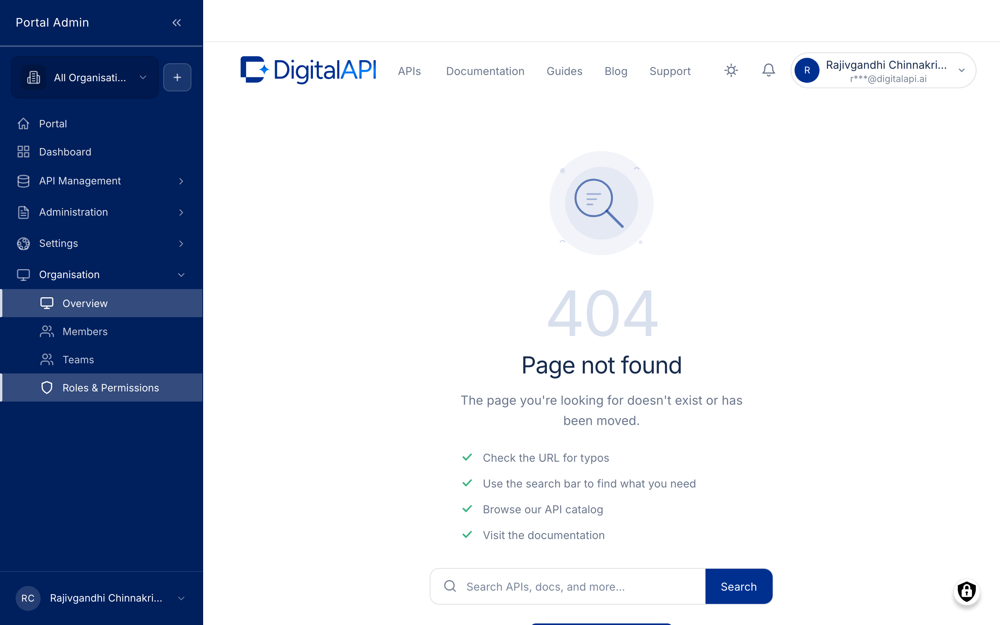

A role bundles permissions: which menu items appear, which buttons are enabled, and which records a member can edit. The marketplace ships with four built-in roles that cover most needs, plus a custom-role builder for the rare case where one of them is too wide or too narrow for a colleague's job. Roles are assigned on the Members surface and reviewed here on the Custom Roles list.

## What you configure

The Custom Roles list shows every role available in your Organisation, built-in and custom, with the member count holding each. The Add role form is where you build a new one. The fields you fill in are:

- **Role name.** Required, max 100 characters, unique within the Organisation. The display name shown in dropdowns and audit entries.
- **Description.** Optional, max 255 characters. A one-line summary shown on the Custom Roles list, such as "Approves subscription requests for the Payments team. Cannot edit APIs or governance."
- **Base role.** Optional dropdown. Picking a base role pre-ticks every permission that role holds, so you start from "API Provider plus one extra" rather than an empty grid, then add or remove individual checkboxes.
- **Permission grid.** Required, grouped by surface. Each surface (APIs, Products, Subscriptions, Members, Teams, Roles, Settings, Analytics) offers a view, edit, create, delete, and approve checkbox where applicable. Tick only the permissions the role needs.
- **Role(s) on a member.** A multi-select on the member edit form that assigns one or more roles. Roles stack: the member's effective permission set is the union of every role they hold.

## Configure

1. Expand the **ORGANISATION** group in the sidebar, then click **Custom Roles** to open the **Custom Roles** list.
2. Click **Add role**.
3. Enter a short, unique **Role name** and a one-line **Description**.
4. Optional. Pick a **Base role** to pre-tick its permissions, then adjust.
5. Tick the permissions the role needs in the grouped grid.
6. Click **Save**. The role returns to the list with **Source = Custom**.
7. To assign it, open **Members**, click **Edit** on a member's row, pick the role in the **Role(s)** multi-select, then **Save**. The member picks it up on their next sign-in.

## Verify

- The new role appears in the **Custom Roles** list with the correct name and **Source = Custom**.
- Open its permission editor and confirm the ticked checkboxes match your intent.
- Assign it to a sandbox member, sign in as them, and confirm the menu items, buttons, and records align with your design.

## Options

Built-in roles cannot be renamed or deleted; their permission set is view-only. Reach for a custom role only when a built-in one does not fit.

- **API Provider.** Imports APIs, runs governance, designs Products and plans, approves subscriptions, monitors analytics. Scoped to one Organisation.
- **Org Admin.** Everything an API Provider can do, plus invite members, change roles, define custom roles, configure single sign-on, and brand the storefront.
- **API Consumer.** Browses the catalog, subscribes to plans, manages personal Apps and API keys, views own usage. No admin-side access.
- **Portal Admin.** Cross-Organisation administrator for the platform team running the marketplace. Out of scope for most teams.


**Caution:** A permission ticked by mistake takes effect for every member holding the role on their next request. Review the grid before saving.



**Tip:** Test a new role against a sandbox member account before assigning it to a real colleague.



**Result:** The role is available on the Members edit form and the invite form, and every member you assign it to gains exactly the permissions you ticked.
