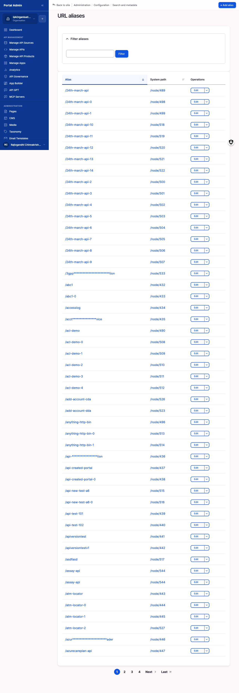
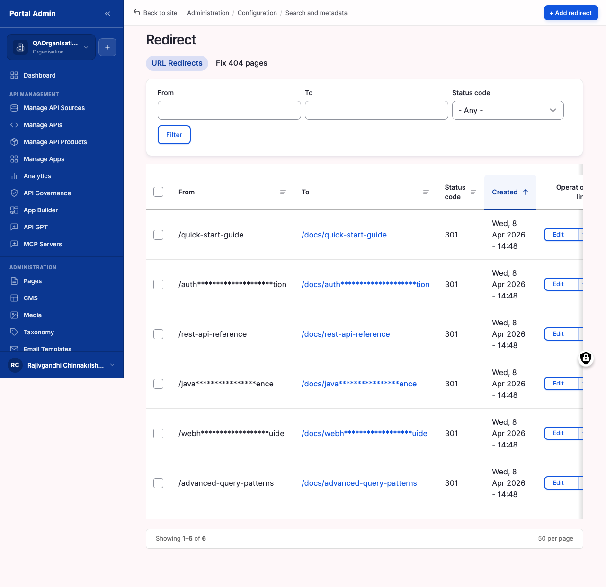

URL aliases and redirects control how storefront content is found by URL. Aliases map machine paths like `/node/688` to readable paths like `/api/payment-service`. Redirects forward old paths to new ones so links from emails, search engines, or external sites keep working when content moves or is renamed. Both surfaces live under **Configuration** > **Search and metadata**.

## What you configure

Two related surfaces, each with a short set of fields:

- **Alias**: the readable public path consumers see in their address bar, such as `/api/payment-service`. This is the field you edit.
- **System path**: the internal path the alias resolves to, such as `/node/688`. Read-only. Change the alias, not this column.
- **Filter aliases**: a free-text filter that scopes the alias list to rows whose public path or system path contains your text.
- **From**: on a redirect, the old path the marketplace receives a request for, such as `/old-payments-api`.
- **To**: on a redirect, the destination the request forwards to. Internal paths and external URLs both work.
- **Status code**: the HTTP status returned to the client. `301 (Moved Permanently)` for renamed content, `302 (Found)` for temporary moves.

## Configure

1. From the left sidebar, expand **Configuration**, then **Search and metadata**, and click **URL aliases**.
2. Use **Filter aliases** to find an alias by its public path or by the system path it points at.
3. Click **Edit** in the row's **Operations** column, update the **Alias** field to the new public path, and click **Save**.
4. To forward an old path, return to **Search and metadata** and click **Redirect**.
5. Click **+ Add redirect**, then enter the old path in **From** and the new path or external URL in **To**.
6. Choose a **Status code**: `301 (Moved Permanently)` for renamed content, `302 (Found)` for temporary moves.
7. Click **Save**.

## Fix 404 pages

The **Fix 404 pages** tab next to **URL Redirects** records every request that returned a 404, with a hit count. Skim it weekly to catch broken inbound links from search engines, social posts, or external blogs before they hurt discovery. Sort by count to surface the highest-impact misses, click **Add redirect** on a row to pre-fill the **From** field, set the **To** path and status code, and save. Trace the referrer first to confirm the right destination, then point each redirect straight at the final target so requests resolve in one hop.

## Verify

- Open the **From** path in a private browser window and confirm the browser lands on the **To** destination.
- Confirm the response status matches the code you picked, `301` or `302`.
- Confirm there is no chain. The redirect lands on the final destination in one hop, not on another redirect.
- After editing an alias, open the new public path and confirm the page renders at the clean URL.


**Note:** A long redirect chain (A to B to C) slows the request and confuses search-engine indexers. Always point a path at its final destination.
**Result:** Consumers reach content at the clean alias, and any request to a retired path forwards to its replacement.
