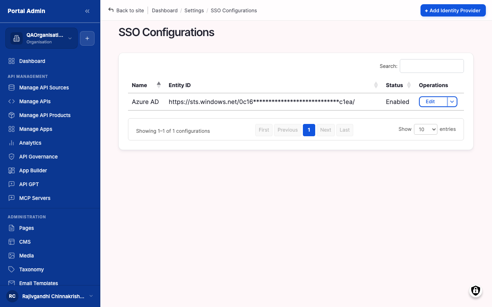

Federate the marketplace against a corporate identity provider so members sign in with their existing credentials. Use it when the security team requires every user to authenticate through Okta, Azure AD, Ping, ADFS, or Auth0. Email-and-password sign-in stays available alongside SAML as a break-glass fallback, so it stacks on top of the default login rather than replacing it.

## What you configure

Register one identity provider per IdP. The marketplace needs the IdP's metadata, endpoints, signing certificate, and a mapping from its claims to marketplace accounts.

- **Identity Provider Name**: a label shown on the sign-in button and in the SSO Configurations list, for example *Okta Production*. Distinguishes IdPs when more than one is registered.
- **Entity ID**: the unique identifier the IdP advertises, copied verbatim from its metadata. Mismatches here are the most common cause of SAML failures.
- **IdP Metadata URL or XML**: paste the live metadata endpoint (preferred, since it picks up certificate rotations automatically) or upload the exported XML file. One of the two is required.
- **Single Sign-On / Single Logout Service URL**: the IdP endpoints the marketplace redirects to for sign-in and federated logout. The SSO URL is required; the logout URL is optional.
- **X.509 Certificate**: the IdP's signing certificate in PEM form, including the `-----BEGIN CERTIFICATE-----` and `-----END CERTIFICATE-----` lines. Every SAML response is verified against it.
- **Attribute Mapping**: which IdP claim carries email (required), first name, last name, and optionally a role or group claim. Defaults match Okta and Azure AD.
- **Default Role on First Sign-In**: the role new federated users land on until an Org Admin promotes them. API Consumer is the safest default.
- **Just-in-Time Provisioning**: on to auto-create accounts on first sign-in; off to require pre-provisioning by an Org Admin. A **Force SSO for Organisation** toggle disables email-and-password sign-in for a chosen organisation.

## Configure

1. From the left sidebar, expand **SETTINGS** and click **SSO Configurations**.
2. Click **Add IdP** to open the form, then enter a recognisable label in **Identity Provider Name**.
3. Enter the **Entity ID** issued by the IdP, copied verbatim from its metadata.
4. Paste the IdP's metadata endpoint into **IdP Metadata URL**, or upload the XML in **IdP Metadata XML**.
5. Enter the **Single Sign-On Service URL**, and the **Single Logout Service URL** if the IdP supports it.
6. Paste the signing certificate into **X.509 Certificate**, full PEM block included.
7. Map the IdP claims in **Attribute Mapping**: email, first name, last name, and optionally role or group.
8. Set **Default Role on First Sign-In**, then decide whether to tick **Just-in-Time Provisioning**.
9. Click **Save**.

## Verify

- Confirm the new IdP appears in **SSO Configurations** with status **Active**.
- Confirm the marketplace's Service Provider metadata at `/saml/sp/metadata` is reachable and matches what the IdP team registered.
- In a private browser window, click the SSO button, sign in as a test user, and confirm they land on the dashboard with the expected email, name, and role.
- Repeat for one user in each mapped group to catch attribute-mapping mistakes that affect only some users.


**Caution:** SAML changes take effect immediately. Test the round-trip in a non-production environment and keep one local-password Portal Admin account active as the break-glass route before enabling Force SSO.
**Result:** Members who click the SSO button are redirected to the IdP and land back on the marketplace under the mapped role.


The marketplace exposes its Service Provider metadata at `/saml/sp/metadata` once SAML is enabled. Hand that URL to the IdP team so they register the marketplace as a Service Provider. When rotating a certificate, paste the new value into the existing IdP entry rather than creating a parallel one; two IdPs with the same Entity ID confuse the response handler. To retire an IdP, edit it and untick **Enabled** to hide its button, or **Delete** it to remove the entry entirely.