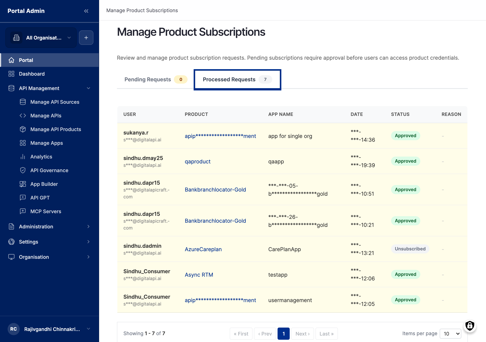

Once your API Product is published, the next event in the marketplace is a subscription request. A consumer signs in, locates your Product, registers an app, and clicks **Subscribe**. From that moment a row appears in your queue and a clock starts ticking on your end. This is your daily triage surface: where pending requests land, how you inspect each one, and how you move a subscription through Pending, Active, Suspended, and Revoked. It pairs with [Consumer apps & credentials](feat-apps-and-credentials.md), where you inspect the app before you approve.


**Note:** Two list views show subscriptions: **Manage API Subscriptions** at `/admin/portal/subscriptions` (per-API rows) and **Manage Product Subscriptions** at `/admin/portal/product-subscriptions` (per-Product rows). Use the Product view as the default. The API view is only useful when a consumer subscribed to an API outside any Product, which is rare for marketplaces that lead with Products.


## The subscription lifecycle

A subscription occupies exactly one of four states at any time. The marketplace exposes the state machine in three places: the **Status** column on the queue, the **Status** pill on the subscription detail page, and the audit log entry attached to every transition.

- **Pending**: the consumer has clicked **Subscribe**. The marketplace has recorded the intent and added the row to your queue. No API key is registered on the gateway and no calls succeed.
- **Active**: you have approved the request. The marketplace registers a key on the gateway, notifies the consumer, and the gateway accepts calls authenticated with that key. Quota and rate-limit counters apply.
- **Suspended**: you have paused the subscription. The key and the call history are preserved, the gateway returns `401` for any call authenticated with the key, and quota counters freeze where they are.
- **Revoked**: you have ended the subscription. The marketplace destroys the key on the gateway and the row stays on the queue for audit. To resume, the consumer must re-subscribe and you must re-approve.

Five transitions move a subscription between states, and you (API Provider or Portal Admin) trigger every one:

1. **Pending to Active**, by clicking **Approve**. The marketplace provisions the key on the gateway, sets state to *Active*, and queues a notification email.
2. **Pending to Revoked**, by clicking **Reject Subscription**. The marketplace records the rejection reason, sends a rejection email, and the row settles into *Revoked*.
3. **Active to Suspended**, by clicking **Suspend**. The gateway begins rejecting calls authenticated by the key.
4. **Suspended to Active**, by clicking **Reactivate**. The gateway resumes accepting calls without any change to the key.
5. **Active or Suspended to Revoked**, by clicking **Revoke Access**. The gateway destroys the key. The row stays for audit; the relationship is final.


**Caution:** The marketplace does not auto-expire pending requests. A request sitting in *Pending* for six months is still actionable, and the consumer sees the same "Pending" badge the whole time. Build a regular review cadence so consumers do not lose interest while waiting.


## What you see

The queue opens at `/admin/portal/product-subscriptions` showing every subscription regardless of state, sorted by request timestamp descending, 25 rows per page. The queue is a flat list; the marketplace does not enforce an approval policy for you, so triage cadence is on you. Read the columns left to right:

- **App**: the consumer-side app the subscription belongs to. Click the name to open its detail page in Manage Apps, where the credentials and registering user are visible.
- **Consumer**: the marketplace user who registered the app. Click to open their profile, organisation, and contact email.
- **Product**: the API Product the subscription is against. Click to jump to the Product detail in Manage API Products.
- **Plan**: the plan tier on the Product. Most Products ship a single plan, in which case the value matches the Product name.
- **Status**: *Pending*, *Active*, *Suspended*, or *Revoked*. The set of available actions on the row depends on this value.
- **Created**: timestamp of the original request, in the portal's configured timezone.
- **Actions**: a per-row dropdown carrying **Approve**, **Reject Subscription**, **Suspend**, **Reactivate**, and **Revoke Access**. The visible entries depend on the current Status.

Three filters sit above the table: **Status**, **Product**, and **App** (a partial, case-insensitive search box). Each filter is recorded as a URL parameter (`?status=pending&product=42`), so a filtered view can be bookmarked or shared, and pagination preserves filter state. A **Reset** link clears them.

The **Actions** dialogs carry two text fields depending on the action. The **Notes** field on Approve and Reactivate is optional and surfaces in the consumer's notification email. The **Reason** field on Reject, Suspend, and Revoke is written to both the consumer's email and the audit log.

## Triage the pending queue

Use this as your first stop each working day, and any time you receive a subscription notification email.

1. Expand **API MANAGEMENT** in the sidebar, then click **Manage Product Subscriptions**.
2. Apply the **Status** filter set to *Pending* so only actionable rows remain.
3. Sort by **Created** ascending so the oldest request rises to the top.
4. For each row, click the **App** name to open the consumer's app detail page in a new tab. Read the registering user, the app description, the requested Product, and the request timestamp.
5. Decide whether the request fits your policy: approve now, approve after a check, reject, or hold for clarification.
6. Return to the queue and act via the **Actions** menu, or leave a borderline row in *Pending* and email the consumer directly for context.


**Tip:** Bookmark the URL for `?status=pending` and pin it. The morning queue review then takes one click rather than two clicks and a dropdown.


## Approve a subscription

Use this to grant access after queue triage and app inspection have both passed. Confirm the consumer's identity matches your records and the gateway has capacity, since the marketplace registers each key synchronously against the gateway.

1. From the queue, filter to *Pending* and locate the row to approve.
2. Open the **Actions** menu and click **Approve**. A confirmation dialog opens.
3. Read the dialog summary: the consumer's app name, the Product, the plan, and the requested quota.
4. Optionally fill the **Notes** field with text the consumer should see in the notification email. Two to three sentences is the right length.
5. Click **Confirm**. The dialog closes, the row's Status flips to *Active*, and a confirmation toast appears.
6. Behind the scenes the marketplace provisions the API key on the gateway, registers it against the consumer's app, and queues the notification email. The sequence typically completes in under fifteen seconds.

Once you act on a request it leaves the pending list and lands on the **Processed Requests** view, which keeps every approval (*Active*) and rejection (*Revoked*) with the disposition you assigned, the originating app and consumer carried over, and the actions that remain available (such as **Suspend** or **Revoke Access** on an approved row).


**Note:** The full API key is shown to the consumer on their My Apps page on the portal. Providers see only the prefix in the credentials table; the marketplace deliberately never echoes the full value back to the issuing surface.



**Tip:** If your plan has a long quota period, for example monthly, approve early in the period so the consumer receives a full month of calls. Approving three days before a quota renewal looks ungenerous.


## Reject a pending subscription

Use this when the request fails your policy and you do not intend to onboard the consumer. The rejection reason is sent verbatim to the consumer's email and stored in the audit log, so write it as if the consumer's procurement team will read it.

1. From the queue, filter to *Pending* and locate the row.
2. Open the **Actions** menu and click **Reject Subscription**. A dialog opens with a **Reason** text area.
3. Fill the **Reason** with one to three actionable sentences. "Insufficient procurement detail. Re-subscribe once your procurement contact has confirmed the contract reference." is a better rejection than "Rejected."
4. Click **Confirm**. The row's Status moves to *Revoked* and the consumer receives a notification email containing the Reason text.
5. The row remains under the *Revoked* filter for audit; you can reopen it to read the Reason later.


**Caution:** Reject Subscription is only available on rows currently in *Pending*, and rejection is final for the row. If the consumer later supplies the missing detail, they must subscribe again from scratch; you cannot reanimate a Revoked row. To end an *Active* or *Suspended* subscription, use **Revoke Access** instead.


## Suspend and reactivate

Use suspend when the consumer is in arrears, repeatedly violating the rate limit, or otherwise needs their traffic paused while an issue is resolved. Suspension is reversible and preserves the key and call history. Warn the consumer at least one working day ahead; suspending without notice generates support tickets within minutes.

1. From the queue, locate the row for the active subscription.
2. Open the **Actions** menu and click **Suspend**. A dialog opens.
3. Fill the **Reason**, for example *Payment overdue, pending resolution by 2026-06-15* or *Rate-limit violation, pending review*.
4. Click **Confirm**. The row's Status moves to *Suspended* and the gateway begins returning `401` for calls authenticated by the key.

To reactivate once the issue is resolved, filter to *Suspended*, open the **Actions** menu, click **Reactivate**, optionally add **Notes**, and **Confirm**. The Status returns to *Active* and the gateway resumes accepting calls on the same key.


**Note:** Suspension does not credit unused quota and reactivation does not issue a new key. When the subscription returns to *Active*, the quota counter resumes from where it stopped, and the consumer continues to use the credential they already held. No re-deployment is required on the consumer side.


## Revoke a subscription

Use this when the relationship is over and the consumer should no longer be able to call the API. Revocation is final at the row level. Notify the consumer ahead of time and capture a clear reason; the reason is the explanation the consumer's procurement team will see months later.

1. From the queue, locate the row for the active or suspended subscription.
2. Open the **Actions** menu and click **Revoke Access**. A dialog opens with a **Reason** text area.
3. Fill the **Reason** with one to three specific sentences. "Contract end-date reached. Re-subscribe under the new contract reference if the relationship is renewed." is a better reason than "End of contract."
4. Click **Confirm**. The row's Status moves to *Revoked*, the gateway destroys the key, and the consumer receives a notification email.


**Caution:** Revocation destroys the API key on the gateway and cannot be undone. In-flight calls at the exact moment of revoke may complete; every new call returns `401`. Use **Suspend** if there is any chance of resumption.



**Note:** A revoked subscription does not free quota already counted in the current period. Quota counters are bound to the subscription instance; once revoked, its counters are sealed in the audit record.


## Confirm the consumer's first calls

The fastest signal that approval worked is the consumer's first call, which typically appears within minutes. Click into the subscription row to open the detail page, which shows the call count for the current period, the all-time count, the **Last call** timestamp, and a recent-responses panel listing the most recent HTTP status codes.

- Response codes of `2xx` mean the integration is live and healthy.
- `401` or `403` mean the consumer's key is not being sent correctly; ask them to check the header name and value.
- `5xx` means the API itself is failing; check the gateway logs and your upstream service before assuming the consumer is at fault.


**Note:** Call counts roll up from the gateway on a poll interval typically between one and five minutes. A zero count immediately after approval is normal. Cross-reference the aggregate view at Provider Analytics (`/admin/portal/analytics`) filtered to the same app; the numbers should match within the poll interval.


## Verify

- Confirm the queue row's Status changes (Pending to Active, Suspended, or Revoked) without a page-reload error.
- Open the app's **Credentials** tab after an approval and confirm a new key row sits at the top with the current timestamp.
- Ask the consumer to retry a call: an approved key returns `2xx`; a suspended or revoked key returns `401`.
- Open the **Audit** tab on the subscription detail page and confirm the actor, the state change, and the **Reason** text were recorded.

## Related

- [Consumer apps & credentials](feat-apps-and-credentials.md): inspect the app and rotate its issued key.
- [API Products & Plans](feat-products-and-plans.md): publish the Product that consumers subscribe to.
- [Publishing APIs](feat-publishing-apis.md): publish the underlying APIs before approving subscriptions against them.
- [Provider analytics](feat-provider-analytics.md): read aggregate traffic across all subscriptions.