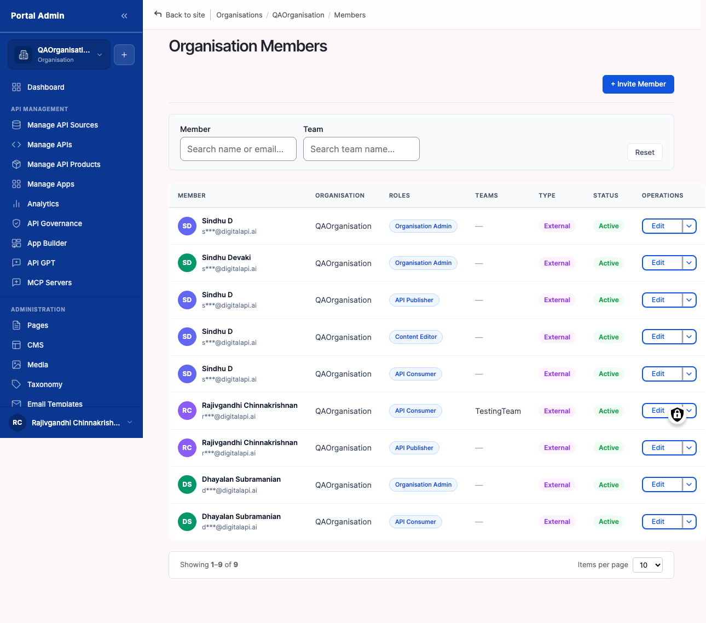

Invite colleagues into your Organisation, set their role on the way in, and group them into Teams that scope which APIs and Products each crew sees. Use this surface to run access for everyone who works in the marketplace on your behalf.

## Configure

1. Expand the **ORGANISATION** group in the sidebar, then click **Members** to open the **Organisation Members** list.
2. Click **Invite member** at the top right.
3. Enter the colleague's work **Email**. The form rejects an address already in this Organisation.
4. Pick a **Role**. The built-in roles appear first, then any custom roles. Choose the smallest role that fits the job.
5. Optional. Pick a team in **Also add to team** so the colleague lands with the right scope on first sign-in.
6. Optional. Add a **Welcome message** (up to 500 characters). It appears in the invitation email.
7. Click **Send invitation**. A Pending row appears in the list.
8. To create a Team, click **Teams** in the ORGANISATION group, click **Add team**, enter a **Name** and one-line **Description**, optionally pick **Initial members**, then **Save**.
9. On the team detail page, click **Add members**, pick Organisation members from the dropdown, and **Save**.


**Result:** The colleague receives an email invite; their row flips from Pending to Active on first sign-in with the role and team you set, and team members see every API and Product scoped to that team.
**Tip:** SAML users do not use the invite form. On first sign-in through your identity provider they land as Active with the default role, ready for you to adjust from the same edit form.


### Key columns

1. **Role(s).** Roles assigned to the member, rendered as comma-separated badges. A member can hold more than one.
2. **Teams.** The teams the member belongs to. Empty until you add them to one.
3. **Status.** Pending (invite sent), Active (accepted and signed in), or Suspended (sign-in blocked, data kept).