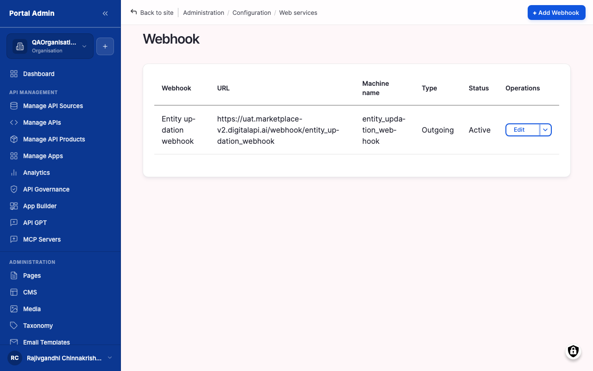
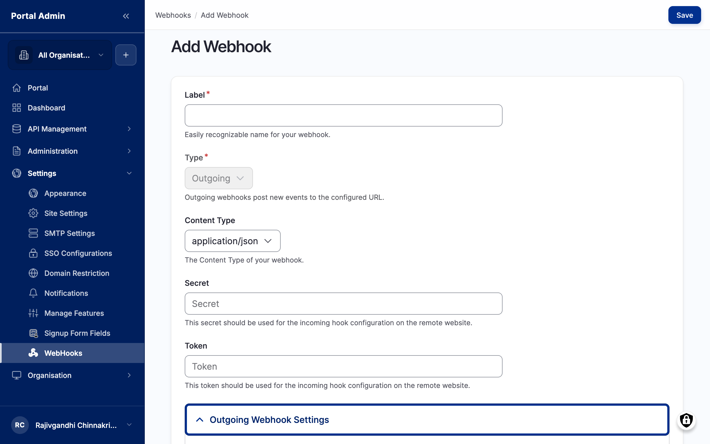

Webhooks are the marketplace's outbound notification channel for systems other than email. When something happens (a subscription is created, an API is published, a governance scan completes), the marketplace POSTs a signed JSON payload to a URL you control. Use webhooks to drive Slack messages, ticketing-system tickets, internal dashboards, or other downstream automations in near-real-time. Every attempt is logged, so you can confirm a delivery landed, inspect the request and response bodies, and retry a failure.

## What you see

The **Webhook** list sits under **SETTINGS** in the left sidebar. Each row is one registered receiver with its name, target URL, status, and last-delivery timestamp. The controls are:

- **Name** column: the internal label you gave the webhook, for example "Slack #api-ops".
- **URL** column: the receiver endpoint the marketplace POSTs to.
- **Status** column: *Active* receivers get every event they subscribe to; *Inactive* receivers are skipped.
- **Add webhook** button: top-right, opens the registration form.
- **Operations** menu: per-row menu to open the **Deliveries** tab, send a test event, edit, or remove the webhook.

## The Add webhook form

A webhook registration ties a receiver URL to the events it cares about and the secret used to sign each payload. The top of the form holds the identity and signing fields; the receiver URL and event subscriptions live in a collapsible **Outgoing Webhook Settings** panel below.

- **Label**: text (required). A recognisable name so you can find the webhook in the list later, for example "Slack #api-ops".
- **Type**: select (required). Set to *Outgoing*. Outgoing webhooks POST new events to the configured URL.
- **Content Type**: select (required). The body format the marketplace sends. Leave it on `application/json` unless the receiver needs another format.
- **Secret**: text (required). A long random string the marketplace uses to sign every payload. The receiver verifies the signature before acting. Treat it like a password and do not reuse it across webhooks.
- **Token**: text (optional). A second value the receiver checks on the incoming hook as an extra factor alongside the signature.
- **Description**: textarea (optional). Free text describing what the receiver does. Useful when other admins audit the list.
- **Headers**: key/value (optional). Extra HTTP headers, for example a static `X-Source: marketplace` tag, appended to every delivery.
- **URL**: URL (required). The receiver endpoint, entered under **Outgoing Webhook Settings**. It must accept JSON, return a 2xx within 10 seconds, and use HTTPS in production.
- **Events**: multi-select (required). The subscriptions, ticked in the same panel. Subscribe only to what the receiver needs.
- **Status**: select (required). *Active* to enable delivery, *Inactive* to register without firing.

### Events you can subscribe to

The events span the platform's main activity. Common picks are:

- **Subscription events**: Subscription Created, Subscription Approved.
- **API events**: API Published.
- **Governance events**: Governance Scan Complete.
- **Product / membership events**: Product changes and Member Invited.

## Register a webhook

1. Expand **SETTINGS** in the sidebar, then click **Webhook**.
2. Click **Add webhook** in the top-right.
3. Enter a **Label**, set **Type** to *Outgoing*, and leave **Content Type** on `application/json`.
4. Paste a long random string into **Secret**, and optionally a **Token**.
5. Open **Outgoing Webhook Settings**, enter the receiver **URL** (HTTPS in production), and tick the events to subscribe to.
6. Set **Status** to *Active*.
7. Click **Save**.
8. Open the row's **Operations** menu, click **Send test**, and confirm the receiver returns a `2xx`.


**Note:** A delivery times out after 10 seconds. Have the receiver acknowledge quickly and queue the work asynchronously, or the delivery fails and is retried per the retry policy.


## Send a test delivery

Send a test on every new webhook before relying on it in production. It confirms the receiver is reachable, that the signature header is verified correctly, and that the payload shape matches what the receiver expects.

1. Open **SETTINGS** > **Webhook**.
2. Find the webhook row and open its **Operations** menu.
3. Click **Send test**. The marketplace fires a single POST with a synthetic payload tagged `test: true`.
4. Watch the modal for the response code and elapsed time.
5. Open the **Deliveries** tab to inspect the request and response bodies in full.


**Tip:** Tag synthetic deliveries in your receiver logs by checking the `X-Marketplace-Test` header. That stops a test event from polluting your real downstream metrics.


## Inspect delivery logs

Inspect delivery logs when a downstream system reports it stopped receiving notifications, when you want to confirm a specific event was delivered, or when you want to retry a failure.

1. Expand **SETTINGS** in the sidebar, then click **Webhook**.
2. Click the webhook's name to open its detail view.
3. Open the **Deliveries** tab. Each row is one delivery attempt with the event type, target URL, response code, and timestamp.
4. Click a row to expand the request and response bodies, headers, and any error message.
5. To retry a failed delivery, click **Retry** on that row.

Common response-code patterns:

- **2xx**: delivered successfully. No action needed.
- **3xx**: the receiver redirected. The marketplace does not follow redirects, so update the target URL to the final destination.
- **4xx (other than 401)**: the receiver rejected the payload. Read the response body in the expanded row to see why.
- **401**: the receiver rejected the signature. Confirm the shared secret on both ends matches.
- **5xx**: the receiver errored out. Check the receiver's logs.
- **Timeout**: the receiver did not respond within 10 seconds. Move the work to an async queue on the receiver.


**Caution:** Disabling a webhook does not retry failed deliveries that arrived while it was disabled. Investigate failures, fix the receiver, then re-enable. If the gap matters, replay the missed events from the marketplace audit log once the receiver is healthy.


## Rotate a webhook secret

Rotate a secret on a regular cadence, when a team member with access leaves, or when you suspect the secret has been exposed in a log or screenshot.

1. Generate a new random string in your password manager.
2. Open **SETTINGS** > **Webhook** and click the webhook name.
3. Click **Edit**, paste the new value into the **Secret** field, and click **Save**.
4. Update the receiver to verify against the new secret.
5. Send a test delivery and confirm the receiver returns a `2xx`.


**Note:** The marketplace uses the new secret on the very next outbound delivery. There is no overlap window where both secrets are accepted, so coordinate the rotation with the receiver team.


## Verify

- Confirm the row appears in the **Webhook** list with status *Active*.
- Click **Send test** and confirm the receiver acknowledges the synthetic event with a `2xx`.
- Trigger a real subscribed event and confirm the delivery shows up in the **Deliveries** tab, where each row records the response code and timestamp. Use **Retry** on any failed delivery.


**Tip:** Add a Slack webhook that subscribes to delivery-failure events for every other webhook. You will hear about a broken receiver in team chat before someone asks why their automation stopped.



**Result:** Every subscribed event fires a signed JSON POST to the receiver URL, and each attempt is logged under the webhook's Deliveries tab.


## Related

- [Notifications](feat-notifications.md) deliver the same events to users inside the app rather than to external systems.
- [Email templates](feat-email-templates.md) cover the transactional emails the marketplace sends for the same lifecycle events.
- [Audit log](feat-audit-log.md) is where you replay missed events after a receiver outage.