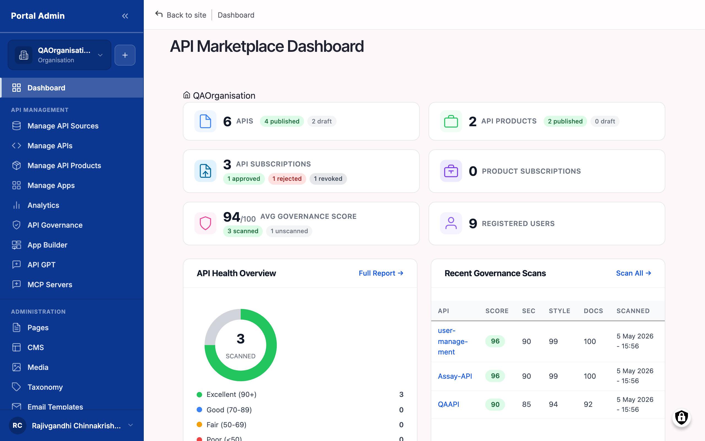

# Getting started

Marketplace is the console you reach at `/admin/...` once you sign in. Ten minutes on this page covers everything you need before the first chapter: sign in, find the dashboard, learn the four sidebar groups, and recognise the UI patterns repeated on every list page.


**Time to complete.** About ten minutes for the steps below, plus another ten if you want to explore the dashboard panels yourself before moving on.



**Already signed in?** Skip to [Your first day in four steps](#your-first-day-in-four-steps) below, or jump straight to [Connecting your first gateway](connecting-your-first-gateway.md) if your Org Admin has already given you sign-in credentials and you want to start working.


## Before you start

You need three things before you can use this guide hands-on.

<table data-view="cards"><thead><tr><th></th><th></th></tr></thead><tbody><tr><td><strong>An invitation</strong></td><td>Your Org Admin has invited you to the marketplace and you have accepted the email. The invitation sets your initial password (or links your SSO identity) and the API Provider or Portal Admin role.</td></tr><tr><td><strong>Your marketplace URL</strong></td><td>The hostname your organisation reaches the console at. This guide writes it as <code>&lt;your-portal-domain&gt;</code> throughout; your production URL is whatever your Org Admin shared with you.</td></tr><tr><td><strong>A supported browser</strong></td><td>A current version of Chrome, Edge, Firefox, or Safari. The console is responsive but is designed for desktop use during day-to-day operation.</td></tr></tbody></table>

## Your first day in four steps

Follow these in order. Each step is short on its own; the goal is to land you on the admin dashboard with the sidebar layout already familiar.



### Sign in to the marketplace

Open `<your-portal-domain>` in a browser and click **Login** in the top-right corner. Enter your email and password, or click your organisation's SSO button. After sign-in, an API Provider lands on `/admin/dashboard`. See [Signing in to the marketplace](#signing-in-to-the-marketplace) below for the full walkthrough.



### Recognise the Portal Admin dashboard

The dashboard summarises every working surface in five tiles: **API Health Overview**, **Recent Governance Scans**, **Gateway Connections**, **Recent Subscriptions**, **Quick Actions**. Each tile is also a shortcut into the deeper screen that owns the data. See [Recognising the dashboard](#recognising-the-dashboard) below.



### Find your way around the sidebar

Every action in this guide starts from one of four left-sidebar groups: **API MANAGEMENT**, **ADMINISTRATION**, **SETTINGS**, **ORGANISATION**. The Sidebar map table below names every entry and the URL it lands on.



### Recognise the common UI patterns

Status badges (Draft, Published, Pending, Suspended), the search-and-filter bar at the top of every list page, the per-row action menu, and the breadcrumb trail at the top of every detail page repeat everywhere. Five minutes on these and the rest of the guide reads as variations on a known shape.




**Result.** You can sign in, recognise the dashboard, find any administrative surface from the sidebar, and read every list page without screen-hunting. You are ready to start [Connecting your first gateway](connecting-your-first-gateway.md).


## Signing in to the marketplace

The marketplace lives at the URL your Org Admin shared (`<your-portal-domain>` in this guide). The unauthenticated landing is the public consumer storefront. Click **Login** in the top-right corner to reach the sign-in form.

#### Before you start

- **Confirm your account has the API Provider or Portal Admin role.** The provider-side sidebar groups are hidden for accounts with only the API Consumer role. If **API MANAGEMENT** is missing from the sidebar after sign-in, your role is wrong; ask your Org Admin to add the Provider role.
- **Identify your marketplace URL.** The guide writes it as `<your-portal-domain>`; your production URL is different. The path conventions (`/admin/dashboard`, `/admin/apim/connections`) are the same.
- **Decide whether to use SSO or a local password.** If your Organisation has SAML configured, the form redirects to your identity provider. Otherwise, sign in with the email and password set when you accepted your invitation.

To sign in:

1. Open `<your-portal-domain>` in a browser. The page is the public storefront.
2. Click **Login** in the top-right corner.
3. Enter your email and password, or click the SSO button.
4. Complete multi-factor authentication if your Organisation has it enabled.
5. After authentication, an API Provider or Portal Admin lands on `/admin/dashboard`. A consumer-only account lands on the consumer dashboard.

> **Result:** You are signed in and viewing the admin dashboard.

> **Tip:** Bookmark `/admin/dashboard` rather than the storefront. As a Provider, it is your most frequent destination.

> **Note:** Sessions expire after the inactivity window your Org Admin sets (eight hours by default). When the session lapses you return to the public landing; sign in again to continue.

## Recognising the dashboard

The page that loads at `/admin/dashboard` is the entry point for every working session. It summarises your APIs, your governance scans, your connected gateways, and your subscription requests. Every panel links to the deeper screen that owns the data.

The numbered callouts in Figure 2-1 are:

1. **API Marketplace Dashboard.** The page heading. The dashboard is recognisable by this title.
2. **API Health Overview.** A tile that summarises APIs by status (Draft, Published) and surfaces any health flags. Click the heading to open Manage APIs.
3. **Recent Governance Scans.** A tile listing the most recent scan runs with their average score. Click a row to open the report; click the heading to open the Reviewing API governance chapter's entry surface.
4. **Gateway Connections.** A tile listing every connected source with status. Click the heading to open Manage API Sources, the entry point for the Connecting your first gateway chapter.
5. **Recent Subscriptions.** A tile showing the latest subscription requests, with Pending rows highlighted. Click any Pending row to jump straight into the approval flow.
6. **Quick Actions.** Shortcut buttons for the most common create flows: Create API, Create API Product, Create Article.

> **Result:** You can read each tile at a glance and click through to the underlying screen.

> **Tip:** Empty tiles on day one are expected. The dashboard fills in as you connect a gateway, import APIs, run scans, and onboard consumers.

> **Note:** The dashboard refreshes on page reload; it does not push live updates. After a change elsewhere, reload to see it on the dashboard.

## Sidebar map

Every action in this guide starts in one of four left-sidebar groups. The table names every entry, the page heading it loads, and the URL it lands on, so you can reach any surface by whichever identifier you have.

| Sidebar group | Sub-entry | Page heading | URL |
|---|---|---|---|
| API MANAGEMENT | Manage APIs | Manage APIs | `/admin/manage-apis` |
| API MANAGEMENT | Manage API Sources | Manage API Sources | `/admin/api-sources` |
| API MANAGEMENT | Manage API Products | Manage API Products | `/admin/manage-api-products` |
| API MANAGEMENT | Governance Reports | Governance Reports | `/admin/api-gov-reports` |
| API MANAGEMENT | API GPT | API GPT | `/admin/api-gpt` |
| API MANAGEMENT | MCP Servers | MCP Servers | `/admin/portal/mcp-servers` |
| ADMINISTRATION | Manage Subscriptions | Manage Subscriptions | `/admin/manage-subscriptions` |
| ADMINISTRATION | Manage Consumers | Manage Consumers | `/admin/manage-consumers` |
| ADMINISTRATION | Manage Apps | Manage Apps | `/admin/manage-apps` |
| ADMINISTRATION | Provider Analytics | Provider Analytics | `/admin/provider-analytics` |
| SETTINGS | Webhooks | Services Webhooks | `/admin/config/services/webhook` |
| SETTINGS | Email Templates | Email Templates | `/admin/config/system/symfony-mailer-lite-transport` |
| SETTINGS | Linting Rules | API Linting | `/admin/config/apim/api-linting` |
| SETTINGS | Search Configuration | Search Path | `/admin/config/search-path` |
| SETTINGS | Domains | Domain Registration | `/admin/config/system/domain` |
| SETTINGS | Branding | Appearance | `/admin/appearance` |
| ORGANISATION | Members | Members | `/admin/organisations/<id>/members` |
| ORGANISATION | Roles | Roles | `/admin/organisations/<id>/roles` |
| ORGANISATION | Teams | Teams | `/admin/organisations/<id>/teams` |
| ORGANISATION | Settings | Organisation Settings | `/admin/config/marketplace/organisation` |


**Three identifiers per surface.** Each row in the table shows the sidebar label, the page heading, and the URL for the same surface. Use whichever you have at hand: a colleague's "go to Manage APIs", a screenshot showing the page heading, or a deep-link URL in a runbook.


## Recognising the common UI patterns

Every list page in the marketplace uses the same controls. Learn them once and every chapter reads faster.

- **Status badges.** Coloured pill labels on every row: **Draft** (grey) and **Published** (green) for catalog content, **Pending** (amber), **Active** (green), **Suspended** (grey), and **Revoked** (red) for subscriptions, **Healthy** (green) and **Error** (red) for gateway connections.
- **Search and filter bar.** A free-text **Search** input plus one or two dropdown filters anchored at the top of every list. The search is title-substring; the dropdowns scope by status, source, visibility, or owner.
- **Sortable columns.** Hover any column header. A sortable header shows an arrow; click to toggle ascending or descending. The default sort is usually **Last updated**, descending.
- **Row action menu.** A three-dot button at the right edge of every row. Opens a menu with the per-row actions (Edit, Delete, Re-run, Duplicate, Suspend, depending on the surface).
- **Bulk-action bar.** A header checkbox selects every row; the bar that appears offers the bulk operations the surface supports.
- **Breadcrumb trail.** Every detail page shows a breadcrumb (e.g. **Manage APIs > Customer Orders API**) at the top. The breadcrumb returns you to the parent list with a click.
- **Right-aligned primary action.** Every list page's primary create action (**+ Create API**, **+ Add Connection**, **+ Invite Member**) sits at the top-right of the page.


**Tip.** When a surface feels unfamiliar, locate the search bar and the row action menu first. Every list page in the marketplace follows this shape; once you find these two, you can predict the rest.


## What to do next

Most providers walk the chapters in order on day one, then return to them as task-oriented reference. Pick a starting point:

<table data-view="cards"><thead><tr><th></th><th></th><th data-hidden data-card-target data-type="content-ref"></th></tr></thead><tbody><tr><td><strong>Connect your first gateway</strong></td><td>Register a Gateway Connection for any supported gateway product, test the credentials, and prepare the catalog for import.</td><td><a href="connecting-your-first-gateway.md">connecting-your-first-gateway.md</a></td></tr><tr><td><strong>Import your first API</strong></td><td>Trigger an automatic import once the connection is in place, or walk the Create APIs wizard to create one by hand.</td><td><a href="importing-your-first-api.md">importing-your-first-api.md</a></td></tr><tr><td><strong>Review API governance</strong></td><td>Open the Governance Report, read the score breakdown, and drill into the violations that matter.</td><td><a href="reviewing-api-governance.md">reviewing-api-governance.md</a></td></tr><tr><td><strong>Configure access and branding</strong></td><td>If your day-zero job is identity and branding rather than the API workflow, jump here for SAML, custom domains, and the storefront theme.</td><td><a href="configuring-access-and-storefront-branding.md">configuring-access-and-storefront-branding.md</a></td></tr></tbody></table>
