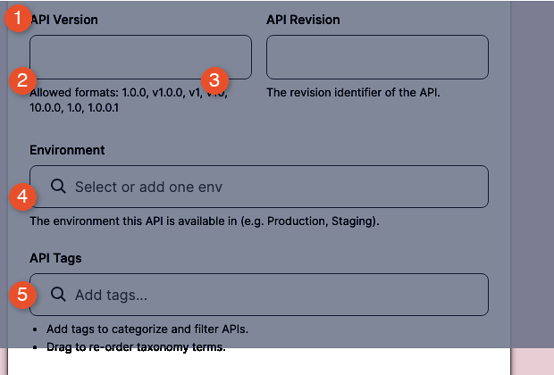
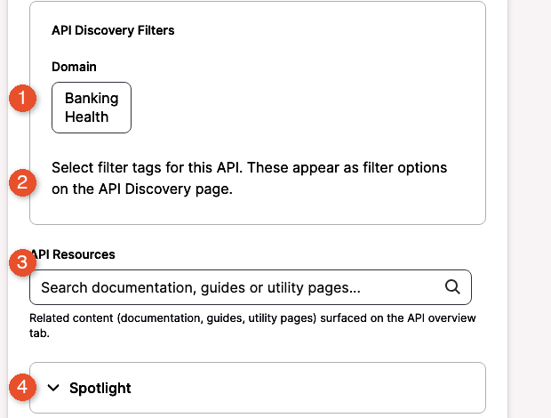
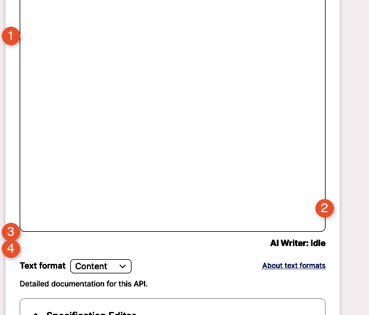
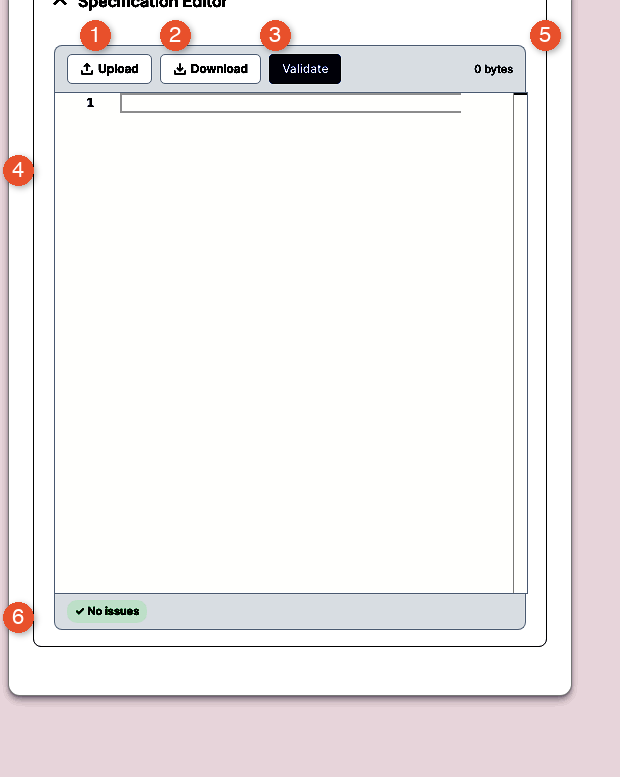

With a gateway connection in place, the marketplace can pull your APIs into its catalog. There are two paths: an **automatic import** that reads everything in the connected gateway and creates one catalog entry per spec, and a **manual create** flow that uses the **Create APIs** wizard. Most teams use the automatic path for the first wave so the catalog mirrors the gateway, then use the manual path for one-off APIs not yet behind the gateway.

You will learn:

- How to trigger an automatic import from a connected gateway and choose which APIs to bring in.
- How to use the **Create APIs** wizard's four fieldsets — basic identity, discovery filters, narrative content, and the specification editor — to create an API by hand.
- How to set initial visibility and moderation state at creation time.
- How to verify the import populated Manage APIs correctly.
- How to recognise and fix the most common import failures.

Allow ~25 minutes for an automatic import of 10–20 APIs, or ~15 minutes per manually created API.

## Importing from a connected gateway

The fastest way to populate your catalog is to let the marketplace read every API your gateway already exposes.

#### Trigger an automatic import from a connected gateway

Use this task to have the marketplace discover and create API nodes for everything in a connected gateway. The flow reads the gateway, creates one API node per spec, and links each node back to the source connection.

#### Before you start

- **Confirm the connection passed Test connection.** A connection that did not authenticate cannot import. See [Testing the connection](connecting-your-first-gateway.md#test-the-connection).
- **Decide whether to import all APIs or a subset.** The import flow lists every API the gateway exposes; you can deselect APIs to exclude from the marketplace catalog.
- **Choose a default visibility.** Imported APIs land in the catalog with a single visibility setting that can be changed per-API later. Org Level is a safe default for the first import.

To trigger an automatic import:

1. From the left sidebar, select **Manage API Sources**.
2. Under Existing API Sources, locate the row for the connection to import from.
3. Click **Import APIs**. The page opens at `/admin/apim/connection/<id>/import-apis/<gateway>`.
4. Wait for the marketplace to query the gateway and return its list of APIs. For a large gateway this can take 30 seconds or more.
5. Review the list. Each row shows the API title, the version or revision, the environment, and a checkbox.
6. Deselect any APIs to exclude from the marketplace. By default the page selects all rows.
7. Select a default **Visibility** for the import — Org Level, Internal, or Public. Per-API overrides come later in [Publishing your first API](publishing-your-first-api.md#publishing-your-first-api).
8. Click **Import selected**. The marketplace creates one API node per selected row and shows a progress indicator while it processes the batch.
9. When the import finishes, the page redirects to Manage APIs. The new APIs appear in the list with the source connection name in the API Source column.

The numbered callouts in Figure 4-1 are:

1. **Title column** — The public name of each imported API. Click a title to open its detail page.
2. **API Source column** — The gateway connection the API came from. Filter the list with the **API Source** dropdown above the table.
3. **Status column** — Moderation state per row. Imported APIs land as **Draft** unless you chose otherwise.
4. **Last updated column** — When the spec or metadata last changed. Sort by this to find recent imports.
5. **Governance Report link** — Per-API drilldown into the governance score, covered in [Reviewing API governance](reviewing-api-governance.md#reviewing-api-governance).

> **Result:** Every selected API exists as a node in the marketplace catalog. Each node carries a link back to its source gateway and is ready for governance scanning, plan design, and publication.

> **Note:** Imported APIs start in Draft moderation state. Consumers do not see them until you publish them in [Publishing your first API](publishing-your-first-api.md#publishing-your-first-api). The exception is APIs explicitly marked Public during import — these still require a publish step before they appear on the consumer catalog.

> **Tip:** The same connection supports importing API Products as well. Use Import Products (the link next to Import APIs on the connection row) after the underlying APIs are imported. Plan-and-product groupings are covered in [Reviewing API Products and Plans](reviewing-api-products-and-plans.md#reviewing-api-products-and-plans).

#### Verify

1. Confirm the redirect lands you on Manage APIs after the import finishes.
2. Sort Manage APIs by **Last updated** descending and confirm the imported APIs sit at the top.
3. Confirm each new row carries your connection name in the **API Source** column.
4. Click into one API and confirm the spec renders in the **API Specification** tab.

## Creating an API manually

Use the **Create APIs** wizard when the API is not behind a connected gateway yet, or when the marketplace itself should own the lifecycle of the spec.

#### Create an API from a spec

Use this task when you have an OpenAPI document on disk (or as a URL) and want to create an API node manually. The form is a single long page split into four fieldsets: basic identity, discovery filters, narrative content, and the spec itself.

#### Before you start

- **Prepare your OpenAPI spec.** The form accepts OpenAPI 2.0 (Swagger) and 3.0 documents in JSON or YAML. Keep the file under 10 MB.
- **Validate your spec offline.** The editor runs a basic check, but a spec that breaks at parse time produces a less useful error than one rejected by your editor's linter. Run a Spectral or Stoplight check first.
- **Select the API source.** If a gateway is connected, you can attach this API to that source. Otherwise, leave the source blank — the API is treated as a marketplace-owned spec.
- **Decide the visibility level.** Org Level keeps the API hidden from anyone outside your organisation; Internal opens it to every logged-in marketplace user; Public exposes it to anonymous visitors as well.

To create an API from a spec:

1. From the left sidebar, expand Content and then APIs, or click **Create > APIs** in the top bar. Either path opens the Create APIs form at `/node/add/apis`.
2. Complete the **basic identity** fieldset — Title, API Version, API Revision, Environment, and API Tags.
3. Complete the **API Discovery Filters** fieldset — Domain, API Resources, and Spotlight.
4. Write the **Overview** and **Documentation** rich-text fields.
5. Upload or paste your spec into the **Specification Editor** and validate it.
6. Select a **Visibility** scope and a **Moderation state** at the bottom of the form.
7. Click **Save**. The marketplace creates the API node and redirects to its detail page.

The next four figures walk through each fieldset.

##### Basic identity

The numbered callouts in Figure 4-2 are:

1. **Title** — The public API name. Required, max 255 characters. The Title field appears at the top of this fieldset; in the screenshot it is masked because the marketplace showed a draft-restoration prompt over it (see the Note below). Enter the public-facing API name surfaced to consumers.
2. **API Version** — Free-text version label, max 255 characters. Optional but recommended; consumer-side filters key off this value. Use the version your engineering team tags releases with — for example `1.4.0`.
3. **API Revision** — Free-text revision label, max 255 characters. Optional. Use this when your gateway tracks revisions independently of versions.
4. **Environment** — Per-environment tag with placeholder *Select or add one env*. Allows the catalog to show separate entries for `prod`, `staging`, and `dev`. Enter a value or select from the suggestions.
5. **API Tags** — Free-text discovery tags with placeholder *Add tags...*. Multiple tags allowed, comma-separated. Tags drive the catalog's filter facets on the consumer side; common patterns are `payments`, `internal`, `webhook`.

> **Note:** When you reopen a partially-filled Create APIs form, the marketplace shows a draft-restoration dialog with Resume editing and Discard buttons. This dialog covers the Title field until you respond to it. Click Discard to start fresh, or Resume editing to load your last unsaved values. Figure 4-2 shows the form with this dialog covering the Title row.

##### Discovery filters

The numbered callouts in Figure 4-3 are:

1. **Domain** — Multi-select of business domains. Default options are Banking and Health; your Portal Admin can add more from Settings & administration. Domain drives the catalog grouping consumers see on the discovery page.
2. **Filter description** — Help text under the Domain selector that names the discovery filters this API will appear under. Read it once during onboarding, then trust the labels.
3. **API Resources** — Autocomplete with placeholder *Search documentation, guides or utility pages...*, max 1024 characters per entry. Link related guides, articles, or utility pages so consumers find context next to the spec.
4. **Spotlight** — Collapsed panel that, when expanded, exposes a checkbox plus a *from* and *to* date-time range. Use Spotlight to feature the API on the catalog landing page during a launch window. Leave it off for routine APIs.

##### Narrative content

The numbered callouts in Figure 4-4 are:

1. **Overview** — Rich-text editor for the one-paragraph summary that appears on the catalog tile and the API landing page. The toolbar carries paragraph style, bold, italic, blockquote, link, and list buttons. Keep the Overview short — three to five sentences is the recommended length.
2. **AI Writer indicator** — The "AI Writer: Idle" label below the editor reports whether the AI assist hook is active. Idle is the resting state. The label is a status reporter only; no action is required.
3. **Text format** — Dropdown set to Content by default. Switch to Markdown to render raw Markdown verbatim, or Email for editorial templates. The Content format applies to most cases.
4. **Helper text** — One-line guidance under the editor (for example, "A brief overview of the API"). Read it once per format change; the constraints rarely affect the Content format.

The numbered callouts in Figure 4-5 are:

1. **Documentation** — Rich-text editor for long-form content: usage examples, authentication details, rate-limit notes, and changelog. Same toolbar as Overview. Markdown pastes render cleanly.
2. **AI Writer indicator** — Same status indicator as the Overview editor; reports whether the AI assist hook is active for the Documentation editor.
3. **Text format** — Independent of the Overview editor's setting. Defaults to Content; switch to Markdown if the source is raw Markdown.
4. **Helper text** — Reads "Detailed documentation for this API" by default. Reinforces that this editor is for the long-form content, not the catalog summary.

##### Specification editor

The numbered callouts in Figure 4-6 are:

1. **Upload** — Opens a file picker for OpenAPI documents in JSON or YAML. Drag-and-drop into the editor body also works. Triggers automatic validation when the file lands.
2. **Download** — Exports the editor contents as a file. Use this after edits to keep the canonical spec on disk in sync with the marketplace.
3. **Validate** — Runs the parser against the editor body. A green check with No issues indicates the spec parsed; a red banner names the failing line.
4. **Editor body** — Code area with line-number gutter and syntax highlighting. Paste your spec here, or use Upload to populate it.
5. **Size indicator** — The "0 bytes" label updates as you type or upload. Use it to confirm the editor was not accidentally cleared.
6. **Status indicator** — The "✓ No issues" label after a clean validation. After a failed validation the same area shows the parse error.

After all four fieldsets are completed and the spec validates, scroll past the editors to the bottom of the form to set visibility and moderation:

8. In the **Visibility** panel, select one of the three radio options:
   - Org Level — visible only to members of this organisation
   - Internal — visible to all logged-in users
   - Public — visible to everyone including anonymous visitors
9. Leave **Moderation state** as Draft for a review pass, or select Published when the content is ready.
10. (Optional) Set a **Publish on** date for a scheduled go-live.
11. Click **Save**.

> **Result:** The API node is created. Depending on the visibility and moderation state selected, it is either staged for review or live in the catalog. Either way, the governance scanner picks it up on its next run.

> **Note:** Saving an API as Public does not expose it on the consumer-facing catalog by itself — the moderation state must also be Published. Both must agree before anonymous visitors see it.

> **Tip:** Use Draft plus an internal review on every first import. The governance score (covered in [Reviewing API governance](reviewing-api-governance.md#reviewing-api-governance)) typically catches missing security definitions and underspecified responses that you should fix before publishing.

#### Verify

1. Confirm the form redirects to the API detail page after **Save**.
2. Open the **API Specification** tab and confirm your spec renders without parse errors.
3. Open Manage APIs and confirm the new API is listed with the **Status** you selected.
4. Confirm the **Visibility** scope on the detail page matches the radio you selected.

## Confirming and troubleshooting

After import, verify the catalog reflects what you expected, and review the most common fixes when it does not.

#### Verify the import worked

Use this task immediately after an automatic import or a manual create. It is a five-minute pass that catches misconfigured imports before consumers notice.

To verify an import:

1. From the left sidebar, select **Manage APIs** under **API MANAGEMENT**.
2. Sort the list by **Last updated**, descending. Recently imported APIs sit at the top.
3. For each new API, check the Title, API Source, and Status columns:
   - Title matches the gateway entry or the value entered in the form.
   - API Source lists the connection imported from (or *(none)* for manual creates without a source).
   - Status is Draft or Published as intended.
4. Click into one API. Confirm the spec renders in the **API Specification** tab. If a render error appears, the spec did not parse; re-import or fix the spec.
5. Switch to the **API Governance Report** tab on the API detail page (or use the Governance Report column on Manage APIs if your view shows it). A score of N/A indicates the scan has not run yet; a numeric score indicates the scanner has assessed the API.
6. If the score remains N/A after a few minutes, see [Re-running the governance scan](reviewing-api-governance.md#re-run-the-governance-scan) to trigger a scan manually.

The numbered callouts in Figure 4-7 are:

1. **Title column** — The public name of the API. Click to open the detail page.
2. **API Source column** — Which gateway connection (or manual entry) the API came from. Filter the list with the **API Source** dropdown above the table.
3. **Status column** — Draft or Published moderation state.
4. **Last updated column** — When the spec or metadata last changed. Sort by this to find recent imports.
5. **Governance Report link** — Per-API drilldown into the governance score, covered in [Reviewing API governance](reviewing-api-governance.md#reviewing-api-governance).

> **Result:** The imported APIs match the gateway, the specs render, and the governance scan is scheduled. You are ready to read the governance results in [Reviewing API governance](reviewing-api-governance.md#reviewing-api-governance).

> **Tip:** Bookmark Manage APIs with the filter set to your most recent connection. The marketplace remembers the URL parameters, so reopening the bookmark returns the same filtered view.

#### Fix common import failures

Use this task when an automatic import shows fewer APIs than expected, when an API row in Manage APIs has an error icon, or when the form rejected your spec.

The most common failures and fixes:

- **Invalid spec format.** The marketplace accepts OpenAPI 2.0 and 3.0 in JSON or YAML. AsyncAPI, RAML, and gRPC `.proto` files do not import. Convert the spec to OpenAPI before re-importing, or attach the original document under API Resources as supplementary documentation.
- **Missing security definitions.** Specs with no `securitySchemes` import but flag a governance violation. Add a `securitySchemes` block (even a minimal `apiKey` or `oauth2` boilerplate) before re-importing — the cost is lower than failing governance later.
- **Gateway timeout during import.** The gateway took too long to return its API list. Re-trigger the import; if it fails again, check the gateway's admin endpoint health, then re-test the connection (see [Testing the connection](connecting-your-first-gateway.md#test-the-connection)).
- **Duplicate title collision.** The marketplace rejects an API whose title exactly matches one already in the catalog under the same source. Rename one of them, or use API Version to disambiguate.
- **Spec too large.** Specs larger than 10 MB are rejected. Split the spec by tag or by path prefix, and import each part as its own API.
- **Authentication rejected mid-import.** A credential that passed Test connection can still fail mid-import if it expired or its scopes were narrowed. Edit the connection (see [Editing or revoking a connection](connecting-your-first-gateway.md#edit-or-revoke-a-connection)), paste a fresh credential, re-test, and re-import.
- **Empty environment.** APIs with no `servers` block in OpenAPI 3.0 (or no `host` in OpenAPI 2.0) import but show *(no environment)* in the Environment column. Add a `servers` entry pointing at your gateway and re-import.

> **Note:** Re-importing an API that already exists updates the existing node rather than creating a duplicate, provided the title matches. Edits to Overview, Documentation, tags, and visibility are preserved across re-imports.

> **Caution:** Do not delete an API node to force a clean re-import if it has consumer subscriptions. Deleting the node revokes those subscriptions. Edit the existing node instead, or use Manage API Sources to re-trigger the import for that one row.

## Next steps

- **[Reviewing API governance](reviewing-api-governance.md#reviewing-api-governance)** — Each imported API has been queued for governance scanning; the next chapter shows how to read the score and address findings.
- **[Publishing your first API](publishing-your-first-api.md#publishing-your-first-api)** — Once governance is acceptable, transition the API from Draft to Published so consumers can find it.
- **[Reviewing API Products and Plans](reviewing-api-products-and-plans.md#reviewing-api-products-and-plans)** — Wrap the imported APIs into a subscribable Product before approving consumer subscriptions.
- **[Testing the connection](connecting-your-first-gateway.md#test-the-connection)** — If imports are missing or partial, retest the upstream connection to confirm credentials are still valid.
