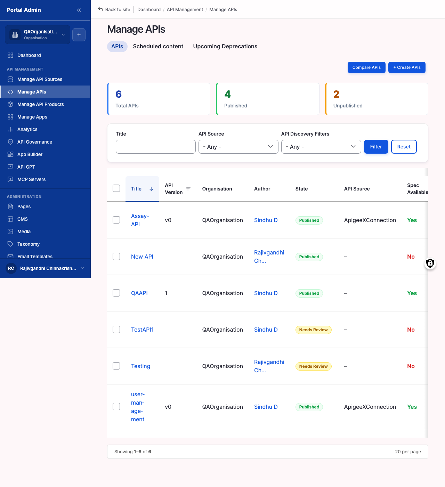
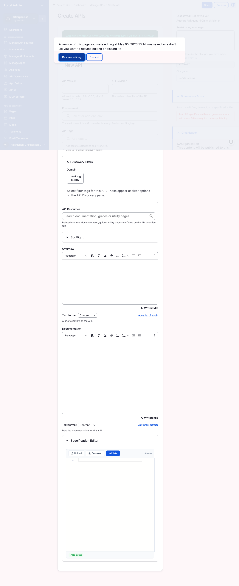
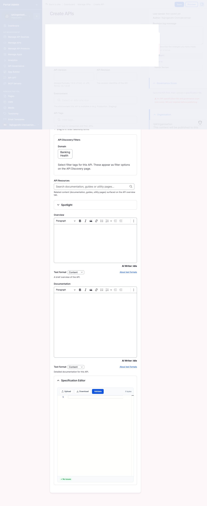

A gateway connection on its own does nothing. To make the catalog useful you have to bring APIs across, either by letting the marketplace read everything your gateway exposes or by hand-crafting one entry at a time in the **Create APIs** wizard. Most teams do both: an automatic import to seed the catalog with what already exists, then a sprinkling of manual creates for APIs that live outside any gateway.

You will learn:

- How to trigger an automatic import from a connected gateway and choose which APIs to bring in.
- How to read every column, filter, and row action on the **Manage APIs** list page.
- How to walk all four fieldsets of the **Create APIs** wizard: Basic Identity, Discovery Filters, Narrative Content, and the Specification Editor.
- How to set visibility and moderation state at creation time so the API lands in the right state.
- How to edit an existing API in place, re-run governance, duplicate it, or delete it.
- How to verify the import populated Manage APIs correctly and to recognise the most common import failures.

Allow ~25 minutes for an automatic import of 10 to 20 APIs, or ~15 minutes per manually created API.

## Importing from a connected gateway

The fastest way to populate the catalog is to let the marketplace read every API your gateway already exposes and turn each one into a catalog node.

#### Trigger an automatic import

Use this task to discover and create one API node per spec held in a connected gateway. The import reads the gateway, creates nodes in batch, and links each new node back to the source connection so subsequent governance scans and re-imports know where the spec came from.

#### Before you start

- **Confirm the connection passed Test connection.** A connection that failed authentication cannot list APIs. Open the connection row and click **Test connection**; a green banner means you are clear to import.
- **Decide whether to import all APIs or a subset.** The import page lists every API the gateway exposes. Deselecting a row excludes it from this run, not forever; you can re-trigger the import later and pick it up.
- **Choose a default visibility.** Imported APIs land with one visibility setting. **Org Level** is the safe default for a first import: nothing leaks to anonymous visitors while you review what came in.
- **Allow enough time.** Gateways with hundreds of APIs can take a minute to enumerate. Start the import when you have a few minutes to watch it finish, not as the last thing before a meeting.

To trigger an automatic import:

1. From the left sidebar, expand **API MANAGEMENT**, then click **Manage API Sources**.
2. Scroll to **Existing API Sources** and find the row for the connection to import from.
3. Click **Import APIs** on that row. The page opens at `/admin/apim/connection/<id>/import-apis/<gateway>`.
4. Wait for the marketplace to query the gateway. The page shows a loading state while it enumerates; large gateways can take 30 seconds or more.
5. Review the list. Each row shows the API title, the version or revision, the environment, and a selection checkbox.
6. Deselect any rows to exclude. The header checkbox toggles every row at once.
7. Pick a default **Visibility** for the batch: Org Level, Internal, or Public. Per-API overrides come later in [Publishing your first API](publishing-your-first-api.md#publishing-your-first-api).
8. Click **Import selected**. A progress indicator runs while the marketplace creates one node per row.
9. When the import finishes, the page redirects to **Manage APIs**. The new APIs are at the top of the list with the connection name in the **API Source** column.

The numbered callouts in Figure 4-1 are:

1. **Source row banner**. Names the connection the import is reading from. Confirms you are about to write into the right gateway's catalog slice.
2. **API list**. One row per spec the gateway exposes. Each row carries the title, version, environment, and a checkbox.
3. **Header checkbox**. Selects or deselects every row at once. Useful for narrowing a long list down to a handful by deselecting all, then ticking the few you want.
4. **Default Visibility selector**. Sets the visibility level applied to every API created in this batch. Org Level is the safest first-import default.
5. **Import selected button**. Starts the batch. The button stays disabled until at least one row is selected.


**Result:** Every selected API exists as a node in the marketplace catalog. Each node carries a link back to its source gateway and is ready for governance scanning, plan design, and publication.



**Note:** Imported APIs land in **Draft** moderation state by default. Consumers do not see them until you publish them in [Publishing your first API](publishing-your-first-api.md#publishing-your-first-api). The Visibility selector controls who *could* see them; the moderation state controls whether anyone *does*.



**Tip:** The same connection supports importing API Products as well. After the underlying APIs land, use **Import Products** from the connection row. Plans and product groupings are covered in [Reviewing API Products and Plans](reviewing-api-products-and-plans.md#reviewing-api-products-and-plans).



**Caution:** Re-running an import for a connection that already has APIs in the catalog updates existing nodes whose titles match. Title is the matching key, so renaming an API in the gateway and re-importing creates a duplicate rather than updating the original.


Verify:

1. Confirm the redirect lands on **Manage APIs** after the import finishes.
2. Sort Manage APIs by **Last updated**, descending, and confirm the new APIs sit at the top.
3. Confirm each new row carries the connection name in the **API Source** column.
4. Click into one API and confirm the spec renders without a parse error in the **API Specification** tab.

## Walking the Manage APIs list page

Manage APIs is the catalog's control surface. It lists every API the marketplace knows about, regardless of whether it came from an automatic import, a manual create, or a re-import. Most day-to-day provider work passes through this page, so it pays to know every column, filter, and row action.

#### Read the Manage APIs columns

Use this task on every first visit, and any time the catalog feels noisy. Knowing what each column reports turns the list from a wall of titles into a quick triage tool.

To inspect the list:

1. From the left sidebar under **API MANAGEMENT**, click **Manage APIs**. The page opens at `/admin/manage-apis`.
2. Read the column headers from left to right. The default order surfaces identity first, source second, lifecycle third.
3. Hover any column header. Sortable headers display an arrow indicator on hover; click to toggle ascending or descending.

The numbered callouts in Figure 4-2 are:

1. **Title column**. The public name of each API. Click a title to open the API detail page where you can edit, view the spec, or remove the entry.
2. **API Source column**. The gateway connection or documentation source the API came from. APIs created by hand in the wizard show `(none)` or the source you selected during creation.
3. **Status column**. Moderation state: **Draft** or **Published**. Draft APIs are invisible to consumers regardless of Visibility.
4. **Last updated column**. Timestamp of the most recent change to spec, metadata, or moderation state. This is the column most providers sort by daily.
5. **Governance Report link**. Opens the per-API governance drilldown covered in [Reviewing API governance](reviewing-api-governance.md#reviewing-api-governance). A value of N/A means the scan has not run yet.


**Note:** The **API Source** column reports the connection name, not the gateway product. Two connections to the same product (for example two Apigee X connections in different GCP projects) read as distinct sources.



**Tip:** Sort by **Last updated** descending and bookmark the resulting URL. The marketplace preserves filter and sort parameters in the URL, so the bookmark always lands on the most recently changed APIs.


#### Filter and re-sort the imported list

Use this task to narrow a catalog with dozens or hundreds of entries down to the slice you need: APIs from one connection, only drafts, only public, or only the ones changed today.

To filter and re-sort:

1. On **Manage APIs**, locate the filter row above the table. The filters are Status, API Source, and Visibility.
2. From the **Status** dropdown, pick Draft, Published, or leave All for both.
3. From the **API Source** dropdown, pick a single connection to scope the list. The dropdown lists every connection currently registered, plus an `(unsourced)` entry for manual creates without a source.
4. From the **Visibility** dropdown, pick Org Level, Internal, or Public to scope by audience.
5. Click a sortable column header to re-sort. The **Last updated** header is the most common choice; click it once for descending, click again for ascending.
6. Read the URL after applying filters. The marketplace records each filter as a URL parameter (for example `?status=draft&source=42&visibility=org`), so you can paste or bookmark a filtered view.

The numbered callouts in Figure 4-3 are:

1. **Status filter**. Constrains the list to Draft, Published, or all. Defaults to all when the page loads from the sidebar.
2. **API Source filter**. Constrains the list to a single gateway or documentation source. Useful immediately after an import to see only that batch.
3. **Visibility filter**. Constrains the list to one visibility scope. Useful when auditing what is exposed to anonymous visitors versus what stays internal.
4. **Sortable column headers**. Title and Last updated are clickable; the arrow indicator shows the current sort direction.
5. **Pagination**. Sits below the table. Defaults to 25 rows per page; the per-page selector accepts 10, 25, 50, or 100.


**Result:** The list shows only the APIs that match your filters, sorted by the column you chose. The URL captures the filter state so you can share or bookmark it.



**Tip:** The empty state ("No APIs match the current filters") is informative, not an error. If you see it after an import, drop the filters one at a time to find which constraint is hiding the new rows; the most common culprit is a Status filter still set to Published when the imports are Draft.



**Note:** Pagination preserves filter and sort state. Moving to page two does not reset Status, API Source, or Visibility selections.


#### Use the row action menu

Use this task whenever you want to operate on a single API from the list without opening its detail page. The row action menu carries Edit, Delete, Duplicate, Re-run governance, and Open in gateway.

To open a row action menu:

1. On **Manage APIs**, hover the row for the API to act on. An action menu icon appears at the right edge of the row.
2. Click the action icon. The menu opens with five entries.
3. Pick the action you want:
   - **Edit** opens the API detail page in edit mode at `/node/<nid>/edit`.
   - **Delete** opens a confirmation dialog before removing the API.
   - **Duplicate** copies the API into a new draft with `(copy)` appended to the title.
   - **Re-run governance** queues the spec for an immediate governance scan and updates the Governance Report column when the scan finishes.
   - **Open in gateway** deep-links to the API in its source gateway's admin console (where the gateway supports it). Manual-create APIs without a source have this action disabled.


**Note:** The row action menu is the only path to **Re-run governance** from the list page. The detail page exposes the same action from its **API Governance Report** tab.



**Caution:** **Delete** is permanent and revokes any consumer subscriptions tied to the API. For draft APIs with no subscriptions the impact is local; for published APIs with live subscriptions, prefer transitioning to Unpublished first (covered in [Publishing your first API](publishing-your-first-api.md#publishing-your-first-api)) and only deleting after consumers have migrated.



**Tip:** **Duplicate** is the quickest way to scaffold a new API that shares most of its metadata with an existing one, for example a `v2` next to a `v1`. Duplicate, then edit the title and the spec, then save.


#### Run a bulk action

Use this task when several APIs need the same change at once, for example marking ten draft APIs as Published or deleting a batch of stale imports.

To run a bulk action:

1. On **Manage APIs**, tick the checkbox at the left of each row to include.
2. Use the header checkbox to select every visible row at once.
3. From the **Actions** dropdown above the table, pick the operation: **Publish selected**, **Unpublish selected**, **Delete selected**, or **Re-run governance**.
4. Click **Apply**. The marketplace confirms the action in a dialog summarising the selected count.
5. Confirm. The action runs server-side and the page refreshes with updated Status, Last updated, or row counts.


**Result:** Every selected API has the action applied. Status, governance scores, or row presence change to match.



**Note:** Bulk **Publish selected** ignores APIs that are already published, so running it across a mixed selection is safe. Bulk **Delete selected**, by contrast, deletes every selected row regardless of state; double-check the selection.



**Caution:** Bulk actions span only the current page, not the full filtered set. To act on more than one page, increase the per-page size first or run the action page by page.


## Creating an API by hand

The **Create APIs** wizard at `/node/add/apis` is the path for APIs that do not live behind a connected gateway, or where the marketplace itself owns the canonical spec. The form is a single long page split into four fieldsets, then a visibility-and-moderation footer. This section walks every fieldset.

#### Open the Create APIs wizard

Use this task whenever you need a new API node without going through an import. Two entry points open the same form.

To open the wizard:

1. From the top bar, click **Create**, then **APIs**. The form opens at `/node/add/apis`.
2. Or, from the left sidebar, expand **Content**, then **APIs**, then click **Add API**. Both routes land on the same form.
3. If the marketplace finds an unsaved draft from a previous session, a **Resume editing** prompt appears over the form. Click **Resume editing** to load the saved values, or **Discard** to start fresh.

The numbered callouts in Figure 4-4 are:

1. **Page title**. Reads **Create APIs** with the form group label below it. Confirms you are on the new-API surface, not an edit form for an existing one.
2. **Basic Identity fieldset**. The first group of fields, covering Title, Version, Revision, Environment, and Tags.
3. **Discovery Filters fieldset**. The second group, covering Domain, API Resources, and Spotlight.
4. **Form actions strip**. Save, Preview, and Delete buttons. Stays at the bottom of the form and remains visible as you scroll.
5. **Resume editing banner**. Shown only when a prior session left unsaved values. Pick Resume or Discard before continuing.


**Note:** The wizard autosaves a draft every 30 seconds while you type. Closing the tab without saving loses nothing; the Resume editing prompt appears the next time you open `/node/add/apis`.



**Tip:** Keep the canonical OpenAPI document open in a separate tab or editor while you fill the form. You will paste from it twice: once into the Description in Narrative Content (for the catalog tile), and once into the Specification Editor.


#### Fill the Basic Identity fieldset

Use this task to set the identity fields that drive every consumer-facing display string for the API. Title and Version appear on the catalog tile, in search results, and in the in-browser spec viewer's header.

To fill Basic Identity:

1. In the **Title** field, enter the public-facing API name, max 255 characters. The Title becomes the catalog tile heading.
2. In the **API Version** field, enter the release tag your engineering team uses, for example `1.4.0`. Max 255 characters. The version appears next to the title on the tile.
3. In the **API Revision** field, enter the revision label if your gateway tracks revisions independently of versions, for example `rev-3`. Max 255 characters. Leave blank when revisions are not meaningful for this API.
4. In the **Environment** field, pick or add an environment tag (`prod`, `staging`, `dev`). The autocomplete suggests existing tags as you type.
5. In the **API Tags** field, enter discovery tags as a comma-separated list, for example `payments, internal, webhook`. Tags drive the consumer-side catalog filters.

The numbered callouts in Figure 4-5 are:

1. **Title field**. Required, max 255 characters. Appears as the catalog tile heading and the spec viewer header.
2. **API Version field**. Free-text release tag, max 255 characters. Drives version-aware filters on the consumer side.
3. **API Revision field**. Free-text revision label, max 255 characters. Use only when revisions matter independently of versions.
4. **Environment field**. Autocomplete with placeholder *Select or add one env*. Allows separate catalog entries per environment.
5. **API Tags field**. Free-text discovery tags. The placeholder reads *Add tags...*; press Enter or comma to confirm a tag.


**Note:** Title is the matching key for re-imports from a connected gateway. Editing the Title later breaks the link to subsequent re-imports for that connection.



**Tip:** Treat tags as a controlled vocabulary across your team. Free-text tags are cheap to add but expensive to clean up after the catalog has hundreds of entries. Pick five to ten tags per business domain and document them in your team's onboarding notes.



**Caution:** Version and Revision are display fields, not enforcement fields. The marketplace does not refuse a subscription against an old version; consumer apps continue to call whatever endpoint the spec declares. Use the deprecation workflow in [Publishing your first API](publishing-your-first-api.md#publishing-your-first-api) to retire a version on the consumer side.


#### Fill the Discovery Filters fieldset

Use this task to set the metadata that controls which catalog facets, domains, and related-content tiles the API appears under for consumers.

To fill Discovery Filters:

1. In the **Domain** multi-select, pick one or more business domains. The default options are Banking and Health; your Portal Admin can add more.
2. Read the help text under Domain. It names the discovery filters the API will appear under on the consumer catalog.
3. In the **API Resources** autocomplete, type the title of a related guide, documentation page, or utility page and pick from the suggestions. Each entry can be up to 1024 characters.
4. Expand the **Spotlight** collapsed panel only if you want to feature the API on the catalog landing page during a launch window. Inside the panel, tick **Enable Spotlight** and set a *from* and *to* date-time range.
5. Leave Spotlight collapsed for routine APIs. The default state is off.

The numbered callouts in Figure 4-6 are:

1. **Domain selector**. Multi-select of business domains. Drives the catalog grouping consumers see on the discovery page.
2. **Domain help text**. One-line description under the selector that names the discovery filters this API will appear under.
3. **API Resources autocomplete**. Links related guides, articles, or utility pages so consumers find context next to the spec. Placeholder reads *Search documentation, guides or utility pages...*.
4. **Spotlight panel**. Collapsed by default. Expand to feature the API on the landing page during a launch window.
5. **Spotlight date range**. Inside the expanded panel, sets the *from* and *to* date-time bounds for the feature window.


**Note:** Domain drives the left-rail grouping consumers see on the catalog discovery page. An API with no Domain still appears in catalog search results but is not grouped under any heading.



**Tip:** Spotlight is most effective in two to three week windows tied to a launch or marketing push. Leaving Spotlight on permanently dilutes the signal; the landing page surfaces only the top spotlighted APIs and the rest get demoted.



**Result:** The API's discovery metadata is set. The consumer catalog now knows which domain heading, related resources, and feature window apply.


#### Fill the Narrative Content fieldset

Use this task to write the human-facing prose for the API: the one-paragraph Overview that appears on the catalog tile, and the long-form Documentation that appears on the API landing page.

To fill Narrative Content:

1. In the **Overview** rich-text editor, write three to five sentences describing what the API does. The Overview is the catalog tile blurb.
2. Use the editor toolbar for paragraph style, bold, italic, blockquote, link, and lists. Keep it short; the catalog tile truncates after the first sentence or two.
3. Read the **Text format** dropdown below the editor. Leave it on **Content** for plain rich text; switch to **Markdown** if you are pasting raw Markdown from a README; switch to **Email** only for editorial templates.
4. In the **Documentation** rich-text editor, write long-form content: authentication details, rate-limit notes, usage examples, changelog. The Documentation tab on the API detail page renders this verbatim.
5. The same toolbar applies. Markdown paste renders cleanly. The Text format dropdown is independent of the Overview's.
6. Optionally upload a **Logo** in the image field beneath Documentation. The catalog tile uses the logo as the API's icon; a 256x256 PNG with transparent background works best.

The numbered callouts in Figure 4-7 are:

1. **Overview editor**. Rich-text editor for the catalog tile blurb. Keep to three to five sentences.
2. **Editor toolbar**. Paragraph style, bold, italic, blockquote, link, and list buttons. Identical for Overview and Documentation.
3. **AI Writer indicator**. The "AI Writer: Idle" label below the editor reports whether the AI assist hook is active. Idle is the resting state and requires no action.
4. **Text format dropdown**. Set to Content by default. Switch to Markdown for raw Markdown, or Email for editorial templates.
5. **Documentation editor**. Rich-text editor for the long-form API landing page content. Independent text format from the Overview.
6. **Logo upload**. Image upload for the catalog tile icon. Accepts PNG, JPG, and SVG up to 5 MB.


**Note:** The Overview is rendered as plain text on the catalog tile (links and formatting are stripped for the tile preview) and as rich text on the API landing page. Write it to read well in both contexts.



**Tip:** Paste your API's README directly into Documentation with the Text format set to Markdown. The editor preserves headings, code blocks, and links; you save the time of reformatting the content for rich text.



**Caution:** The Logo upload accepts large files but the catalog tile renders at 64x64. Anything more than a few hundred kilobytes wastes bandwidth on every catalog load. Resize before uploading.


#### Fill the Specification Editor fieldset

Use this task to attach the OpenAPI document that drives the spec viewer, the try-it console, and the governance scanner. This fieldset is the most consequential one in the wizard.

#### Before you start

- **Validate your spec offline first.** The editor runs a parser check on Validate, but a spec rejected by your own linter is faster to fix at the source than in the browser. Run Spectral or Stoplight before pasting.
- **Confirm format and size.** The editor accepts OpenAPI 2.0 (Swagger) and 3.0 in JSON or YAML, up to 10 MB. AsyncAPI, RAML, and gRPC `.proto` files do not import.
- **Decide whether to upload or paste.** Upload is faster for large specs; paste preserves your editor's exact whitespace and comments.

To fill the Specification Editor:

1. Scroll to the **Specification Editor** fieldset, below Narrative Content.
2. To upload, click **Upload** and pick the JSON or YAML file. Drag-and-drop into the editor body also works.
3. To paste, click into the editor body and paste your spec. Syntax highlighting activates immediately.
4. To pull from a URL, click **Import from URL** and paste a publicly reachable spec URL. The marketplace fetches and pastes the contents into the editor body.
5. Click **Validate**. The status indicator updates: a green check with **No issues** means the spec parsed; a red banner names the failing line.
6. Read the **Size indicator** beneath the editor to confirm content is present. A `0 bytes` value after upload means the file did not attach.
7. If the validation fails, fix the named line in the editor body and click **Validate** again.

The numbered callouts in Figure 4-8 are:

1. **Upload button**. Opens a file picker for JSON or YAML. Drag-and-drop onto the editor body also works.
2. **Import from URL button**. Fetches a spec from a public URL into the editor body.
3. **Download button**. Exports the editor contents as a file. Useful after edits to keep the canonical spec on disk in sync.
4. **Validate button**. Runs the parser against the editor body. Updates the status indicator with the result.
5. **Editor body**. Code area with line-number gutter and syntax highlighting. Paste, upload, or import populates it.
6. **Size and status indicators**. `0 bytes` plus a status pill beneath the editor. After a clean validation the pill reads **No issues**; after a failure it names the parse error.


**Result:** The spec is attached. The Specification tab on the API detail page renders it, the try-it console reads it, and the governance scanner queues a scan when the API saves.



**Note:** Validate only checks parseability, not governance. A spec can parse cleanly and still fail governance because it lacks a `securitySchemes` block or under-specifies responses. Run [Reviewing API governance](reviewing-api-governance.md#reviewing-api-governance) immediately after saving to catch those.



**Tip:** When iterating on a spec, prefer **Import from URL** pointed at a Git-hosted raw file. Each iteration only requires re-fetch, not re-upload, and the canonical source stays in version control.



**Caution:** The editor body is the source of truth at save time. If you uploaded a file and then typed over the editor, the typed contents win, not the uploaded file. Check the **Size** indicator and the editor body before clicking Save.


#### Set visibility and moderation, then save

Use this task to set the audience scope and the lifecycle state of the new API before saving. These two settings together determine whether anyone sees the API and which roles count as "anyone".

To set visibility and moderation:

1. Scroll past the Specification Editor to the **Visibility** panel.
2. Pick one of the three radio options:
   - **Org Level**. Visible only to members of this organisation. Use for internal-first releases.
   - **Internal**. Visible to all logged-in marketplace users across organisations.
   - **Public**. Visible to everyone including anonymous visitors. Reserved for production APIs you intend to market.
3. Below Visibility, set **Moderation state**:
   - **Draft**. Hidden from consumers regardless of Visibility. Use for review passes.
   - **Published**. Live in the catalog at the chosen visibility.
4. Optionally set a **Publish on** date-time for a scheduled go-live. Saving in Draft with a Publish on date queues the marketplace to transition the API to Published at the chosen time.
5. Click **Save** at the bottom of the form. The marketplace creates the node and redirects to the detail page at `/api/<nid>`.

The numbered callouts in Figure 4-9 are:

1. **Specification Editor footer**. The bottom edge of the spec editor, just above the visibility panel.
2. **Visibility radios**. Org Level, Internal, or Public. Required selection before save.
3. **Moderation state selector**. Draft or Published. Defaults to Draft for fresh nodes.
4. **Publish on field**. Optional date-time picker for a scheduled go-live. Only relevant when Moderation state is Draft.
5. **Save button**. Persists the node. Disabled until required fields are valid and the spec parses.


**Result:** The API node is created. Depending on Visibility and Moderation state, it is either live in the catalog or staged for review. The governance scanner picks it up on its next run regardless.



**Note:** Saving with Visibility=Public and Moderation=Draft hides the API from anonymous visitors until the moderation state transitions to Published. Both settings must agree before the API appears on the consumer catalog.



**Tip:** Always save the first version of a new API as Draft, even when you are confident. The governance scan typically catches missing security definitions and under-specified responses you want to fix before going live.



**Caution:** A spec that fails Validate cannot save. The Save button remains disabled until the status indicator reads **No issues**. If Save looks unresponsive, scroll up and check the Specification Editor's status indicator.


Verify:

1. Confirm the form redirects to the API detail page after **Save**.
2. Open the **API Specification** tab on the detail page and confirm the spec renders without parse errors.
3. Open **Manage APIs** and confirm the new API is listed with the **Status** you selected.
4. Confirm the **Visibility** scope on the detail page matches the radio you selected.

<strong>All fields on the Create APIs wizard</strong>

| Fieldset | Field | Type | Required | Max | What to enter |
|---|---|---|---|---|---|
| Basic Identity | Title | Text | Yes | 255 | Public API name shown on the catalog tile. |
| Basic Identity | API Version | Text | No | 255 | Release tag, for example `1.4.0`. |
| Basic Identity | API Revision | Text | No | 255 | Revision label when revisions differ from versions. |
| Basic Identity | Environment | Autocomplete | No | 255 | `prod`, `staging`, `dev`, or a custom tag. |
| Basic Identity | API Tags | Multi-tag text | No | n/a | Comma-separated discovery tags. |
| Discovery Filters | Domain | Multi-select | No | n/a | One or more business domains (Banking, Health, etc.). |
| Discovery Filters | API Resources | Autocomplete | No | 1024 | Links to related guides, articles, utility pages. |
| Discovery Filters | Spotlight enable | Checkbox | No | n/a | Off by default. On adds the API to the landing-page feature row. |
| Discovery Filters | Spotlight from/to | Date-time | Conditional | n/a | Required only when Spotlight is enabled. |
| Narrative Content | Overview | Rich text | Recommended | n/a | Three to five sentences for the catalog tile blurb. |
| Narrative Content | Documentation | Rich text | Recommended | n/a | Long-form authentication, examples, rate limits, changelog. |
| Narrative Content | Logo | Image upload | No | 5 MB | PNG, JPG, or SVG. Renders at 64x64 on the catalog tile. |
| Specification | Editor body | Code (JSON/YAML) | Yes | 10 MB | OpenAPI 2.0 or 3.0 document. |
| Visibility / Moderation | Visibility | Radio | Yes | n/a | Org Level, Internal, or Public. |
| Visibility / Moderation | Moderation state | Select | Yes | n/a | Draft or Published. |
| Visibility / Moderation | Publish on | Date-time | No | n/a | Optional scheduled go-live. |

## Editing and maintaining APIs

Imported and created APIs are not frozen. The detail page exposes every editable field and adds tabs for spec, documentation, and governance.

#### Edit an existing API in place

Use this task to update an API's metadata, swap its spec, or rewrite its narrative content. Edits preserve the node identity and the link back to its source connection.

To edit an API:

1. From **Manage APIs**, click the title of the API to open its detail page.
2. Click **Edit** in the top-right of the detail page, or open the row action menu on Manage APIs and pick Edit. Both routes land at `/node/<nid>/edit`.
3. The edit form is the same shape as Create APIs, pre-populated with current values.
4. Update the fields you need to change. Title, Version, and Revision are editable; changes propagate to the catalog tile on save.
5. Replace the spec by uploading or pasting a new document into the Specification Editor. Click **Validate** before saving.
6. Click **Save**. The detail page reloads with the updated values; Last updated on Manage APIs refreshes to the current timestamp.


**Note:** Editing Title breaks the re-import matching key for connection-sourced APIs. After a Title change, the next gateway re-import will create a duplicate row rather than updating this one. Avoid Title edits on imported APIs unless you have a specific reason and the patience to clean up duplicates later.



**Tip:** The detail page tabs (Overview, API Specification, Documentation, API Governance Report) let you preview each surface independently before saving. Open them in a separate tab while editing to compare before-and-after without leaving the form.



**Caution:** Replacing the spec on a published API can break consumer apps that depend on the old shape. For breaking changes, prefer creating a new API at the new version rather than mutating the old one.


#### Re-run governance on an imported API

Use this task immediately after import, after a spec change, or whenever a Governance Report column reads N/A and you want a current score.

To re-run governance from Manage APIs:

1. On **Manage APIs**, locate the row for the API.
2. Open the row action menu and pick **Re-run governance**. The Governance Report column flips to a running indicator.
3. Wait. The scan typically completes within a minute for specs under 1 MB.
4. Refresh the page. The Governance Report column now shows a numeric score and the **View report** link is active.

To re-run governance from the detail page:

1. Open the API detail page and click the **API Governance Report** tab.
2. Click **Re-run scan**. The tab refreshes with running status, then with the new score when the scan completes.

The numbered callouts in Figure 4-10 are:

1. **Score summary**. The current governance score, expressed as a percentage with a colour band (green, amber, red).
2. **Severity breakdown**. Counts of errors, warnings, and information findings.
3. **Re-run scan button**. Queues a fresh scan against the current spec.
4. **Findings list**. Per-rule findings with the line number, severity, and remediation hint.
5. **Last scanned timestamp**. When the score reflected here was last produced.


**Result:** The governance score reflects the current spec. Findings are itemised in the tab and are addressable by editing the spec and re-running the scan.



**Note:** Governance is read-only. The scanner reports issues; it does not modify the spec. All remediation happens by editing the spec and re-validating.



**Tip:** Treat governance as a pre-publish gate. APIs in Draft with a poor score should stay in Draft until the score improves. The threshold for "good enough" is a team decision covered in [Reviewing API governance](reviewing-api-governance.md#reviewing-api-governance).


#### Duplicate an API

Use this task when you need a new API that shares most of its metadata with an existing one, for example a `v2` next to a `v1`.

To duplicate:

1. On **Manage APIs**, open the row action menu for the source API.
2. Pick **Duplicate**. The marketplace creates a new draft API with `(copy)` appended to the Title and redirects you to its edit form.
3. Edit Title, Version, and any other fields that should differ. At minimum, change Title to remove the `(copy)` marker.
4. Click **Save**.


**Note:** Duplicate copies metadata and the spec body, but does not copy the source connection link. The new API has no API Source, so re-imports will not touch it.



**Tip:** Duplicate is the fastest way to scaffold a versioned successor: duplicate `v1`, change Title to include `v2`, update Version, paste the new spec, save.


#### Delete an unwanted import

Use this task to remove an API the marketplace should not catalog: a duplicate from a mistaken re-import, an experiment, or an API whose upstream entry has been removed.

To delete:

1. On **Manage APIs**, open the row action menu for the API.
2. Pick **Delete**. The marketplace shows a confirmation dialog summarising the deletion.
3. Confirm. The node is removed and the row disappears from Manage APIs.


**Caution:** Deleting an API revokes any consumer subscriptions tied to it. For Draft APIs with no subscriptions this is local cleanup; for Published APIs, prefer transitioning to Unpublished first and only deleting after consumers have migrated. The Upcoming API Deprecation Notice workflow gives you a graceful path.



**Note:** Deletion is permanent. The marketplace does not preserve a soft-deleted copy. If you may want the API back, export the spec from the detail page first.



**Tip:** Use bulk **Delete selected** from the Actions dropdown to remove several stale imports at once. Filter Manage APIs by API Source to a deprecated connection, select all, and run the bulk delete.


## Verifying and troubleshooting

The last step of a first import is to confirm the catalog reflects what you expected and to recognise the common failure modes when it does not.

#### Verify the import populated Manage APIs

Use this task immediately after every automatic import or manual create. The pass takes five minutes and catches misconfigured imports before consumers do.

To verify:

1. From the sidebar, click **Manage APIs**.
2. Sort by **Last updated**, descending. Recently imported or created APIs sit at the top.
3. For each new API, check Title, API Source, and Status:
   - Title matches the gateway entry or the value entered in the wizard.
   - API Source lists the connection (or `(none)` for manual creates without a source).
   - Status is Draft or Published as intended.
4. Click into one API. Confirm the spec renders on the **API Specification** tab.
5. Open the **API Governance Report** tab (or the Governance Report column on Manage APIs). A score of N/A means the scan has not run yet; a numeric score means the scanner has assessed the API.
6. If the score stays N/A after a few minutes, see [Re-run governance on an imported API](#re-run-governance-on-an-imported-api) to trigger the scan by hand.


**Result:** The imported APIs match the gateway, the specs render, and the governance scan is scheduled. You are ready to read the governance results in [Reviewing API governance](reviewing-api-governance.md#reviewing-api-governance).



**Tip:** Bookmark Manage APIs with the filter set to your most recent connection. The URL parameters persist, so reopening the bookmark returns the same filtered view next time.



**Note:** The catalog tile on the consumer-facing site refreshes from a cache. A freshly published API typically appears within a minute; if it has not appeared after five minutes, clear caches via the admin toolbar or wait for the cache TTL.


#### Fix common import failures

Use this task when an automatic import shows fewer APIs than expected, when a row in Manage APIs shows an error icon, or when the wizard rejected a spec at Validate.

The common failures and their fixes:

- **Invalid spec format.** The marketplace accepts OpenAPI 2.0 and 3.0 in JSON or YAML. AsyncAPI, RAML, and gRPC `.proto` files do not import. Convert the spec to OpenAPI before re-importing, or attach the original document under API Resources as supplementary documentation.
- **Missing security definitions.** Specs with no `securitySchemes` import but flag a governance violation on the next scan. Add a `securitySchemes` block (a minimal `apiKey` or `oauth2` block is fine) before re-importing, so governance has something to score against.
- **Gateway timeout during import.** The gateway took too long to enumerate its APIs. Re-trigger the import; if it fails again, check the gateway's admin endpoint health, then click **Test connection** on the source row (see [Testing the connection](connecting-your-first-gateway.md#test-the-connection)).
- **Duplicate title collision.** The marketplace rejects an API whose Title exactly matches one already in the catalog under the same source. Rename one of them, or use API Version to disambiguate.
- **Spec too large.** Specs larger than 10 MB are rejected at upload. Split the spec by tag or by path prefix and import each part as its own API.
- **Authentication rejected mid-import.** A credential that passed Test connection can still fail mid-import if it expired or its scopes were narrowed. Edit the connection (see [Editing or revoking a connection](connecting-your-first-gateway.md#edit-or-revoke-a-connection)), paste a fresh credential, re-test, and re-trigger the import.
- **Empty environment.** APIs with no `servers` block in OpenAPI 3.0 (or no `host` in OpenAPI 2.0) import but show `(no environment)` in the Environment column. Add a `servers` entry pointing at the gateway and re-import.
- **Save button disabled in the wizard.** Always means the spec failed Validate. Scroll to the Specification Editor and check the status indicator; fix the named parse error, click Validate, then Save.

<strong>Quick-reference: failure to first fix</strong>

| Symptom | First thing to check | Action |
|---|---|---|
| Import button disabled | Test connection on the source row | Re-test, then re-open the import page |
| Import returns zero APIs | Gateway tenant scope (project ID, org, region) | Edit the connection's tenant field |
| Some APIs missing from list | Spec format on the missing APIs | Convert to OpenAPI 2.0 or 3.0 |
| Row shows error icon on Manage APIs | API Specification tab on detail page | Fix the spec, save |
| Governance Report stays N/A | Scan queue depth | Re-run governance from the row action menu |
| Save disabled on Create APIs wizard | Specification Editor status indicator | Re-validate the spec |
| Catalog tile not appearing for consumer | Visibility plus Moderation state | Confirm both Public and Published |


**Note:** Re-importing an API that already exists updates the existing node rather than creating a duplicate, provided the Title matches. Edits to Overview, Documentation, tags, and Visibility are preserved across re-imports.



**Caution:** Do not delete an API to force a clean re-import if it has consumer subscriptions. Deletion revokes those subscriptions. Edit the node in place instead, or use Manage API Sources to re-trigger the import for the affected connection.



**Tip:** When in doubt, re-test the connection before re-importing. A five-second Test connection click rules out the most common class of failures (credential rotation, endpoint change, region mismatch) before you spend ten minutes debugging the import flow.


## Next steps

- **[Reviewing API governance](reviewing-api-governance.md#reviewing-api-governance)**. Each imported API has been queued for governance scanning; the next chapter walks through reading the score and addressing findings.
- **[Publishing your first API](publishing-your-first-api.md#publishing-your-first-api)**. Once governance is acceptable, transition the API from Draft to Published so consumers can find it.
- **[Reviewing API Products and Plans](reviewing-api-products-and-plans.md#reviewing-api-products-and-plans)**. Wrap the imported APIs into a subscribable Product before approving consumer subscriptions.
- **[Testing the connection](connecting-your-first-gateway.md#test-the-connection)**. If imports are missing or partial, re-test the upstream connection to confirm credentials are still valid.