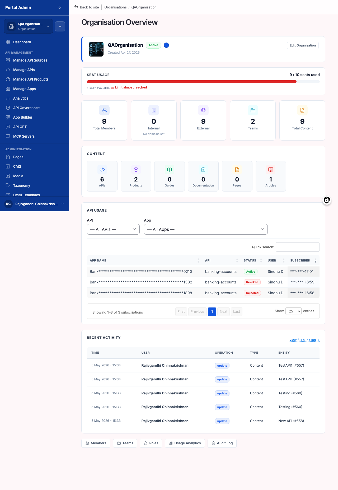
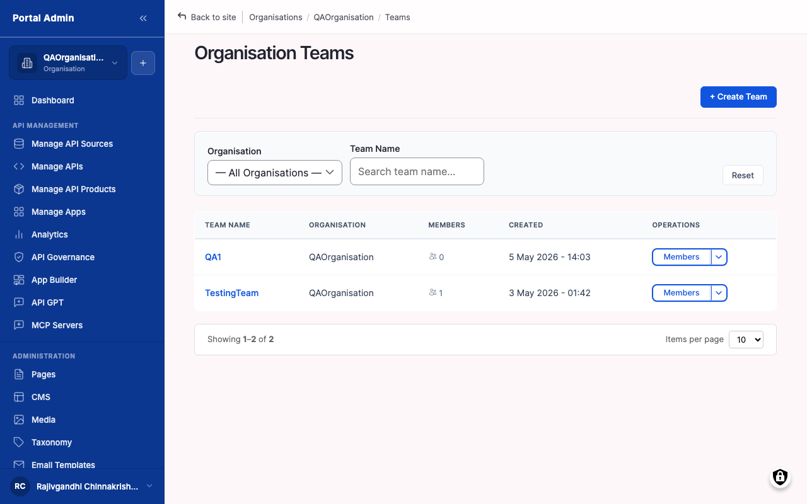
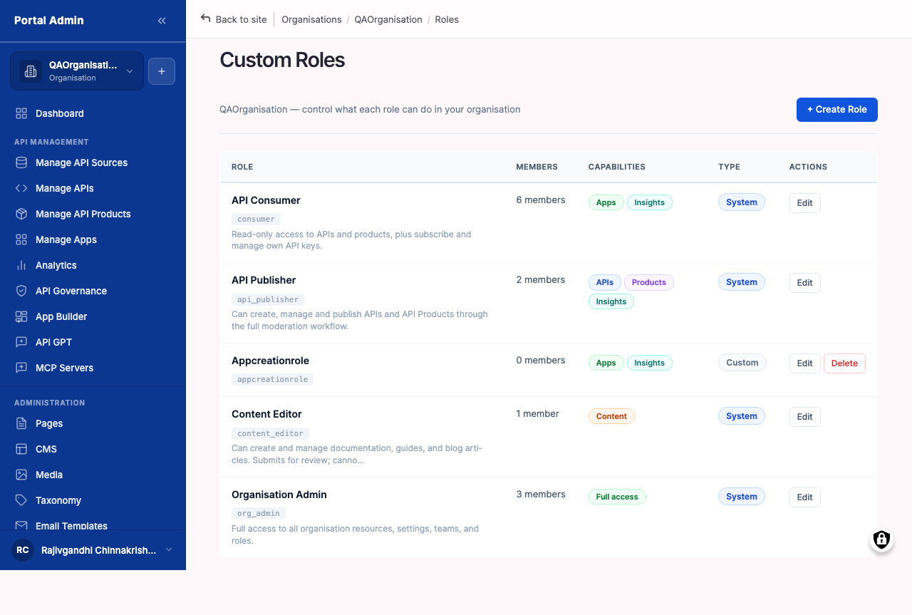
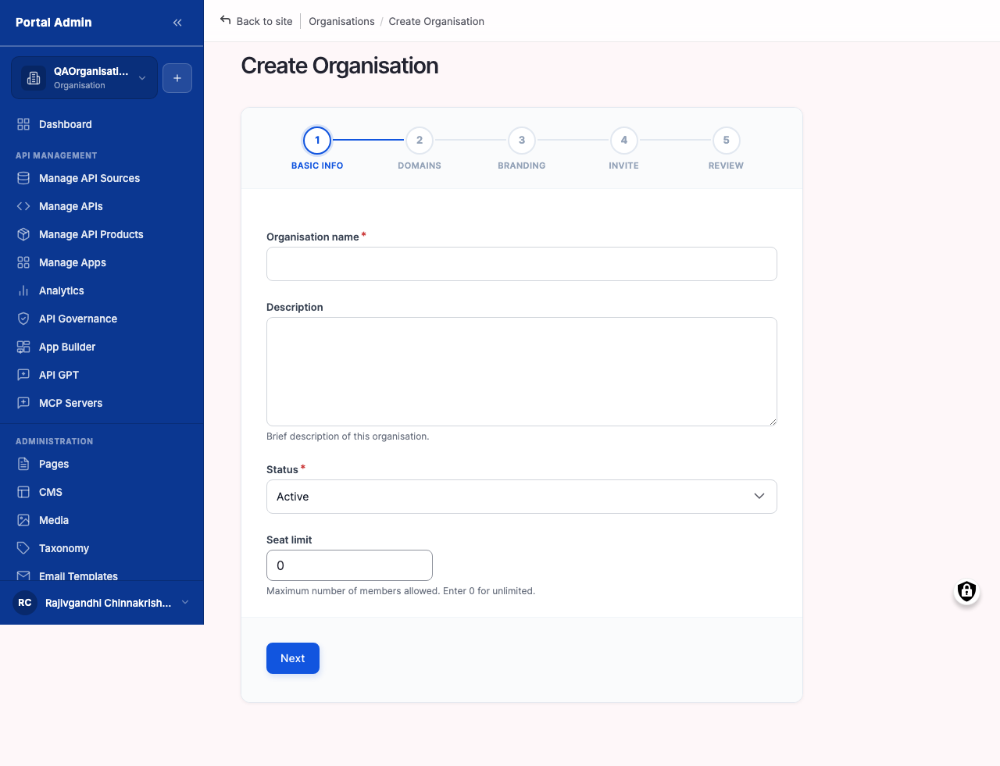

Running the marketplace is a team activity. You bring in colleagues to import APIs, review governance, design Products and plans, approve consumers, and watch traffic. Everyone you work with lives inside one **Organisation**, the unit of multi-tenancy on the marketplace. Inside that Organisation, **Members** are the individual users who sign in. **Teams** group those members into smaller crews so a Payments squad sees Payments APIs and a Cards squad sees Cards APIs. **Roles** decide what each member can do: import APIs, approve subscriptions, change settings, invite further members. This chapter walks every surface you use to run that work, from the Organisations list at the top to a single custom role at the bottom.

You will learn:

- How Organisations, Members, Teams, and Roles relate, and which page owns each one.
- How to invite a colleague, pick the right role, and land them in a team on first sign-in.
- How to run a monthly audit of who has access and which accounts have gone dormant.
- How to create a Team, add members, and scope APIs or Products so only that team sees them.
- How to recognise the four built-in roles and when to reach for a custom role instead.
- How to handle SAML-provisioned users and the role-assignment differences they bring.
- (Portal Admin only) How to add a fresh Organisation when a new tenant is being onboarded.

Allow ~45 minutes to walk the chapter and complete a first invitation.

The four entities relate like this:

- An **Organisation** is the top-level container. Every API, Product, subscription, App, and member belongs to one Organisation. A Portal Admin can run more than one Organisation on the same marketplace. An API Provider almost always works inside a single Organisation.
- A **Member** is one user account linked to one Organisation. The same email can be a member of more than one Organisation. The user picks which Organisation to act in after signing in.
- A **Team** is a sub-group inside an Organisation. Teams scope visibility for APIs and Products flagged Org Level. When a team is picked on a resource, only members of that team see it in the catalog.
- A **Role** is a bundle of permissions: which menu items appear, which buttons are enabled, which records can be edited. A member always has at least one role, and roles can stack.

The rest of the chapter takes each of those four ideas in turn.

## Recognising the Organisation surfaces

The **ORGANISATION** group in the left sidebar gathers every page that relates to your Organisation, its members, its teams, and its roles. As an API Provider you spend most of your time in **Organisation Members** and **Organisation Teams**. A Portal Admin sees one extra entry: the top-level **Organisations** list that spans the whole platform.

#### Open the Organisation list

Open the Organisation list when you want a top-level view of every Organisation in the marketplace, or when you need to confirm which Organisation you are currently acting in.

#### Before you start

- **Confirm your role.** As an API Provider you typically see only the Organisation you belong to. As a Portal Admin you see every Organisation on the platform with its member and team counts.
- **Know your active Organisation.** The Organisation switcher at the top of the sidebar shows the Organisation you are currently scoped into. Every action you take applies to that Organisation.

To open the Organisation list:

1. From the left sidebar, expand the **ORGANISATION** group.
2. Click **Organisations**. The page loads with the title **Organisations**.
3. Scan the table to find the Organisation you want to work with.
4. Click an Organisation's name to open its detail page.

The numbered callouts in Figure 11-1 are:

1. **Organisations**. The page heading. Each row is one Organisation on the platform.
2. **Name**. The Organisation's display name. Click the name to open the Organisation Overview.
3. **Status**. Active, Suspended, or Pending. A suspended Organisation cannot publish APIs or accept new subscriptions.
4. **Members**. The current member count for the Organisation. Click the number to jump straight to that Organisation's Members list.
5. **Teams**. The team count. Click to jump to the Teams list.
6. **Created**. The date the Organisation was created. Useful when reconciling against your tenant onboarding records.


**Result:** You see every Organisation visible to your role and can pick the one to manage.



**Note:** As an API Provider on a single Organisation, the list contains a single row, your own. The page is still useful as a navigation hub because the columns link straight to the corresponding Members and Teams pages.


#### Verify

1. Confirm the table shows at least one row and that the column headers (**Name**, **Status**, **Members**, **Teams**, **Created**) all carry data.
2. Click the **Members** count on your Organisation's row and confirm the page navigates to its Members list.
3. Return to the list and confirm the Organisation switcher in the top sidebar still reflects the Organisation you intend to act in.

#### Open your Organisation's detail page

Open the Organisation detail page when you need a single screen that summarises your Organisation and gives you links into every sub-surface: members, teams, roles, settings.

#### Before you start

- **Confirm you can reach the Organisations list.** The detail page is one click from the list. If the list is empty for your role, your Org Admin must grant you access first.
- **Know which Organisation you intend to inspect.** The breadcrumb at the top of every sub-page reflects the Organisation in scope. If you manage more than one, pick the right name from the list before drilling in.
- **Have your sub-task in mind.** The detail page is a hub. You arrive to invite a member, scope a team, audit roles, or edit branding. Knowing the next step saves backtracking.

To open the detail page:

1. From the **ORGANISATION** group in the sidebar, click **Organisations**.
2. Click the name of your Organisation. The page loads with the title **Organisation Overview**.
3. From the overview header, click **Members**, **Teams**, **Roles**, or **Settings** to drill into the corresponding sub-surface.

The numbered callouts in Figure 11-2 are:

1. **Organisation Overview**. The page heading. The name of the Organisation appears alongside it.
2. **Status badge**. Active, Suspended, or Pending. Mirrors the column on the Organisations list.
3. **Members count**. The number of members currently in the Organisation. Click to open the Members list.
4. **Teams count**. The number of teams in the Organisation. Click to open the Teams list.
5. **Edit organisation**. Opens the form covered in [Configure Organisation-wide preferences](#configure-organisation-wide-preferences).
6. **Sub-section tabs**. Members, Teams, Roles, and Settings tabs that scope the page to one entity at a time.


**Result:** You are inside your Organisation's working area, with a link to every sub-surface you need for the rest of this chapter.



**Tip:** Bookmark the Organisation Overview page in your browser. Most administrative tasks start there and branch out.


#### Verify

1. Confirm the heading reads **Organisation Overview** with your Organisation's name alongside it.
2. Confirm the **Members** and **Teams** counts match what you expect. Flag any drift to your Org Admin.
3. Click **Members** in the sub-section tabs and confirm the Members list opens scoped to this Organisation.

#### Configure Organisation-wide preferences

Configure Organisation-wide preferences when you need to set defaults that apply to every API, Product, and member created inside your Organisation, such as a seat limit, Organisation-level branding, or an auto-assigned default role for new sign-ups from your domain.

The settings live under the **SETTINGS** group, not on the Organisation Overview page. The **Organisation Overview** page edits the Organisation's name, theme colour, and seat limit. The **Organisation Settings** page covers platform-wide toggles that apply across every Organisation.

#### Before you start

- **Decide which toggles you want on.** The toggles change the experience for every member of every Organisation on this marketplace. Read the descriptions carefully before flipping them.
- **Confirm your role.** Some toggles are restricted to Portal Admin. As an API Provider you see those rows in read-only mode.

To configure Organisation-wide preferences:

1. From the left sidebar, expand the **SETTINGS** group.
2. Click **Organisation**. The page loads with the title **Organisation Settings**.
3. Tick or untick the toggles described in the figure callouts.
4. Choose a value from the **Default organisation role** dropdown.
5. Click **Save configuration**.

The numbered callouts in Figure 11-3 are:

1. **Enforce seat limit**. When ticked, the marketplace blocks invites once an Organisation reaches its seat count. When unticked, invites continue and you are billed for the overage.
2. **Enable organisation branding**. When ticked, each Organisation can override the marketplace logo, theme colour, and favicon for its own members. When unticked, every Organisation inherits the marketplace-wide branding.
3. **Enable organisation homepage**. When ticked, each Organisation can pick a custom landing page for its members on sign-in. When unticked, all members land on the marketplace-wide home page.
4. **Auto-assign by domain**. When ticked, a user signing up with an email matching an Organisation's verified domain is auto-added to that Organisation. When unticked, every Organisation membership is by explicit invite.
5. **Enable partner registration**. When ticked, an external partner can request to join an Organisation through a public form. The Org Admin approves or declines.
6. **Enable audit logging**. When ticked, member, role, and team changes are written to an audit log retained for 90 days. Recommended for production.
7. **Default organisation role**. The role assigned to a new member when no role is picked on the invite. Pick the lowest-privilege role that lets a new member do their job.


**Result:** The toggles save and apply on the next page load. New members and new Organisations pick up the new defaults immediately. Existing members keep their current roles.



**Note:** The per-Organisation theme colour, favicon, and homepage are set on the Organisation Overview's **Edit organisation** form, not on this page. This page controls whether per-Organisation branding is available at all.



**Caution:** Turning **Enable audit logging** off discards future audit entries. Past entries remain searchable until they age out of the 90-day window. Leave logging on in any production deployment.


#### Verify

1. Confirm the **Configuration saved** banner appears after you click **Save configuration**.
2. Reload the page and confirm every toggle holds its new state.
3. Sign in as a freshly-invited test user and confirm they land on the **Default organisation role** you picked.

## Inviting and managing members

The **Organisation Members** page lists every user linked to your Organisation, their role, their team membership, their status, and their last sign-in. From this one page you invite new members, change a member's role or team, suspend a member, or revoke them.

#### Read the Members list

Read the Members list to learn the surface before you touch it. Knowing every column, filter, and action turns the page from a wall of names into a quick triage tool.

To read the list:

1. From the **ORGANISATION** group in the sidebar, click **Members**.
2. The page loads with the title **Organisation Members**.
3. Read the column headers from left to right. The default order surfaces identity first, role second, status third.
4. Hover a sortable header. Title and Last sign-in are clickable; the arrow indicator shows the sort direction.

The numbered callouts in Figure 11-4 are:

1. **Organisation Members**. The page heading. Each row below is one member.
2. **Invite member**. Opens the invite form covered in the next task.
3. **Name**. The member's full name as it appears in their profile. Click a name to open the member detail page.
4. **Email**. The address the marketplace mails notifications to. The email is the unique identifier across Organisations.
5. **Role(s)**. The roles assigned to the member. A member can hold more than one role; multiple roles render as comma-separated badges.
6. **Teams**. The teams the member belongs to inside the Organisation. Empty when the member is not yet on any team.
7. **Status**. Pending (invite sent, not accepted), Active (accepted and signed in at least once), or Suspended (sign-in blocked, data preserved).
8. **Last sign-in**. The most recent sign-in timestamp. Useful for spotting dormant members before a seat-count audit.
9. **Edit**. Opens the member's detail page where you change role and team membership.
10. **Remove**. Revokes the member from the Organisation. The marketplace prompts you to confirm.

The list also offers three filter dropdowns above the table:

- **Status**. All, Pending, Active, or Suspended. Narrows the table to one lifecycle state at a time.
- **Role**. Lists every built-in and custom role available in the Organisation. Filtering by **Org Admin** is how you find the colleagues who can change settings.
- **Team**. Lists every team in the Organisation. Filtering by team is the quickest way to see who works on a product line.

Pagination sits below the table. The default is 25 rows per page and the per-page selector accepts 10, 25, 50, or 100. The empty state reads *No members match the current filters* when a filter combination has no matches.


**Result:** You can answer the basic governance questions at a glance: who has admin access, who is dormant, who is still pending an invite, and who works on which team.



**Tip:** The URL captures every filter and sort selection. Bookmark a filtered view (for example *Status = Pending*) so you reopen it next month without re-clicking.


#### Verify

1. Confirm the table shows at least one row, your own, with **Role = Org Admin** and **Status = Active**.
2. Sort by **Last sign-in** descending and confirm the row you signed in with sits at the top.
3. Apply the **Role = API Provider** filter and confirm only API Provider rows remain.

#### Invite a colleague to your organisation

Invite a colleague when they need to sign in to the marketplace and act on behalf of your Organisation: importing APIs, approving subscriptions, designing Products, or monitoring traffic.

#### Before you start

- **Have your colleague's work email address.** The invite is sent by email. If the colleague does not yet have a marketplace account, the same email becomes the unique identifier for the new account.
- **Decide on a role before inviting.** The four built-in roles (API Provider, Org Admin, API Consumer, Portal Admin) grant very different permissions. Pick the smallest role that lets the colleague do their job. Roles are covered in [Recognise the built-in roles](#recognise-the-built-in-roles) below.
- **Decide whether they go straight into a team.** If you already know the colleague will work on a specific area, say the Payments team, pick the team on the invite form so they land with the right scope on first sign-in.
- **Confirm your Organisation has seats available.** When **Enforce seat limit** is on, the form blocks the invite once the seat count is reached. Check the **Members** counter on the Organisation Overview before inviting a large group.

To invite a colleague:

1. From the **ORGANISATION** group in the sidebar, click **Members**.
2. Click **Invite member** at the top right of the **Organisation Members** page.
3. Enter the colleague's email in the **Email** field. The form validates the address and warns you if it already belongs to a member of this Organisation.
4. Pick a role from the **Role** dropdown. The four built-in roles appear first, followed by any custom roles your Org Admin has created.
5. Optional. Pick a team from the **Also add to team (optional)** dropdown to scope the colleague on first sign-in.
6. Optional. Add a personal note in the **Welcome message** field. The note appears in the invitation email above the standard sign-in link.
7. Click **Send invitation**.

The Invite member form fields are:

1. **Email**. Required. The work email address the invitation is mailed to. Must be a valid RFC 5322 address. Cannot match an existing member of this Organisation.
2. **Role**. Required. The role the colleague holds on first sign-in. Defaults to the Default organisation role configured on the Organisation Settings page.
3. **Also add to team (optional)**. A single-select picker listing every team in the Organisation. Leave blank if you do not want the colleague on a team yet.
4. **Welcome message**. Free-text note up to 500 characters. Personalises the invitation email; useful for a sentence such as *"Hi Sam, this is the marketplace where we publish Payments APIs."*
5. **Send invitation**. Saves the invite, mails the colleague, and creates a Pending row in **Organisation Members**.
6. **Cancel**. Discards the form without sending the invite.


**Result:** Your colleague receives an email invitation. Once they accept and either create an account or sign in with an existing one, they appear in **Organisation Members** with the role and team you picked. The row's status flips from Pending to Active on first sign-in.



**Note:** Inviting a colleague does not create a marketplace login from scratch. It links a new or existing account to your Organisation under the role you picked. If your Organisation uses single sign-on, your colleague signs in through your identity provider and the marketplace links the account on first sign-in.



**Tip:** Send invites in small batches with the same role and team rather than one large batch with mixed roles. The form accepts a single email per submission; sending homogeneous batches keeps the audit log easy to read.


#### Verify

1. Confirm a new row for the invitee appears in **Organisation Members** with status **Pending**.
2. Ask your colleague to confirm the invitation email arrived in their inbox.
3. Once they accept, refresh the list and confirm the row's status flips to **Active** and the role and team you picked are shown.

#### Accept an invitation (recipient view)

This task is for the colleague who has just received your invitation. The flow is included so you can walk them through it the first time, and so you can recognise the screens when a colleague asks for help.

To accept an invitation:

1. Open the invitation email. The subject reads *You have been invited to <Organisation name>*.
2. Click **Accept invitation**. The link opens the marketplace sign-up flow at `/user/register?token=<invite-token>`.
3. If you already have a marketplace account, click **Sign in instead** and authenticate. The marketplace links your existing account to the new Organisation.
4. If you do not have an account, fill the registration form: name, password, and any required profile fields. Submit.
5. The marketplace lands you on the Organisation Overview page for the inviting Organisation.


**Result:** The invitation token is consumed, the membership row flips from Pending to Active, and the inviter sees the change in **Organisation Members** within a minute.



**Note:** Invitation links expire after seven days. If a colleague reports a *Token expired* error, return to **Organisation Members**, find their Pending row, click the row action menu, and pick **Resend invitation** to issue a fresh token.



**Caution:** Each invitation token is single-use. Accepting on one device invalidates the link on another. If a colleague clicked the link from a laptop and the work account lives on their phone, resend the invitation rather than asking them to reuse the old link.


#### Resend or revoke a pending invitation

A pending invitation that has expired, been lost in a spam folder, or been issued to the wrong address needs a quick recovery action.

To resend a pending invitation:

1. From **Organisation Members**, apply the **Status = Pending** filter.
2. Locate the row for the colleague waiting on the invite.
3. Open the row action menu at the right of the row.
4. Click **Resend invitation**. A fresh token is generated and a new email is dispatched.

To revoke a pending invitation:

1. From the same row's action menu, click **Revoke invitation**.
2. Confirm in the dialog. The row disappears from the list and the original token is invalidated immediately.


**Result:** The recipient receives a fresh email (resend) or the invitation is cancelled with no further effect (revoke). Either way, the seat count released back to the Organisation budget once the row is no longer Pending or Active.



**Tip:** Revoke and re-invite rather than editing a pending invitation. The form is shorter the second time, and a clean revoke entry in the audit log is clearer than a chain of edits on the same token.


#### Review who is in your organisation

Run a monthly review of the Members list. Audits catch dormant accounts before they consume seats, stop a former colleague who slipped through offboarding, and confirm that no one has been given a wider role than their job needs.

To review who is in your Organisation:

1. From the **ORGANISATION** group in the sidebar, click **Members**.
2. Sort the list by **Last sign-in** ascending to surface dormant accounts at the top.
3. Filter by **Status = Pending** to find invites colleagues have not yet accepted. Re-invite the ones who still need access; revoke the rest.
4. Filter by **Role = Org Admin** to confirm only the people who should hold admin actually do. A small Org typically has two or three Org Admins; more than five is a flag.
5. Filter by **Role = API Provider** and scan for accounts that have not signed in for 90 days. Those are candidates for suspension.
6. Export the filtered list (where the export button is available) for compliance archives.


**Tip:** Make this a recurring monthly review on a shared calendar. Stale memberships are a common cause of seat-limit overruns and a meaningful security exposure when staff change roles.



**Note:** A dormant member is not the same as a hostile one. Suspend rather than remove for first-pass cleanup. A suspended member can be reactivated; a revoked one has to be re-invited from scratch.


#### Verify

1. Confirm the **Role = Org Admin** filter returns a count that matches your expected admin headcount.
2. Confirm the **Status = Pending** filter returns either zero rows or only rows you can name.
3. Confirm the **Last sign-in** ascending sort surfaces at least one dormant candidate, and that you take action on it (suspend, revoke, or note as still-needed).

#### Change a member's role

Change a member's role when their responsibilities change. A common case is promoting an API Consumer to API Provider, or stepping an outgoing Org Admin down to API Provider before they leave.

#### Before you start

- **Pick the smallest role that does the job.** A reader who only needs analytics does not need full API Provider write access. If a finer-grained custom role exists in your Organisation, use that instead.
- **Tell the member.** A role change takes effect on their next sign-in. Send them a heads-up so they expect new menu items to appear or disappear.

To change a member's role:

1. From the **ORGANISATION** group, click **Members**.
2. Locate the member's row. Click **Edit** at the right of the row.
3. The page navigates to the member's edit form.
4. Pick a new role from the **Role(s)** multi-select. Hold cmd or ctrl to add a second role.
5. Optional. Add or remove team memberships in the **Teams** multi-select.
6. Click **Save**.

The Member edit form fields are:

1. **Name**. Read-only. Surfaces the member's name for confirmation.
2. **Email**. Read-only. The unique identifier across Organisations.
3. **Role(s)**. Multi-select of every role available in the Organisation, built-in and custom. A member can hold more than one role; the effective permission set is the union.
4. **Teams**. Multi-select of every team in the Organisation. Adding a team grants the member access to all APIs and Products scoped to that team.
5. **Status**. Active or Suspended. Suspending blocks sign-in without deleting the row.
6. **Save**. Persists the changes. Takes effect on the member's next request.


**Result:** The member's role is updated. The change takes effect on their next request; they may need to refresh the browser to see new menu items appear or disappear.



**Note:** Custom roles defined by your Org Admin appear in the same dropdown alongside the four built-in roles. See [Create a custom role](#create-a-custom-role) below.



**Tip:** Start narrow. A role can be widened later in the same dropdown. The damage from a too-wide role granted by mistake is harder to undo.


#### Verify

1. Confirm the member's row in **Organisation Members** shows the new role.
2. Ask the member to refresh their browser and confirm the menu items they expect to gain or lose match the new role.
3. Open the audit log and confirm the role change is recorded against your username with the correct timestamp.

#### Suspend a member

Suspend a member to block their sign-in without removing their record. Suspension is the right tool for a member on extended leave, a member under HR review, or a member whose credentials may have been compromised and you want time to investigate.

To suspend a member:

1. From **Organisation Members**, locate the member's row.
2. Click **Edit** at the right of the row.
3. In the member edit form, change **Status** from **Active** to **Suspended**.
4. Add a brief **Suspension reason** in the field that appears beneath the status selector. The reason is captured in the audit log.
5. Click **Save**.


**Result:** The member's next sign-in attempt is rejected with a *Your account is suspended* message. Their data, ownership of Apps, and audit history all remain intact. The Members list shows the row with **Status = Suspended**.



**Tip:** Suspend before you revoke. A suspended member can be reactivated in a single click if the situation turns out to be a misunderstanding. A revoked member has to be re-invited and may lose ownership of their Apps in the process.



**Caution:** Suspension does not revoke any API keys the member created. If the suspicion is credential compromise, also rotate the keys owned by the member from the **Manage Apps** page covered in the Onboarding chapter.


#### Revoke a member from your organisation

Revoke a member when they have left your company, when they no longer work on the marketplace, or when their account has been compromised and you need to cut access fast.

#### Before you start

- **Confirm the member is no longer the owner of any live App or subscription.** Reassign owners on the Manage Apps page before revoking the account, or you risk orphaning consumer subscriptions.
- **Have the member's email address copied.** The confirmation dialog asks you to type the email verbatim to prevent an accidental click.
- **Tell the member.** Even a hostile-departure revoke is easier when the affected person hears it from you rather than seeing the access drop without warning.


**Caution:** Revoke is reversible (you can re-invite the member) but the side effects are not. Subscriptions and Apps that the member personally owns may be detached when their account is revoked. Migrate App ownership to a colleague before revoking.


To revoke a member:

1. From the **ORGANISATION** group, click **Members**.
2. Locate the member's row.
3. Click **Remove** at the right of the row.
4. Confirm in the dialog. The marketplace asks you to type the member's email to confirm an irreversible action.


**Result:** The member loses access to the Organisation. Their personal account remains so they can sign in to other Organisations they belong to, but they no longer see your Organisation's APIs, Products, subscriptions, or members.



**Note:** A revoked member's audit log entries are preserved. The audit retains a record of who did what, even after the actor is gone.


#### Verify

1. Confirm the member's row no longer appears in **Organisation Members**.
2. Ask the revoked user to confirm they no longer see your Organisation in the sidebar switcher when they sign in elsewhere.
3. Open the audit log and confirm the removal is recorded against your username with the reason captured.

#### Provision a SAML-authenticated user

SAML-authenticated users do not arrive through the invite form. When your Organisation has single sign-on configured, a user signing in through your identity provider lands on the marketplace as a Pending member of your Organisation, provided their email matches a verified domain. This task walks the differences from the email-invite flow.

#### Before you start

- **Confirm SAML SSO is configured.** SAML setup itself lives in **Configuring access and storefront branding**; without an IdP connection, SAML-driven provisioning does not happen.
- **Confirm the user's email domain is verified.** Auto-provisioning only triggers for users signing in with an email matching a domain on your Organisation's verified-domain list. Unverified domains fall back to manual invite.
- **Decide the default role for SAML-provisioned users.** The **Default organisation role** on the Organisation Settings page applies to SAML-provisioned users as well as email-invited ones.

To watch a SAML user provision themselves:

1. Direct the user to your Organisation's SAML sign-in URL. The format is usually `/saml/login/<org-id>`.
2. The user authenticates with your identity provider.
3. On first sign-in, the marketplace creates a member row in **Organisation Members** with status **Active** and role equal to the Organisation's default role.
4. The user lands on the Organisation Overview page on first sign-in.

To adjust the SAML-provisioned user's role:

1. From **Organisation Members**, filter by **Status = Active** and find the user's row.
2. Click **Edit** and pick a wider role from the **Role(s)** multi-select if the default role is too narrow for their job.
3. Click **Save**.


**Result:** The SAML user is a fully linked member of your Organisation. They sign in through your IdP every time, and you change their role and team from the same edit form you use for email-invited users.



**Note:** SAML-provisioned users do not show a **Pending** state. The first SAML round-trip creates them as **Active** because the identity provider has already authenticated them. Pending only happens with email invites.



**Tip:** Pick a narrow default role on the Organisation Settings page, then widen on a per-user basis as the colleague's job is confirmed. Set the default to API Consumer rather than API Provider; widening from Consumer to Provider is a low-risk action, the reverse is much harder to communicate.



**Caution:** SAML role mapping from IdP attribute to marketplace role is optional and configured in the SAML IdP form. When attribute mapping is in use, the **Default organisation role** is ignored and the IdP-supplied attribute wins. Confirm which mode your Organisation runs in before debugging an unexpected role assignment.


#### Verify

1. Sign in as a test SAML user and confirm they appear in **Organisation Members** with **Status = Active** within a minute.
2. Confirm the role assigned matches either the Organisation default role or the IdP-supplied attribute, depending on your configuration.
3. Open the audit log and confirm the provisioning event is recorded with the IdP name and the user's email.

## Organising members into Teams

Teams are an optional layer between an Organisation and an individual member. A team is a named sub-group that scopes which APIs and Products its members see in the catalog. Use teams when one Organisation runs more than one product line and you want each product line's APIs to stay private to its own crew.

#### Create a Team

Create a team when you need to scope APIs or Products to a subset of your Organisation. A common example is keeping the experimental Identity APIs visible only to the Identity crew, while the Payments crew sees only Payments APIs.

#### Before you start

- **Pick a clear name.** Team names appear in dropdowns on every API and Product visibility picker. Keep them short and recognisable: *Payments*, *Identity*, *Cards*, rather than internal codenames.
- **Have a one-line description ready.** The description appears in the team list and helps members joining later understand what the team owns.

To create a team:

1. From the **ORGANISATION** group, click **Teams**.
2. The page loads with the title **Organisation Teams**.
3. Click **Add team**.
4. Enter the team's **Name**.
5. Enter a one-line **Description**.
6. Click **Save**.
7. The page navigates to the new team's detail page, where you add members.

The numbered callouts in Figure 11-5 are:

1. **Organisation Teams**. The page heading. Each row below is one team in the Organisation.
2. **Add team**. Opens the create-team form covered in steps 3 to 6 above.
3. **Name**. The team's display name. Click the name to open the team detail page.
4. **Members**. The current member count for the team. Click to jump to the team's member list.
5. **Scoped APIs**. The number of APIs flagged Org Level and scoped to this team.
6. **Scoped Products**. The number of API Products scoped to this team.
7. **Created**. The date the team was created.

The Create team form fields are:

1. **Name**. Required, max 100 characters. The team's display name in every dropdown and badge.
2. **Description**. Optional, max 255 characters. A one-line note for the Teams list.
3. **Initial members**. Optional multi-select of existing Organisation members. Lets you populate the team in one shot instead of adding members afterwards.
4. **Save**. Creates the team and redirects to the team detail page.


**Result:** The team exists. The next step is to add members and to scope APIs or Products to it.


#### Verify

1. Confirm the new team appears in **Organisation Teams** with the name and description you entered.
2. Confirm the team detail page opens and the **Members** count starts at zero (or whatever number you picked on the form).
3. Confirm the team's name appears in the **Teams** picker on an API or Product Visibility form.

#### Add members to a Team

Add members to a team after the team is created, or when an existing member's responsibilities expand to a new product line.

#### Before you start

- **Confirm every prospective member is already in your Organisation.** The picker lists Organisation members only. If a colleague is missing, invite them first.
- **Have the team's name picked.** Picking the right team is the only point of failure here. Adding a member to the wrong team grants them visibility you did not intend.
- **Sanity-check the visibility implications.** Adding a member to a team gives them every Product and API scoped to that team. Review the team's scoped resources before you add anyone.

To add members:

1. From the **ORGANISATION** group, click **Teams**.
2. Click the team's name to open the team detail page.
3. Click **Add members**.
4. Pick one or more members from the dropdown of Organisation members.
5. Click **Save**.


**Result:** The picked members now belong to the team. They see any APIs and Products scoped to the team on their next page load.



**Note:** A member can be on more than one team. The visibility rule is additive: a member sees the union of every team's scoped resources.



**Tip:** Add yourself to every team as you create it, even if you do not actively work in that product line. As an API Provider you may need to triage a subscription request or a governance violation before someone on the team is online.


#### Verify

1. Confirm the team detail page now lists each new member.
2. Ask one of the added members to refresh the catalogue and confirm Org-Level resources scoped to the team are now visible to them.
3. Confirm the **Members** count on **Organisation Teams** matches the new size.

#### Scope APIs and Products to a Team

Scope an API or Product to a team to make it visible only to that team's members. Scoping is the right tool when an asset is in early development, when it is a private internal API, or when one product line should not see another product line's roadmap.

#### Before you start

- **Confirm the team exists and has the right members.** Scoping to an empty team makes the resource invisible to everyone except admins.
- **Confirm the asset is at the right visibility level.** Public APIs ignore team scope. Internal APIs are visible to every Org member regardless of team. Only Org Level honours the Teams picker.
- **Tell the affected teams.** Flipping scope on a published asset hides it from members not on the team; communicate before you save.

To scope a resource to a team:

1. Open the API or Product you want to scope. See the Publishing chapter for APIs and the Reviewing API Products and Plans chapter for Products.
2. In the **Visibility** picker, choose **Org Level**. A second **Teams** picker appears below.
3. Pick one or more teams in the **Teams** picker.
4. Click **Save**.


**Result:** The API or Product is visible only to members of the picked teams, plus to any Org Admin and Portal Admin. Members not on those teams do not see it in the catalog or in search.



**Note:** Team scoping only applies when **Visibility = Org Level**. Public APIs are visible to everyone on the marketplace; Internal APIs are visible to every member of the Organisation. Both ignore team scope.



**Caution:** Removing a team from a published API or Product hides it from members of that team on their next page load. Their existing subscriptions still work; the API does not stop responding. But they cannot find the asset in the catalog any more. Tell affected teams before flipping team scope on a live asset.


#### Verify

1. Sign in as a member of the picked team and confirm the asset appears in the catalogue and search.
2. Sign in as a member outside the picked team and confirm the asset is not visible.
3. Open the asset's audit history and confirm the Visibility change is recorded against your username.

#### Remove a member from a Team

Remove a member from a team when their responsibilities shift away from that product line, but keep them in the Organisation under their existing role.

To remove a team member:

1. From **Organisation Teams**, click the team's name to open its detail page.
2. Locate the member's row in the **Members** list on the team page.
3. Click **Remove from team** at the right of the row.
4. Confirm in the dialog.


**Result:** The member loses visibility of every API and Product scoped to that team on their next page load. They remain a member of the Organisation with their existing role and other team memberships intact.



**Tip:** When in doubt, suspend access rather than removing membership. If the member rotates back to the product line in a quarter, leaving the team membership in place saves the re-add.


## Working with Roles

Roles bundle permissions. A role decides which menu items appear, which buttons are enabled, and which records can be edited. The marketplace ships with four built-in roles that cover most needs, plus a custom-role builder for the rare case where you need a finer slice.

#### Recognise the built-in roles

Recognise the four built-in roles before you assign any of them. They are not interchangeable.

To open the Roles list:

1. From the **ORGANISATION** group, click **Custom Roles**.
2. The page loads with the title **Custom Roles**.
3. Scan the table to see every role available in your Organisation, built-in and custom.

The four built-in roles are:

1. **API Provider**. Imports APIs from a connected gateway, runs governance checks, designs API Products and plans, approves subscription requests, monitors analytics. The audience this guide is written for. Scoped to one Organisation.
2. **Org Admin**. Everything an API Provider can do, plus: invite members, change roles, define custom roles, configure single sign-on, brand the storefront, set the Organisation homepage. Scoped to one Organisation.
3. **API Consumer**. Browses the catalog, subscribes to plans, manages personal Apps and API keys, views their own usage analytics. No admin-side access. Scoped to one Organisation, but a consumer can hold memberships in many.
4. **Portal Admin**. Cross-Organisation administrator. Operates across every Organisation on the platform, configures marketplace-wide policies, manages the Organisation list, runs platform-wide system notifications. Reserved for the platform team running the marketplace itself. Out of scope for most teams.

The numbered callouts in Figure 11-6 are:

1. **Custom Roles**. The page heading.
2. **Role name**. The display name. Click to open the role's permission editor.
3. **Source**. Built-in or Custom. Built-in roles cannot be renamed or deleted; their permission set can only be viewed.
4. **Members**. The number of members currently holding the role. Useful when planning to retire a role.
5. **Add role**. Opens the create-role form covered in [Create a custom role](#create-a-custom-role) below.


**Note:** Most Organisations get along with the four built-in roles for the lifetime of the marketplace. Add a custom role only when you have a real need; see the next section.



**Tip:** Click each built-in role to view its permission set in read-only mode. The grid is grouped by surface and is the fastest way to learn what each role can and cannot do, before you grant it.


#### Create a custom role

Create a custom role when one of the built-in roles is too wide or too narrow for a colleague's job. A common case is an *Approver* role that can approve subscription requests but cannot import APIs or change governance.

#### Before you start

- **Write the role's purpose in one sentence.** *"Approves subscription requests for the Payments team. Cannot edit APIs or governance rules."* That sentence becomes the role's description and gets you a faster review by the colleague who reports to you.
- **List the permissions the role needs.** Check the four built-in roles' permission sets first. Often a custom role is a built-in role plus or minus one or two permissions.

To create a custom role:

1. From the **ORGANISATION** group, click **Custom Roles**.
2. Click **Add role**.
3. Enter a **Role name**, short and recognisable.
4. Enter a one-line **Description** of what the role can do.
5. Tick the permission checkboxes the role needs. The list is grouped by surface: APIs, Products, Subscriptions, Members, Teams, Settings.
6. Click **Save**.
7. Assign the new role to one or more members. See [Change a member's role](#change-a-members-role).

The Add role form fields are:

1. **Role name**. Required, max 100 characters. The display name in dropdowns and audit entries. Must be unique within the Organisation.
2. **Description**. Optional, max 255 characters. One-line summary shown on the Custom Roles list.
3. **Base role**. Optional dropdown. Picking a base role pre-ticks every permission held by that role; you then add or remove individual checkboxes. Useful for "API Provider plus one extra permission" scenarios.
4. **Permission grid**. Required. Grouped by surface. Each surface (APIs, Products, Subscriptions, Members, Teams, Roles, Settings, Analytics) lists a view, edit, create, delete, and approve checkbox where applicable.
5. **Save**. Persists the role and returns to the Custom Roles list.


**Result:** The new role is available in the **Role(s)** dropdown on the Members page and on the invite form. Colleagues you assign it to pick up the new permissions on their next sign-in.



**Tip:** Test a new custom role against a sandbox member account first. Sign in as that member and confirm the menu items, buttons, and records behave as you expect before assigning the role to a real colleague.



**Caution:** A permission ticked by mistake on a custom role takes effect for every member holding that role on their next request. Review the permission grid carefully before saving.


#### Verify

1. Confirm the new role appears in the **Custom Roles** list with the correct name and **Source = Custom**.
2. Open the role's permission editor and confirm the ticked checkboxes match your intent.
3. Assign the role to a sandbox member and confirm the menu items, buttons, and records they see align with your design.

#### Assign a role to a member

Assigning a role to a member uses the same flow as changing a role. See [Change a member's role](#change-a-members-role) for the steps. The custom role you created appears in the same **Role(s)** multi-select alongside the four built-in roles.


**Tip:** Two roles can stack. Assigning both *API Provider* and a custom *Approver* role grants the union of the two permission sets. Use stacking sparingly; it is easier to reason about a single role than three layered ones.


#### Audit role usage

Audit role usage when you are about to retire a custom role, when an annual access review is due, or when a permission you thought was narrow turns out to be granted broadly.

To audit role usage:

1. From the **ORGANISATION** group, click **Custom Roles**.
2. Sort the table by **Members** descending. The role granted to the most colleagues sits at the top.
3. For each role with a non-zero member count, click the **Members** number to open a filtered Members list scoped to that role.
4. Cross-reference the filtered Members list against your access matrix. Flag any member whose job no longer matches the role.
5. For unused roles (zero members), decide whether to delete or to keep as a documented standard.


**Result:** Every role's member set is reviewed against an external source of truth. Mis-grants are caught before they show up in an incident review.



**Note:** Deleting a custom role with zero members is safe. Deleting a custom role that still has members is blocked; you must reassign the affected members to a different role first.



**Tip:** Run this audit on the same monthly cadence as the Members review. The two reviews share a similar mindset and combining them takes only an extra five minutes.


## Adding and removing Organisations (Portal Admin)

This section covers a Portal-Admin-only task. As an API Provider on a single Organisation, the **Add organisation** button does not appear in your sidebar. The information is included so you understand what your Portal Admin sees and can plan a tenant onboarding conversation.

#### Add a new Organisation

Add a new Organisation when a new tenant is being onboarded to the marketplace: a separate company, a separate business unit, or a separate brand that needs its own isolated set of APIs, Products, members, and branding.

#### Before you start

- **Confirm the new tenant's name and contact owner.** The owner becomes the first **Org Admin** of the new Organisation and receives the welcome email.
- **Know the seat limit.** Pick a number that matches the tenant's contracted seat count. The seat limit can be widened later but should not be set arbitrarily high.
- **Confirm domains for auto-assign by domain.** If you have **Auto-assign by domain** turned on, every email matching the listed domains is auto-added to the new Organisation on sign-up. List only domains the tenant fully owns.

To add an Organisation:

1. From the **ORGANISATION** group, click **Organisations**.
2. Click **Add organisation**.
3. The page loads with the title **Create Organisation**.
4. Enter the **Organisation name**.
5. Enter a **Description**.
6. Pick a **Status**: Active for an immediately-live tenant, Pending while you finish setup.
7. Enter a **Seat limit** matching the tenant's contracted seat count.
8. Click **Save**.
9. Open the new Organisation and click **Invite member** to invite the first Org Admin. See [Invite a colleague to your organisation](#invite-a-colleague-to-your-organisation).

The numbered callouts in Figure 11-7 are:

1. **Organisation name**. The tenant's display name. Appears in the sidebar switcher, on every API and Product the tenant owns, and on the storefront. Required.
2. **Description**. A one-line note for your own records: what business the tenant is in, who the owner contact is, what stage the onboarding is at. Visible only to admins.
3. **Status**. Active makes the Organisation live immediately. Pending hides it from the catalog while you finish setup. Required.
4. **Seat limit**. The maximum number of members the Organisation can hold when **Enforce seat limit** is on. Leave blank for no limit.
5. **Save**. Creates the Organisation. The first Org Admin still needs to be invited as a separate step.


**Result:** The new Organisation exists. It appears in the Organisations list with status Pending or Active and zero members until you invite the first Org Admin.



**Note:** Multi-tenancy is by Organisation. Each Organisation is isolated; its APIs, Products, subscriptions, members, teams, and branding are all scoped to one Organisation. Cross-Organisation visibility happens only when a resource is flagged **Public** on its visibility picker.



**Tip:** Set the new Organisation to **Status = Pending** while you finish onboarding: invite the Org Admin, set the theme colour, configure single sign-on. Flip to **Active** once the Org Admin has signed in and confirmed the tenant is ready to go live.



**Caution:** Deleting an Organisation deletes every API, Product, subscription, App, and member inside it. The action is irreversible and is restricted to Portal Admin. Suspend the Organisation first and confirm with the tenant before deleting.


#### Verify

1. Confirm the new Organisation appears in the **Organisations** list with the chosen name and status.
2. Switch into the new Organisation from the sidebar switcher and confirm every count (Members, APIs, Products) starts at zero.
3. Send the first **Org Admin** invitation and confirm they accept and land on the new tenant's Overview page.

## Next steps

- **Configuring access and storefront branding**. Brand the new Organisation to match its tenant identity before consumers arrive, and finish SAML configuration.
- **Reviewing API Products and Plans**. Once your team is in place, design the Products and plans they will publish to consumers.
- **Publishing your first API**. Members with the API Provider role can now follow the publish flow against the gateway you connected earlier.