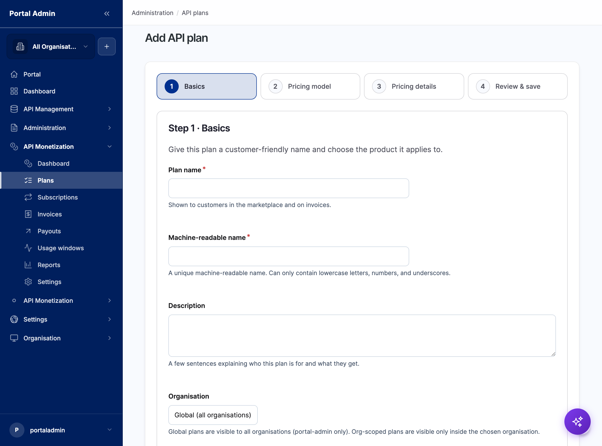
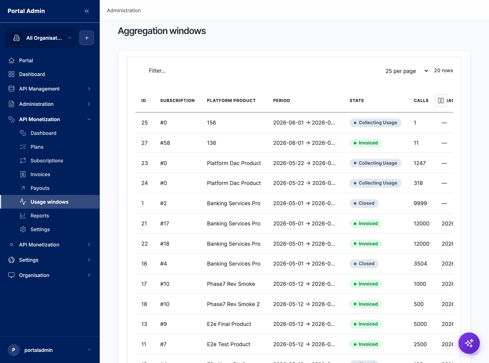

Monetization turns API consumption into revenue. It is the pricing brain for the marketplace: you author plans, attach them to products, and the platform meters usage, raises invoices, and tracks payouts. Open it from the sidebar under **API Monetization**, which lands on a dashboard of plans, active subscriptions, open invoices, and pending payouts, with anything that needs attention flagged for review.

## Two modes

How monetization meters and enforces depends on where the gateway sits:

- **Proxy mode.** Astra Gateway sits in the request path, so the marketplace meters every call and enforces quotas in real time. Every pricing model is available, and billing is exact per call.
- **Federated mode.** Consumer applications call the gateway directly. The gateway enforces quotas; the marketplace collects usage after the fact and closes each billing window after a grace period. Simpler pricing (per-call, freemium, soft-quota) applies, and billing is eventual rather than per-call.

## What you configure

The API Monetization area groups the work into a few surfaces:

- **Plans.** The price, quota, and tier on a product, with a pricing model and currency.
- **Subscriptions.** The link between a consumer application and a product under a plan, with its lifecycle.
- **Usage windows.** Aggregation of metered calls per subscription per billing period, moving from **Collecting Usage** to **Closed** to **Invoiced**.
- **Invoices.** Rated usage rolled into billable line items for a period.
- **Payouts.** Revenue-share disbursements to providers, with retries on failure.
- **Billing plan mappings.** The link between a marketplace rate plan and a product and price in your external billing platform.
- **Settings.** Currency, grace period, and billing behaviour.

## Create a plan

Plans are authored in a four-step wizard.

1. From the sidebar, open **API Monetization**, then **Plans**, and click **Add plan**.
2. **Basics.** Enter a customer-facing plan name, a machine-readable name, and a description, then choose the organisation scope. Global plans are visible to every organisation; org-scoped plans are visible only inside the chosen organisation.
3. **Pricing model.** Choose how the plan charges: fixed fee, pay-as-you-go, flat fee with quota, tiered, volume, freemium, revenue share, or hybrid.
4. **Pricing details.** Set the fee, currency, quota, rate limits, and any tier boundaries.
5. **Review and save.** Confirm the plan, which then becomes available on its product for consumers to subscribe to.

## Connect a billing platform

The marketplace prices and meters; money movement is delegated to a pluggable billing platform. A **billing plan mapping** links a marketplace rate plan to the external platform's product and price.

1. Open **API Monetization**, then **Billing plan mappings**, and add a mapping.
2. Choose the rate plan, select the billing adapter (Stripe, Kill Bill, Zuora, or Chargebee), and enter the external product and price identifiers.
3. Save. Rated invoices now flow to that platform for charging and collection.

Switching billing platforms is a configuration change, not a re-platforming: the pricing logic stays in the marketplace, and only the adapter and mappings change.

## Read usage and revenue

- **Usage windows** show the calls counted for each subscription in each period and the window's state. A window stays **Collecting Usage** for the grace period, then **Closes** and is **Invoiced**.
- **Invoices** list the rated line items per period, with open, paid, and past-due states and a retry path for failures.
- **Payouts** track what is owed to providers under revenue-share plans, with pending, paid, and failed states.
- **Marketplace reports** show revenue over time, invoice mix, and top plans and products, exportable to CSV or JSON for finance.

## Verify

- After **Add plan**, confirm the plan appears in the Plans list with its pricing model, currency, and scope.
- After a billing mapping is saved, confirm it lists the rate plan, adapter, and external identifiers.
- Send traffic against a subscribed application and confirm a usage window opens for it, then closes and produces an invoice once the grace period passes.


**Note:** In federated mode the marketplace reports what the gateway meters, so usage and invoices reflect the gateway's collection schedule, not real time.
**Result:** Plans price access, usage windows meter it, invoices bill it, and payouts settle revenue share, with an external billing platform handling charging.
