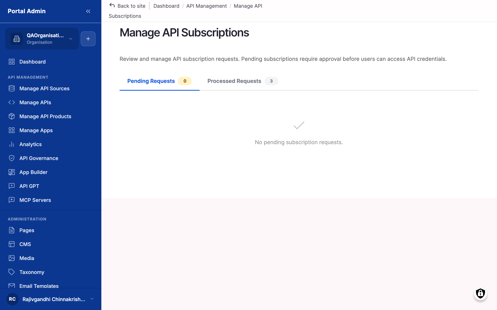
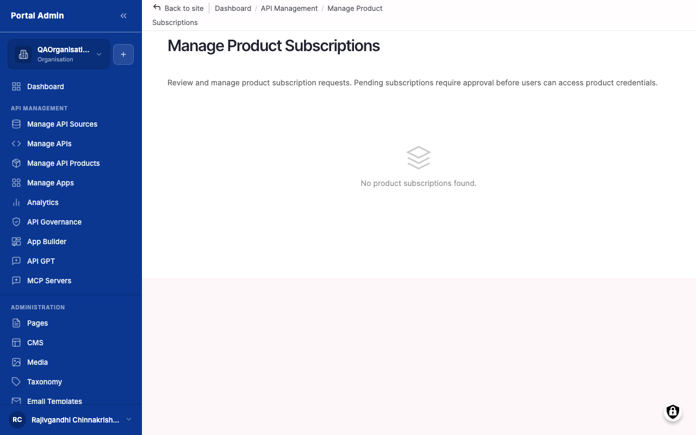

Once your API Product is published, the next event in the marketplace is a subscription request: a consumer signs in to the portal, locates your Product, registers an app, and clicks **Subscribe**. Until you act on that request, the consumer cannot make a call. This chapter walks through the subscription lifecycle, how to find pending requests, how to approve them, how the consumer is notified, where the first calls land, and how to suspend or revoke access if the relationship breaks down.

You will learn:

- How a subscription moves through Pending, Active, Suspended, and Revoked, and which actor triggers each transition.
- How to find pending requests in Manage Product Subscriptions and review the requesting consumer's app.
- How to approve a request so the gateway accepts the consumer's first call within minutes.
- How to send a kickoff message that supplements the marketplace's transactional email.
- How to read the first-call signals on a subscription detail page.
- How to suspend a subscription to pause traffic, and when to revoke instead.

Allow ~30 minutes to work through the chapter end to end on a fresh subscription.

## Understanding the subscription lifecycle

A subscription moves through four states: **Pending**, **Active**, **Suspended**, **Revoked**. Each transition is triggered by a specific actor.

- **Pending → Active.** Triggered by you (the API Provider or Portal Admin) when you approve the request from Manage API Subscriptions or Manage Product Subscriptions. The marketplace issues an API key, registers it on the gateway, and notifies the consumer.
- **Active → Suspended.** Triggered by you to pause calls without destroying the key. Suspended subscriptions stop accepting calls at the gateway, but the key, the app, and the call history are preserved. The consumer can resume from where they left off when you reactivate.
- **Active → Revoked** or **Suspended → Revoked.** Triggered by you when the relationship is over. The marketplace destroys the key on the gateway, retains the audit record, and the consumer must subscribe again from scratch to resume.
- **Pending → Revoked.** Triggered by you (via Reject Subscription) when you decide not to onboard the requester at all. The consumer is notified that the request was rejected and must resubmit.

Two views show subscriptions in the admin UI: **Manage API Subscriptions** (per-API, deprecated for new flows) and **Manage Product Subscriptions** (per-Product, the current canonical view). Use the Product view by default; fall back to the API view only to investigate a single-API subscription that pre-dated your Product redesign.

## Reviewing pending subscriptions

When consumers are signing up, the first task each morning is to check the queue.

#### Review pending subscriptions

Use this task to find new requests that require attention.

#### Before you start

- **Confirm your portal sends email notifications.** If `/admin/config/system/smtp` is not configured, you will not receive an email when a request lands and must check the list manually each day.
- **Define your approval policy.** Free tier auto-approve, Pro tier manual review, Enterprise tier procurement-led? Write the policy down somewhere your team can see; the marketplace does not enforce it for you.

To review pending subscriptions:

1. From the left sidebar, select **API MANAGEMENT**, then **Manage Product Subscriptions**. The list opens at `/admin/portal/product-subscriptions`.
2. Filter the list to show only pending requests. The view defaults to all states; select *Pending* in the status filter at the top.
3. Each row shows the consumer's app name, the consumer's user, the requested Product, the requested plan, and the request timestamp.
4. Click the app name on the row to open the consumer's app detail page in Manage Apps. From there, review the app description, the requesting user, and any context the consumer provided.
5. Repeat for the **Manage API Subscriptions** view (`/admin/portal/subscriptions`) if your portal still has direct-API subscriptions. Most current Marketplace deployments use the Product view exclusively.

The numbered callouts in Figures 8-1, 8-2, and 8-3 are:

1. App name — Click to open the consumer's app detail page. Shows the registering user, the registration date, the description, and any notes.
2. Consumer user — The marketplace user who registered the app. Click to see their profile and other apps.
3. Requested Product or API — The Product (Figure 8-3) or API (Figure 8-2) the subscription is for.
4. Plan — The plan tier on the Product. In the current Marketplace there is one plan per Product, so this almost always matches the Product name.
5. Status — *Pending*, *Active*, *Suspended*, or *Revoked*. The action buttons available on the row depend on the current status.
6. Action buttons — Approve, Reject Subscription, suspend, or Revoke Access. The available set depends on the current status.

> **Result:** You have a list of pending requests with enough context to decide whether to approve each one.

> **Note:** The marketplace does not auto-expire pending requests. A request that sits in *Pending* for six months is still valid until you approve, reject, or revoke it. Build a regular review cadence into your operations.

> **Tip:** If your team handles many requests, sort by request date ascending so the oldest are at the top. Consumers waiting more than a few business days lose interest and unsubscribe before you reach them.

#### Verify

1. Confirm the **Manage Product Subscriptions** page has loaded with a non-empty queue when at least one consumer has subscribed.
2. Confirm the status filter set to *Pending* hides every Active, Suspended, and Revoked row.
3. Click into one row and confirm the consumer's app detail page opens with the registering user, app description, and request timestamp visible.

## Approving a subscription

Approval is the moment the relationship goes live. From the click of Approve to the consumer's first call is typically less than a minute.

#### Approve a subscription

Use this task to grant a consumer access to your Product or API.

#### Before you start

- **Confirm the consumer's identity matches your records.** For paid tiers this is a procurement check. For free tiers the email domain is often sufficient.
- **Confirm the gateway has capacity.** A single approval is fine, but when approving ten subscriptions at once, monitor the gateway's connection metrics — the marketplace registers the keys synchronously.

To approve a subscription:

1. Open Manage Product Subscriptions (or Manage API Subscriptions for direct-API subs).
2. Filter to *Pending* and locate the row.
3. Click the **Approve** action on the row.
4. The marketplace prompts for confirmation if the Product has a paid plan. Confirm.
5. The marketplace registers the API key on the gateway, sets the subscription state to *Active*, and queues a notification email to the consumer.

> **Result:** The subscription is *Active*. The gateway accepts calls authenticated with the new key. The consumer sees the key in their My Apps page on the portal and receives an email containing the key and a link to your Product documentation.

> **Note:** The API key is shown to the consumer on their My Apps page. The marketplace does not show the full key to providers after issue — your audit log shows the key prefix only.

> **Tip:** If your plan has a long quota period (for example monthly), approve subscriptions early in the period so the consumer receives a full month's worth of calls. Approving three days before a renewal looks ungenerous.

#### Verify

1. Confirm the subscription row's status changes from *Pending* to *Active* without a page reload error.
2. Confirm a notification email has been queued — check your portal's outbound mail log or send a test event afterwards.
3. Open the consumer's subscription detail page and confirm an API key prefix is now displayed.
4. Wait five minutes, then re-open the detail page and confirm the call counter increments once the consumer makes a request.

## Communicating with the consumer

The marketplace sends one transactional email per state transition, but there is no in-product chat. For anything beyond a transactional notification, reach out by email.

#### Communicate with the consumer

Use this task when a request requires context the consumer has not provided, or when an approval needs a kickoff message.

#### Before you start

- **Prepare a kickoff template.** A consistent first email — welcome line, key location, documentation link, support address — saves re-typing. Store the template in your team wiki.
- **Use the email on the consumer's profile.** Click through to the user from the subscription row to copy the email address.

To communicate with a consumer:

1. From the subscription row, click the consumer's user link to open their profile. The profile shows the registered email.
2. Open your mail client and send a kickoff email. Include the Product name, the API key location (their My Apps page), the Documentation link, and your support address.
3. (If the request was rejected) Use the Reject Subscription action on the row to trigger the rejection notification, and follow up with a personal email if the rejection needs explanation.
4. Track the conversation in your team's CRM or ticketing system; the marketplace does not store consumer emails or threads.

> **Result:** The consumer has a real human contact and a clear next step.

> **Note:** Approving a subscription automatically queues a notification email to the consumer's primary inbox. The transactional email contains the key location and a Product link; it does not contain a personal message. Send your own kickoff to add one.

> **Tip:** Set up a shared inbox for consumer onboarding (for example `developers@<your-domain>`) so messages are not lost when team members are away.

#### Verify

1. Confirm the kickoff email arrived in the consumer's inbox by asking the consumer to acknowledge or by sending a test message to a colleague's address first.
2. Confirm the email contains the Product name, the API key location, the documentation link, and the support address.
3. Log the conversation in your CRM or ticketing tool with a link back to the subscription row.

## Watching the first calls land

The fastest signal that approval worked is the consumer's first call. It typically appears within minutes.

#### Watch the first calls land

Use this task immediately after approval to confirm the gateway and the marketplace are in sync.

#### Before you start

- **Open the consumer's app or product subscription detail page.** This is where call counts roll up.
- **Treat timing as indicative, not guaranteed.** Some consumers integrate the same day; some take a fortnight. The first call landing within ten minutes of approval is a good signal that the integration path is healthy.

To watch the first calls land:

1. From Manage Product Subscriptions, click through to the consumer's subscription detail page.
2. The page shows the call count, the last call timestamp, and the most recent gateway response codes.
3. Refresh after five minutes. If the count is still zero, that is acceptable — most consumers do not call within five minutes. The relevant signal is the first non-zero value.
4. If the count is non-zero and the response codes are 2xx, the integration is live. Cross-link to [Monitoring usage](monitoring-usage.md#monitoring-usage) to follow the longer-running view.
5. If the count is non-zero but the response codes are 401 or 403, the consumer's key is not being sent correctly — reach out and check their integration. If the codes are 5xx, the API itself is failing — check the gateway and your upstream service.

> **Result:** You have visibility into first-call success and can identify integration problems while the consumer is still in onboarding.

> **Note:** Call counts roll up from the gateway on a poll interval — typically one to five minutes. A zero count immediately after approval is normal.

> **Tip:** Bookmark the consumer's subscription detail page for the first week of the relationship. Once usage is steady, switch to the aggregate view in Chapter 9.

#### Verify

1. Confirm the call counter on the subscription detail page is non-zero within the first day of approval.
2. Confirm the most recent response codes are `2xx`, indicating a healthy round-trip.
3. If response codes are `4xx` or `5xx`, click through to the call detail and reach out to the consumer with the specific error before they raise a ticket.

## Suspending or revoking a subscription

Sometimes the relationship stops working. Suspend pauses; revoke ends. Both actions take effect immediately at the gateway.

#### Suspend or revoke a subscription

Use suspend when the consumer is in arrears or violating the rate limit and calls need to be paused while the issue is resolved. Use revoke when the relationship is over.

#### Before you start

- **Confirm the consumer has been notified.** Suspending without warning produces support tickets. Send an email a week ahead.
- **Confirm the action is reversible.** Suspended can be reactivated to Active. Revoked is final; the consumer must resubscribe from scratch.
- **Capture a reason.** Both actions take a free-text Reason field. The reason appears in the consumer's notification email and in the audit log.

> **Caution:** Revoking a subscription destroys the API key on the gateway. Calls in flight at the moment of revoke may complete; new calls return 401. The action cannot be undone — the consumer cannot resume; they must re-subscribe and you must re-approve. Use suspend if there is any chance of resumption.

To suspend a subscription:

1. From Manage Product Subscriptions, locate the row for the active subscription.
2. Click the suspend action on the row.
3. Enter a short note in the **Reason** field — for example, *Plan downgrade in progress* or *Payment issue, pending resolution*.
4. Confirm. The subscription state moves to Suspended. The gateway stops accepting calls authenticated by the key. The consumer's app dashboard reflects the new state.

To revoke a subscription:

1. From Manage Product Subscriptions, locate the row for the active or suspended subscription.
2. Click the **Revoke Access** action.
3. Enter a short note in the **Reason** field. The note is included in the consumer's notification email.
4. Confirm. The subscription state moves to Revoked. The gateway destroys the key. The action is final.

The numbered callouts on the suspend / revoke dialog are:

1. **Reject Subscription** — Used on a *Pending* row when you do not intend to onboard the requester at all. Sends a rejection notification.
2. **Revoke Access** — Used on an *Active* or *Suspended* row to end the relationship permanently. Destroys the key on the gateway.
3. **Reason** — Free-text rationale. Required. Surfaces in the consumer's notification email and the marketplace audit log.

> **Result:** The consumer's calls return 401 from the moment the suspend or revoke completes. Their key is preserved (suspend) or destroyed (revoke). The audit log records who acted and why.

> **Note:** Suspending a subscription does not credit unused quota. Quota counters resume from where they were when the subscription returns to *Active*.

> **Tip:** Use revoke sparingly. Most consumer disputes resolve faster when the consumer knows they can resume. Suspend buys time; revoke ends the conversation.

#### Verify

1. Confirm the subscription row's status changes to *Suspended* or *Revoked* immediately after you confirm the dialog.
2. Ask the consumer to retry a call and confirm the gateway returns `401`.
3. Open the audit log entry for the action and confirm the **Reason** text you entered is captured against your username.
4. For a suspended subscription, reactivate it in a sandbox environment and confirm calls resume with the same key.

## Next steps

- **[Monitoring usage](monitoring-usage.md#monitoring-usage)** — Once your first consumer is approved, the next chapter shows how to read the analytics dashboard for their incoming calls.
- **[Exposing APIs to AI agents](exposing-apis-to-ai-agents.md#exposing-apis-to-ai-agents)** — When you are ready to widen access beyond human consumers, register an MCP server for the same API.
- **[Managing your team](managing-your-team.md#managing-your-team)** — Delegate subscription approvals to a colleague by inviting them to the Organisation with a suitable role.
