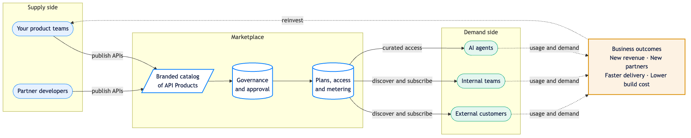

# Overview

This page sets out the business rationale for an API marketplace, the value it delivers, the capabilities it provides, and how the components fit together. For step-by-step procedures, follow the chapters from [Getting started](getting-started.md) onward.

## Why an API marketplace

A marketplace provides three avenues for growth that a gateway alone does not. Each converts existing engineering investment into commercial value.


**Grow revenue in existing markets.** Publish your APIs as subscribable products to current customers and partners. A self-service catalog with interactive documentation and self-registration shortens the path from initial interest to active integration.



**Expand into new markets through partners.** Onboard third-party providers to publish alongside your own teams. Their APIs broaden the catalog and extend your reach to their audiences, establishing an ecosystem rather than a single-vendor catalog.



**Accelerate delivery by composing existing APIs.** Consume partner and third-party APIs from the same catalog your teams use to publish. Integrating proven capabilities rather than rebuilding them reduces both cost and time to market.


## Who it serves

A marketplace serves several audiences, each with a tailored, branded experience.

- **Providers** (product teams and partner developers) publish APIs, enrich them with documentation and branding, define who may access them, and monitor how they are used.
- **Consumers** (external customers and internal teams) discover APIs, review interactive documentation, request access, manage their credentials, and build against them with confidence.
- **The business** gains a governed channel in which access is controlled, usage is measured, and subscriptions provide recurring revenue.

This collaboration across the organisation, its customers, and its partners compounds over time. A gateway manages traffic; a marketplace builds an ecosystem around it.


**A single API is rarely the product.** Customers adopt complete capabilities rather than individual endpoints. Marketplace lets you bundle related APIs into Products and Plans, so a subscriber receives a complete capability with its commercial terms defined, rather than a set of disconnected endpoints.


## How the marketplace creates value

The marketplace sits between the teams that build APIs and the audiences that consume them. Product teams and partners publish into one branded catalog. Governance and approval maintain quality and control access. Plans and metering convert access into subscriptions. Consumers discover, subscribe, and build, and the resulting usage informs the analytics that guide future investment. This cycle sustains growth.

## Capabilities and business value

Each capability maps to a business outcome, not only a technical one.

| Capability | What it does | Business value |
| --- | --- | --- |
| Branded catalog and discovery | Consumers browse, search, and filter every published API and Product in a storefront styled to your brand. | Straightforward discovery converts interest into adoption and retains customers on your own channel. |
| Multi-gateway connections | One console reads APIs and Products from every major gateway, wherever they run. | Reuse the gateways you already operate, with no migration or re-platforming cost. |
| API governance scoring | Every specification is scored against linting rulesets, with severity-ranked findings and remediation guidance. | Consistent, high-quality APIs reach consumers, protecting your brand and lowering support load. |
| Products and Plans | Related APIs bundle into Products carrying the Plan, quota, and rate-limit terms consumers subscribe to. | Customers buy a complete capability with clear commercial terms, not a list of disconnected endpoints. |
| Subscription approval workflow | Access requests route through a defined approve or reject flow before credentials are issued. | Product owners control who consumes what, opening governed, subscription-based revenue streams. |
| Role and persona-based access | Built-in and custom roles, teams, and visibility scopes decide what each audience sees. | The right people see the right products, and access itself becomes a commercial boundary. |
| Provider analytics | Time-series traffic per API, per Organisation, and per consumer, filterable and exportable. | Usage data shows what is working, who is active, and where to invest next. |
| Application and credential management | Every consumer application, its issued keys, and its subscriptions are visible and manageable in one place. | Faster, safer onboarding and credential rotation builds consumer confidence. |
| AI-agent access | A curated set of APIs is exposed to AI agents and a storefront chat assistant. | Your APIs reach the emerging channel of AI-driven consumption without exposing the full catalog. |
| Notifications and webhooks | Organisation-wide announcements plus outbound webhook deliveries on every key event. | Subscribers stay informed and downstream systems automate on marketplace activity. |
| Branding, theming, and custom domains | Per-Organisation logo, theme, accent colour, and additional registered domains. | A familiar, on-brand experience gives customers confidence and encourages repeat use. |

## What Marketplace is

Marketplace is the enterprise console that delivers these capabilities. The storefront publishes your APIs to a branded developer catalog. The control plane connects to every major API gateway, so a single console covers APIs wherever they run. The governance and operations layer scores each specification, routes each subscription through approval, measures traffic, and notifies operators of relevant events.


**Who this guide is for.** You are the API Provider or Portal Admin who runs the marketplace day-to-day: you connect the organisation's gateways, import APIs into the catalog, complete the consumer-facing metadata, approve subscription requests, monitor usage, and operate the administrative surfaces. This guide walks every surface you reach from sign-in onwards.


## Platform capabilities

- **Multi-gateway connections.** Register a connection to any supported gateway (Apigee, Apigee X, Kong, MuleSoft, AWS API Gateway, Azure API Management, IBM API Connect, Tyk, APISIX, Aelix). The marketplace reads APIs and Products from the connected gateway without relocating them.
- **Documentation and repository sources.** Pull API specifications from spec registries (SwaggerHub, Postman) and source-control systems (GitHub, Bitbucket, Azure Repos) for APIs not yet behind a runtime gateway.
- **Synchronised API and Product catalog.** Maintain a unified catalog populated from every connected source. Synchronisation is automatic and incremental; gateway-side changes propagate on the next cycle.
- **Consumer-facing metadata enrichment.** Complete each API and Product with the title, overview, long-form documentation, logo, categories, and tags consumers see in the storefront.
- **API governance scoring.** Score every API specification against configurable linting rulesets and surface the score, severity-ranked violations, and remediation guidance on a dedicated Governance Report.
- **Read-only Plan, quota, and rate-limit visibility.** Display the Plan, quota window, and rate-limit ceiling that the connected gateway enforces, so consumers see accurate operational terms before they subscribe.
- **Subscription lifecycle management.** Review pending subscription requests, approve or reject them, and move existing subscriptions through Active, Suspended, and Revoked states.
- **Consumer application management.** Inspect every application a consumer has registered, the credentials issued to it, and the subscriptions linked to it.
- **Provider analytics.** Read time-series traffic data per API, per Organisation, and per consumer, filtered by time range and HTTP status code, and export the underlying data for offline analysis.
- **MCP server and API GPT integration.** Register Model Context Protocol servers that expose a curated subset of APIs to AI agents, and configure the API GPT chat assistant that consumers reach through the storefront.
- **System notifications and webhooks.** Post organisation-wide announcements to every user's inbox and emit outbound webhook deliveries on every subscription, governance, API, and Product event for downstream automation.
- **Identity and access management.** Configure SAML 2.0 single sign-on against an external identity provider, manage built-in and custom roles, organise members into teams, and scope visibility per team.
- **Storefront branding and theming.** Apply per-Organisation branding (logo, favicon, accent colour, theme) and register additional domains for multi-brand deployments.

## Architecture at a glance

The marketplace sits between the consumer-facing storefront and the runtime gateways. Provider work happens in the console at `/admin/...`. Consumer work happens in the public catalog at the root URL. AI agents reach a curated slice of APIs through the MCP server. Every gateway, every spec source, every notification target is configured once and surfaces in the same console.

## Deployment models

Marketplace ships in three deployment models: **hosted SaaS**, **private cloud** (deployed into your own AWS, Azure, or GCP account), and **on-premises** (deployed into your data centre). The provider experience is identical across all three. The deployment model only affects the URL operators reach the console at and who owns the underlying infrastructure. All three models support SAML 2.0 sign-on, role-based access control, multi-tenancy by Organisation, and per-tenant white-labelled branding.

## Audience and prerequisites

This guide is written for the **API Provider** and **Portal Admin** roles. You are responsible for connecting gateways, importing APIs, completing consumer-facing metadata, configuring governance and visibility, approving subscription requests, monitoring usage, and operating administrative surfaces. Prior operational experience with at least one supported gateway product is assumed. Detailed marketplace knowledge is not: the chapters introduce each surface in the order an operator typically encounters it.

Topics outside the API Provider scope (Organisation creation, platform-wide tenancy administration, identity-provider configuration, deep theme customisation) are referenced where relevant and pointed at the corresponding administrator surfaces or companion guides.
