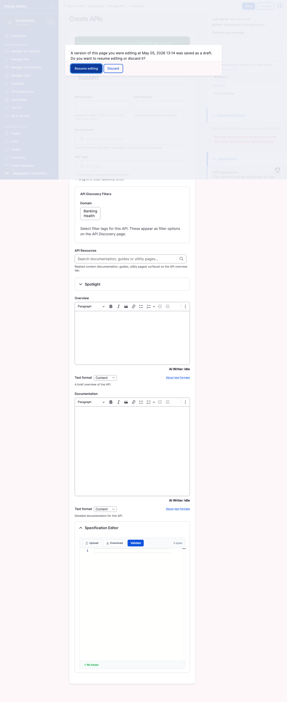

A draft API lives entirely inside the admin surface. The gateway connection feeds the spec, the governance scanner reports a score, and your team can read the catalog row, but no consumer can find it. Publishing is the moment the API crosses from a private node into a discoverable storefront entry. This chapter walks every fieldset on the edit form, every state transition on the moderation panel, the visibility scopes that decide who renders the tile, the scheduled publish flow for coordinated launches, and the consumer-side catalog you check to confirm the publish landed.

You will learn:

- How to walk every fieldset on the API edit form: Overview, Categories and Tags, Documentation, Logo, Visibility, and Moderation.
- How to set visibility so the API renders for the right audience: Public, Internal, or Org Level with optional Teams scoping.
- How to transition the moderation state from Draft to Published, with an optional revision log message.
- How to schedule a publish to fire automatically at a future date and time.
- How to preview the published tile as an anonymous visitor on the consumer catalog.
- How to unpublish an API back to Draft, version a published spec without breaking subscribers, and use bulk publish actions.
- How to read the Content list with moderation-state and scheduled-transition filters when you manage tens of APIs at once.

Allow ~30 minutes for the first publish, including content review. Subsequent publishes settle into a five-minute loop once the metadata template is set.

## Completing the public-facing metadata

Imported APIs arrive with whatever the gateway provided: an OpenAPI title, a version number, and very little narrative content. Before publishing, complete the fields a consumer reads: the Overview blurb, the Documentation long-form page, the logo, the categories, and the tags. This is the work that turns a gateway row into a storefront entry.

#### Open the edit form for an imported API

Use this task at the start of every publish to load the edit form pre-populated with the imported values.

#### Before you start

- **Confirm the API is in Draft.** Imported APIs land as Draft by default. If the Status column on **Manage APIs** already reads **Published**, you are editing a live entry and changes propagate immediately to consumers; see [Unpublish a live API](#unpublish-a-live-api) before making structural edits.
- **Have your metadata assets ready.** A one-paragraph Overview, a longer Documentation block (Markdown or rich text), a square logo file at 256x256 or larger, an agreed list of Domain values, and the search tags consumers will look for. The form does not autosave drafts after the first save, so collect inputs before opening the editor.

To open the edit form:

1. From the left sidebar, expand **API MANAGEMENT**, then click **Manage APIs**. The list opens at `/admin/manage-apis`.
2. Locate the row for the API to publish. Use the **Title** search, the **API Source** filter, or the **Domain** filter at the top of the page to narrow the list.
3. Click the **Edit** action on that row, or click the title and pick **Edit** on the detail page. Both routes land on `/node/<nid>/edit`.

The numbered callouts in Figure 6-1 are:

1. **Title search**. Free-text search at the top of the list. Filters as you type.
2. **API Source filter**. Restricts the list to one gateway connection. Useful when the catalog aggregates several gateways.
3. **Domain filter**. Restricts the list by the discovery taxonomy. Use this with hundreds of APIs to scope to one functional area.
4. **Status column**. Current moderation state for each row. Draft means the consumer side does not render the tile; Published means it does.
5. **Edit action**. Opens the edit form pre-populated with the current values. This is the entry point for every publish.
6. **Add new**. Creates a fresh API node from scratch. Ignore this for the publish flow; you have an imported entry to edit.


**Tip:** Sort by **Last updated** descending and pin the URL. The marketplace stores filter and sort state in URL parameters, so the bookmark returns the same view next time.



**Note:** Edits to Title break the matching key for connection-sourced re-imports. After a Title change, the next gateway re-import creates a duplicate row instead of updating this one. Plan Title edits deliberately.


#### Fill the Overview fieldset

The Overview is the back-cover blurb on a book. Consumers decide whether to read further based on three sentences. Treat it as marketing copy, not reference detail.

To fill Overview:

1. Scroll to the **Overview** rich-text editor at the top of the edit form.
2. Write three to five sentences that state what the API does, what data it returns, and who it is for. Avoid endpoint detail; the spec viewer covers that.
3. Use the editor toolbar for bold, italic, links, lists, and quotes. The catalog tile strips formatting; the API detail page renders it.
4. Read the **Text format** dropdown below the editor. Leave it at **Content** for plain rich text; switch to **Markdown** when pasting raw Markdown from a README; switch to **Email** only for editorial templates.
5. Save the form before walking to the next fieldset only if the page warns you about a session timeout. Otherwise, save once at the end.

The numbered callouts in Figure 6-2 are:

1. **Overview editor**. Rich-text editor that drives both the catalog tile blurb and the Overview tab on the API detail page.
2. **Editor toolbar**. Bold, italic, link, list, blockquote. Identical to the Documentation toolbar lower on the form.
3. **AI Writer indicator**. The label below the editor reports whether the optional AI assist hook is active. Idle is the resting state.
4. **Text format dropdown**. Set to Content by default. Switch to Markdown for raw Markdown paste.


**Tip:** Marketplace consumer telemetry suggests readers decide within twenty seconds of opening a catalog tile. Write the first sentence to answer "what does this API do?" and the second to answer "who is it for?".



**Note:** The catalog tile renders the first line or two of the Overview as plain text. Links and formatting only appear on the detail page; do not rely on a hyperlink in sentence one to do the work of the blurb.



**Caution:** Pasting from a Word processor often introduces invisible formatting that breaks the tile preview. If the tile shows odd line breaks or stray characters, click **Source** in the toolbar and clean up the HTML, then save again.


#### Fill the Documentation fieldset

The Documentation block becomes the long-form page consumers land on when they click through from the catalog tile. Walk authentication, the base URL, the three or four most-used endpoints, and one runnable example.

To fill Documentation:

1. Scroll to the **Documentation** rich-text editor below the Overview.
2. Write or paste the long-form content. Headings, code blocks, inline code, lists, and links all render. The Documentation tab on the API detail page renders this verbatim.
3. Set the **Text format** dropdown to **Markdown** if pasting Markdown; otherwise leave it at Content. The format applies to the Documentation editor independently of the Overview format.
4. For runnable examples, paste a single `curl` invocation that exercises the most representative endpoint. Consumers prefer one working command to ten incomplete snippets.
5. Link to your full reference site, your changelog, and the contact channel for support. The Documentation block is the front door for everything beyond the spec.


**Tip:** Paste your project README into Documentation with Text format set to Markdown. The editor preserves headings, lists, and fenced code blocks, sparing you a manual rewrite.



**Note:** The Documentation tab is the only place to put narrative content that is too long for the Overview. The spec viewer renders OpenAPI verbatim and does not accept prose; if you want a reader to see something, it belongs here.


#### Set Categories and Tags

Categories and Tags drive the consumer catalog filters. Without them, the API still appears in catalog search results but is not grouped under any heading and does not show up under any filter chip.

To set Categories and Tags:

1. Scroll to the **Domain** multi-select. Pick one or more business categories from the configured values (commonly Banking, Health, T1, t2; your portal admin can add more).
2. Read the help text beneath Domain. It names the discovery filters this API will appear under on the consumer catalog.
3. In the **API Tags** field, enter discovery keywords as a comma-separated list, for example `accounts, payments, kyc, webhook`. Press Enter or comma to confirm each tag.
4. In the **API Resources** autocomplete, pick related guides, documentation pages, or utility pages. Each related resource renders as a card on the API detail page.
5. Expand the **Spotlight** collapsed panel only if you want the API featured on the catalog landing page during a launch window. Tick **Enable Spotlight** and set the from and to date-times. Leave it collapsed for routine publishes.

The numbered callouts in Figure 6-3 are:

1. **Domain selector**. Multi-select for business categories. Drives the catalog left-rail grouping consumers see on the discovery page.
2. **Domain help text**. One-line description that names the discovery filters this API will appear under.
3. **API Resources autocomplete**. Links related guides, articles, or utility pages so consumers find context next to the spec.
4. **Spotlight panel**. Collapsed by default. Expand to feature the API on the landing page during a launch window.
5. **Spotlight date range**. Inside the expanded panel, sets the from and to bounds for the feature window.


**Tip:** Treat Tags as a controlled vocabulary across your team. Free-text tags are cheap to add but expensive to clean up once the catalog reaches hundreds of entries. Agree on five to ten tags per business domain and document them in your team's onboarding notes.



**Note:** An API with no Domain still appears in catalog search results but is not grouped under any heading. Domain is the primary discovery axis; treat it as required even though the form does not enforce it.



**Caution:** Spotlight windows that overlap dilute the landing-page feature row. Coordinate Spotlight windows across the team so launches do not collide.


#### Attach a logo

The logo is the visual identity of the API on every catalog surface. The tile crops to a square, so a wordmark with significant horizontal whitespace renders poorly next to other tiles.

#### Before you start

- **Prepare a square image at 256x256 or larger.** Anything smaller pixelates on retina screens. SVG is ideal; PNG with a transparent background is a strong second choice.
- **Confirm the brand mark works at 64x64.** The catalog tile thumbnail renders at 64x64; if your wordmark is unreadable at that size, use the icon mark instead.

To attach a logo:

1. Scroll to the **Logo** image upload field, located beneath the Documentation editor.
2. Click **Choose File** and pick your image. The accepted formats are PNG, JPG, and SVG up to 5 MB.
3. Wait for the upload to complete. A thumbnail preview appears next to the field once the upload finishes.
4. To replace an existing logo, click **Remove** on the thumbnail, then upload the replacement.


**Result:** The catalog tile and the API detail page render the uploaded logo next to the title. The same image appears in subscriber-facing app dashboards once consumers subscribe.



**Note:** The Logo upload accepts files up to 5 MB but the catalog tile renders at 64x64. Anything larger than a few hundred kilobytes wastes bandwidth on every catalog load. Resize before uploading.



**Caution:** Logos with transparent backgrounds render correctly on the light theme but can become invisible against dark backgrounds in the storefront. Test the tile on both themes before publishing.


## Choosing who can see the API

Visibility decides which audience the marketplace renders the tile for. Public is the storefront default for commercial APIs; Internal is for partner programs; Org Level keeps the API private to your team. You can change visibility at any time, but each change has consequences for existing subscribers, so set it deliberately.

#### Set the visibility scope

Use this task before publishing to control whether the API tile is shown to anonymous visitors, every logged-in user, or only members of your organisation.

#### Before you start

- **Identify the audience that consumes the API.** Public APIs drive sign-ups and developer relations. Internal APIs serve named partners behind portal login. Org Level APIs are private to your team and never appear in the consumer catalog.
- **Confirm the Overview and Documentation do not leak data.** Endpoint paths and examples in the narrative can expose internal schema. Public APIs require a content-review pass; Internal and Org Level APIs are looser.

To set visibility:

1. On the edit form, scroll to the **Visibility** radio group in the right rail (or below the spec editor on narrower screens).
2. Select one of the three options:
   - **Public, visible to everyone including anonymous visitors.** The tile renders on `/api-discovery` for signed-out visitors and is eligible for sitemap indexing. Choose this only after the content review.
   - **Internal, visible to all logged-in users.** The tile renders for any account with a marketplace login, regardless of organisation. Choose this for partner programs that require sign-in but no public marketing.
   - **Org Level, visible only to members of this organisation.** The tile renders only for users in your organisation. Choose this for internal-platform APIs that have no place in the consumer catalog.
3. If you select **Org Level**, the **Teams** picker becomes meaningful. Select one or more teams (for example, `QA1`, `TestingTeam`) to narrow visibility further; leave all teams unselected to make the API visible to every member of your organisation.
4. Click **Save**. Visibility takes effect on the next page render.

The numbered callouts on the Visibility group are:

1. **Org Level**. Narrowest scope. The API does not appear on the public catalog and never renders for users outside your organisation. Pair with the Teams picker for finer access control.
2. **Internal**. Mid scope. The tile renders for any signed-in account. Useful for partner programs where every consumer must authenticate but public discovery is not desired.
3. **Public**. Widest scope. The tile renders on the discovery page to anonymous visitors. Reserved for production APIs you intend to market.


**Caution:** Changing an already-published API from Public to Internal or Org Level does not revoke existing subscriptions. Consumers who subscribed while the API was Public continue to call it and see it on their app dashboard. To stop calls, also revoke their subscription; see the Onboarding your first consumer chapter for the revoke flow.



**Tip:** Default new APIs to Internal while the catalog is small. Promote to Public in batches once descriptions, governance scores, and rate limits are confirmed correct.



**Note:** The Teams picker only renders when Org Level is selected. Switching back to Internal or Public hides the Teams picker but preserves the selection; switching back to Org Level re-enables it with the previous selection intact.


#### Verify

1. Reload the edit form and confirm the Visibility radio remains on the option you selected.
2. If you selected Org Level, confirm the Teams picker reflects your selection (or remains empty for organisation-wide visibility).
3. Open the API detail page in a separate browser session as an account in the intended audience and confirm the tile renders. Sign in as an account outside the audience and confirm the tile does not.

#### Change visibility after publishing

Use this task to widen or narrow the audience of an already-published API.

To change visibility on a live API:

1. Open the API edit form from **Manage APIs**.
2. Update the **Visibility** radio to the new scope.
3. (Optional) Type a **Revision log message** describing the change, for example *Open to public after governance pass*.
4. Click **Save**. The new visibility takes effect on the next consumer-side page render.


**Caution:** Narrowing visibility (Public to Internal, or Internal to Org Level) hides the tile from new visitors but does not revoke any existing subscriptions. Existing subscribers continue to see the API in their app dashboard. To stop them calling it, revoke their subscription explicitly.



**Note:** Widening visibility (Org Level to Internal, or Internal to Public) exposes the API to a larger audience immediately. Re-read the Overview and Documentation for anything you would not show externally before saving.


## Moving an API from Draft to Published

Publishing is one click. Everything that matters happens before the click and after the click: what you put in the metadata, and what appears on the consumer catalog. The click itself is a moderation-state transition.

#### Transition from Draft to Published

Use this task once the metadata is complete, the visibility is set, and you are ready for consumers to find the API.

#### Before you start

- **Re-read the Overview and Documentation as if you were a consumer.** Typos, broken links, and unhelpful copy persist once they are public.
- **Confirm the governance score is acceptable.** Publishing an API with critical lint failures pushes consumer-visible problems into production. The threshold is a team decision covered in the Reviewing API governance chapter.
- **Decide whether to attach the API to an API Product.** Plans live on Products, not APIs. If you want consumers to subscribe with a quota or a rate limit, the Designing API Products and plans chapter is the next step.

To move an API from Draft to Published:

1. From the sidebar, click **Manage APIs**. Locate the API in the list and confirm the **Status** column reads **Draft**.
2. Click the **Edit** action on the row.
3. Scroll to the right rail of the edit form and find the **Save as** or **Moderation state** control. The current state shows next to the label.
4. In the **Change to** dropdown, select **Published**.
5. (Optional) Enter a short note in **Revision log message**, for example *Initial publish, v1.0*. The note is stored alongside the revision timestamp and author, and is retrievable from the API's revision history later.
6. (Optional) To queue the publish for later instead of immediately, expand the **Publishing options** panel further down the right rail and set a **Publish on** date and time. See [Scheduling a publish for later](#scheduling-a-publish-for-later) for the full flow.
7. Click **Save**. The form posts and redirects to the API detail page; the Status column on Manage APIs reflects the new state immediately.

The numbered callouts in Figure 6-4 are:

1. **Current state label**. Reads **Draft** or **Published** depending on the row's existing state. Confirms what you are transitioning from.
2. **Change to dropdown**. Targets the next moderation state. The options are Draft, Needs Review, Published, and Archived; not every workflow exposes all four.
3. **Revision log message**. Free-text label stored with the revision. Searchable from the revision history.
4. **Publishing options collapsible**. Optional scheduling panel. Expand to set a Publish on date and time.
5. **Save button**. Persists the state transition and any pending field edits.

The right rail of the edit form groups the publish controls into related panels. From top to bottom:

- **Moderation panel.** Shows the current state and the Change to dropdown. Selecting Published here is the action that takes the API live.
- **Visibility panel.** The three radios from the previous section. Editable at any time; visibility changes take effect on the next render.
- **Revision log message.** Free-text label for the revision. Appears in the API's revision history alongside the timestamp and author.
- **Publishing options panel.** Optional scheduling controls. **Publish on** queues a future transition; the marketplace flips the state automatically when the schedule fires.
- **URL alias panel.** Auto-generates the public URL from the title by default. Override the alias when you need a specific URL, such as preserving incoming links from a previous catalog.


**Result:** The Status column on Manage APIs reads **Published**. The API detail page renders for the audience the Visibility scope allows. If Visibility is Public, anonymous visitors can find the API at `/api-discovery`.



**Note:** Publishing the API does not on its own make it subscribable. Subscriptions are managed at the API Product level. See the Designing API Products and plans chapter to wrap the API in a Product and a plan, then the Onboarding your first consumer chapter to approve the first subscription.



**Tip:** When publishing more than ten APIs in a session, sort the Manage APIs list by Status to identify any rows still in Draft. The filter and the sort persist in the URL, so a single bookmark surfaces the work-in-progress every visit.


#### Bulk publish a batch of APIs

Use this task immediately after a large import, when ten or more APIs need to go live at the same launch moment.

To bulk publish:

1. On **Manage APIs**, tick the checkbox at the left of each row to include. Use the header checkbox to select every row on the current page.
2. From the **Actions** dropdown above the table, pick **Publish selected**.
3. Click **Apply**. The marketplace shows a confirmation dialog summarising the selected count.
4. Confirm. The action runs server-side and the page refreshes with updated Status columns.


**Note:** Bulk Publish selected ignores APIs that are already Published, so running it across a mixed selection is safe. Use the Status filter on Manage APIs to constrain the selection to Draft rows first.



**Caution:** Bulk actions act only on the visible page. If your selection spans pagination, increase the per-page size to 100 first or run the action one page at a time.


#### Verify

1. Confirm the Status column on Manage APIs reads Published for the API.
2. Open the API detail page and confirm the URL alias matches what is shown in the right rail.
3. Confirm the revision history lists your latest entry with the revision log message you typed.

## Scheduling a publish for later

Some launches need to land at a specific moment: a Monday-morning go-live, a coordinated press release, the start of a maintenance window. The marketplace supports a scheduled publish on the same edit form. The schedule writes a queued transition; the marketplace cron flips the state when the schedule fires.

#### Schedule a publish for a future moment

Use this task when the API is content-complete now but the launch is later.

#### Before you start

- **Confirm the portal timezone.** The schedule fields use the marketplace's configured timezone, not your browser's. Check your profile if uncertain.
- **Confirm cron is running.** The schedule only fires when the marketplace cron job runs. Most portals run cron every minute; if yours runs less frequently, the publish lands within one cron cycle of the scheduled time.
- **Lock the content.** Edits after the schedule is set are accepted up to the scheduled moment, but every save updates the queued version. Decide whether to allow further edits before sharing the launch time.

To schedule a publish:

1. On the API edit form, expand the **Publishing options** collapsible in the right rail.
2. Set the **Publish on** date.
3. Set the **Publish on** time.
4. Set the **Publish state** to **Published**.
5. Leave the **Moderation state** at **Draft**. The schedule transitions the state to Published when it fires; setting it to Published now defeats the purpose.
6. (Optional) Type a **Revision log message** describing the planned launch, for example *Scheduled launch, marketing campaign starts Monday*.
7. Click **Save**. The form posts; the API row continues to read Draft until the scheduled moment.

The numbered callouts in Figure 6-5 are:

1. **Scheduled tab**. Filters the content list to nodes with a queued state transition. Reads the schedule from the same Publishing options panel you just used.
2. **Schedule date column**. When the marketplace will run the transition. Sortable; click to see the next launch.
3. **Target state column**. Always Published in the publish flow. Other workflows may queue transitions to Archived or Draft.
4. **Cancel action**. Removes the queued transition without changing the current state. Use this to abandon a launch.


**Result:** The API is queued for publishing. The Status column continues to read Draft until the scheduled time, then flips to Published on the next cron cycle.



**Caution:** The schedule cannot run if marketplace cron is not running. If the scheduled time passes and the API remains in Draft, contact your portal administrator to check cron health before retrying manually.



**Note:** Saving while a schedule is queued does not cancel the schedule. To cancel, open the Publishing options panel and clear the Publish on date, or use the Cancel action from the Scheduled view.


#### Cancel a scheduled publish

Use this task to abandon a queued launch, for example when content is not ready or the launch slips.

To cancel a schedule:

1. From the sidebar, click **Content**, then the **Scheduled** tab. The page filters to nodes with queued transitions.
2. Locate the row for the API.
3. Click the **Cancel** action. The transition is removed and the API stays in its current state.
4. (Optional) Open the edit form to confirm the Publish on date is now empty.


**Note:** Cancelling a schedule does not delete the revision log message or the visibility setting; only the queued transition disappears. The API remains in whatever state it was in before the schedule was set.



**Tip:** Pair scheduled publishes with the Spotlight window from the Categories and Tags fieldset. Setting both to the same launch moment makes the API the catalog landing-page feature for the launch window without any further admin action.


#### Verify

1. Confirm the API row appears under the **Scheduled** view of Content after Save.
2. Confirm the right-rail summary on the edit form shows the Publish on date and time you set.
3. After the scheduled time passes, reload Manage APIs and confirm the Status has flipped to Published.

## Verifying the consumer-side catalog

Trust but verify. The fastest way to confirm a publish worked is to view the page a consumer would see: not the admin view, not your logged-in view, but a fresh anonymous session.

#### Preview the API as an anonymous visitor

Use this immediately after every publish to confirm the change rendered as expected.

#### Before you start

- **Open a private or incognito window.** Your admin session caches the publish state and personalisation. An incognito window starts with no cookies and renders the page exactly as an anonymous visitor sees it.
- **Identify the public URL of your portal.** The discovery page lives at `/api-discovery` under the portal's public hostname.

To verify a published API on the consumer catalog:

1. Open an incognito or private browser window.
2. Navigate to `<your-portal>/api-discovery`. The catalog renders with the tiles for every Published, Public API.
3. Locate the catalog tile for your API. The tile should show the title, the logo, and the first line or two of the Overview.
4. If Domain values are set, click each domain filter chip to confirm the API appears under the correct category. Click each tag chip to confirm tag-based filtering surfaces it.
5. Click the tile. The detail page should render with the Overview, the Documentation tab, the API Specification tab with the spec viewer, and a Subscribe button if the API is wrapped in a Product.
6. Confirm the URL alias in the address bar matches what you set in the right rail of the edit form.
7. Close the incognito window.


**Result:** You have viewed exactly what a consumer sees. The publish is verified.



**Note:** If the tile is not visible, the most common causes in order are: Visibility is set to Internal or Org Level instead of Public; the moderation state is still Draft; the catalog cache has not refreshed (typically refreshes within one minute); the tile is matched out by an active filter chip on the discovery page.



**Tip:** Bookmark `<your-portal>/api-discovery` in your incognito profile. Every publish ends with a one-click sanity check.


#### Read the catalog tile layout

Use this task once on first publish to understand the rendering rules. Knowing what consumers see informs the metadata choices on every subsequent publish.

The catalog tile renders the following elements:

- **Logo thumbnail** at 64x64, top-left. The uploaded Logo image, cropped square.
- **Title** to the right of the logo. The API Title from the edit form, truncated at roughly 60 characters.
- **Overview snippet** below the title. The first one or two sentences of the Overview, stripped of formatting and truncated.
- **Domain badge** below the snippet, if a Domain is set. Renders as a chip showing the first selected domain.
- **Tag chips** to the right of the domain badge. The first three tags render as clickable chips; remaining tags are hidden until the consumer opens the detail page.


**Note:** The catalog re-orders tiles by recency, by Spotlight window, and by tag-based relevance to the consumer's search. Two consumers searching the same term may see your tile at different positions.



**Tip:** When the tile preview looks crowded, shorten the Title and tighten the Overview's first sentence. Domain and tags should communicate the rest.


#### Verify

1. Confirm the catalog tile renders all five elements (logo, title, snippet, domain badge, tag chips) for your API.
2. Click the tile and confirm the detail page renders the Documentation tab and the API Specification tab.
3. If the API is attached to a Product, confirm the Subscribe button renders on the detail page.

## Unpublishing, versioning, and managing live APIs

Publication is reversible and the form supports a clean versioning workflow. Use these tasks to take an API back to Draft when a problem surfaces, to ship a new version without disturbing existing subscribers, and to read the Content moderation list when several APIs are in flight at once.

#### Unpublish a live API

Use this task to take a Published API back to Draft, for example when a critical bug appears or governance flags a finding that must be fixed before consumers continue to call it.

#### Before you start

- **Notify subscribers if they exist.** Unpublishing hides the catalog tile but does not on its own revoke subscriptions or block calls. Combine with the Upcoming API Deprecation Notice workflow in the Day-to-day operations chapter for a graceful path.
- **Decide on the rollback message.** Type a revision log message that records why the unpublish happened; the next provider to read the history will thank you.

To unpublish a live API:

1. Open the API edit form from **Manage APIs**.
2. In the right rail, find the **Change to** dropdown.
3. Select **Draft** (or **Archived** for a permanent retirement).
4. Type a **Revision log message** describing the reason, for example *Reverting to Draft to fix governance finding GOV-014*.
5. Click **Save**. The Status column on Manage APIs flips to Draft on the next page render.

The numbered callouts in Figure 6-6 are:

1. **Moderation state filter**. Filters the content list to Draft, Needs Review, Published, or Archived. Defaults to all states.
2. **State column**. Current state for each row.
3. **Author column**. The user who made the last revision. Useful for tracing rollback or republish decisions.
4. **Updated column**. Timestamp of the most recent state transition. Sortable.
5. **Quick edit action**. Opens the row's edit form in a focused panel without leaving the list. Speeds up bulk moderation work.


**Result:** The catalog tile no longer renders for the audience the previous Visibility allowed. Existing subscribers continue to see the API in their app dashboard until you revoke their subscriptions separately.



**Caution:** Unpublishing does not stop existing subscribers from calling the gateway. The marketplace hides the discovery surface; the gateway still routes traffic. Coordinate with the gateway team to apply a rate-limit or block at the gateway tier if you need to stop calls immediately.



**Note:** Archiving is permanent in workflow terms but does not delete the node. The revision history is preserved and the node remains queryable from the admin surface. Use Archived when the API will never return; use Draft when the unpublish is temporary.


#### Version a published spec

Use this task to publish a new version of an API without breaking apps that subscribed to the previous version.

To ship a new version:

1. On **Manage APIs**, open the row action menu for the current version and pick **Duplicate**. The marketplace creates a new draft API with `(copy)` appended to the Title.
2. Open the duplicate's edit form. Update the **Title** to remove the `(copy)` marker and reflect the new version, for example `Orders API v2`.
3. Update the **API Version** field to the new release tag, for example `2.0.0`.
4. Paste the new OpenAPI spec into the Specification Editor and click **Validate**.
5. Walk the same Overview, Documentation, Categories, Tags, and Logo flow you used on the first publish. The duplicate carries the metadata over; refine it for the new version.
6. Set the **Visibility** scope. Most second-version publishes match the first version's scope.
7. Transition the moderation state to **Published** when ready.
8. (Optional) On the previous version's edit form, type a **Revision log message** announcing the new version and link consumers to the new tile from the Documentation tab.


**Result:** Both versions live in the catalog. Existing subscribers continue calling the previous version's endpoints; new subscribers find the new version on the discovery page.



**Tip:** Versioning via Duplicate is the safest path because it preserves the previous version's node identity, revision history, and subscriber list. Editing the spec in place on the previous version risks breaking calls in production.



**Note:** The deprecation notice workflow covered in the Day-to-day operations chapter pairs naturally with versioning. Schedule a deprecation notice on the previous version once the new version is stable.


#### Read the Content moderation list

Use this task to triage moderation state across all APIs at once, especially when several editors are working in parallel.

To read the moderation list:

1. From the sidebar, click **Content**. The page opens at `/admin/content`.
2. Use the **Content type** filter to constrain to **APIs**. The list now shows only API nodes regardless of source.
3. Use the **Moderation state** filter to constrain to one state. Pick Draft to see in-flight work; pick Needs Review to find APIs waiting on review; pick Published to audit the live catalog.
4. Sort by the **Updated** column to surface the most recent transitions.
5. Tick checkboxes and use the **Actions** dropdown for bulk transitions, for example Publish selected or Archive selected.


**Tip:** The Content list is the single best surface for moderation audits. It rolls every content type into one filterable view, so you can read API state, page state, and notification state from a single page.



**Note:** The Manage APIs list and the Content list are two views into the same node store. Changes on either propagate to the other on the next page render.


## Reference: every field on the Publish flow

The edit form is long. The collapsible below summarises every field that participates in a publish, so you can scan once instead of scrolling repeatedly during the first few publishes.

<strong>All fields on the API edit form that affect publishing</strong>

| Fieldset | Field | Type | Required | What to enter |
|---|---|---|---|---|
| Overview | Overview body | Rich text | Recommended | Three to five sentences for the catalog tile blurb. |
| Overview | Text format | Select | Yes | Content, Markdown, or Email. Choose Markdown when pasting Markdown. |
| Documentation | Documentation body | Rich text | Recommended | Long-form authentication, examples, rate limits, changelog. |
| Documentation | Text format | Select | Yes | Independent of Overview format. |
| Categories and Tags | Domain | Multi-select | Recommended | One or more business domains for catalog grouping. |
| Categories and Tags | API Tags | Multi-tag text | Recommended | Comma-separated discovery tags. |
| Categories and Tags | API Resources | Autocomplete | No | Related guides, articles, utility pages. |
| Categories and Tags | Spotlight enable | Checkbox | No | Off by default. On adds the API to the landing-page feature row. |
| Categories and Tags | Spotlight from/to | Date-time | Conditional | Required when Spotlight is enabled. |
| Logo | Logo image | Image upload | No | PNG, JPG, or SVG up to 5 MB. Square at 256x256 or larger. |
| Visibility | Visibility scope | Radio | Yes | Org Level, Internal, or Public. |
| Visibility | Teams | Multi-select | No | Only meaningful when Visibility is Org Level. |
| Moderation | Change to | Select | Yes | Target moderation state: Draft, Needs Review, Published, or Archived. |
| Moderation | Revision log message | Text | No | Free-text label stored with the revision. |
| Publishing options | Publish on date | Date | No | Future date for a scheduled publish. |
| Publishing options | Publish on time | Time | No | Future time for a scheduled publish. |
| Publishing options | Publish state | Select | No | Target state for the scheduled transition. Almost always Published. |
| URL alias | URL alias | Text | No | Auto-generated from the Title; override when migrating preserved URLs. |

## Next steps

- **Reviewing API Products and Plans.** Wrap your published API in a Product so consumers can subscribe through a Plan with quota and rate limit.
- **Onboarding your first consumer.** Once a Product is live, approve the first subscription and walk a consumer through obtaining a key.
- **Reviewing API governance.** Re-check the score after each publish; rule changes upstream can produce new findings on previously published APIs.
- **Monitoring usage.** After consumers begin calling, monitor latency, errors, and quota consumption from the analytics dashboards.