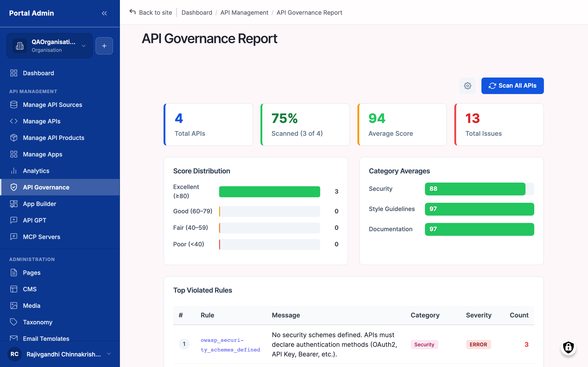
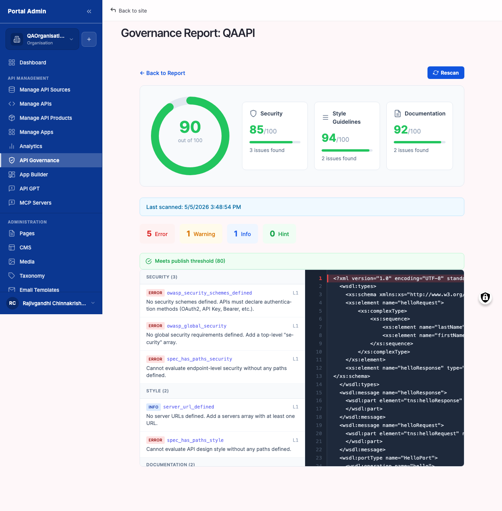
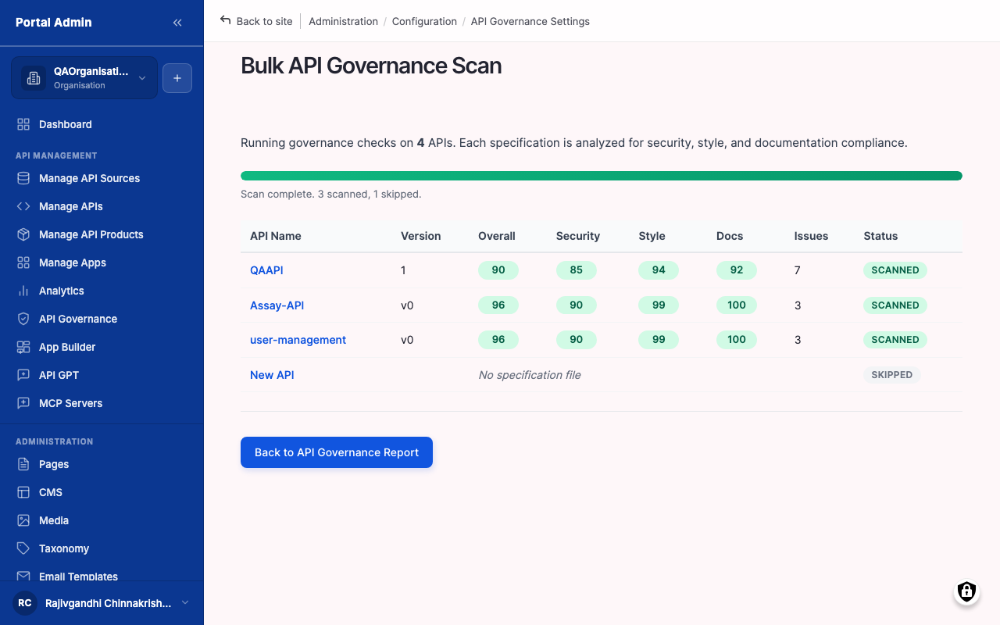
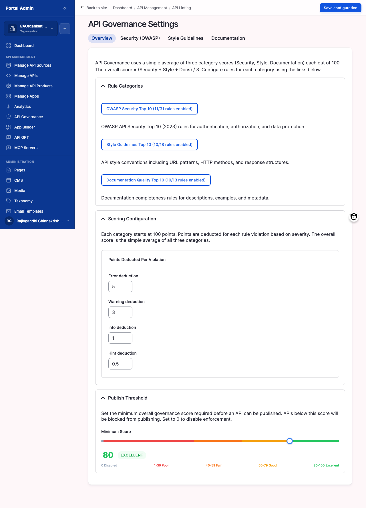

# Reviewing API governance

Once your APIs are in the catalog, the marketplace runs them through a configurable set of linting rules and produces a per-API score. The score tells consumers (and auditors) whether your APIs follow your organisation's standards for security, naming, documentation completeness, and error-handling shape. The score is the gate between Draft and Published — fix findings before consumers see the API, not after.

You will learn:

- How to open the **API Governance Report** and read the catalog-wide summary panels.
- How to drill into a per-API score and identify the rules driving it down.
- How to trigger a **Bulk API Governance Scan** after rule-set changes or large imports.
- How to enable, disable, and re-weight rules in **API Governance Settings** so the score reflects your team's standards.

Allow ~20 minutes for the first read of the report and ~10 minutes per API for fixing findings.

## Reading the governance report

The report is the single dashboard for every scanned API. It surfaces score distribution, category averages, the most-violated rules, and a sortable list of every scanned API.

#### Open the governance report

Use this task as the first stop after any import. The report is the fastest way to see whether the new APIs meet your organisation's standards.

#### Before you start

- **Confirm at least one API is in the catalog.** The report is empty until an API has been imported or created. See [Importing your first API](importing-your-first-api.md#importing-your-first-api).
- **Understand the score scale.** Scores run from 0 to 100. The marketplace weights violations by severity — a single Error (severity 1) costs more than several Warnings (severity 2) or Info findings (severity 3). Target a score ≥ 80 for production APIs, ≥ 90 for public ones.

To open the governance report:

1. From the left sidebar, expand **API MANAGEMENT**, then click **API Governance Report**. The page opens at `/admin/api-gov-report`.
2. Read the top-of-page summary panels in order:
   - Score Distribution — A histogram of scores across every scanned API. A heavy tail on the left indicates many APIs need attention.
   - Category Averages — Mean scores grouped by rule category (for example Security, Documentation, Naming). The lowest category is the priority.
   - Top Violated Rules — The five rules triggered most often. Fixing one of these typically lifts many scores at once.
3. Scroll to the **Scanned APIs** table. Each row is one API.
4. The columns include the API Title, the Score, the Last scanned timestamp, and a link to the per-API drilldown.
5. Sort by Score ascending to surface the worst offenders. Click a row to drill in.

The numbered callouts in Figure 5-1 are:

1. **Score Distribution panel** — Histogram of scores. The y-axis is API count, the x-axis is score bucket.
2. **Category Averages panel** — One row per rule category with its mean score. Use this to decide which rule category to focus on first.
3. **Top Violated Rules panel** — The five rules triggered most often across all APIs, with violation counts.
4. **Scan All button** — Triggers a re-scan of every API. Covered in [Re-running the governance scan](#re-run-the-governance-scan).
5. **Scanned APIs table** — The per-API list. Sortable by Score, Last scanned, or API Title.

> **Result:** You have a single-screen view of governance health across the catalog and can identify which categories drag the average down and which rules are violated most.

> **Note:** The score is recomputed every time the spec changes, every time Scan All runs, and every time the rule set is edited. APIs that have not been scanned at least once show *N/A* in the Score column.

> **Tip:** Treat Top Violated Rules as your weekly standup agenda. Fixing the rule at the top of that list typically moves the Score Distribution histogram more than addressing one low-scoring API at a time.

#### Verify

1. Confirm the page heading reads API Governance Report.
2. Confirm the three summary panels — Score Distribution, Category Averages, and Top Violated Rules — render with data.
3. Confirm the Scanned APIs table lists every API in the catalog with a numeric score (or N/A for APIs not yet scanned).

#### Read a per-API score breakdown

Use this task to determine exactly why one API has its current score, and what to fix to raise it.

To read a per-API breakdown:

1. From API Governance Report, click the row for the API to inspect. The page opens at `/admin/api-gov-report/<api-id>` — for example `/admin/api-gov-report/540` for the API with internal id 540. The page title reads Governance Report: <API Title>.
2. Read the header panel: it shows the API's current score, when it was last scanned, the spec version that was scanned, and a link back to the API's catalog page.
3. Below the header, find the **Severity Summary** — a count of findings grouped by severity (Error, Warning, Info). Errors carry the most weight; clear those first.
4. Scroll to the **Findings** table. Each row is one rule violation. The columns name the rule, its severity, the JSON path in the spec where it triggered, and a one-line description of the fix.
5. Group findings by rule (use the Rule column header to sort). Rules that fire many times across one API typically point to a single root cause — for example "missing 4xx response" repeated across every operation indicates a default 4xx response definition needs to be added once.
6. Open your spec in your editor, fix the path the row names, and save.
7. Re-import or re-scan the API (see [Re-running the governance scan](#re-run-the-governance-scan)) to see the score update.

The numbered callouts in Figure 5-2 are:

1. **Score header** — The current score, last-scanned timestamp, and spec version.
2. **Severity Summary** — Counts of Error, Warning, and Info findings.
3. **Findings table** — One row per rule violation. Sortable by rule, severity, or path.
4. **Severity column** — Colour-coded badges (red for Error, amber for Warning, grey for Info).
5. **Path column** — The JSON pointer into the spec where the rule triggered. Use it to locate the fix in your editor.

> **Result:** The breakdown shows which rules the API violates, where they trigger in the spec, and how the score divides by severity.

> **Note:** A finding's *severity* is set in the rule definition, not on the finding itself. To stop a noisy rule from dragging scores down, lower its severity in Linting Rules (covered in Chapter 5.4) rather than asking every API team to suppress it locally.

> **Tip:** Sort findings by severity descending and fix every Error first. A single Error often outweighs ten Warnings, so the score response is most visible when Errors are cleared.

#### Verify

1. Confirm the page title reads Governance Report followed by the API title.
2. Confirm the score header shows a numeric score, a last-scanned timestamp, and the spec version.
3. Confirm the Severity Summary lists Error, Warning, and Info counts.
4. Confirm the Findings table renders one row per violation with Rule, Severity, and Path columns.

## Running scans and tuning rules

Scores update automatically when specs change, but you should know how to force a re-scan and how to adjust the rules that drive the scores.

#### Re-run the governance scan

Use this task after changing linting rules, after a bulk import, or whenever you suspect a stale score. The **Bulk API Governance Scan** flow re-scans every API in the catalog.

#### Before you start

- **Choose a quiet window where possible.** A scan against a large catalog can take several minutes and briefly increases load on the marketplace's scanner workers. Mid-day or after-hours, depending on your team's pattern.
- **Decide whether a full re-scan is needed.** If only one API's spec changed, the change-triggered scan runs automatically — Scan All is not required. Reserve Scan All for rule-set changes or first-time imports.

To re-run the scan:

1. From the left sidebar, select **API Governance Report**.
2. At the top of the page, click **Scan All**. The page navigates to `/admin/api-gov-report/scan-all` and the title reads Bulk API Governance Scan.
3. Read the confirmation panel. It states how many APIs are queued, an estimate of the scan duration, and a warning that running scans block other governance writes until they complete.
4. Click **Start scan**. The page shows a progress indicator with one row per API.
5. Wait for the run to complete. You can navigate away — the scan continues in the background — but the report's headline score panels do not update until the run finishes.
6. When the run completes, the page returns to API Governance Report with refreshed numbers.

The numbered callouts in Figure 5-3 are:

1. **Page title** — *Bulk API Governance Scan*. The page is reachable from the Scan All button on the report.
2. **Confirmation panel** — Lists the queued APIs and the estimated duration.
3. **Start scan button** — Triggers the run. The button is disabled if a scan is already in progress.
4. **Progress indicator** — Updates per-API as workers process the queue.

> **Result:** Every API in the catalog has a fresh score that reflects the current rule set and the current spec content.

> **Note:** Per-API scans run automatically when a spec is re-imported or edited via Manage APIs. Scan All is required only after a rule-set change, when drift is suspected, or after a one-off bulk action.

> **Caution:** Avoid running Scan All during a heavy import. The two operations contend for the same scanner workers; the import can stall while the scan runs.

#### Verify

1. Confirm the progress indicator advances row-by-row as the queue is processed.
2. Confirm the page returns to API Governance Report when the run completes.
3. Confirm the Score Distribution panel reflects the new scores.
4. Spot-check one API in the Scanned APIs table — its Last scanned timestamp should match the time of the run.

#### Configure linting rules

Use this task to enable a rule, disable one your team has decided to ignore, or adjust a rule's severity to weight the score differently. Rule authoring (writing new rules from scratch) is a Portal Admin task covered in the administration guide; this section covers the day-to-day toggling.

#### Before you start

- **Agree on the rule change with your API guild or governance group.** Disabling a rule lifts the score of every API that was violating it. Confirm that this is the desired outcome before clicking.
- **Plan a re-scan after rule changes.** The new rule set affects scores only after a scan. See [Re-running the governance scan](#re-run-the-governance-scan).

To configure linting rules:

1. From the left sidebar, expand **SETTINGS**, then click **API Governance Settings**. The page opens at `/admin/config/apim/api-linting`.
2. The page lists every rule in a table grouped by category (for example Security, Documentation, Naming, Operations).
3. For each rule, the available controls are:
   - Enable / Disable — A toggle on the row. Disabled rules do not run; their findings disappear from every API.
   - Severity — A dropdown with Error, Warning, or Info. Severity controls how heavily a violation weights the score.
   - Description — A read-only one-line description of what the rule checks.
4. Toggle a rule to enable or disable it. Change severity by selecting a new option in the dropdown.
5. Scroll to the bottom and click **Save configuration**. Changes take effect immediately for new scans; existing scores remain until the next scan.
6. After saving, see [Re-running the governance scan](#re-run-the-governance-scan) and click Scan All to refresh scores against the new rule set.

The numbered callouts in Figure 5-4 are:

1. **Rule category headings** — Group rules by what they check. Use the categories to focus your review.
2. **Rule name and description** — One row per rule, with a one-line description of what triggers a violation.
3. **Enable / Disable toggle** — Turns the rule on or off. Disabled rules skip every API.
4. **Severity dropdown** — One of Error, Warning, or Info. Drives the score-weight for any violation.
5. **Save configuration button** — Persists your changes. Required to apply the new rule set.

> **Result:** The rule set reflects your team's standards. The next governance scan scores APIs against the new rules.

> **Note:** Disabling a rule does not delete past findings; it stops the rule from firing on the next scan. Re-enabling later restores the rule but produces fresh findings, not the historical ones.

> **Tip:** When tightening a rule (raising severity, or enabling a previously-disabled rule), notify your API teams before running Scan All. Otherwise scores drop overnight without explanation and the team spends the next morning answering "what changed?"

> **Caution:** Disabling rules to game the score does not improve API quality. Use the rule set to encode your real standards; if a rule fires repeatedly across many APIs, the correct fix is typically in the specs, not in the rule.

#### Verify

1. Confirm a confirmation banner appears after **Save configuration**.
2. Re-open API Governance Settings and confirm your toggle and severity changes have persisted.
3. Trigger Scan All and confirm the new rule set is reflected in fresh scores on the Scanned APIs table.

## Next steps

- **[Publishing your first API](publishing-your-first-api.md#publishing-your-first-api)** — Once an API meets your governance threshold, transition it from Draft to Published.
- **[Reviewing API Products and Plans](reviewing-api-products-and-plans.md#reviewing-api-products-and-plans)** — Group governed APIs into a Product so consumers can subscribe through a single Plan.
- **[Importing your first API](importing-your-first-api.md#importing-your-first-api)** — If a finding traces back to a missing field on the spec, re-import after fixing the source spec to refresh the catalog entry.
