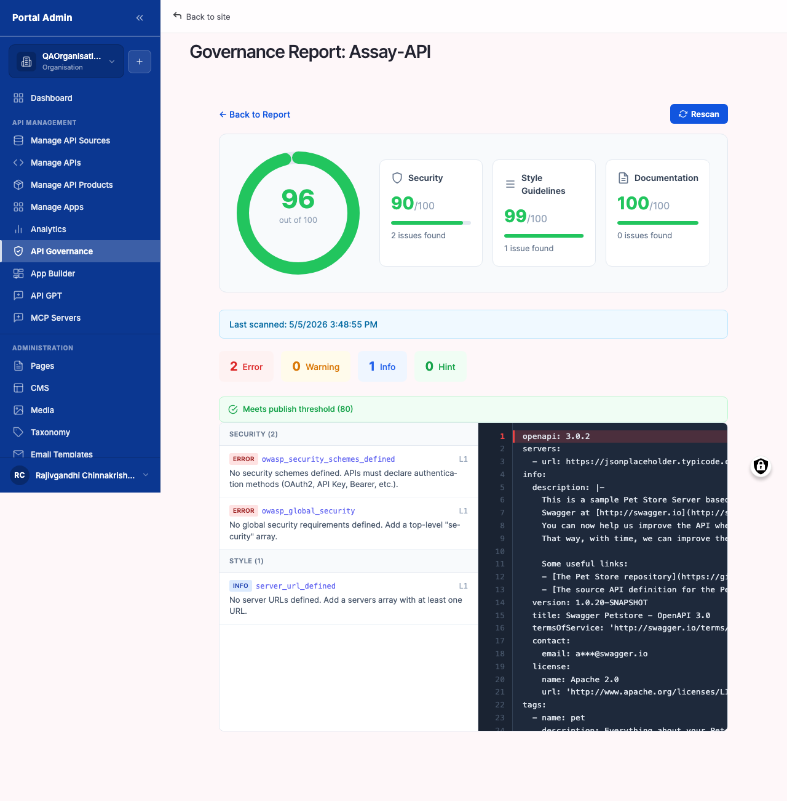

Once APIs are in the catalog, the marketplace runs them through a configurable set of linting rules and produces a per-API score between 0 and 100. The score answers one question for every API: does it follow your organisation's standards for security, naming, documentation completeness, and error-handling shape. Governance is the gate between Draft and Published. Fix the findings before consumers see the API, not after.

You will learn:

- How to open the **API Governance Report** and read the catalog-wide summary panels, distribution histogram, and Top Violated Rules.
- How to drill into a per-API score, walk the Findings table row by row, and pinpoint the JSON path that needs fixing in the spec.
- How to configure the **API Governance Settings** ruleset: enable, disable, and re-weight rules across Security, Documentation, Naming, and Operations.
- How to trigger a **Bulk API Governance Scan** after rule changes or large imports, and how to read the progress indicator.
- How to remediate a finding, re-run the scan on a single API, and compare scores across runs.
- How to export the report, filter Manage APIs by score, and exclude an API from scanning when its findings are accepted exceptions.

Allow ~20 minutes for the first read of the report, ~10 minutes per API for typical remediation, and ~5 minutes to tune the ruleset.

## Reading the governance report

The report is the single dashboard for every scanned API. It surfaces score distribution across the catalog, average scores by rule category, the rules triggered most often, and a sortable list of every API with its current score.

#### Open the governance report

Use this task as the first stop after any import, after any rule change, and as part of a weekly governance review. The report is the fastest way to see whether the catalog meets your standards.

#### Before you start

- **Confirm at least one API is in the catalog.** The report is empty until an API has been imported or created. The Importing your first API chapter covers both routes.
- **Understand the score scale.** Scores run from 0 to 100. The marketplace weights violations by severity. A single Error (severity 1) costs more than several Warnings (severity 2), and Info findings (severity 3) cost the least. Target a score of 80 or higher for production APIs and 90 or higher for public ones.
- **Know your team's threshold.** The marketplace does not block publication based on score. The bar is policy, not code. Agree on the number with your API guild before walking new providers through the report.

To open the governance report:

1. From the left sidebar, expand **API MANAGEMENT**, then click **API Governance Report**. The page opens at `/admin/api-gov-report` with the page title *API Governance Report*.
2. Read the top-of-page summary panels in order: Score Distribution, Category Averages, Top Violated Rules.
3. The **Score Distribution** histogram shows the count of APIs in each score band (0 to 20, 20 to 40, 40 to 60, 60 to 80, 80 to 100). A heavy left tail means many APIs need attention. A right-skewed shape means the catalog is broadly healthy.
4. The **Category Averages** panel lists one row per rule category (Security, Documentation, Naming, Operations) with the mean score across every scanned API. The lowest category is the priority for the week.
5. The **Top Violated Rules** panel lists the five rules triggered most often, with violation counts. Fixing the rule at the top of this list typically lifts many scores at once.
6. Scroll to the **Scanned APIs** table. Each row is one API. The columns include API Title, Score, Severity counts, Last scanned timestamp, and a View report link.
7. Sort by **Score** ascending to surface the worst offenders. Click a title to drill into its breakdown.

The numbered callouts in Figure 5-1 are:

1. **Score Distribution panel**. Histogram of catalog-wide scores. The y-axis is API count, the x-axis is score bucket. Hover a bar to see the exact count.
2. **Category Averages panel**. One row per rule category with its mean score. Use this to decide which category to prioritise this week.
3. **Top Violated Rules panel**. The five rules triggered most often across the catalog, with the total violation count next to each rule name.
4. **Scan All button**. Triggers a re-scan of every API in the catalog. Covered in detail in Re-running the scan across the catalog later in this chapter.
5. **Scanned APIs table**. The per-API list, sortable by Title, Score, Errors, Warnings, Info, or Last scanned. Each row carries a View report link.


**Result:** You have a single-screen view of governance health across the catalog. The Category Averages tell you what to focus on, the Top Violated Rules tell you which fix will move the most scores, and the Scanned APIs table tells you which APIs to start with.



**Note:** The score is recomputed every time the spec changes, every time Scan All runs, and every time the ruleset is edited. APIs that have not been scanned at least once show *N/A* in the Score column.



**Tip:** Treat Top Violated Rules as your weekly standup agenda. Fixing the rule at the top of that list typically moves the Score Distribution histogram more visibly than addressing one low-scoring API at a time.


Verify:

1. Confirm the page heading reads *API Governance Report*.
2. Confirm the three summary panels render with data, not placeholders.
3. Confirm the Scanned APIs table lists every API in the catalog with a numeric score or *N/A* for APIs that have not yet been scanned.
4. Sort by Score ascending and confirm the worst-scoring API rises to the top.

#### Read the Scanned APIs table columns

Use this task to understand every column on the table so you can triage at a glance instead of opening every API.

To read the columns:

1. Hover any column header. Sortable headers display an arrow indicator. Click to toggle ascending or descending.
2. Read each column in order from left to right.

The columns are:

- **API Title**. The catalog title of the API. Click the title to open its governance drilldown.
- **Score**. A numeric value between 0 and 100, colour-banded green (80 and above), amber (50 to 79), and red (below 50). *N/A* means no scan has run.
- **Errors**. The count of severity-1 findings. Errors dominate the score, so this column is the highest-signal triage cue.
- **Warnings**. The count of severity-2 findings. Warnings weigh less than Errors but still cost score.
- **Info**. The count of severity-3 findings. Informational findings are mostly style and consistency cues.
- **Last scanned**. Timestamp of the most recent scan. Sort descending to see the freshest scans.
- **View report**. Per-row link into the per-API drilldown.


**Note:** The Score column reflects the most recent successful scan. If a scan fails partway through (for example, the spec became unparseable mid-edit), the column shows the prior score with a small warning icon until the next successful run.



**Tip:** Filter the table by combining sorts. Sort by Errors descending, then sort by Last scanned descending within that. The result is the most recently broken APIs, which is usually who needs help today.


#### Filter and search the report

Use this task on a catalog with dozens or hundreds of APIs to narrow the report to the slice you actually need to review.

To filter and search:

1. Above the Scanned APIs table, locate the filter row. The filters are Category, Score range, and Source.
2. From the **Category** dropdown, pick a single rule category (Security, Documentation, Naming, Operations) to show only APIs that have violations in that category. Leave blank for all.
3. Use the **Score range** slider to constrain the table to a score window, for example 0 to 60 to focus on failing APIs.
4. From the **Source** dropdown, pick a single connection or `(none)` for manually created APIs. Useful for assigning ownership of remediation by gateway team.
5. Type into the **Search by title** field to filter the list to titles matching your query. The search runs as you type.
6. The URL captures filter state as parameters (for example `?category=security&score_max=60&source=42`). Bookmark the URL to return to the same view later.


**Result:** The Scanned APIs table shows only the rows that match your filters, while the summary panels at the top continue to reflect the whole catalog. The split lets you triage a slice while keeping catalog-wide context in view.



**Tip:** Bookmark a filtered URL per gateway team. When the API guild reviews governance weekly, each team opens their own bookmark and the meeting moves through the catalog in parallel.


## Drilling into a per-API breakdown

The catalog-wide view tells you where to focus. The per-API drilldown tells you exactly what to fix, where in the spec it lives, and what the score response will be.

#### Read a per-API score breakdown

Use this task to determine exactly why one API has its current score, and which findings to address first.

#### Before you start

- **Have the spec source open in your editor.** The drilldown names the JSON path where each rule triggered. Fixing the spec means editing the source document. Keep your OpenAPI document open in a tab alongside the marketplace.
- **Confirm you have edit permission on the API.** A consumer or auditor can read the drilldown but cannot edit the spec to address findings. If the **Edit spec** action is disabled, ask the API's owner team to remediate.

To read a per-API breakdown:

1. From **API Governance Report**, click a row in the Scanned APIs table. The page opens at `/admin/api-gov-report/<api-id>`, for example `/admin/api-gov-report/540`.
2. The page title reads *Governance Report:* followed by the API title.
3. Read the **Score header**. It shows the API's current score, the last-scanned timestamp, the spec version that was scanned, and a link back to the API's catalog page.
4. Read the **Severity Summary**. It lists the count of findings grouped by Error, Warning, and Info. Errors are the most score-costly, so clear those first.
5. Scroll to the **Findings** table. Each row is one rule violation.
6. Read the columns: Rule (the rule name), Severity (Error, Warning, or Info), Path (the JSON pointer where the rule fired), Message (the one-line fix hint).
7. Sort by Severity descending to bring Errors to the top.
8. Group findings by Rule. Rules that fire many times against one spec usually point to a single root cause. For example, "Operation missing 4xx response" repeated across every operation means a single default 4xx response definition needs to be added once.
9. Click the **Path** value to copy the JSON pointer to your clipboard. Paste it into your editor's go-to-line or path-search tool to land on the exact spec location.
10. Edit the spec in your editor, save it, and re-import the API or trigger a per-API re-scan to refresh the score.

The numbered callouts in Figure 5-2 are:

1. **Score header**. Current score with a colour band, last-scanned timestamp, and the spec version that was scanned.
2. **Severity Summary**. Counts of Error, Warning, and Info findings shown as coloured badges.
3. **Findings table header**. Columns for Rule, Severity, Path, and Message. Sortable by clicking a header.
4. **Severity column**. Colour-coded badges (red for Error, amber for Warning, grey for Info) make Errors easy to spot at a glance.
5. **Path column**. The JSON pointer into the spec where the rule triggered. Click to copy the pointer to your clipboard.
6. **Message column**. A one-line fix hint, for example "Add a 4xx response definition to this operation".


**Result:** The breakdown shows which rules the API violates, where they trigger in the spec, and how the score divides by severity. You have everything needed to plan the remediation.



**Note:** A finding's severity is set in the rule definition, not on the finding itself. To stop a noisy rule from dragging scores down, lower the rule's severity in API Governance Settings rather than asking every API team to suppress it locally.



**Tip:** Sort findings by Severity descending and fix every Error before touching Warnings or Info. A single Error often outweighs ten Warnings in the scoring formula, so the score response is most visible when Errors are cleared first.


Verify:

1. Confirm the page title reads *Governance Report:* followed by the API title.
2. Confirm the Score header shows a numeric score, a last-scanned timestamp, and the spec version.
3. Confirm the Severity Summary lists Error, Warning, and Info counts that add up to the total in the Findings table.
4. Confirm the Findings table renders one row per violation with the Rule, Severity, Path, and Message columns.

#### Drill a specific violation

Use this task when you want to understand what a single rule checks, why it failed on this API, and what the minimum-acceptable fix looks like.

To drill a violation:

1. From the API drilldown, locate the row for the rule you want to investigate.
2. Click the **Rule** name. A side panel opens with the full rule definition.
3. Read the **What this rule checks** section. It explains the rule in prose, with a link back to the canonical reference for the OpenAPI fragment under test.
4. Read **Why it matters**. Each rule carries a short rationale, usually one or two sentences, explaining the consumer or security impact of letting the violation ship.
5. Read **How to fix it**. The side panel shows a minimal example of compliant spec content, often a five-line YAML fragment you can copy.
6. Read **Where it fired**. The Path is repeated here with a small code-fence snippet of the offending spec content.
7. Copy the example, paste it into your spec at the named path, and save.
8. Close the side panel and re-sort the Findings table by Rule to confirm the violation count for this rule drops on the next scan.

The numbered callouts in Figure 5-3 are:

1. **Findings table sorted by Severity**. Errors at the top, Info at the bottom.
2. **Rule name link**. Clicking the name opens the rule reference side panel.
3. **Repeated path patterns**. Multiple rows with the same Rule but different Paths usually mean one root cause spread across operations.
4. **Inline message preview**. A one-line summary of the fix without needing to open the side panel.
5. **Back to report breadcrumb**. Returns to the catalog-wide API Governance Report.


**Result:** You know exactly what the rule checks, why it exists, and what the corrected spec content looks like. The remediation is now a copy-paste exercise into your spec source.



**Note:** Rule descriptions are shipped with the marketplace and are not editable by providers. If a description seems wrong or out of date, raise it with your Portal Admin. Rule authoring is a Portal Admin task covered in the administration guide.



**Tip:** When the same rule fires across many APIs in your catalog, look at the rule's **Why it matters** rationale before disabling it. The cost of the violations is usually clearer in the rationale than in the rule name, and most teams keep the rule on once they understand the impact.


#### Remediate a finding and re-run the scan

Use this task to take a finding from "logged" to "cleared". The cycle is: read the finding, fix the spec, re-scan, confirm the finding has gone.

To remediate and re-run:

1. From the per-API drilldown, pick the finding to address. Errors first.
2. Click the **Path** value to copy the JSON pointer.
3. Open the API's spec source in your editor and navigate to the path.
4. Apply the fix from the rule reference side panel.
5. Save the spec file. If the spec lives in a connected gateway, push the change to the gateway through your normal release process. If the spec lives in the marketplace itself, return to the API detail page and edit the spec there.
6. Return to the per-API drilldown.
7. Click **Re-run scan** at the top of the drilldown. The page shows a running indicator while the scan executes. Most specs finish within a minute.
8. When the scan completes, the Score header refreshes and the Findings table re-renders.
9. Confirm the targeted finding no longer appears, and check the score moved in the expected direction.


**Result:** The finding is cleared from the drilldown and the score reflects the remediation. The same change is now in the spec source, ready to ship through your normal release pipeline.



**Tip:** Batch your edits before re-running. Fix three or four findings, save the spec once, then re-scan. Each re-scan takes the same time whether you fixed one finding or twenty, so batching is the faster path through a long Findings table.



**Caution:** A spec edit that breaks parseability will fail the scan and leave the prior score in place. If a re-scan returns no change after a remediation, check the spec validates against an OpenAPI parser offline before re-trying.


#### Compare scores across runs

Use this task to confirm your remediation work is having the intended effect, week over week or release over release.

To compare scores:

1. From the per-API drilldown, scroll to the **Scan history** panel below the Findings table.
2. The panel lists the last ten scans with date, score, and severity counts.
3. Read the score trend left to right. A downward trend means the spec is regressing; an upward trend confirms the remediation work is landing.
4. Click any historical row to view the snapshot of findings at that scan, frozen at the time it ran.
5. Use the compare control at the top of Scan history to pick two scans and view a diff: findings cleared since the older scan are marked green, findings introduced since are marked red.


**Result:** You can demonstrate progress over time on a per-API basis. The compare view shows exactly which findings landed in a given release and which were cleared.



**Note:** Scan history retains the last ten scans per API. Older scans are pruned automatically. Export the report (covered later in this chapter) if you need to keep a long-term record.



**Tip:** Tag releases with the spec version in your gateway, then match the version to a row in Scan history. Pairing the score with the release tag turns governance into a release-quality metric your team can chart in dashboards outside the marketplace.


## Tuning the linting ruleset

Scores are only as meaningful as the rules behind them. The API Governance Settings page is where you turn rules on, turn them off, and re-weight their severity to match your team's standards.

#### Configure linting rules

Use this task to enable a new rule, disable a rule your team has decided to ignore, or adjust a rule's severity to weight the score differently. Rule authoring is a Portal Admin task covered in the administration guide. This task covers day-to-day toggling.

#### Before you start

- **Agree on the change with your API guild or governance group.** Disabling a rule lifts the score of every API that was violating it. Enabling a rule drops the score of every API that violates the new rule. Confirm with your team before clicking.
- **Plan a re-scan after rule changes.** The new ruleset affects scores only after a scan. After saving rule changes, run Scan All so scores reflect the new policy.
- **Communicate ahead of tightening.** When raising severity on an existing rule or enabling a previously-disabled rule, notify API teams before triggering Scan All. Otherwise scores drop overnight without explanation and the team spends the next morning answering "what changed?"

To configure linting rules:

1. From the left sidebar, expand **SETTINGS**, then click **API Governance Settings**. The page opens at `/admin/config/apim/api-linting`.
2. The page lists every rule grouped by category. The categories are Security, Documentation, Naming, and Operations.
3. For each rule, the row shows the rule name, a one-line description, the Enable / Disable toggle, and the Severity dropdown.
4. To disable a rule, click the **Enable** toggle on its row. The toggle slides to off and the row dims. Disabled rules do not run on the next scan and their findings disappear from every API.
5. To enable a previously disabled rule, click the toggle the other way. The row brightens and the rule fires on the next scan.
6. To change a rule's severity, pick a new value from the **Severity** dropdown: Error, Warning, or Info. Severity controls how heavily a violation weights the score.
7. To change a rule's category, expand the rule and pick a new category from the **Category** dropdown. Recategorising shifts the rule's contribution to the Category Averages panel on the report.
8. Scroll to the bottom of the page and click **Save configuration**. A confirmation banner appears at the top of the page.
9. Trigger Scan All from the API Governance Report (covered next) to refresh every score against the new ruleset.

The numbered callouts in Figure 5-4 are:

1. **Category heading**. Groups rules by what they check. Use category headings to focus a review session on one area, for example a security-focused review pass.
2. **Rule name and description**. One row per rule. The description is one line of plain text explaining what triggers a violation.
3. **Enable / Disable toggle**. The on-off switch for the rule. Disabled rules skip every API on the next scan.
4. **Severity dropdown**. Error, Warning, or Info. Drives the score weight applied to any violation of this rule.
5. **Save configuration button**. Sits at the bottom of the page. Persists every change on the page. Required to apply the new ruleset.


**Result:** The ruleset reflects your team's standards. The next governance scan scores APIs against the new rules.



**Note:** Disabling a rule does not delete past findings, it stops the rule from firing on the next scan. Re-enabling later restores the rule but produces fresh findings, not historical ones. Scan history snapshots taken under the prior rule state remain unchanged.



**Tip:** When tightening a rule, run Scan All immediately and screenshot the new Top Violated Rules panel. Share the screenshot with API teams in the same message that announces the change. The visual evidence of the new policy in action lands more clearly than the text of the rule itself.



**Caution:** Disabling rules to game the score does not improve API quality. Use the ruleset to encode your real standards. If a rule fires repeatedly across many APIs, the right fix is almost always in the specs, not in the rule.


Verify:

1. Confirm a confirmation banner appears after **Save configuration**.
2. Re-open API Governance Settings and confirm your toggle and severity changes have persisted.
3. Trigger Scan All and confirm the new ruleset is reflected on the Scanned APIs table.

<strong>Rule categories and what they check</strong>

| Category | What it checks | Typical rules |
|---|---|---|
| Security | Authentication declarations, scope definitions, transport security. | `security-defined`, `securitySchemes-present`, `oauth2-scopes-required`. |
| Documentation | Presence of descriptions, examples, summary fields, and the top-level info block. | `info-contact`, `operation-description`, `parameter-description`, `tag-description`. |
| Naming | Casing rules on paths, parameters, and schema property names. | `path-kebab-case`, `parameter-camelCase`, `schema-property-camelCase`. |
| Operations | Operation-level requirements: response codes, error shapes, IDs, examples. | `operation-operationId`, `operation-2xx-response`, `operation-4xx-response`, `operation-tag-defined`. |

#### Adjust severity for a noisy rule

Use this task when a rule fires across many APIs but the impact does not warrant treating each finding as an Error.

To adjust severity:

1. On **API Governance Settings**, locate the rule on its category row.
2. From the **Severity** dropdown, lower the value (for example Error to Warning, or Warning to Info).
3. Save the configuration.
4. Run Scan All and read the Score Distribution histogram. The histogram should shift to the right as the rule contributes less weight to scores.


**Note:** Lowering severity is not the same as disabling. Findings still appear in the per-API drilldown, they just cost less score. This is the recommended approach for "lint-style" rules where you want visibility but not blocking weight.



**Tip:** Use Info for stylistic rules (consistent casing, presence of summary fields) and reserve Error for security and contract correctness. Most teams settle on three Errors, ten Warnings, and the rest Info as a starting profile.


#### Roll back a rule change

Use this task when a recent rule change has caused unintended score drops that need reversing.

To roll back:

1. On **API Governance Settings**, locate the rule you changed.
2. Reverse the change: flip the toggle back, or pick the prior severity from the dropdown.
3. Save the configuration.
4. Run Scan All to refresh scores against the restored ruleset.


**Result:** The ruleset is back to its prior state and the next scan returns scores to where they were before the change.



**Caution:** The marketplace does not version the ruleset. Roll back is manual. Keep a changelog of rule edits outside the marketplace (your team's wiki, a shared doc) so a reverse is always a copy-paste away.


## Re-running scans across the catalog

Scores update automatically when a spec changes. The Bulk API Governance Scan is for the cases where automatic updates are not enough: after a ruleset change, after a large import, or when you suspect drift between the displayed score and the actual spec state.

#### Re-run the scan across the catalog

Use this task after a ruleset change, after a bulk import, or when a stale score is suspected. The Bulk API Governance Scan re-scans every API in the catalog against the current ruleset.

#### Before you start

- **Pick a quiet window where possible.** A scan against a large catalog can take several minutes and briefly increases load on the marketplace's scanner workers. Off-hours or post-deploy windows are safest.
- **Decide whether a full re-scan is necessary.** If only one API's spec changed, the change-triggered scan runs automatically. Scan All is required only for ruleset changes, first-time imports, or troubleshooting.
- **Avoid running Scan All during a heavy import.** The two operations contend for the same scanner workers. The import can stall while the scan runs.

To re-run the scan across the catalog:

1. From the left sidebar, click **API Governance Report**.
2. At the top of the page, click **Scan All**. The page navigates to `/admin/api-gov-report/scan-all` and the title reads *Bulk API Governance Scan*.
3. Read the confirmation panel. It states how many APIs are queued, an estimate of the scan duration, and a warning that the run blocks other governance writes until it completes.
4. Click **Start scan**. The page shows a progress indicator with one row per API.
5. Each row shows the API title, a progress state (Queued, Running, Done), and the resulting score once the scan finishes.
6. Wait for the run to complete. You can navigate away. The scan continues in the background, but the report's headline panels do not update until the run finishes.
7. When every row reaches Done, the page returns to the API Governance Report with refreshed numbers across every panel.

The numbered callouts in Figure 5-5 are:

1. **Page title**. Reads *Bulk API Governance Scan*. The page is reachable from the Scan All button on the report.
2. **Confirmation panel**. Lists the queued APIs and the estimated duration. Read it before clicking Start scan.
3. **Start scan button**. Triggers the run. The button is disabled if a scan is already in progress.
4. **Per-API progress rows**. Updates per row as workers process the queue. Each row carries the API title, the current state, and the resulting score on completion.
5. **Run summary footer**. Shown after every row reaches Done. Reports the total APIs scanned, the number whose score changed, and the average score across the run.


**Result:** Every API in the catalog has a fresh score that reflects the current ruleset and the current spec content. The summary panels on the report refresh to match.



**Note:** Per-API scans run automatically when a spec is re-imported or edited via Manage APIs. Scan All is the right choice for ruleset changes, first-time setup, and recovery from suspected drift.



**Caution:** Avoid running Scan All during a heavy import. The two operations contend for the same scanner workers, and the import can stall.


Verify:

1. Confirm the progress indicator advances row by row as the queue is processed.
2. Confirm the page returns to API Governance Report when the run completes.
3. Confirm the Score Distribution panel reflects the new scores.
4. Spot-check one API in the Scanned APIs table. Its Last scanned timestamp should match the time of the run.

#### Re-scan a single API

Use this task to refresh one API's score without re-scanning the whole catalog. The single-API scan is faster and does not contend with imports.

To re-scan a single API:

1. From the Scanned APIs table on API Governance Report, click the row for the target API.
2. On the per-API drilldown, click **Re-run scan** in the top right.
3. The page shows a running indicator. The scan typically finishes within a minute for specs under 1 MB.
4. When the scan completes, the Score header refreshes and the Findings table re-renders.

Or, from Manage APIs:

1. On Manage APIs, locate the row for the API.
2. Open the row action menu and pick **Re-run governance**. The Governance Report column flips to a running indicator until the scan finishes.


**Result:** The single API has an up-to-date score. Other APIs in the catalog are not touched.



**Tip:** Re-scan a single API after every targeted remediation. Waiting for the next Scan All slows the feedback loop and makes it harder to attribute a score change to a specific edit.


## Acting on report results

The report is most useful when it drives action. This section covers the tasks that turn a Findings list into prioritised work and that close the loop on completed remediation.

#### Filter Manage APIs by score

Use this task to bring governance-driven prioritisation into your day-to-day catalog view.

To filter by score:

1. From the left sidebar, click **Manage APIs**.
2. Locate the filter row above the table. The Score filter is one of the dropdowns alongside Status and Visibility.
3. Pick a score band from the **Score** dropdown: All, High (80 and above), Medium (50 to 79), Low (below 50), or Not scanned.
4. The table refreshes to show only APIs in the chosen band.
5. Combine with Status or Visibility filters to scope further, for example "Low score, Published, Public" to find the highest-risk APIs in production.

The numbered callouts in Figure 5-6 are:

1. **Score filter dropdown**. Constrains the table by score band.
2. **Status filter dropdown**. Constrains the table to Draft, Published, or all.
3. **Score column**. Same colour bands as the governance report. Sort to bring lowest scores to the top.
4. **Row action menu icon**. Opens per-row actions including Re-run governance and Exclude from scanning.
5. **Bulk action dropdown**. Apply Re-run governance to many APIs at once.


**Result:** Manage APIs becomes a triage view as well as an inventory view. You can sort, filter, and act on score directly without bouncing between pages.



**Tip:** Bookmark `Manage APIs` filtered to Low and Published. That URL is the daily-standup view for the team: anything in it is a published API that fails governance and needs an owner.


#### Export the governance report

Use this task to share governance state with auditors, leadership, or teams outside the marketplace. Export is also the right path for long-term archival of scan results.

To export:

1. From **API Governance Report**, click **Export** at the top right of the page.
2. Pick the export scope: Current view (respects active filters) or Whole catalog.
3. Pick the format: CSV or PDF. CSV is best for downstream analysis in a spreadsheet; PDF is best for distribution.
4. Click **Generate export**. The marketplace prepares the file and offers a download link.
5. Save the file to your reporting folder.


**Result:** A CSV or PDF snapshot of governance state, ready to send to an auditor or to chart in a spreadsheet.



**Note:** Export captures the report as it stands at the moment of export. It does not include scan history per API. For long-term trend analysis, schedule exports on a regular cadence (weekly works well for most teams) and append the rows to a tracking sheet.



**Tip:** Name your export files with the date in `YYYY-MM-DD` form. Sorting by filename in your reporting folder then doubles as a timeline.


#### Exclude an API from scanning

Use this task when an API has accepted exceptions to governance, for example a legacy API where the spec violations are documented and approved.

#### Before you start

- **Confirm the exclusion is approved.** Excluding an API removes it from the report and from catalog-wide averages. The exclusion should be a deliberate policy decision, not a way to hide a failing score.
- **Document the reason.** The marketplace stores the exclusion reason next to the flag. Future reviewers should be able to read why the API is excluded without asking around.

To exclude an API:

1. From **Manage APIs**, click the title of the API to open its detail page.
2. Click the **API Governance Report** tab on the detail page.
3. Click **Exclude from scanning** at the top right.
4. A dialog asks for an exclusion reason. Type a short justification (one or two sentences).
5. Click **Confirm**. The API is flagged and the next Scan All skips it. The score reads *Excluded* on the report.

To restore an excluded API:

1. From the API detail page, click the **API Governance Report** tab.
2. Click **Resume scanning**. The exclusion lifts, and the next scan reincludes the API.


**Result:** The API is removed from governance averages and from the Top Violated Rules counts. The exclusion reason is stored next to the API record for audit purposes.



**Note:** Excluded APIs still appear on Manage APIs and consumers can still subscribe to them. Exclusion only affects governance reporting, not catalog visibility or subscribability.



**Caution:** Exclusion is a policy escape hatch and should be rare. A catalog with many exclusions has a misleading average score and undermines the report's credibility with leadership. Audit exclusions quarterly and re-enable any whose justification has expired.


## Next steps

- **Publishing your first API**, covered in the next chapter, walks through transitioning an API from Draft to Published once its score meets your threshold.
- **Reviewing API Products and Plans** groups governed APIs into a Product so consumers can subscribe through a single Plan.
- **Importing your first API** is the right return route when a finding traces back to a missing field on the source spec. Re-import after fixing the spec at the source to refresh the catalog entry.