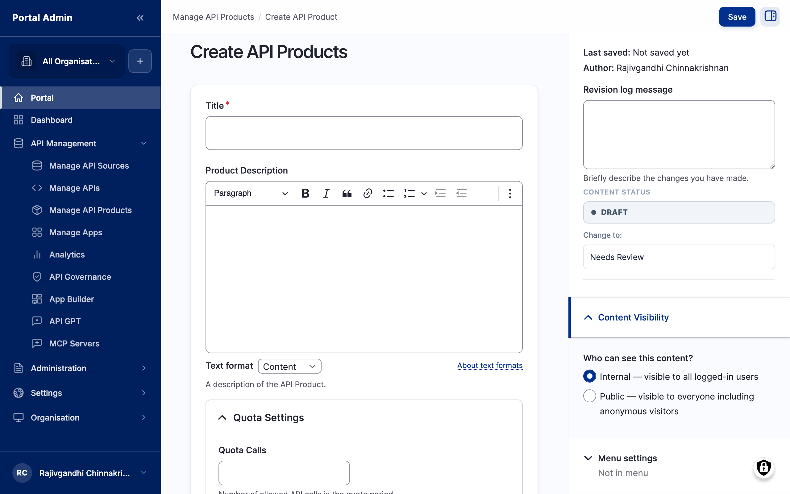
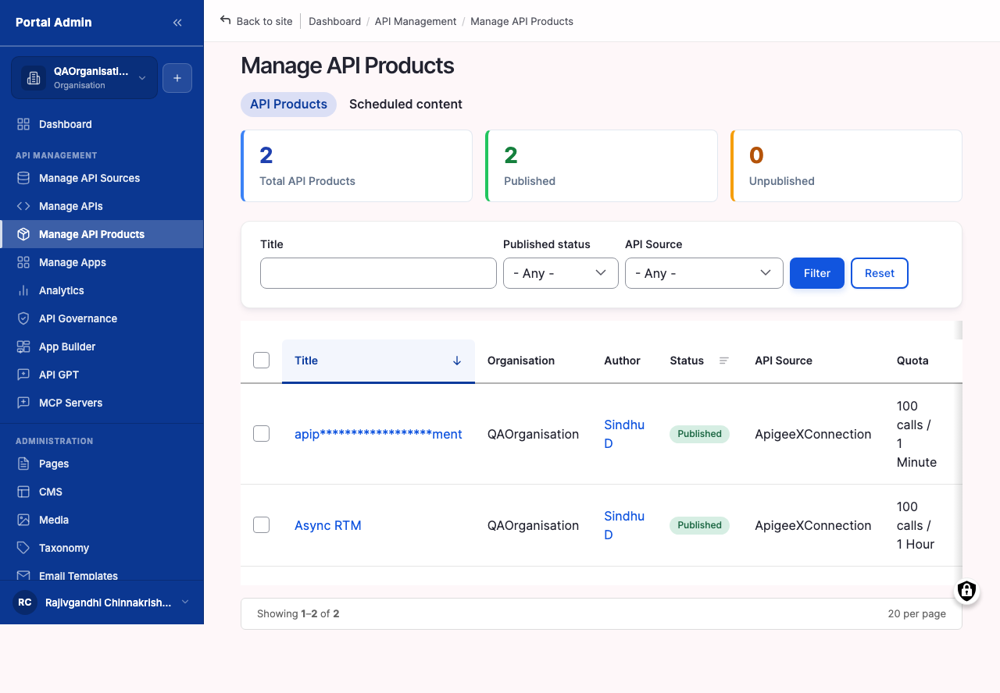
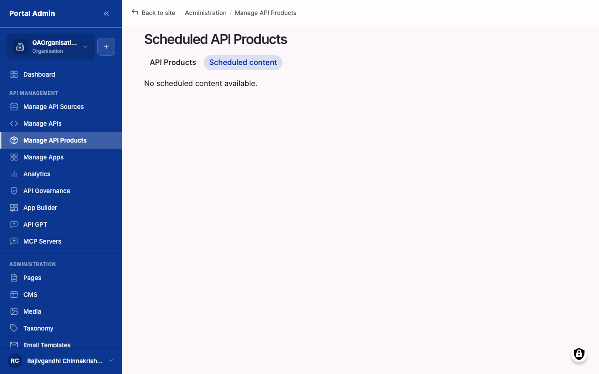

An **API Product** bundles one or more APIs into a single subscription unit: one key, one quota window, one rate-limit ceiling, one row on the consumer dashboard. A **Plan** attaches to a Product and carries the operational terms the gateway enforces at runtime: how many calls per period, how fast they can arrive, and what happens at the cap. On this marketplace, Products and their Plans are read in from the connected gateway. The gateway is the system of record for which APIs sit inside a bundle, what the Plan is called, what the quota figure is, what the period is, and what the rate-limit ceiling is. The marketplace mirrors those values for consumers to read, then asks you to author the consumer-facing copy that sits next to them.

You will learn:

- How to read every column, filter, and row action on **Manage API Products**, including the **Scheduled** tab.
- How to recognise which fields on the edit form the gateway owns (read-only) and which the marketplace owns (editable).
- How to author the marketplace-owned consumer-facing metadata: title, overview, documentation, logo, categories, tags, visibility, and moderation state.
- How to walk a Plan entry end to end: name, quota window, rate-limit ceiling, bundled APIs, and the connection that issued it.
- How to publish a Product, schedule a publication for a future moment, and recognise stale or removed rows the next time you sync.
- How to spot the difference between a single-API Product and a bundle, and how to locate any Product's parent gateway in two clicks.

Allow ~30 minutes per Product for the first review-and-enrich pass, plus 5 minutes per re-sync.

## How Products and Plans arrive on the marketplace

Each gateway implements its own version of the bundle idea. Apigee Products bundle proxies, Kong groups Services into bundles, AWS API Gateway uses Usage Plans, MuleSoft uses API Groups. Each gateway also carries a Plan attached to that bundle defining the runtime quota and rate-limit numbers it will enforce on every call. The marketplace normalises all of these shapes into a single **API Products** list on the Provider side, with the Plan and its numbers shown alongside the Product they apply to.

Most Products reach the marketplace through a gateway sync, covered next. A Product can also be created by hand through the **Create API Product** wizard, for a bundle that has no gateway counterpart yet or for a documentation-only placeholder you will attach to a gateway later. The wizard is the same form you use to enrich a synced Product, opened on a blank node.

The numbered callouts in Figure 7-1 are:

1. **Title field**. The consumer-facing Product name. On a manual Product you type this directly; on a synced Product the gateway pre-fills it. Marketplace-owned either way.
2. **Overview editor**. The rich-text body a consumer reads on the Product detail page. Pick **Markdown** from the **Text format** dropdown when you need lists or links.
3. **Logo image field**. The square icon that anchors the catalog tile. Upload a PNG or SVG of 256x256 or larger.
4. **Categories and Tags fields**. The taxonomy that surfaces the Product to the right audience filters. Reuse the same values you applied to the underlying APIs.
5. **Right-rail panels**. The **Visibility**, **Status**, and **Publishing options** panels, identical to the synced-Product edit form. Leave **Status** at **Draft** until the consumer-facing copy is complete.


**Note:** A manually created Product carries no Plan, quota, rate limit, or bundled APIs until it is associated with a gateway and synced. Those fields are gateway-owned and stay read-only on the marketplace. To give a manual Product real runtime terms, publish the matching bundle on a gateway and re-sync.



**Tip:** Reach the wizard from **Manage API Products** by clicking **Add API Product** above the list. The form opens on a blank node at `/node/add/api_products`.


Because the gateway is the only system that can enforce the quota and rate-limit at runtime, the marketplace deliberately treats those values as read-only mirrors. A figure shown on the catalog that did not match what the gateway actually enforces would mislead consumers, and the next sync would rewrite every gateway-controlled field to whatever the gateway currently reports anyway. The rule of thumb is straightforward. If a value affects how the gateway accepts or rejects a runtime call (quota, period, rate limit, which APIs are in the bundle, the Plan tier name), change it in the gateway. If a value affects how a consumer reads the catalog tile and detail page (title, overview, logo, categories, tags, visibility, moderation state), change it on the marketplace.

#### Trigger a Product sync from a connected gateway

Use this task when a new Product has been published on the gateway and you want it to appear on the marketplace, or when an existing Product's APIs, Plan name, quota, or rate limit have changed on the gateway and you need the catalog to catch up.

#### Before you start

- **Confirm the gateway connection is healthy.** From the left sidebar, choose **Manage API Sources** and check that the gateway shows status **Connected**. A red status means no Product can sync until the connection is repaired. See the Connecting your first gateway chapter for the repair steps.
- **Know which gateway issued the Product.** If your portal has connections to several gateways, sync each one separately. The marketplace does not auto-deduplicate Products that happen to share a name across gateways.
- **Allow time for the gateway to settle.** A Product or Plan change made on the gateway in the last few seconds may not yet be reachable through its admin API. Wait a minute before triggering a sync after a gateway-side change.

To trigger a Product sync:

1. From the left sidebar, choose **Manage API Sources**.
2. Locate the row for the gateway connection that owns the Product. The list shows the connection name, the gateway type, and the last sync timestamp.
3. Click **Import Products** on that row. The marketplace pulls the current Product list from the gateway through the same adapter that imports APIs.
4. Wait for the sync banner to confirm completion. The list refreshes; new Products appear in **Manage API Products** with their Plan, quota, and rate-limit fields populated from the gateway.
5. Open **Manage API Products** to confirm the new Product is visible and that its Plan column reflects the gateway state.


**Result:** The Product is on the marketplace. Its Plan, quota, rate-limit, and bundled-API fields are filled in from the gateway. The consumer-facing fields (title, description, logo, categories, visibility, status) are still empty and waiting for you to author them.



**Note:** A sync is read-only against your gateway. The marketplace pulls metadata; it does not push changes back. To rename a Product, change the APIs inside it, raise a quota, or relax a rate limit, change the value on the gateway and re-sync.



**Tip:** Schedule a recurring sync if your gateway team ships Product or Plan changes often. The cadence setting lives on the connection edit form covered in the Connecting your first gateway chapter.


Verify:

1. Confirm the sync banner reports completion without error.
2. Open **Manage API Products** and confirm the new or updated Product is listed.
3. On the Product row, confirm the **Plan**, **Quota**, and **API Source** columns reflect the gateway state.

## Walking the Manage API Products list

**Manage API Products** is the catalog's Product control surface. Every Product the marketplace knows about is listed here, regardless of which gateway it came from. The page is also where you discover stale rows, scheduled rows waiting on a publish timer, and Products still waiting on consumer-facing copy.

#### Read every column on Manage API Products

Use this task on your first visit, and any time the list feels noisy. Knowing what each column reports turns the list from a wall of titles into a quick triage surface.

To read the list:

1. From the left sidebar, expand **API MANAGEMENT**, then click **Manage API Products**. The page opens with the default **Live** tab selected; a second tab, **Scheduled**, sits beside it.
2. Read the column headers from left to right. The default order surfaces identity first, source second, Plan terms third, lifecycle last.
3. Hover any column header. Sortable headers show an arrow indicator on hover; click to toggle ascending or descending.

The numbered callouts in Figure 7-2 are:

1. **Title column**. The consumer-facing Product name. New synced rows show the gateway-supplied name until you replace it on the edit form. Marketplace-controlled. Sort this column to scan a long catalog quickly.
2. **Status column**. Shows **Draft**, **Needs Review**, **Published**, or **Archived**. Marketplace-controlled. State changes are made on the edit form, never inline on the list.
3. **API Source column**. Names the gateway connection the Product was synced from. In a multi-gateway portal this column tells you at a glance which gateway team owns the bundle. Filter by this column to focus on one gateway at a time.
4. **Plan column**. Shows the synced Plan name attached to the Product. Read-only on the marketplace; the gateway is the system of record.
5. **Quota column**. Shows the quota figure the gateway will enforce. Read-only on the marketplace; the gateway is the system of record.
6. **Edit action**. Opens the edit form. The form exposes the read-only gateway fields for review and the editable marketplace fields for authoring.


**Note:** The default tab shows live Products. The **Scheduled** tab shows Products with a future publish date set on the right rail of the edit form. See the Schedule a future publication task later in this chapter for the scheduling mechanic.



**Tip:** Bookmark **Manage API Products** with your most common filter applied (for example **API Source: Apigee X** and **Status: Draft**). The URL captures the filter state, so the bookmark always lands on the slice of the catalog you actually work on.


Verify:

1. Confirm the page loads with the **Live** tab active by default.
2. Confirm the **API Source** column shows a value on every row imported from a gateway.
3. Confirm the **Plan** and **Quota** columns render as plain text, not as input controls.

#### Filter and re-sort the Products list

Use this task to narrow a catalog with dozens or hundreds of Products down to the slice you need: Products from one connection, only drafts, only public-facing, or only the ones touched today.

To filter and re-sort:

1. On **Manage API Products**, locate the filter row above the table. The filters are **Status**, **API Source**, and **Visibility**.
2. From the **Status** dropdown, pick **Draft**, **Needs Review**, **Published**, or **Archived**, or leave it on **All** for the unfiltered view.
3. From the **API Source** dropdown, pick a single gateway connection to scope the list. The dropdown lists every connection currently registered.
4. From the **Visibility** dropdown, pick **Org Level**, **Internal**, or **Public** to scope by audience.
5. Click a sortable column header to re-sort. **Title** and the implicit **Last updated** column are the most common choices.
6. Read the URL after applying filters. The marketplace records each filter as a URL parameter, so you can paste or bookmark a filtered view.


**Result:** The list shows only the Products that match your filters, sorted by the column you chose. The URL captures the filter state for sharing or bookmarking.



**Tip:** When you cannot see a Product you expected, drop the filters one at a time. The most common culprit is a **Status** filter left on **Published** while the row you want is still **Draft**.



**Note:** Pagination preserves filter and sort state. Moving to page two does not reset the **Status**, **API Source**, or **Visibility** selections.


#### Review a Product on the second view

A second view of the same list is useful when verifying a publication change took effect, or when comparing two Products from different gateways side by side. The columns are identical, but it is worth knowing what the row looks like once **Status** has flipped away from **Draft**.

The numbered callouts in Figure 7-3 are:

1. **Title cell with logo thumbnail**. Once a logo is uploaded on the edit form, it renders as a 32x32 thumbnail next to the Title. A blank slot here means no logo has been attached yet.
2. **Status pill**. Coloured pill rendering of the moderation state. **Published** is green, **Draft** is grey, **Archived** is amber, **Needs Review** is blue.
3. **API Source value**. The connection name. Click the gateway icon next to the name to open the connection's edit form on **Manage API Sources** in a new tab.
4. **Plan + Quota composite**. Two cells read together: Plan name on the left, quota figure on the right. Both are gateway-owned.
5. **Row action menu**. Opens Edit, View on consumer catalog, and Open in gateway. The last entry is enabled only for sourced Products; manual-create Products without a source have it disabled.


**Tip:** When two rows show the same Title but different **API Source** values, you are looking at the same logical bundle in two gateways (for example a staging and a production gateway). Treat them as separate Products on the marketplace; they have separate Plans, separate quotas, and separate subscriptions.


#### Use the row action menu

Use this task whenever you want to operate on a single Product without opening the edit form. The row action menu carries Edit, View on consumer catalog, and Open in gateway.

To open a row action menu:

1. On **Manage API Products**, hover the row for the Product to act on. An action menu icon appears at the right edge of the row.
2. Click the action icon. The menu opens with three entries.
3. Pick the action you want:
   - **Edit** opens the Product edit form at `/node/<nid>/edit`.
   - **View on consumer catalog** opens the public-facing Product detail page in a new tab. Useful for verifying the consumer experience without leaving the admin.
   - **Open in gateway** deep-links to the bundle on the source gateway's admin console (where the gateway supports it). Disabled for manual-create Products without a source.


**Note:** There is deliberately no **Delete** in the row action menu. Removing a Product from the catalog uses the **Archived** moderation state, not deletion, so existing subscribers keep their revision history intact.



**Tip:** **Open in gateway** is the fastest path from a marketplace row to the place where Plan and quota changes are made. Use it when a consumer flags a quota figure they want raised; the link drops you on the matching screen in the gateway's admin.


## Reviewing a synced Product

Once a Product has synced, the work shifts from the gateway-facing screens to the **Manage API Products** edit form. The edit form is where read-only Plan fields are inspected and where the marketplace-owned consumer-facing fields are authored.

#### Open a synced Product in the edit form

Use this task as the entry point for every other task in this chapter.

#### Before you start

- **Confirm the Product has synced from the gateway.** The row appears in Manage API Products only after a sync from **Manage API Sources** has run.
- **Know the gateway connection name.** Use the **API Source** filter to narrow the list when your portal has connections to several gateways.
- **Have your consumer-facing copy and logo to hand.** The edit form is where you paste both; switching back and forth is slower than entering them in one pass.

To open the edit form:

1. From the left sidebar, choose **API MANAGEMENT**, then **Manage API Products**.
2. Use the title search at the top of the list, or the **API Source** filter, to narrow the view to the Product you want.
3. Click the **Edit** action on the row. The marketplace opens the edit form pre-populated with the gateway-side metadata. Plan, quota, rate-limit, and bundled-API fields are visible but read-only; title, description, logo, categories, tags, visibility, and status are editable.


**Result:** The edit form is open with the gateway-supplied Title pre-populated and the right-rail **Status** panel showing the current moderation state. The Plan and quota fields render as plain text below the bundled-APIs list.



**Tip:** Open the consumer catalog page for the same Product in a second browser tab before you start editing. Side-by-side review catches stale copy faster than scrolling between two views in one tab.


#### Recognise read-only versus editable fields

Use this task on the first Product you open. Spending a minute on the visual cues here saves a recurring source of confusion later.

The edit form mixes fields the gateway owns with fields the marketplace owns. Gateway-owned fields appear in the upper portion of the form and on the right rail under the bundle metadata; they render greyed out, are tagged with a synced-from-gateway indicator, or are surfaced as plain text instead of input controls. Marketplace-owned fields render as normal inputs: text boxes, rich-text editors, file pickers, dropdowns, radios.

A complete read/write split for a synced Product:

| Element | Owner | Where to change it |
|---|---|---|
| Product structure (which APIs are bundled) | Gateway | In the gateway, then re-sync |
| Plan name and Plan tier | Gateway | In the gateway, then re-sync |
| Quota (calls per period) | Gateway | In the gateway, then re-sync |
| Quota period (per minute, hour, day, month) | Gateway | In the gateway, then re-sync |
| Rate limit (calls per second or minute) | Gateway | In the gateway, then re-sync |
| Other Plan terms (burst, overage) | Gateway | In the gateway, then re-sync |
| **Title** (consumer-facing display name) | Marketplace | Marketplace edit form |
| **Overview** | Marketplace | Marketplace edit form |
| **Documentation** | Marketplace | Marketplace edit form |
| **Logo** image | Marketplace | Marketplace edit form |
| **Categories** and **Tags** | Marketplace | Marketplace edit form |
| **Visibility** (Public / Internal / Org Level) | Marketplace | Marketplace edit form |
| **Status** (Draft / Needs Review / Published / Archived) | Marketplace | Marketplace edit form |
| **Publish on** (scheduled go-live) | Marketplace | Marketplace edit form, right rail |


**Caution:** Editing a quota, rate-limit, or other Plan-tier value on the marketplace appears to save but does not reach the gateway. The next sync overwrites the local edit with the value the gateway reports. To change a Plan term, change it in the gateway and trigger a re-sync.



**Note:** The marketplace keeps Plan terms read-only because the gateway is the only system that can enforce them at runtime. A quota figure in the catalog that did not match what the gateway enforces would mislead consumers into expecting headroom they do not have.



**Tip:** When a consumer reports they are hitting a 429 well before the quota number shown on the catalog, the first thing to check is whether the marketplace is showing a stale figure. Trigger a sync from **Manage API Sources** to re-align before assuming a gateway misconfiguration.


#### Walk a Plan's read-only details

Use this task on every Product you review. The Plan section is the part consumers read first when they decide whether to subscribe, so every figure shown here needs to match what the gateway will enforce on a real call.

The Plan section sits on the right rail of the edit form, below the bundle metadata and above the **Status** panel. Every field renders as plain text without an input control.

To walk the Plan section:

1. Open the Product on the edit form.
2. Locate the **Plan** card on the right rail. The card carries the Plan name as its heading.
3. Read the **Plan name** field. Marketplace-owned mirror of the gateway Plan title (for example *Free*, *Starter*, *Pro*, *Enterprise*). A Plan name change made on the gateway appears here on the next sync.
4. Read the **Quota** field. Two values rendered as one phrase, for example *10,000 calls per day*. The integer is the cap; the period is the rolling window the gateway resets the counter on.
5. Read the **Rate limit** field. The per-second or per-minute ceiling the gateway applies to bursts inside the quota window, for example *50 calls per second*. A rate limit lower than the quota implies the gateway smooths traffic across the period.
6. Read the **Burst** field if present. The short-lived overage the gateway permits above the rate-limit ceiling before it starts rejecting calls with 429.
7. Read the **Overage policy** field if present. Names the gateway behaviour at the cap: *reject*, *queue*, or *throttle*. Manual *overage_fee* values shown here are advisory; the gateway enforces whichever rule it has configured.
8. Read the **Bundled APIs** list. One row per API inside the Product. Click any title to open the API on Manage APIs.


**Result:** You have read the same Plan figures a consumer will read on the catalog tile. Every figure originates on the gateway and is regenerated on every sync.



**Note:** A Product can carry exactly one Plan in this marketplace. Multi-tier Plan support (Free + Starter + Pro on the same bundle) is provided by creating one Product per tier on the gateway and syncing each one as a separate marketplace Product.



**Tip:** When the **Plan** card on the right rail reads *No Plan attached*, the gateway has shipped a Product with no Plan. This is valid for free-tier bundles but blocks subscriptions on paid-tier marketplaces. Attach a Plan on the gateway, then re-sync.


#### Understand the quota window

Use this task to interpret the Quota figure correctly before you publish a Product. A misread on the period (minute vs hour vs day vs month) leads to either an unhappy subscriber or an over-promised tier.

The Quota figure has three parts:

- **The integer.** The maximum number of calls the gateway will accept inside one window before it starts returning 429.
- **The window length.** The rolling period the counter resets on. Common values are *per minute*, *per hour*, *per day*, and *per month*.
- **The reset behaviour.** A rolling window resets *N* time units after each individual call, smoothing traffic; a fixed window resets at a wall-clock boundary (midnight UTC, top of the hour). The gateway controls which mode is in effect, and the marketplace shows whichever the gateway reports.


**Note:** Most gateways default to a rolling window. The catalog renders the figure as *per <unit>* regardless of mode; consumers do not see the rolling-versus-fixed distinction. If the distinction matters for your audience, mention it in the **Documentation** field on the edit form.



**Tip:** When two Products on the same gateway share a Plan name but show different Quota integers, the gateway has overridden the Plan per Product. This is supported behaviour, not a sync bug. Treat each Product's figure as authoritative for that bundle.


#### Observe the rate-limit ceiling

Use this task to interpret the rate-limit value correctly. Rate limit and quota are commonly confused, and a Provider who advertises one as the other will mislead consumers.

The rate-limit ceiling is the *per-second* or *per-minute* burst cap. A bundle with a daily quota of 10,000 calls and a rate limit of 50 calls per second can in principle exhaust its full daily quota in 200 seconds; the rate limit prevents that by spreading calls over time. A rate limit is the runtime smoother; the quota is the daily, hourly, or monthly cap.

To observe the rate-limit ceiling:

1. On the edit form right rail, read the **Rate limit** field on the Plan card.
2. Note whether the unit is *per second*, *per minute*, or another period. The gateway reports the unit; the marketplace renders it verbatim.
3. Compare the ceiling against the quota figure. A rate limit of 1 call per second on a 100,000 calls per day Plan implies the gateway will reject sustained bursts well below the daily cap; consumers will see 429 on bursts even when their daily counter has headroom.
4. Document the practical implication on the **Documentation** field if your consumers are likely to confuse the two figures.


**Result:** You have read the rate-limit ceiling and understood how it interacts with the quota window. Your consumer documentation can now describe the practical envelope rather than just the cap.



**Caution:** A consumer report of "429 before reaching the quota" is almost always a rate-limit hit, not a quota hit. The fastest triage path is to confirm the rate-limit ceiling, then ask the consumer what their burst pattern looked like.


#### Tell a single-API Product from a bundle

Use this task whenever you need to know whether a Product carries one API or several. Single-API Products and bundles render slightly differently on the consumer catalog, and the rate at which one is updated versus the other differs.

To tell them apart:

1. Open the Product on the edit form.
2. Scroll to the **Bundled APIs** section on the right rail.
3. Count the rows in the list:
   - **One row** means a single-API Product. The Product is effectively a thin wrapper around one API with a Plan attached.
   - **Two or more rows** mean a bundle. One key gives the subscriber access to every API in the list under the same Plan, quota, and rate limit.
4. Click any title in the list to open the API on Manage APIs. Use this to confirm the underlying APIs are themselves published before publishing the Product.


**Tip:** Single-API Products are the simplest case for a first sync. Start with them, get the consumer-facing copy right, publish, and then move on to bundles. A bundle's Overview has to justify the bundle (why these APIs are sold together) rather than just describe one API.



**Note:** The gateway controls which APIs are in the bundle. Removing an API from the bundle on the gateway and re-syncing will quietly remove it from the marketplace bundle. Tell subscribers in advance when you are about to drop an API from a published bundle.


#### Locate a Product's parent gateway

Use this task when you need to know which gateway issued a Product, for example to deep-link to the bundle in the gateway's admin or to confirm which gateway team owns the change.

To locate the parent gateway:

1. On **Manage API Products**, read the **API Source** column on the Product row. The column shows the connection name.
2. To confirm the connection details, click the connection name. The link opens **Manage API Sources** filtered to that connection.
3. To open the bundle directly in the gateway's admin console, use the row action menu's **Open in gateway** entry.


**Result:** You know which gateway owns the bundle and can act on it without guesswork.



**Note:** A Product's parent gateway is fixed at sync time. Once a Product has been imported from a connection, it cannot be re-parented to a different connection. To move a Product to a different gateway, archive the existing marketplace row and re-sync the new gateway's version of the bundle.


## Enriching the consumer-facing metadata

The marketplace-owned fields are where Provider effort actually lives. They are the back-cover blurb a consumer reads before they subscribe: the title that appears in search results, the paragraph that explains what the bundle does, the longer reference content, the icon next to the tile, the filters that surface the bundle to the right audience.

#### Complete the consumer-facing description

Use this task once a Product has synced and you want consumers to find, read, and decide on it.

#### Before you start

- **Confirm the underlying APIs are published.** A Product whose APIs are still in Draft will surface to consumers but reject calls. Publish the APIs first (see the Publishing your first API chapter) and only then enrich the Product.
- **Prepare the consumer-facing copy.** Two or three sentences for the Overview that state what the bundle does, what data it returns, and which audience tier it targets. Reserve detailed reference material for the Documentation field.
- **Agree the category taxonomy with your team.** The same domain values you set on APIs reappear here as Product filters. Inconsistency between APIs and Products breaks the consumer's filter experience.

To complete the description:

1. From **Manage API Products**, click the **Edit** action on the row.
2. Replace the **Title** with the consumer-facing name a subscriber would recognise. The gateway-supplied name often contains a version suffix or an internal codename.
3. Complete the **Overview** field with two or three sentences. Choose **Markdown** from the **Text format** dropdown when you need lists or links.
4. Complete the **Documentation** field with longer reference content: getting-started steps, sample request and response payloads, error codes, support contact. Two to four paragraphs is typical.
5. Set the **Categories** and **Tags** fields. Use the same taxonomy you applied to the underlying APIs.
6. Leave the **Status** at **Draft** for now. Publication happens in a later task once visibility is set.
7. Click **Save**. The Product remains in draft state, but the consumer-facing metadata is committed.


**Result:** The Product carries a human-readable Title, an Overview, longer Documentation, Categories, and Tags. Status is still **Draft**, so consumers cannot see it yet.



**Note:** Edits to consumer-facing fields survive the next sync. The marketplace overwrites only the gateway-controlled fields (bundle name, attached APIs, Plan, quota, rate limit) and preserves the title, description, logo, categories, tags, visibility, and status.



**Tip:** Treat the Overview as a back-cover blurb. Consumers decide whether to subscribe within twenty seconds of opening the tile. Shorter copy with one strong sentence outperforms long copy every time.


Verify:

1. Reload the edit form and confirm Title, Overview, Documentation, Categories, and Tags retain your values.
2. Open the consumer catalog page in an incognito window and confirm the Overview renders next to the Plan card.
3. Confirm the **Status** column on **Manage API Products** still reads **Draft** while you finish the rest of the metadata.

#### Attach a Product logo

Use this task to give the Product tile an icon. The catalog tile uses the logo as the visual anchor next to the Title; tiles without a logo render with a placeholder square that looks unfinished.

#### Before you start

- **Prepare a square logo file (PNG or SVG, 256x256 or larger).** The tile crops to a square. A wide wordmark renders poorly next to other tiles.
- **Keep the file under 500 KB.** The catalog tile renders at 64x64; large files waste bandwidth on every catalog load.
- **Use a transparent background where possible.** A solid background fights against the catalog tile's own background colour.

To attach the logo:

1. On the edit form, scroll to the **Logo** image field below the Documentation editor.
2. Click **Choose file** (or drag the image into the dropzone).
3. Wait for the upload progress bar to complete. The marketplace renders a thumbnail preview next to the field.
4. Click **Save**. The logo is committed to the Product and appears on the **Manage API Products** list as a 32x32 thumbnail next to the Title.


**Result:** The Product tile carries the uploaded image as its icon on both the admin list and the consumer catalog.



**Tip:** Reuse the logo from the underlying API where the Product is a single-API wrapper. Visual continuity between the API and the Product helps consumers connect the two on the catalog.



**Note:** Replacing a logo on a published Product takes effect on the next consumer catalog cache refresh. Allow up to a minute for the new image to appear; clear caches from the admin toolbar to force an immediate refresh.


#### Set the visibility scope

Use this task before publication. Visibility decides which audience the Product tile is rendered for, and it is one of the marketplace-owned fields.

The visibility radio group is the same three-option control you set on APIs in the Publishing your first API chapter.

To set visibility:

1. On the edit form for the synced Product, scroll to the **Visibility** radio group.
2. Select one of:
   - **Org Level**. Visible only to members of this organisation. The narrowest scope. The tile never appears in the public catalog and is hidden from users outside your organisation. Pair with the Teams picker for finer-grained access.
   - **Internal**. Visible to all logged-in users. Mid scope. The tile is shown to anyone with a marketplace account regardless of organisation. Useful for partner programs.
   - **Public**. Visible to everyone including anonymous visitors. Widest scope. The tile is shown to signed-out visitors on the public catalog and is eligible for indexing.
3. If you select **Org Level**, scroll to the Teams picker and choose one or more teams (for example, **QA1**, **TestingTeam**) to limit visibility further. Leave all teams unselected to keep the Product visible to every member of your organisation.
4. Click **Save**.


**Result:** The Product visibility is set. The Product does not become live until the moderation state changes in the next task.



**Note:** Product-level visibility takes precedence over the visibility of the underlying APIs. A Public Product containing an Internal API will show the tile to anonymous visitors, but the **Subscribe** action prompts them to sign in before they can complete the subscription.



**Tip:** Default new Products to **Internal** while your portal is small. Promote them to **Public** in batches once descriptions and Plan figures have been verified against the gateway.


Verify:

1. Reload the edit form and confirm the Visibility radio remains on the option you selected.
2. If you selected **Org Level**, confirm the Teams picker reflects your team selection.
3. Open the Product detail page from an account in the intended audience and confirm the tile renders.

## Publishing a Product

Publishing a Product is one click on the right-rail **Status** panel, the same pattern you used for an API. The publish action does not touch the gateway; it only flips the marketplace-side state that decides whether the consumer catalog renders the tile.

#### Move a Product from Draft to Published

Use this task once the Product has consumer-facing metadata, a logo, and visibility set, and the gateway-side Plan reflects the terms you want consumers to see.

#### Before you start

- **Re-read the Overview as a consumer.** This is the page a subscriber lands on after clicking the tile.
- **Confirm every bundled API is published.** An unpublished API in a published Product is hazardous: consumers see the Product, subscribe, and receive 404s on their first call.
- **Confirm the gateway-reported Plan figures match what you intend to advertise.** If they do not, fix the gateway first and re-sync. Do not publish around a stale figure.

To publish a Product:

1. From **Manage API Products**, locate the Product and click the **Edit** action.
2. On the edit form, scroll to the right rail and find the **Status** panel.
3. Under **Change to**, select **Published** from the dropdown.
4. (Optional) Enter a short note in **Revision log message**, for example *Initial release, Pro tier*. The note is stored with the revision and helps later retrieval of the change.
5. Click **Save**.
6. Open an incognito window and navigate to your portal's API Products listing. Confirm the page renders the Product with the title, description, logo, bundled APIs, Plan name, quota, rate limit, and a visible **Subscribe** action.


**Result:** The Product row in **Manage API Products** now shows **Status: Published**. The detail page renders for the selected audience. The first subscription request lands in your queue and begins the consumer-onboarding flow covered in the Onboarding your first consumer chapter.



**Caution:** Publishing a Product whose underlying APIs are still in Draft will surface a Product to consumers that they cannot subscribe to. Publish APIs first, then the Product.



**Note:** Every Status transition is recorded in the moderation log. The log is reachable from the **View existing translations** link on the edit form footer and from the global **Moderated content** admin page covered next.


Verify:

1. Confirm the **Status** column on **Manage API Products** reads **Published** for the Product.
2. Open an incognito window and confirm the Product tile renders for the configured audience on the consumer catalog.
3. Click the tile and confirm the detail page shows the bundled APIs, the Plan, the quota, the rate limit, and a **Subscribe** action.

#### Review every Product's moderation history

Use this task when you need to audit who published, archived, or revised which Product, or to retrieve a previous revision of the Overview.

The **Moderated content** admin page lists every node currently in a moderation workflow alongside its state, last revision time, and the user who made the last change.

To open it:

1. From the left sidebar, expand **Content**, then click **Moderated content**.
2. Filter by **Type: API Product** to scope the list to Products.
3. Read the **State** column. Pills match the **Status** column on Manage API Products.
4. Click a row to open the moderation log for that Product.

The numbered callouts in Figure 7-4 are:

1. **Type filter**. Multi-select of node types under moderation. Pick **API Product** to scope this view to Products.
2. **Moderation state column**. Current state pill (Draft, Needs Review, Published, Archived).
3. **Last revision column**. Timestamp of the last state change.
4. **Updated by column**. Username of the person who made the last change. Useful for audit.
5. **Row action menu**. Opens the node, the edit form, or the revisions log.


**Tip:** Use **Moderated content** as your weekly review surface. Filter to **State: Needs Review** and process the queue in one pass rather than scanning **Manage API Products** for review-eligible rows.



**Note:** The moderation state on this page is the same value shown in the **Status** column on Manage API Products. Changing it from either surface produces the same revision entry.


#### Schedule a future publication

Use this task when a Product is ready but should go live at a fixed point in the future, for example an embargoed launch tied to an announcement.

#### Before you start

- **Confirm the marketplace timezone.** The schedule fields use the timezone of the marketplace, not your browser. Check your profile if uncertain.
- **Confirm the consumer-facing metadata is final.** The schedule will publish the Product as it stood at the moment the timer fires, including any unsaved changes you commit between now and then.
- **Coordinate with any announcement or press release.** A scheduled publish without an audience-facing announcement leaves the catalog tile to be discovered by chance.

To schedule a publication:

1. Open the Product on the edit form.
2. Expand the **Publishing options** panel on the right rail.
3. Set the **Publish on** field to the target date and time. The marketplace flips the Status to **Published** automatically when the schedule fires.
4. (Optional) Set the **Unpublish on** field to a later date and time to automatically retire the Product, for example for a time-bounded promotional Product.
5. Click **Save**. The Product appears on the **Scheduled** tab of **Manage API Products** until the publication time arrives.

The numbered callouts in Figure 7-5 are:

1. **Scheduled tab**. Sits next to the default **Live** tab and lists every Product with a future **Publish on** time.
2. **Scheduled at column**. The wall-clock time the Product will become live, in the marketplace timezone.
3. **Action column**. Lists who scheduled the publication and provides an Edit link to adjust the time or cancel the schedule.
4. **Status pill**. Reads **Scheduled** for every row on this tab; flips to **Published** on the **Live** tab the moment the timer fires.


**Result:** The Product is queued for an automatic publication at the time you set. Until then, it is hidden from the consumer catalog and visible only on the **Scheduled** tab.



**Tip:** Pair a scheduled publication with an announcement on your portal's news or blog so consumers see the Product the same hour they receive the email.



**Caution:** Edits committed to the Product after the schedule is set will be included in the published snapshot. If you do not want late edits to propagate, finalise the Overview and Documentation before setting **Publish on**.


#### Audit every scheduled change

The **Scheduled content** admin page shows every node with a pending **Publish on** or **Unpublish on** time, regardless of moderation state or node type. Use it to confirm the global schedule before a launch window.

To open it:

1. From the left sidebar, expand **Content**, then click **Scheduled content**.
2. Filter by **Type: API Product** to scope the list to Products.
3. Read the **Scheduled date** column. Each row carries the wall-clock time the action will fire.

The numbered callouts in Figure 7-6 are:

1. **Type filter**. Multi-select for scoping the list by node type.
2. **Action column**. Names the scheduled action: **Publish** or **Unpublish**.
3. **Scheduled date column**. Wall-clock time in the marketplace timezone.
4. **Actions column**. Edit the schedule or cancel it without opening the node.
5. **Bulk action selector**. Apply the same change (for example **Cancel scheduled action**) to multiple rows at once.


**Tip:** Run through **Scheduled content** every Monday morning. The five-minute scan catches forgotten schedules from a previous launch and gives you confidence that no Product will quietly go live without a current owner.



**Note:** A scheduled change does not show on the **Manage API Products** list filtered by **Status: Published** until the timer fires. The **Scheduled** tab is the only Product-scoped surface for pending changes; **Scheduled content** is the cross-type equivalent.


Verify:

1. Confirm the Product appears under the **Scheduled** tab of **Manage API Products** after **Save**.
2. Confirm the right rail of the edit form shows the **Publish on** date and time you set.
3. After the scheduled time passes, reload **Manage API Products** and confirm the Status has flipped to **Published** on the **Live** tab.

## Handling stale and removed Products

The marketplace does not assume what to do when the gateway-side Product changes underneath a published catalog tile. Instead it flags the row and leaves the decision to you. Different gateway-side changes call for different responses, and an automated reaction would surprise both providers and consumers.

#### Recognise a stale Product

Use this task on every visit to **Manage API Products**. A stale row is the marketplace telling you the catalog and the gateway no longer agree.

A row is flagged stale when any of the gateway-controlled fields (bundle name, attached APIs, Plan name, quota, rate limit) has changed on the gateway since the last sync. A row is flagged removed when the Product has been deleted on the gateway entirely; the marketplace keeps the row as a tombstone to protect existing subscribers.

To recognise the indicators:

1. Open **Manage API Products**.
2. Look for the *stale* badge alongside the **Status** column. Sort by **Last sync** to surface the oldest rows first.
3. Look for the *removed* badge on rows where the gateway has deleted the underlying Product.
4. Click the row title to open the read-only summary, or **Edit** to open the form.


**Note:** The marketplace will not auto-archive a removed Product. The decision to archive is yours, because the right response varies. A temporary gateway-side delete during a refactor should not trigger consumer churn.



**Caution:** Do not delete a Product from the marketplace as a way to handle a removed gateway-side Product. Deletion erases revision history and breaks subscriber dashboards. **Archived** is the correct end state.


#### Re-sync after gateway-side changes

Use this task when a stale or removed badge appears, or when you know a gateway-side change has happened and want the catalog to reflect it without waiting for the scheduled sync.

To re-sync and reconcile:

1. From the left sidebar, choose **Manage API Sources**.
2. Locate the connection for the affected Product and click **Import Products**.
3. Wait for the sync banner to confirm completion.
4. Return to **Manage API Products** and re-open the affected row. Confirm the Plan, quota, rate limit, bundled APIs, and Title now match the gateway state.
5. If the gateway has removed the Product, open the edit form, change the **Status** to **Archived**, add a Revision log message stating why, and click **Save**. Archived Products are hidden from the consumer catalog but remain visible to existing subscribers as read-only history.
6. Notify subscribers through your preferred channel: email, dashboard banner, or the portal's announcements feed.


**Result:** The Product state on the marketplace matches the gateway. Active subscribers retain visibility into the change history; new consumers cannot discover an archived Product.



**Tip:** Schedule a recurring sync rather than relying on manual re-sync after every gateway change. The cadence is configured under the connection on **Manage API Sources**. See the Day-to-day operations chapter for the scheduling controls.


Verify:

1. Confirm the *stale* badge has cleared from the Manage API Products row after the sync completes.
2. Open the edit form and confirm the gateway-controlled fields now match the gateway state.
3. For removed Products, confirm the **Status** now reads **Archived** and the row no longer appears on the consumer catalog.

#### Archive a Product without deleting it

Use this task when a Product should no longer be discoverable but its subscribers should keep access to their existing keys and the change history should remain available.

To archive a Product:

1. From **Manage API Products**, open the row's **Edit** action.
2. On the right-rail **Status** panel, select **Archived** from the **Change to** dropdown.
3. Enter a short note in **Revision log message** describing why the Product is being archived (for example *Replaced by Apigee bundle PaymentsV2*).
4. Click **Save**. The row remains on **Manage API Products** but is filtered out of the consumer catalog. Existing subscribers continue to see the bundle on their dashboard.


**Note:** Archiving does not revoke subscriber access. The gateway will continue to honour existing keys against the bundled APIs until you revoke the keys explicitly. See the Onboarding your first consumer chapter for the revoke workflow.



**Caution:** Archiving a Product does not change anything on the gateway. The gateway still ships the bundle and still serves calls. To stop the gateway from serving the bundle, change it on the gateway as well, then trigger one final re-sync to align the marketplace tombstone with the gateway's removed state.


## Next steps

- **Onboarding your first consumer**. With a published Product in the catalog, the next step is approving the first subscription and walking the consumer through obtaining a key.
- **Monitoring usage**. Once consumers begin calling, monitor latency, errors, and quota consumption from the analytics dashboards.
- **Publishing your first API**. Add additional APIs to the bundle by publishing them on the gateway and re-syncing the Product.
- **Connecting your first gateway**. If a Product needs Plan changes, change them in the gateway and re-sync; the connection edit form is also where you adjust sync cadence.